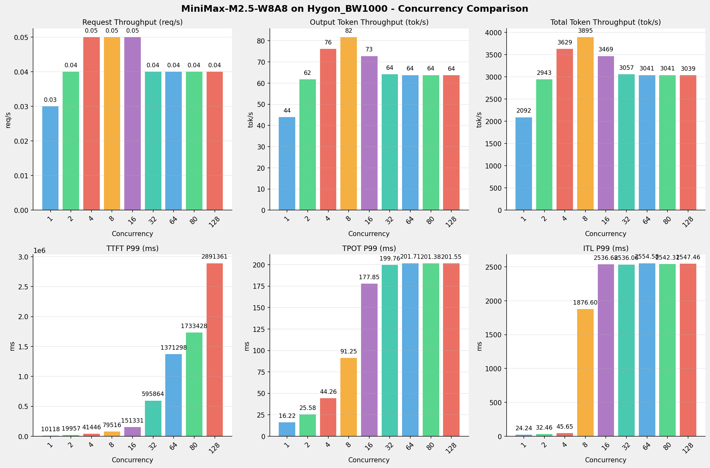
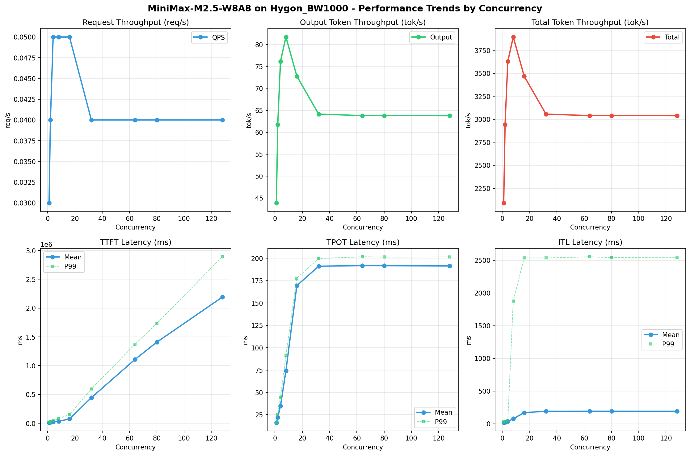

# MiniMax-M2.5-W8A8模型在Hygon_BW1000上的Benchmark基准测试报告

**测试日期：** 2026-05-18

---

## 测试场景
使用vllm bench serve基准测试工具对不同并发数，请求上下文长度下的性能变化趋势。

**主要采集指标**：

| 指标                  | 单位         | 含义                                 |
|---------------------|------------|------------------------------------|
| Request throughput  | req/s      | 请求吞吐量                              |
| Output token throughput | tok/s  | 输出token吞吐量                        |
| Total token throughput | tok/s   | 总token吞吐量                         |
| TTFT                | ms         | Time To First Token，首 token 延迟     |
| TPOT                | ms/token   | Time Per Output Token，每 token 生成时间 |
| ITL                 | ms         | Inter-Token Latency，token间延迟       |

## 🤖 芯片和模型配置信息

| 参数名称                    | Hygon_BW1000 |
|------------------------|-------------|
| **model_name** | MiniMax-M2.5-W8A8 |
| **quantization_config** | int-8 |
| **model_size** | 215G |
| **max_position_embeddings** | 196608 |
| **temperature** | N/A |
| **top_k** | N/A |
| **top_p** | N/A |
| **transformers_version** | 4.57.6 |
| **vllm_version** | 0.15.1+das.opt1.alpha.dtk2604 |
| **python_version** | 3.10.12 |

## 🤖 vLLM启动配置信息

| 参数名称                   | Hygon_BW1000 |
|------------------------|-------------|
| **Model Name** | MiniMax-M2.5-W8A8 |
| **Max Model Len** | 196608 |
| **Max Num Seqs** | 64 |
| **Max Num Batched Tokens** | default |
| **Gpu Memory Utilization** | 0.9 |
| **Dtype** | bfloat16 |
| **Block Size** | default |
| **Dp** | 1 |
| **Tp** | 8 |
| **Pp** | 1 |
| **Enable Export Parallel** | True |
| **Enable Auto Tool Choice** | True |
| **Tool Call Parser** | minimax_m2 |
| **Reasoning Parser** | minimax_m2 (不生效) |
| **Compilation Config** | N/A |

- **Hygon_BW1000**: 海光芯片专家并行配置

## 📊 测试概览

| 项目            | 配置                                     | 备注  |
|---------------|----------------------------------------|-----|
| **数据集**       | random                                 |     |
| **并发数**       | 1, 2, 4, 8, 16, 32, 64, 80, 128    |     |
| **总请求数**      | 300                                    |     |
| **请求输入上下文长度** | 70000（68k）                             |     |
| **请求输出上下文长度** | 1500（1k）                             |     |
| **模型**        | MiniMax-M2.5-W8A8                           |     |
| **被测芯片**      | Hygon_BW1000 |     |

---

## 📋 测试结果汇总

| 并发数 | 请求吞吐量 (req/s) | 输出Token吞吐量 (tok/s) | 总Token吞吐量 (tok/s) | TTFT P99 (ms) | TPOT P99 (ms) | ITL P99 (ms) |
| ----------- | ----------- | ----------- | ----------- | ----------- | ----------- | ----------- |
| 1 | 0.03 | 43.89 | 2092.00 | 10118.14 | 16.22 | 24.24 |
| 2 | 0.04 | 61.75 | 2943.35 | 19956.91 | 25.58 | 32.46 |
| 4 | 0.05 | 76.14 | 3629.34 | 41446.48 | 44.26 | 45.65 |
| 8 | 0.05 | 81.71 | 3894.89 | 79516.10 | 91.25 | 1876.60 |
| 16 | 0.05 | 72.78 | 3469.26 | 151330.77 | 177.85 | 2536.68 |
| 32 | 0.04 | 64.13 | 3056.64 | 595863.60 | 199.76 | 2536.06 |
| 64 | 0.04 | 63.79 | 3040.56 | 1371298.09 | 201.71 | 2554.58 |
| 80 | 0.04 | 63.80 | 3041.22 | 1733428.13 | 201.38 | 2542.31 |
| 128 | 0.04 | 63.76 | 3039.30 | 2891361.47 | 201.55 | 2547.46 |

## 📊 各并发级别性能柱状图

## 📈 性能趋势分析

---

### 🎯 服务基准结果详情

| 指标 | 1 并发 | 2 并发 | 4 并发 | 8 并发 | 16 并发 | 32 并发 | 64 并发 | 80 并发 | 128 并发 |
|------|----------- | ----------- | ----------- | ----------- | ----------- | ----------- | ----------- | ----------- | -----------|
| 成功请求数 | 300 | 300 | 300 | 300 | 300 | 300 | 300 | 300 | 300 |
| 失败请求数 | 0 | 0 | 0 | 0 | 0 | 0 | 0 | 0 | 0 |
| 测试持续时间 (s) | 10253.33 | 7287.61 | 5910.16 | 5507.22 | 6182.87 | 7017.50 | 7054.61 | 7053.10 | 7057.54 |
| 总输入 tokens | 21000000 | 21000000 | 21000000 | 21000000 | 21000000 | 21000000 | 21000000 | 21000000 | 21000000 |
| 总生成 tokens | 450000 | 450000 | 450000 | 450000 | 450000 | 450000 | 450000 | 450000 | 450000 |
| **请求吞吐量 (req/s)** | 0.03 | 0.04 | 0.05 | 0.05 | 0.05 | 0.04 | 0.04 | 0.04 | 0.04 |
| **输出 token 吞吐量 (tok/s)** | 43.89 | 61.75 | 76.14 | 81.71 | 72.78 | 64.13 | 63.79 | 63.80 | 63.76 |
| 峰值输出 token 吞吐量 (tok/s) | 66.00 | 112.00 | 168.00 | 240.00 | 312.00 | 299.00 | 299.00 | 299.00 | 325.00 |
| 峰值并发请求数 | 2.00 | 4.00 | 8.00 | 16.00 | 17.00 | 33.00 | 65.00 | 81.00 | 130.00 |
| **总 token 吞吐量 (tok/s)** | 2092.00 | 2943.35 | 3629.34 | 3894.89 | 3469.26 | 3056.64 | 3040.56 | 3041.22 | 3039.30 |

### ⏱️ 首Token延迟 (TTFT)

| 指标 | 1 并发 | 2 并发 | 4 并发 | 8 并发 | 16 并发 | 32 并发 | 64 并发 | 80 并发 | 128 并发 |
|------|----------- | ----------- | ----------- | ----------- | ----------- | ----------- | ----------- | ----------- | -----------|
| 平均 TTFT (ms) | 9993.33 | 15464.15 | 26798.16 | 34962.62 | 73879.33 | 444260.49 | 1108159.06 | 1408070.53 | 2189682.78 |
| 中位 TTFT (ms) | 10014.96 | 11251.28 | 22159.57 | 36884.00 | 57063.63 | 433702.94 | 1220686.40 | 1583304.98 | 2733185.09 |
| P95 TTFT (ms) | 10107.89 | 19940.45 | 41423.66 | 47070.20 | 124074.69 | 502220.59 | 1237901.88 | 1649490.58 | 2762727.46 |
| P99 TTFT (ms) | 10118.14 | 19956.91 | 41446.48 | 79516.10 | 151330.77 | 595863.60 | 1371298.09 | 1733428.13 | 2891361.47 |

### ⚡ 每Token生成时间 (TPOT)

| 指标 | 1 并发 | 2 并发 | 4 并发 | 8 并发 | 16 并发 | 32 并发 | 64 并发 | 80 并发 | 128 并发 |
|------|----------- | ----------- | ----------- | ----------- | ----------- | ----------- | ----------- | ----------- | -----------|
| 平均 TPOT (ms) | 16.13 | 22.09 | 34.69 | 74.22 | 169.45 | 191.15 | 191.81 | 191.75 | 191.42 |
| 中位 TPOT (ms) | 16.13 | 22.05 | 37.38 | 72.90 | 173.08 | 196.19 | 196.12 | 196.16 | 196.14 |
| P95 TPOT (ms) | 16.20 | 25.16 | 44.05 | 88.17 | 176.30 | 198.52 | 200.43 | 200.11 | 199.27 |
| P99 TPOT (ms) | 16.22 | 25.58 | 44.26 | 91.25 | 177.85 | 199.76 | 201.71 | 201.38 | 201.55 |

### 🔄 Token间延迟 (ITL)

| 指标 | 1 并发 | 2 并发 | 4 并发 | 8 并发 | 16 并发 | 32 并发 | 64 并发 | 80 并发 | 128 并发 |
|------|----------- | ----------- | ----------- | ----------- | ----------- | ----------- | ----------- | ----------- | -----------|
| 平均 ITL (ms) | 16.18 | 22.15 | 34.71 | 76.39 | 169.38 | 191.17 | 191.72 | 191.68 | 191.41 |
| 中位 ITL (ms) | 16.13 | 19.15 | 25.13 | 35.95 | 46.77 | 46.84 | 46.79 | 46.66 | 46.80 |
| P95 ITL (ms) | 16.87 | 20.52 | 26.22 | 42.84 | 67.88 | 72.93 | 67.60 | 61.67 | 69.18 |
| P99 ITL (ms) | 24.24 | 32.46 | 45.65 | 1876.60 | 2536.68 | 2536.06 | 2554.58 | 2542.31 | 2547.46 |

---

## 📝 分析总结

### 1. 吞吐量性能分析

**请求吞吐量 (QPS)**: 随着并发级别增加，QPS持续上升。
低并发(1,2,4)平均 QPS: 0.04 req/s；
中并发(8,16,32)平均 QPS: 0.05 req/s；
高并发(64,80,128)平均 QPS: 0.04 req/s；
最高 QPS 出现在 4 并发，达到 0.05 req/s。

**Token总吞吐量**: 最高达到 3895 tok/s (8 并发)。

### 2. 首Token延迟 (TTFT) 分析

TTFT随并发增加显著上升。
低并发平均 P99 TTFT: 23841ms；
高并发平均 P99 TTFT: 1998696ms；
最高 P99 TTFT 出现在 128 并发，达到 2891361ms。

### 3. Token生成时间 (TPOT) 分析

TPOT随并发增加也呈上升趋势。
低并发平均 P99 TPOT: 28.69ms；
高并发平均 P99 TPOT: 201.55ms；
最高 P99 TPOT 出现在 64 并发，达到 201.71ms。

### 4. Token间延迟 (ITL) 分析

ITL随并发增加呈上升趋势。
低并发平均 P99 ITL: 34.12ms；
高并发平均 P99 ITL: 2548.12ms；
最高 P99 ITL 出现在 64 并发，达到 2554.58ms。

### 5. 综合评估

**吞吐量增长**: 从最低并发到最高并发，QPS增长了 33.3%。
**TTFT延迟恶化**: 高并发相比低并发，TTFT P99增加了 12027.9%。
**TPOT延迟恶化**: 高并发相比低并发，TPOT P99增加了 603.1%。

---

*报告生成时间: 2026-05-18*

