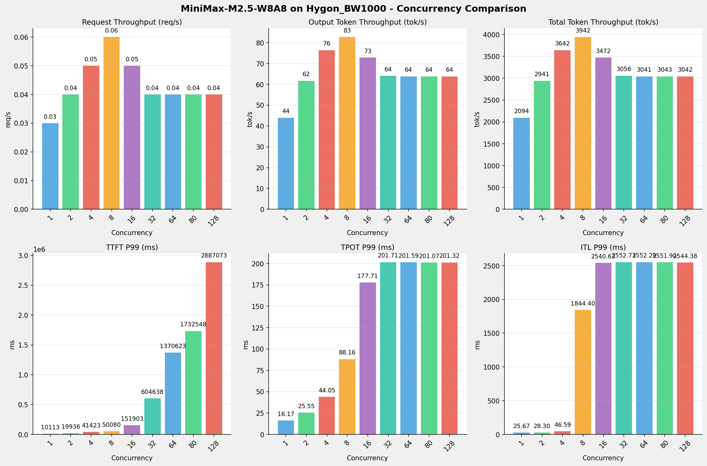
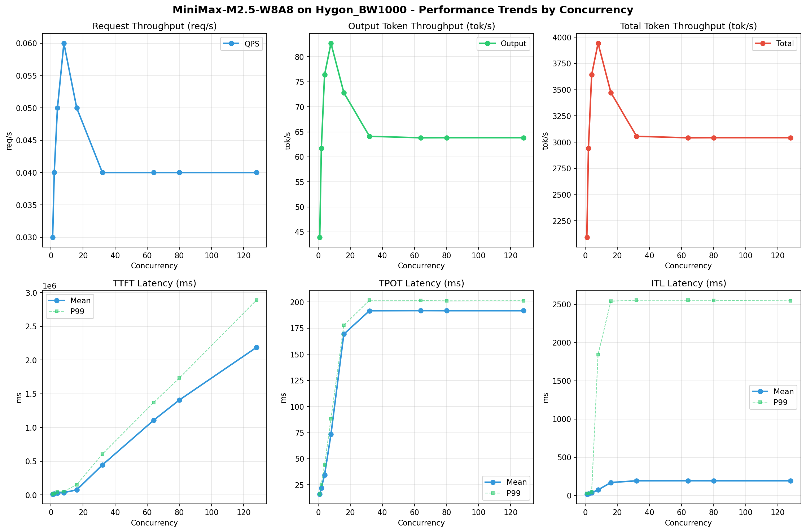

# MiniMax-M2.5-W8A8模型在Hygon_BW1000上的Benchmark基准测试报告

**测试日期：** 2026-05-18

---

## 测试场景
使用vllm bench serve基准测试工具对不同并发数，请求上下文长度下的性能变化趋势。

**主要采集指标**：

| 指标                  | 单位         | 含义                                 |
|---------------------|------------|------------------------------------|
| Request throughput  | req/s      | 请求吞吐量                              |
| Output token throughput | tok/s  | 输出token吞吐量                        |
| Total token throughput | tok/s   | 总token吞吐量                         |
| TTFT                | ms         | Time To First Token，首 token 延迟     |
| TPOT                | ms/token   | Time Per Output Token，每 token 生成时间 |
| ITL                 | ms         | Inter-Token Latency，token间延迟       |

## 🤖 芯片和模型配置信息

| 参数名称                    | Hygon_BW1000 |
|------------------------|-------------|
| **model_name** | MiniMax-M2.5-W8A8 |
| **quantization_config** | int-8 |
| **model_size** | 215G |
| **max_position_embeddings** | 196608 |
| **temperature** | N/A |
| **top_k** | N/A |
| **top_p** | N/A |
| **transformers_version** | 4.57.6 |
| **vllm_version** | 0.15.1+das.opt1.alpha.dtk2604 |
| **python_version** | 3.10.12 |

## 🤖 vLLM启动配置信息

| 参数名称                   | Hygon_BW1000 |
|------------------------|-------------|
| **Model Name** | MiniMax-M2.5-W8A8 |
| **Max Model Len** | 196608 |
| **Max Num Seqs** | 64 |
| **Max Num Batched Tokens** | default |
| **Gpu Memory Utilization** | 0.9 |
| **Dtype** | bfloat16 |
| **Block Size** | default |
| **Dp** | 1 |
| **Tp** | 8 |
| **Pp** | 1 |
| **Enable Export Parallel** | True |
| **Enable Auto Tool Choice** | True |
| **Tool Call Parser** | minimax_m2 |
| **Reasoning Parser** | minimax_m2 (不生效) |
| **Compilation Config** | N/A |

- **Hygon_BW1000**: 海光芯片专家并行配置

## 📊 测试概览

| 项目            | 配置                                     | 备注  |
|---------------|----------------------------------------|-----|
| **数据集**       | random                                 |     |
| **并发数**       | 1, 2, 4, 8, 16, 32, 64, 80, 128    |     |
| **总请求数**      | 300                                    |     |
| **请求输入上下文长度** | 70000（68k）                             |     |
| **请求输出上下文长度** | 1500（1k）                             |     |
| **模型**        | MiniMax-M2.5-W8A8                           |     |
| **被测芯片**      | Hygon_BW1000 |     |

---

## 📋 测试结果汇总

| 并发数 | 请求吞吐量 (req/s) | 输出Token吞吐量 (tok/s) | 总Token吞吐量 (tok/s) | TTFT P99 (ms) | TPOT P99 (ms) | ITL P99 (ms) |
| ----------- | ----------- | ----------- | ----------- | ----------- | ----------- | ----------- |
| 1 | 0.03 | 43.94 | 2094.39 | 10112.88 | 16.17 | 25.67 |
| 2 | 0.04 | 61.70 | 2940.88 | 19935.72 | 25.55 | 28.30 |
| 4 | 0.05 | 76.40 | 3641.82 | 41422.52 | 44.05 | 46.59 |
| 8 | 0.06 | 82.71 | 3942.32 | 50079.90 | 88.16 | 1844.40 |
| 16 | 0.05 | 72.85 | 3472.35 | 151903.07 | 177.71 | 2540.63 |
| 32 | 0.04 | 64.11 | 3055.80 | 604638.18 | 201.71 | 2552.73 |
| 64 | 0.04 | 63.81 | 3041.39 | 1370622.65 | 201.59 | 2552.29 |
| 80 | 0.04 | 63.83 | 3042.53 | 1732547.94 | 201.07 | 2551.90 |
| 128 | 0.04 | 63.83 | 3042.46 | 2887072.73 | 201.32 | 2544.38 |

## 📊 各并发级别性能柱状图

## 📈 性能趋势分析

---

### 🎯 服务基准结果详情

| 指标 | 1 并发 | 2 并发 | 4 并发 | 8 并发 | 16 并发 | 32 并发 | 64 并发 | 80 并发 | 128 并发 |
|------|----------- | ----------- | ----------- | ----------- | ----------- | ----------- | ----------- | ----------- | -----------|
| 成功请求数 | 300 | 300 | 300 | 300 | 300 | 300 | 300 | 300 | 300 |
| 失败请求数 | 0 | 0 | 0 | 0 | 0 | 0 | 0 | 0 | 0 |
| 测试持续时间 (s) | 10241.67 | 7293.73 | 5889.92 | 5440.96 | 6177.38 | 7019.43 | 7052.69 | 7050.05 | 7050.21 |
| 总输入 tokens | 21000000 | 21000000 | 21000000 | 21000000 | 21000000 | 21000000 | 21000000 | 21000000 | 21000000 |
| 总生成 tokens | 450000 | 450000 | 450000 | 450000 | 450000 | 450000 | 450000 | 450000 | 450000 |
| **请求吞吐量 (req/s)** | 0.03 | 0.04 | 0.05 | 0.06 | 0.05 | 0.04 | 0.04 | 0.04 | 0.04 |
| **输出 token 吞吐量 (tok/s)** | 43.94 | 61.70 | 76.40 | 82.71 | 72.85 | 64.11 | 63.81 | 63.83 | 63.83 |
| 峰值输出 token 吞吐量 (tok/s) | 66.00 | 108.00 | 172.00 | 233.00 | 312.00 | 299.00 | 299.00 | 286.00 | 286.00 |
| 峰值并发请求数 | 2.00 | 4.00 | 8.00 | 11.00 | 17.00 | 33.00 | 65.00 | 81.00 | 129.00 |
| **总 token 吞吐量 (tok/s)** | 2094.39 | 2940.88 | 3641.82 | 3942.32 | 3472.35 | 3055.80 | 3041.39 | 3042.53 | 3042.46 |

### ⏱️ 首Token延迟 (TTFT)

| 指标 | 1 并发 | 2 并发 | 4 并发 | 8 并发 | 16 并发 | 32 并发 | 64 并发 | 80 并发 | 128 并发 |
|------|----------- | ----------- | ----------- | ----------- | ----------- | ----------- | ----------- | ----------- | -----------|
| 平均 TTFT (ms) | 10021.30 | 15455.90 | 26898.34 | 34351.35 | 73906.45 | 443786.76 | 1107837.90 | 1407443.94 | 2186513.87 |
| 中位 TTFT (ms) | 10051.42 | 11237.33 | 22419.33 | 37569.26 | 57046.21 | 433890.34 | 1220348.02 | 1582367.64 | 2731041.06 |
| P95 TTFT (ms) | 10097.69 | 19914.29 | 41401.53 | 42808.32 | 123946.19 | 501859.72 | 1236867.85 | 1648936.44 | 2748592.78 |
| P99 TTFT (ms) | 10112.88 | 19935.72 | 41422.52 | 50079.90 | 151903.07 | 604638.18 | 1370622.65 | 1732547.94 | 2887072.73 |

### ⚡ 每Token生成时间 (TPOT)

| 指标 | 1 并发 | 2 并发 | 4 并发 | 8 并发 | 16 并发 | 32 并发 | 64 并发 | 80 并发 | 128 并发 |
|------|----------- | ----------- | ----------- | ----------- | ----------- | ----------- | ----------- | ----------- | -----------|
| 平均 TPOT (ms) | 16.09 | 22.13 | 34.44 | 73.45 | 169.24 | 191.64 | 191.74 | 191.68 | 191.67 |
| 中位 TPOT (ms) | 16.08 | 22.03 | 35.03 | 71.40 | 173.05 | 196.04 | 196.08 | 196.06 | 196.01 |
| P95 TPOT (ms) | 16.16 | 25.22 | 43.87 | 87.48 | 176.11 | 200.41 | 200.29 | 200.01 | 200.02 |
| P99 TPOT (ms) | 16.17 | 25.55 | 44.05 | 88.16 | 177.71 | 201.71 | 201.59 | 201.07 | 201.32 |

### 🔄 Token间延迟 (ITL)

| 指标 | 1 并发 | 2 并发 | 4 并发 | 8 并发 | 16 并发 | 32 并发 | 64 并发 | 80 并发 | 128 并发 |
|------|----------- | ----------- | ----------- | ----------- | ----------- | ----------- | ----------- | ----------- | -----------|
| 平均 ITL (ms) | 16.14 | 22.14 | 34.47 | 73.45 | 169.19 | 191.59 | 191.98 | 191.67 | 191.64 |
| 中位 ITL (ms) | 16.08 | 19.17 | 24.96 | 35.87 | 46.73 | 46.75 | 46.72 | 46.70 | 46.69 |
| P95 ITL (ms) | 17.97 | 20.39 | 27.62 | 43.74 | 70.97 | 70.95 | 68.14 | 69.03 | 64.55 |
| P99 ITL (ms) | 25.67 | 28.30 | 46.59 | 1844.40 | 2540.63 | 2552.73 | 2552.29 | 2551.90 | 2544.38 |

---

## 📝 分析总结

### 1. 吞吐量性能分析

**请求吞吐量 (QPS)**: 随着并发级别增加，QPS持续上升。
低并发(1,2,4)平均 QPS: 0.04 req/s；
中并发(8,16,32)平均 QPS: 0.05 req/s；
高并发(64,80,128)平均 QPS: 0.04 req/s；
最高 QPS 出现在 8 并发，达到 0.06 req/s。

**Token总吞吐量**: 最高达到 3942 tok/s (8 并发)。

### 2. 首Token延迟 (TTFT) 分析

TTFT随并发增加显著上升。
低并发平均 P99 TTFT: 23824ms；
高并发平均 P99 TTFT: 1996748ms；
最高 P99 TTFT 出现在 128 并发，达到 2887073ms。

### 3. Token生成时间 (TPOT) 分析

TPOT随并发增加也呈上升趋势。
低并发平均 P99 TPOT: 28.59ms；
高并发平均 P99 TPOT: 201.33ms；
最高 P99 TPOT 出现在 32 并发，达到 201.71ms。

### 4. Token间延迟 (ITL) 分析

ITL随并发增加呈上升趋势。
低并发平均 P99 ITL: 33.52ms；
高并发平均 P99 ITL: 2549.52ms；
最高 P99 ITL 出现在 32 并发，达到 2552.73ms。

### 5. 综合评估

**吞吐量增长**: 从最低并发到最高并发，QPS增长了 33.3%。
**TTFT延迟恶化**: 高并发相比低并发，TTFT P99增加了 12018.5%。
**TPOT延迟恶化**: 高并发相比低并发，TPOT P99增加了 605.5%。

---

*报告生成时间: 2026-05-18*

