# MiniMax-M2.5-W8A8模型在Hygon_BW1000上的多I/O测试报告

**测试日期：** 2026-05-18

---

## 测试场景
测试不同输入输出长度和并发级别下的性能表现，分析同一芯片同一模型在不同输入输出长度和并发级别下的性能指标变化趋势。

**主要采集指标**：

| 指标                  | 单位         | 含义                                 |
|---------------------|------------|------------------------------------|
| Request throughput  | req/s      | 请求吞吐量                              |
| Output token throughput | tok/s  | 输出token吞吐量                        |
| Total token throughput | tok/s   | 总token吞吐量                         |
| TTFT                | ms         | Time To First Token，首 token 延迟     |
| TPOT                | ms/token   | Time Per Output Token，每 token 生成时间 |
| ITL                 | ms         | Inter-Token Latency，token间延迟       |

## 🤖 芯片和模型配置信息

| 参数名称                    | Hygon_BW1000 |
|------------------------|-------------|
| **model_name** | MiniMax-M2.5-W8A8 |
| **quantization_config** | int-8 |
| **model_size** | 215G |
| **max_position_embeddings** | 196608 |
| **temperature** | N/A |
| **top_k** | N/A |
| **top_p** | N/A |
| **transformers_version** | 4.57.6 |
| **vllm_version** | 0.15.1+das.opt1.alpha.dtk2604 |
| **python_version** | 3.10.12 |

## 🤖 vLLM启动配置信息

| 参数名称                   | Hygon_BW1000 |
|------------------------|-------------|
| **Model Name** | MiniMax-M2.5-W8A8 |
| **Max Model Len** | 196608 |
| **Max Num Seqs** | 64 |
| **Max Num Batched Tokens** | default |
| **Gpu Memory Utilization** | 0.9 |
| **Dtype** | bfloat16 |
| **Block Size** | default |
| **Dp** | 1 |
| **Tp** | 8 |
| **Pp** | 1 |
| **Enable Export Parallel** | True |
| **Enable Auto Tool Choice** | True |
| **Tool Call Parser** | minimax_m2 |
| **Reasoning Parser** | minimax_m2 (不生效) |
| **Compilation Config** | N/A |

- **Hygon_BW1000**: 海光芯片专家并行配置

## 📊 测试概览

| 项目            | 配置                                     | 备注  |
|---------------|----------------------------------------|-----|
| **数据集**       | random                                 |     |
| **并发数**       | 1, 4, 8, 16, 32, 64, 128    |     |
| **总请求数**      | 1000                                    |     |
| **输入输出长度** | (128, 128), (512, 256), (1024, 512), (2048, 1024), (4096, 2048), (8192, 1024) |     |
| **模型**        | MiniMax-M2.5-W8A8                           |     |
| **被测芯片**      | Hygon_BW1000 |     |

---

## 📋 各I/O测试汇总（固定上下文长度，随并发变化）

### input: 128, output: 128

| 并发数 | 请求吞吐量 (req/s) | 输出Token吞吐量 (tok/s) | 总Token吞吐量 (tok/s) | TTFT P99 (ms) | TPOT P99 (ms) | ITL P99 (ms) |
| --------------- | --------------- | --------------- | --------------- | --------------- | --------------- | --------------- |
| 1 | 0.54 | 69.71 | 139.42 | 148.98 | 13.50 | 23.34 |
| 4 | 1.76 | 225.87 | 451.74 | 294.96 | 17.02 | 29.56 |
| 8 | 3.15 | 402.59 | 805.18 | 347.01 | 19.07 | 24.60 |
| 16 | 4.88 | 624.73 | 1249.46 | 461.64 | 24.72 | 39.84 |
| 32 | 6.88 | 880.70 | 1761.39 | 786.60 | 35.60 | 62.20 |
| 64 | 10.42 | 1333.31 | 2666.61 | 1298.18 | 46.99 | 135.18 |
| 128 | 10.68 | 1367.19 | 2734.37 | 7229.68 | 45.81 | 134.95 |

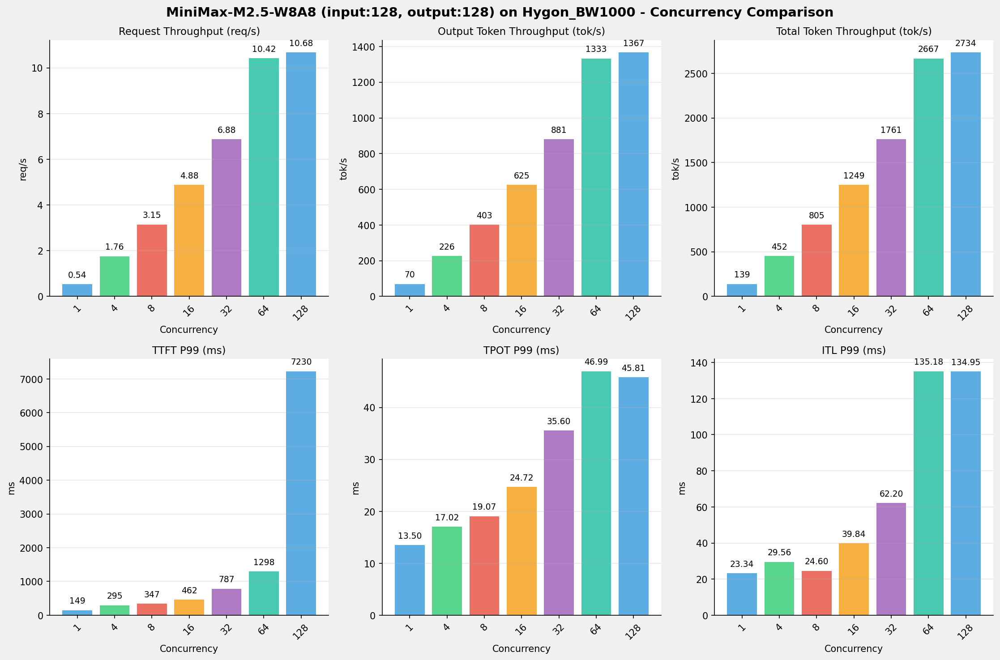

---

### input: 512, output: 256

| 并发数 | 请求吞吐量 (req/s) | 输出Token吞吐量 (tok/s) | 总Token吞吐量 (tok/s) | TTFT P99 (ms) | TPOT P99 (ms) | ITL P99 (ms) |
| --------------- | --------------- | --------------- | --------------- | --------------- | --------------- | --------------- |
| 1 | 0.27 | 69.57 | 208.70 | 155.38 | 13.93 | 22.43 |
| 4 | 0.89 | 226.93 | 680.78 | 358.52 | 17.41 | 28.00 |
| 8 | 1.57 | 402.84 | 1208.51 | 524.83 | 19.54 | 29.39 |
| 16 | 2.42 | 619.05 | 1857.16 | 779.90 | 25.36 | 32.24 |
| 32 | 3.44 | 880.14 | 2640.42 | 1445.65 | 35.60 | 56.15 |
| 64 | 5.03 | 1287.29 | 3861.86 | 2686.74 | 48.50 | 68.89 |
| 128 | 5.08 | 1299.51 | 3898.54 | 15217.88 | 48.11 | 63.00 |

---

### input: 1024, output: 512

| 并发数 | 请求吞吐量 (req/s) | 输出Token吞吐量 (tok/s) | 总Token吞吐量 (tok/s) | TTFT P99 (ms) | TPOT P99 (ms) | ITL P99 (ms) |
| --------------- | --------------- | --------------- | --------------- | --------------- | --------------- | --------------- |
| 1 | 0.14 | 69.93 | 209.80 | 213.04 | 13.98 | 21.33 |
| 4 | 0.45 | 230.19 | 690.57 | 569.68 | 17.44 | 28.31 |
| 8 | 0.79 | 406.35 | 1219.06 | 938.55 | 19.63 | 28.46 |
| 16 | 1.20 | 614.78 | 1844.34 | 1754.29 | 26.10 | 31.52 |
| 32 | 1.68 | 862.58 | 2587.73 | 3358.71 | 37.02 | 54.11 |
| 64 | 2.43 | 1244.14 | 3732.41 | 6403.94 | 51.29 | 62.57 |
| 128 | 2.43 | 1244.78 | 3734.35 | 32833.25 | 51.50 | 67.59 |

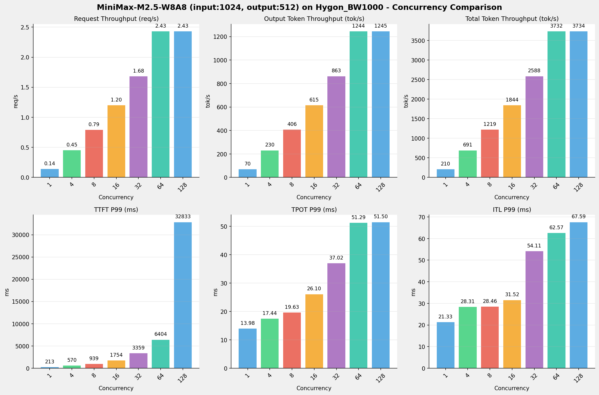

---

### input: 2048, output: 1024

| 并发数 | 请求吞吐量 (req/s) | 输出Token吞吐量 (tok/s) | 总Token吞吐量 (tok/s) | TTFT P99 (ms) | TPOT P99 (ms) | ITL P99 (ms) |
| --------------- | --------------- | --------------- | --------------- | --------------- | --------------- | --------------- |
| 1 | 0.07 | 69.74 | 209.22 | 312.85 | 14.09 | 24.12 |
| 4 | 0.23 | 233.86 | 701.58 | 926.46 | 17.37 | 24.42 |
| 8 | 0.40 | 412.48 | 1237.45 | 1743.14 | 19.63 | 29.51 |
| 16 | 0.61 | 621.01 | 1863.04 | 3237.66 | 25.78 | 36.28 |
| 32 | 0.84 | 859.95 | 2579.86 | 6366.01 | 36.85 | 52.00 |
| 64 | 1.16 | 1191.04 | 3573.13 | 12415.20 | 52.61 | 63.52 |
| 128 | 1.16 | 1187.72 | 3563.15 | 65783.50 | 52.75 | 66.96 |

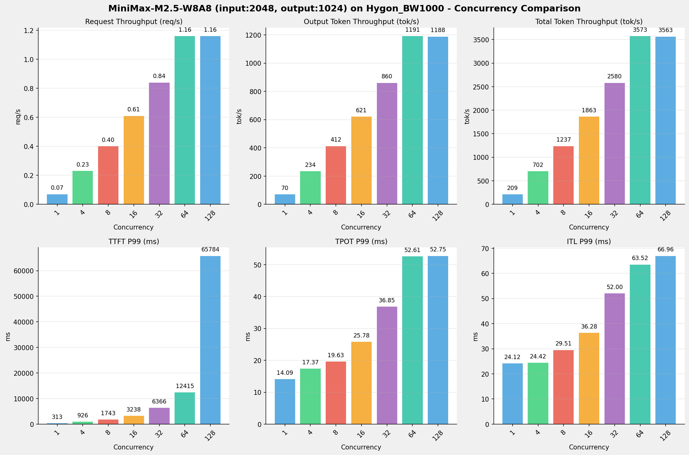

---

### input: 4096, output: 2048

| 并发数 | 请求吞吐量 (req/s) | 输出Token吞吐量 (tok/s) | 总Token吞吐量 (tok/s) | TTFT P99 (ms) | TPOT P99 (ms) | ITL P99 (ms) |
| --------------- | --------------- | --------------- | --------------- | --------------- | --------------- | --------------- |
| 1 | 0.03 | 69.33 | 208.00 | 486.84 | 14.22 | 22.92 |
| 4 | 0.11 | 235.07 | 705.21 | 1701.32 | 17.47 | 24.31 |
| 8 | 0.20 | 410.74 | 1232.21 | 3283.34 | 19.84 | 28.19 |
| 16 | 0.30 | 606.90 | 1820.71 | 6322.58 | 26.70 | 30.67 |
| 32 | 0.40 | 819.67 | 2459.01 | 12529.02 | 39.05 | 54.58 |
| 64 | 0.53 | 1090.61 | 3271.82 | 24565.33 | 57.85 | 70.60 |
| 128 | 0.53 | 1085.44 | 3256.32 | 141717.58 | 58.28 | 67.44 |

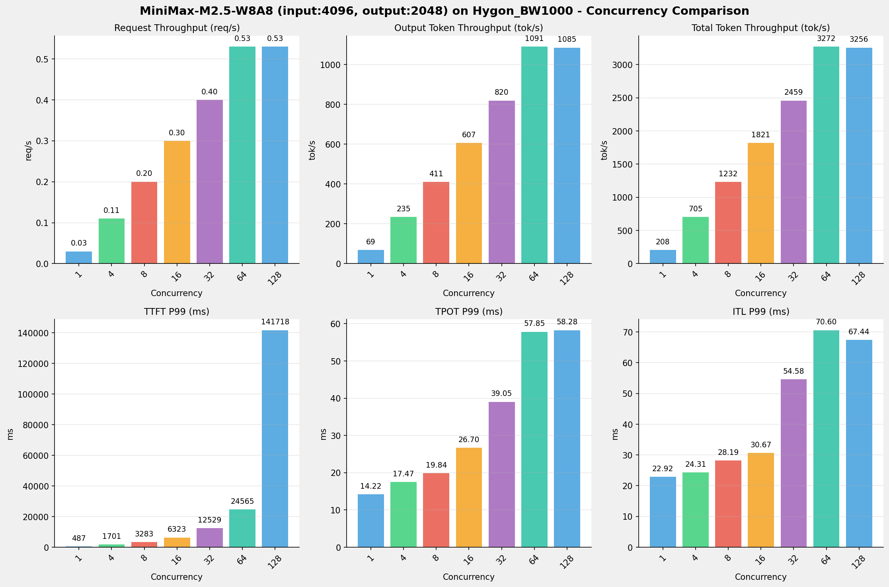

---

### input: 8192, output: 1024

| 并发数 | 请求吞吐量 (req/s) | 输出Token吞吐量 (tok/s) | 总Token吞吐量 (tok/s) | TTFT P99 (ms) | TPOT P99 (ms) | ITL P99 (ms) |
| --------------- | --------------- | --------------- | --------------- | --------------- | --------------- | --------------- |
| 1 | 0.06 | 66.11 | 594.97 | 892.34 | 14.31 | 23.17 |
| 4 | 0.20 | 202.97 | 1826.69 | 3335.25 | 19.43 | 24.63 |
| 8 | 0.31 | 320.18 | 2881.59 | 6485.86 | 24.72 | 32.22 |
| 16 | 0.41 | 424.67 | 3822.06 | 12596.58 | 37.34 | 43.69 |
| 32 | 0.50 | 516.05 | 4644.47 | 19688.71 | 61.36 | 64.07 |
| 64 | 0.59 | 602.89 | 5425.98 | 45274.45 | 112.09 | 1157.52 |
| 128 | 0.59 | 602.62 | 5423.60 | 152443.57 | 114.39 | 2621.29 |

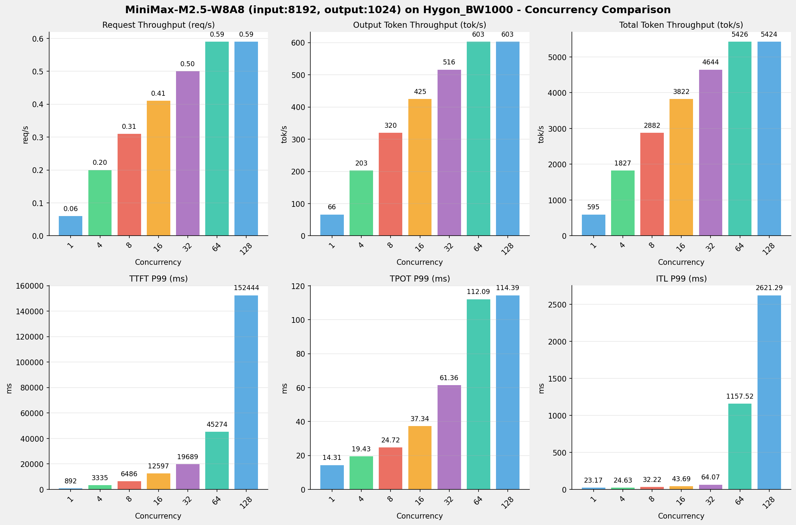

---

## 📊 I/O对比（固定并发数，随上下文长度变化）

### 并发数 = 1

| 指标 | i128_o128 | i512_o256 | i1024_o512 | i2048_o1024 | i4096_o2048 | i8192_o1024 |
| --- | --- | --- | --- | --- | --- | --- |
| 请求吞吐量 (req/s) | 0.54 | 0.27 | 0.14 | 0.07 | 0.03 | 0.06 |
| 输出Token吞吐量 (tok/s) | 69.71 | 69.57 | 69.93 | 69.74 | 69.33 | 66.11 |
| 总Token吞吐量 (tok/s) | 139.42 | 208.70 | 209.80 | 209.22 | 208.00 | 594.97 |
| TTFT P99 (ms) | 148.98 | 155.38 | 213.04 | 312.85 | 486.84 | 892.34 |
| TPOT P99 (ms) | 13.50 | 13.93 | 13.98 | 14.09 | 14.22 | 14.31 |
| ITL P99 (ms) | 23.34 | 22.43 | 21.33 | 24.12 | 22.92 | 23.17 |

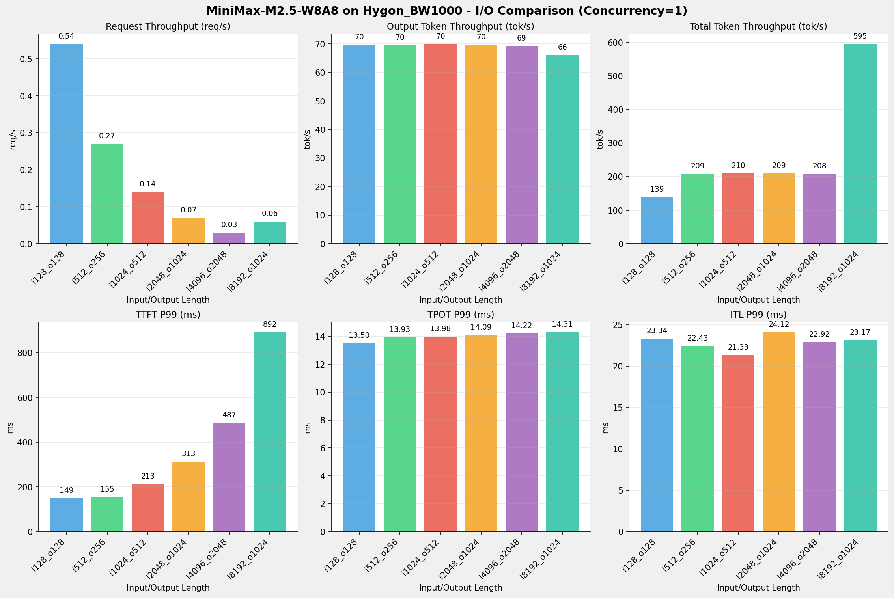

---

### 并发数 = 4

| 指标 | i128_o128 | i512_o256 | i1024_o512 | i2048_o1024 | i4096_o2048 | i8192_o1024 |
| --- | --- | --- | --- | --- | --- | --- |
| 请求吞吐量 (req/s) | 1.76 | 0.89 | 0.45 | 0.23 | 0.11 | 0.20 |
| 输出Token吞吐量 (tok/s) | 225.87 | 226.93 | 230.19 | 233.86 | 235.07 | 202.97 |
| 总Token吞吐量 (tok/s) | 451.74 | 680.78 | 690.57 | 701.58 | 705.21 | 1826.69 |
| TTFT P99 (ms) | 294.96 | 358.52 | 569.68 | 926.46 | 1701.32 | 3335.25 |
| TPOT P99 (ms) | 17.02 | 17.41 | 17.44 | 17.37 | 17.47 | 19.43 |
| ITL P99 (ms) | 29.56 | 28.00 | 28.31 | 24.42 | 24.31 | 24.63 |

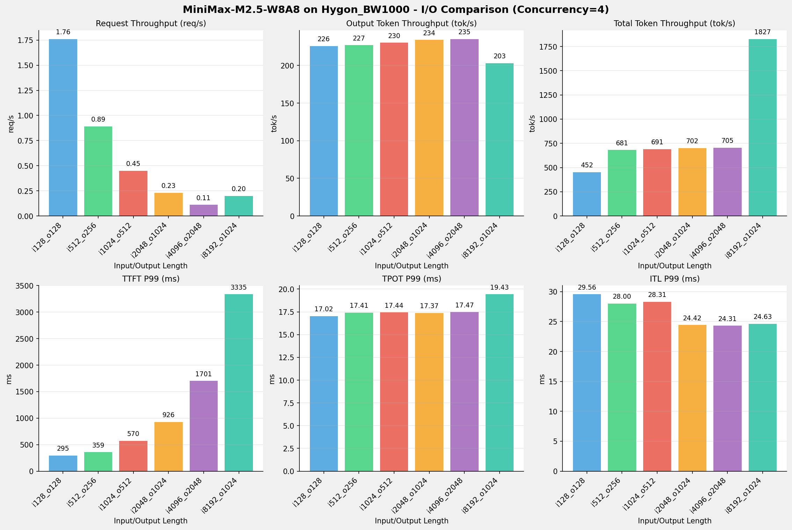

---

### 并发数 = 8

| 指标 | i128_o128 | i512_o256 | i1024_o512 | i2048_o1024 | i4096_o2048 | i8192_o1024 |
| --- | --- | --- | --- | --- | --- | --- |
| 请求吞吐量 (req/s) | 3.15 | 1.57 | 0.79 | 0.40 | 0.20 | 0.31 |
| 输出Token吞吐量 (tok/s) | 402.59 | 402.84 | 406.35 | 412.48 | 410.74 | 320.18 |
| 总Token吞吐量 (tok/s) | 805.18 | 1208.51 | 1219.06 | 1237.45 | 1232.21 | 2881.59 |
| TTFT P99 (ms) | 347.01 | 524.83 | 938.55 | 1743.14 | 3283.34 | 6485.86 |
| TPOT P99 (ms) | 19.07 | 19.54 | 19.63 | 19.63 | 19.84 | 24.72 |
| ITL P99 (ms) | 24.60 | 29.39 | 28.46 | 29.51 | 28.19 | 32.22 |

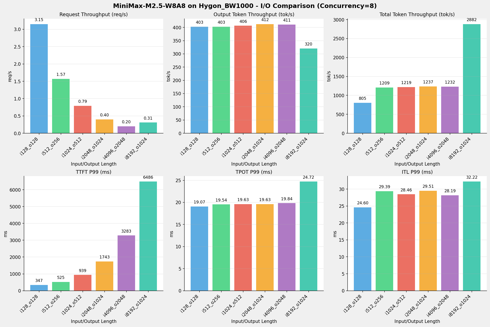

---

### 并发数 = 16

| 指标 | i128_o128 | i512_o256 | i1024_o512 | i2048_o1024 | i4096_o2048 | i8192_o1024 |
| --- | --- | --- | --- | --- | --- | --- |
| 请求吞吐量 (req/s) | 4.88 | 2.42 | 1.20 | 0.61 | 0.30 | 0.41 |
| 输出Token吞吐量 (tok/s) | 624.73 | 619.05 | 614.78 | 621.01 | 606.90 | 424.67 |
| 总Token吞吐量 (tok/s) | 1249.46 | 1857.16 | 1844.34 | 1863.04 | 1820.71 | 3822.06 |
| TTFT P99 (ms) | 461.64 | 779.90 | 1754.29 | 3237.66 | 6322.58 | 12596.58 |
| TPOT P99 (ms) | 24.72 | 25.36 | 26.10 | 25.78 | 26.70 | 37.34 |
| ITL P99 (ms) | 39.84 | 32.24 | 31.52 | 36.28 | 30.67 | 43.69 |

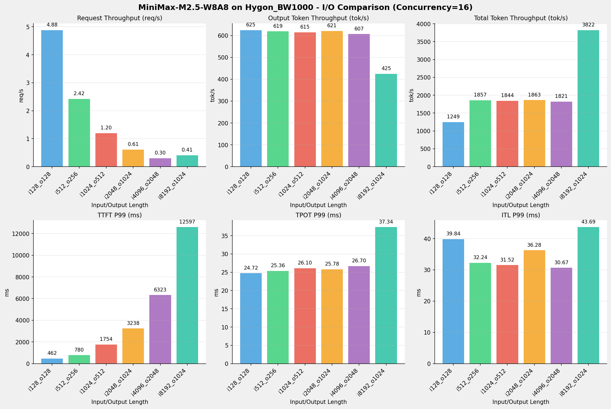

---

### 并发数 = 32

| 指标 | i128_o128 | i512_o256 | i1024_o512 | i2048_o1024 | i4096_o2048 | i8192_o1024 |
| --- | --- | --- | --- | --- | --- | --- |
| 请求吞吐量 (req/s) | 6.88 | 3.44 | 1.68 | 0.84 | 0.40 | 0.50 |
| 输出Token吞吐量 (tok/s) | 880.70 | 880.14 | 862.58 | 859.95 | 819.67 | 516.05 |
| 总Token吞吐量 (tok/s) | 1761.39 | 2640.42 | 2587.73 | 2579.86 | 2459.01 | 4644.47 |
| TTFT P99 (ms) | 786.60 | 1445.65 | 3358.71 | 6366.01 | 12529.02 | 19688.71 |
| TPOT P99 (ms) | 35.60 | 35.60 | 37.02 | 36.85 | 39.05 | 61.36 |
| ITL P99 (ms) | 62.20 | 56.15 | 54.11 | 52.00 | 54.58 | 64.07 |

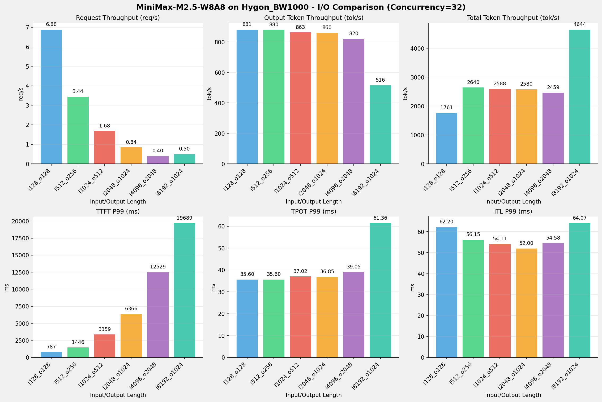

---

### 并发数 = 64

| 指标 | i128_o128 | i512_o256 | i1024_o512 | i2048_o1024 | i4096_o2048 | i8192_o1024 |
| --- | --- | --- | --- | --- | --- | --- |
| 请求吞吐量 (req/s) | 10.42 | 5.03 | 2.43 | 1.16 | 0.53 | 0.59 |
| 输出Token吞吐量 (tok/s) | 1333.31 | 1287.29 | 1244.14 | 1191.04 | 1090.61 | 602.89 |
| 总Token吞吐量 (tok/s) | 2666.61 | 3861.86 | 3732.41 | 3573.13 | 3271.82 | 5425.98 |
| TTFT P99 (ms) | 1298.18 | 2686.74 | 6403.94 | 12415.20 | 24565.33 | 45274.45 |
| TPOT P99 (ms) | 46.99 | 48.50 | 51.29 | 52.61 | 57.85 | 112.09 |
| ITL P99 (ms) | 135.18 | 68.89 | 62.57 | 63.52 | 70.60 | 1157.52 |

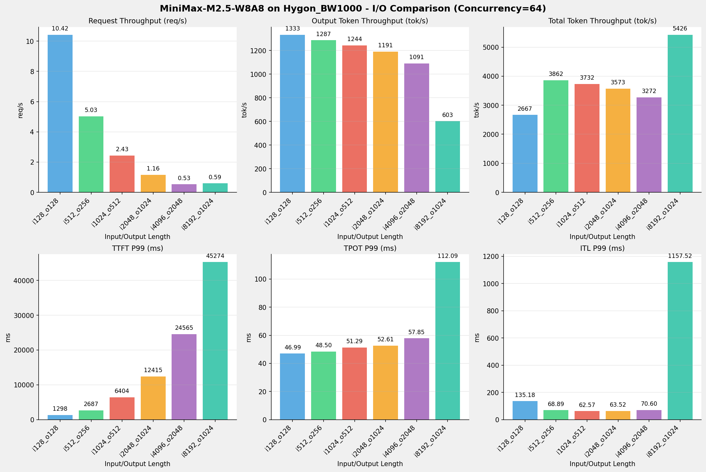

---

### 并发数 = 128

| 指标 | i128_o128 | i512_o256 | i1024_o512 | i2048_o1024 | i4096_o2048 | i8192_o1024 |
| --- | --- | --- | --- | --- | --- | --- |
| 请求吞吐量 (req/s) | 10.68 | 5.08 | 2.43 | 1.16 | 0.53 | 0.59 |
| 输出Token吞吐量 (tok/s) | 1367.19 | 1299.51 | 1244.78 | 1187.72 | 1085.44 | 602.62 |
| 总Token吞吐量 (tok/s) | 2734.37 | 3898.54 | 3734.35 | 3563.15 | 3256.32 | 5423.60 |
| TTFT P99 (ms) | 7229.68 | 15217.88 | 32833.25 | 65783.50 | 141717.58 | 152443.57 |
| TPOT P99 (ms) | 45.81 | 48.11 | 51.50 | 52.75 | 58.28 | 114.39 |
| ITL P99 (ms) | 134.95 | 63.00 | 67.59 | 66.96 | 67.44 | 2621.29 |

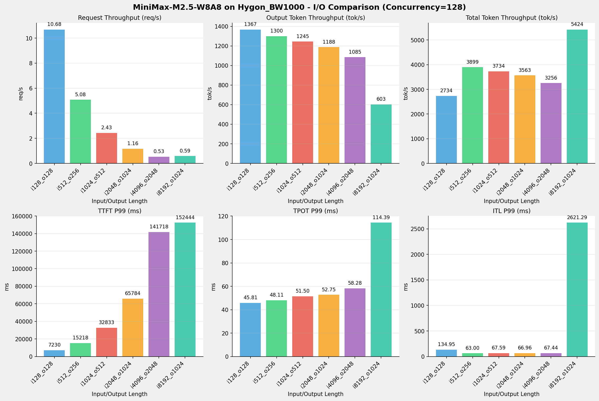

---

## 📝 详细性能数据

### input: 128, output: 128

#### 服务基准结果

| 指标 | 1 并发 | 4 并发 | 8 并发 | 16 并发 | 32 并发 | 64 并发 | 128 并发 |
| ----------- | ----------- | ----------- | ----------- | ----------- | ----------- | ----------- | ----------- |
| 成功请求数 | 1000 | 1000 | 1000 | 1000 | 1000 | 1000 | 1000 |
| 失败请求数 | 0 | 0 | 0 | 0 | 0 | 0 | 0 |
| 测试持续时间 (s) | 1836.13 | 566.70 | 317.94 | 204.89 | 145.34 | 96.00 | 93.62 |
| 总输入 tokens | 128000 | 128000 | 128000 | 128000 | 128000 | 128000 | 128000 |
| 总生成 tokens | 128000 | 128000 | 128000 | 128000 | 128000 | 128000 | 128000 |
| **请求吞吐量 (req/s)** | 0.54 | 1.76 | 3.15 | 4.88 | 6.88 | 10.42 | 10.68 |
| **输出 token 吞吐量 (tok/s)** | 69.71 | 225.87 | 402.59 | 624.73 | 880.70 | 1333.31 | 1367.19 |
| 峰值输出 token 吞吐量 (tok/s) | 77.00 | 272.00 | 472.00 | 750.00 | 1178.00 | 1856.00 | 1856.00 |
| 峰值并发请求数 | 2.00 | 8.00 | 16.00 | 32.00 | 64.00 | 128.00 | 192.00 |
| **总 token 吞吐量 (tok/s)** | 139.42 | 451.74 | 805.18 | 1249.46 | 1761.39 | 2666.61 | 2734.37 |

#### TTFT

| 指标 | 1 并发 | 4 并发 | 8 并发 | 16 并发 | 32 并发 | 64 并发 | 128 并发 |
|----------- | ----------- | ----------- | ----------- | ----------- | ----------- | ----------- | -----------|
| 平均 TTFT (ms) | 134.74 | 221.28 | 289.77 | 401.78 | 548.80 | 870.56 | 6457.75 |
| 中位 TTFT (ms) | 134.89 | 259.85 | 326.93 | 435.18 | 611.99 | 885.65 | 6870.02 |
| P95 TTFT (ms) | 141.10 | 276.54 | 333.85 | 449.29 | 764.46 | 1234.27 | 7222.80 |
| P99 TTFT (ms) | 148.98 | 294.96 | 347.01 | 461.64 | 786.60 | 1298.18 | 7229.68 |

#### TPOT

| 指标 | 1 并发 | 4 并发 | 8 并发 | 16 并发 | 32 并发 | 64 并发 | 128 并发 |
|----------- | ----------- | ----------- | ----------- | ----------- | ----------- | ----------- | -----------|
| 平均 TPOT (ms) | 13.39 | 16.10 | 17.74 | 22.49 | 31.82 | 40.62 | 39.31 |
| 中位 TPOT (ms) | 13.39 | 15.93 | 17.57 | 22.39 | 31.31 | 40.76 | 39.54 |
| P95 TPOT (ms) | 13.43 | 16.93 | 19.00 | 24.52 | 35.00 | 44.70 | 39.81 |
| P99 TPOT (ms) | 13.50 | 17.02 | 19.07 | 24.72 | 35.60 | 46.99 | 45.81 |

#### ITL

| 指标 | 1 并发 | 4 并发 | 8 并发 | 16 并发 | 32 并发 | 64 并发 | 128 并发 |
|----------- | ----------- | ----------- | ----------- | ----------- | ----------- | ----------- | -----------|
| 平均 ITL (ms) | 13.36 | 16.04 | 17.63 | 22.36 | 31.58 | 40.30 | 39.00 |
| 中位 ITL (ms) | 13.33 | 15.94 | 17.70 | 22.75 | 31.03 | 38.56 | 38.51 |
| P95 ITL (ms) | 16.00 | 18.07 | 19.29 | 25.61 | 33.51 | 40.80 | 41.70 |
| P99 ITL (ms) | 23.34 | 29.56 | 24.60 | 39.84 | 62.20 | 135.18 | 134.95 |

---

### input: 512, output: 256

#### 服务基准结果

| 指标 | 1 并发 | 4 并发 | 8 并发 | 16 并发 | 32 并发 | 64 并发 | 128 并发 |
| ----------- | ----------- | ----------- | ----------- | ----------- | ----------- | ----------- | ----------- |
| 成功请求数 | 1000 | 1000 | 1000 | 1000 | 1000 | 1000 | 1000 |
| 失败请求数 | 0 | 0 | 0 | 0 | 0 | 0 | 0 |
| 测试持续时间 (s) | 3679.99 | 1128.12 | 635.50 | 413.53 | 290.86 | 198.87 | 197.00 |
| 总输入 tokens | 512000 | 512000 | 512000 | 512000 | 512000 | 512000 | 512000 |
| 总生成 tokens | 256000 | 256000 | 256000 | 256000 | 256000 | 256000 | 256000 |
| **请求吞吐量 (req/s)** | 0.27 | 0.89 | 1.57 | 2.42 | 3.44 | 5.03 | 5.08 |
| **输出 token 吞吐量 (tok/s)** | 69.57 | 226.93 | 402.84 | 619.05 | 880.14 | 1287.29 | 1299.51 |
| 峰值输出 token 吞吐量 (tok/s) | 77.00 | 256.00 | 496.00 | 749.00 | 1152.00 | 1856.00 | 1856.00 |
| 峰值并发请求数 | 2.00 | 8.00 | 16.00 | 32.00 | 64.00 | 128.00 | 192.00 |
| **总 token 吞吐量 (tok/s)** | 208.70 | 680.78 | 1208.51 | 1857.16 | 2640.42 | 3861.86 | 3898.54 |

#### TTFT

| 指标 | 1 并发 | 4 并发 | 8 并发 | 16 并发 | 32 并发 | 64 并发 | 128 并发 |
|----------- | ----------- | ----------- | ----------- | ----------- | ----------- | ----------- | -----------|
| 平均 TTFT (ms) | 138.09 | 290.33 | 432.57 | 680.36 | 1095.35 | 1691.16 | 13246.28 |
| 中位 TTFT (ms) | 138.47 | 337.86 | 473.42 | 743.19 | 1063.34 | 1874.27 | 14198.52 |
| P95 TTFT (ms) | 144.95 | 346.96 | 485.22 | 752.08 | 1357.87 | 2583.01 | 14863.99 |
| P99 TTFT (ms) | 155.38 | 358.52 | 524.83 | 779.90 | 1445.65 | 2686.74 | 15217.88 |

#### TPOT

| 指标 | 1 并发 | 4 并发 | 8 并发 | 16 并发 | 32 并发 | 64 并发 | 128 并发 |
|----------- | ----------- | ----------- | ----------- | ----------- | ----------- | ----------- | -----------|
| 平均 TPOT (ms) | 13.89 | 16.56 | 18.24 | 23.12 | 31.71 | 42.28 | 42.19 |
| 中位 TPOT (ms) | 13.89 | 16.44 | 18.12 | 22.97 | 31.92 | 41.94 | 41.56 |
| P95 TPOT (ms) | 13.91 | 17.30 | 19.43 | 25.15 | 32.52 | 47.63 | 45.29 |
| P99 TPOT (ms) | 13.93 | 17.41 | 19.54 | 25.36 | 35.60 | 48.50 | 48.11 |

#### ITL

| 指标 | 1 并发 | 4 并发 | 8 并发 | 16 并发 | 32 并发 | 64 并发 | 128 并发 |
|----------- | ----------- | ----------- | ----------- | ----------- | ----------- | ----------- | -----------|
| 平均 ITL (ms) | 13.88 | 16.58 | 18.22 | 23.07 | 31.67 | 42.16 | 42.02 |
| 中位 ITL (ms) | 13.88 | 16.38 | 18.16 | 23.13 | 30.83 | 38.74 | 38.79 |
| P95 ITL (ms) | 15.91 | 17.76 | 20.33 | 25.76 | 35.18 | 43.32 | 43.06 |
| P99 ITL (ms) | 22.43 | 28.00 | 29.39 | 32.24 | 56.15 | 68.89 | 63.00 |

---

### input: 1024, output: 512

#### 服务基准结果

| 指标 | 1 并发 | 4 并发 | 8 并发 | 16 并发 | 32 并发 | 64 并发 | 128 并发 |
| ----------- | ----------- | ----------- | ----------- | ----------- | ----------- | ----------- | ----------- |
| 成功请求数 | 1000 | 1000 | 1000 | 1000 | 1000 | 1000 | 1000 |
| 失败请求数 | 0 | 0 | 0 | 0 | 0 | 0 | 0 |
| 测试持续时间 (s) | 7321.20 | 2224.24 | 1259.98 | 832.82 | 593.57 | 411.53 | 411.32 |
| 总输入 tokens | 1024000 | 1024000 | 1024000 | 1024000 | 1024000 | 1024000 | 1024000 |
| 总生成 tokens | 512000 | 512000 | 512000 | 512000 | 512000 | 512000 | 512000 |
| **请求吞吐量 (req/s)** | 0.14 | 0.45 | 0.79 | 1.20 | 1.68 | 2.43 | 2.43 |
| **输出 token 吞吐量 (tok/s)** | 69.93 | 230.19 | 406.35 | 614.78 | 862.58 | 1244.14 | 1244.78 |
| 峰值输出 token 吞吐量 (tok/s) | 77.00 | 264.00 | 496.00 | 784.00 | 1155.00 | 1796.00 | 1792.00 |
| 峰值并发请求数 | 2.00 | 8.00 | 16.00 | 32.00 | 64.00 | 128.00 | 190.00 |
| **总 token 吞吐量 (tok/s)** | 209.80 | 690.57 | 1219.06 | 1844.34 | 2587.73 | 3732.41 | 3734.35 |

#### TTFT

| 指标 | 1 并发 | 4 并发 | 8 并发 | 16 并发 | 32 并发 | 64 并发 | 128 并发 |
|----------- | ----------- | ----------- | ----------- | ----------- | ----------- | ----------- | -----------|
| 平均 TTFT (ms) | 188.53 | 432.99 | 745.04 | 1184.45 | 1958.76 | 3378.19 | 27454.32 |
| 中位 TTFT (ms) | 198.91 | 544.64 | 891.02 | 1129.00 | 2044.54 | 3071.30 | 29091.67 |
| P95 TTFT (ms) | 204.23 | 553.79 | 905.66 | 1664.32 | 3347.22 | 6388.01 | 32632.51 |
| P99 TTFT (ms) | 213.04 | 569.68 | 938.55 | 1754.29 | 3358.71 | 6403.94 | 32833.25 |

#### TPOT

| 指标 | 1 并发 | 4 并发 | 8 并发 | 16 并发 | 32 并发 | 64 并发 | 128 并发 |
|----------- | ----------- | ----------- | ----------- | ----------- | ----------- | ----------- | -----------|
| 平均 TPOT (ms) | 13.96 | 16.56 | 18.27 | 23.60 | 32.86 | 43.91 | 44.37 |
| 中位 TPOT (ms) | 13.96 | 16.50 | 18.18 | 23.53 | 32.45 | 43.79 | 44.36 |
| P95 TPOT (ms) | 13.98 | 17.22 | 19.46 | 24.76 | 35.60 | 49.81 | 50.29 |
| P99 TPOT (ms) | 13.98 | 17.44 | 19.63 | 26.10 | 37.02 | 51.29 | 51.50 |

#### ITL

| 指标 | 1 并发 | 4 并发 | 8 并发 | 16 并发 | 32 并发 | 64 并发 | 128 并发 |
|----------- | ----------- | ----------- | ----------- | ----------- | ----------- | ----------- | -----------|
| 平均 ITL (ms) | 13.97 | 16.60 | 18.31 | 23.57 | 32.83 | 43.85 | 44.30 |
| 中位 ITL (ms) | 13.95 | 16.41 | 18.17 | 23.05 | 31.08 | 39.75 | 39.80 |
| P95 ITL (ms) | 15.22 | 19.68 | 20.82 | 24.26 | 37.64 | 44.24 | 49.44 |
| P99 ITL (ms) | 21.33 | 28.31 | 28.46 | 31.52 | 54.11 | 62.57 | 67.59 |

---

### input: 2048, output: 1024

#### 服务基准结果

| 指标 | 1 并发 | 4 并发 | 8 并发 | 16 并发 | 32 并发 | 64 并发 | 128 并发 |
| ----------- | ----------- | ----------- | ----------- | ----------- | ----------- | ----------- | ----------- |
| 成功请求数 | 1000 | 1000 | 1000 | 1000 | 1000 | 1000 | 1000 |
| 失败请求数 | 0 | 0 | 0 | 0 | 0 | 0 | 0 |
| 测试持续时间 (s) | 14683.33 | 4378.66 | 2482.53 | 1648.92 | 1190.76 | 859.75 | 862.16 |
| 总输入 tokens | 2048000 | 2048000 | 2048000 | 2048000 | 2048000 | 2048000 | 2048000 |
| 总生成 tokens | 1024000 | 1024000 | 1024000 | 1024000 | 1024000 | 1024000 | 1024000 |
| **请求吞吐量 (req/s)** | 0.07 | 0.23 | 0.40 | 0.61 | 0.84 | 1.16 | 1.16 |
| **输出 token 吞吐量 (tok/s)** | 69.74 | 233.86 | 412.48 | 621.01 | 859.95 | 1191.04 | 1187.72 |
| 峰值输出 token 吞吐量 (tok/s) | 76.00 | 268.00 | 504.00 | 800.00 | 1152.00 | 1740.00 | 1664.00 |
| 峰值并发请求数 | 2.00 | 8.00 | 16.00 | 32.00 | 64.00 | 128.00 | 180.00 |
| **总 token 吞吐量 (tok/s)** | 209.22 | 701.58 | 1237.45 | 1863.04 | 2579.86 | 3573.13 | 3563.15 |

#### TTFT

| 指标 | 1 并发 | 4 并发 | 8 并发 | 16 并发 | 32 并发 | 64 并发 | 128 并发 |
|----------- | ----------- | ----------- | ----------- | ----------- | ----------- | ----------- | -----------|
| 平均 TTFT (ms) | 294.97 | 749.23 | 1278.19 | 2230.18 | 4025.14 | 7529.39 | 56760.85 |
| 中位 TTFT (ms) | 294.13 | 899.87 | 1233.07 | 2161.61 | 4016.23 | 7727.77 | 59337.51 |
| P95 TTFT (ms) | 302.67 | 907.82 | 1734.36 | 3229.39 | 6358.74 | 12402.07 | 64824.12 |
| P99 TTFT (ms) | 312.85 | 926.46 | 1743.14 | 3237.66 | 6366.01 | 12415.20 | 65783.50 |

#### TPOT

| 指标 | 1 并发 | 4 并发 | 8 并发 | 16 并发 | 32 并发 | 64 并发 | 128 并发 |
|----------- | ----------- | ----------- | ----------- | ----------- | ----------- | ----------- | -----------|
| 平均 TPOT (ms) | 14.06 | 16.39 | 18.16 | 23.46 | 32.84 | 45.40 | 47.61 |
| 中位 TPOT (ms) | 14.06 | 16.40 | 18.10 | 23.36 | 32.78 | 45.09 | 48.01 |
| P95 TPOT (ms) | 14.08 | 17.16 | 19.23 | 25.23 | 36.13 | 52.05 | 52.51 |
| P99 TPOT (ms) | 14.09 | 17.37 | 19.63 | 25.78 | 36.85 | 52.61 | 52.75 |

#### ITL

| 指标 | 1 并发 | 4 并发 | 8 并发 | 16 并发 | 32 并发 | 64 并发 | 128 并发 |
|----------- | ----------- | ----------- | ----------- | ----------- | ----------- | ----------- | -----------|
| 平均 ITL (ms) | 14.13 | 16.42 | 18.22 | 23.49 | 32.87 | 45.41 | 47.58 |
| 中位 ITL (ms) | 14.06 | 16.23 | 17.84 | 22.65 | 30.71 | 41.20 | 41.24 |
| P95 ITL (ms) | 15.99 | 18.30 | 20.02 | 24.23 | 36.42 | 48.77 | 48.58 |
| P99 ITL (ms) | 24.12 | 24.42 | 29.51 | 36.28 | 52.00 | 63.52 | 66.96 |

---

### input: 4096, output: 2048

#### 服务基准结果

| 指标 | 1 并发 | 4 并发 | 8 并发 | 16 并发 | 32 并发 | 64 并发 | 128 并发 |
| ----------- | ----------- | ----------- | ----------- | ----------- | ----------- | ----------- | ----------- |
| 成功请求数 | 1000 | 1000 | 1000 | 1000 | 1000 | 1000 | 1000 |
| 失败请求数 | 0 | 0 | 0 | 0 | 0 | 0 | 0 |
| 测试持续时间 (s) | 29538.10 | 8712.33 | 4986.14 | 3374.51 | 2498.57 | 1877.86 | 1886.80 |
| 总输入 tokens | 4096000 | 4096000 | 4096000 | 4096000 | 4096000 | 4096000 | 4096000 |
| 总生成 tokens | 2048000 | 2048000 | 2048000 | 2048000 | 2048000 | 2048000 | 2048000 |
| **请求吞吐量 (req/s)** | 0.03 | 0.11 | 0.20 | 0.30 | 0.40 | 0.53 | 0.53 |
| **输出 token 吞吐量 (tok/s)** | 69.33 | 235.07 | 410.74 | 606.90 | 819.67 | 1090.61 | 1085.44 |
| 峰值输出 token 吞吐量 (tok/s) | 78.00 | 272.00 | 496.00 | 768.00 | 1057.00 | 1536.00 | 1536.00 |
| 峰值并发请求数 | 2.00 | 8.00 | 16.00 | 32.00 | 64.00 | 128.00 | 157.00 |
| **总 token 吞吐量 (tok/s)** | 208.00 | 705.21 | 1232.21 | 1820.71 | 2459.01 | 3271.82 | 3256.32 |

#### TTFT

| 指标 | 1 并发 | 4 并发 | 8 并发 | 16 并发 | 32 并发 | 64 并发 | 128 并发 |
|----------- | ----------- | ----------- | ----------- | ----------- | ----------- | ----------- | -----------|
| 平均 TTFT (ms) | 470.67 | 1247.69 | 2166.41 | 4011.14 | 7468.99 | 10073.54 | 117292.04 |
| 中位 TTFT (ms) | 471.40 | 1416.26 | 2365.69 | 4242.93 | 8017.68 | 9350.88 | 123580.07 |
| P95 TTFT (ms) | 477.67 | 1695.22 | 3272.19 | 6314.51 | 12311.27 | 22539.13 | 130077.96 |
| P99 TTFT (ms) | 486.84 | 1701.32 | 3283.34 | 6322.58 | 12529.02 | 24565.33 | 141717.58 |

#### TPOT

| 指标 | 1 并发 | 4 并发 | 8 并发 | 16 并发 | 32 并发 | 64 并发 | 128 并发 |
|----------- | ----------- | ----------- | ----------- | ----------- | ----------- | ----------- | -----------|
| 平均 TPOT (ms) | 14.20 | 16.41 | 18.43 | 24.26 | 34.93 | 52.71 | 55.72 |
| 中位 TPOT (ms) | 14.20 | 16.41 | 18.41 | 24.20 | 34.86 | 53.53 | 56.30 |
| P95 TPOT (ms) | 14.21 | 17.25 | 19.47 | 26.15 | 38.26 | 57.28 | 57.96 |
| P99 TPOT (ms) | 14.22 | 17.47 | 19.84 | 26.70 | 39.05 | 57.85 | 58.28 |

#### ITL

| 指标 | 1 并发 | 4 并发 | 8 并发 | 16 并发 | 32 并发 | 64 并发 | 128 并发 |
|----------- | ----------- | ----------- | ----------- | ----------- | ----------- | ----------- | -----------|
| 平均 ITL (ms) | 14.25 | 16.46 | 18.47 | 24.27 | 34.95 | 52.72 | 55.71 |
| 中位 ITL (ms) | 14.20 | 16.15 | 17.94 | 23.27 | 32.63 | 45.93 | 46.00 |
| P95 ITL (ms) | 15.96 | 17.61 | 20.15 | 24.90 | 38.86 | 52.40 | 50.61 |
| P99 ITL (ms) | 22.92 | 24.31 | 28.19 | 30.67 | 54.58 | 70.60 | 67.44 |

---

### input: 8192, output: 1024

#### 服务基准结果

| 指标 | 1 并发 | 4 并发 | 8 并发 | 16 并发 | 32 并发 | 64 并发 | 128 并发 |
| ----------- | ----------- | ----------- | ----------- | ----------- | ----------- | ----------- | ----------- |
| 成功请求数 | 1000 | 1000 | 1000 | 1000 | 1000 | 1000 | 1000 |
| 失败请求数 | 0 | 0 | 0 | 0 | 0 | 0 | 0 |
| 测试持续时间 (s) | 15489.87 | 5045.19 | 3198.24 | 2411.26 | 1984.29 | 1698.49 | 1699.24 |
| 总输入 tokens | 8192000 | 8192000 | 8192000 | 8192000 | 8192000 | 8192000 | 8192000 |
| 总生成 tokens | 1024000 | 1024000 | 1024000 | 1024000 | 1024000 | 1024000 | 1024000 |
| **请求吞吐量 (req/s)** | 0.06 | 0.20 | 0.31 | 0.41 | 0.50 | 0.59 | 0.59 |
| **输出 token 吞吐量 (tok/s)** | 66.11 | 202.97 | 320.18 | 424.67 | 516.05 | 602.89 | 602.62 |
| 峰值输出 token 吞吐量 (tok/s) | 75.00 | 264.00 | 480.00 | 736.00 | 960.00 | 1280.00 | 1280.00 |
| 峰值并发请求数 | 2.00 | 8.00 | 16.00 | 32.00 | 49.00 | 76.00 | 135.00 |
| **总 token 吞吐量 (tok/s)** | 594.97 | 1826.69 | 2881.59 | 3822.06 | 4644.47 | 5425.98 | 5423.60 |

#### TTFT

| 指标 | 1 并发 | 4 并发 | 8 并发 | 16 并发 | 32 并发 | 64 并发 | 128 并发 |
|----------- | ----------- | ----------- | ----------- | ----------- | ----------- | ----------- | -----------|
| 平均 TTFT (ms) | 872.96 | 2171.51 | 4051.63 | 6866.31 | 7231.83 | 8453.70 | 107832.67 |
| 中位 TTFT (ms) | 874.47 | 1900.23 | 3821.29 | 6673.56 | 5865.37 | 5829.40 | 111259.10 |
| P95 TTFT (ms) | 882.31 | 3322.97 | 6477.20 | 12581.30 | 16689.00 | 16467.47 | 118724.93 |
| P99 TTFT (ms) | 892.34 | 3335.25 | 6485.86 | 12596.58 | 19688.71 | 45274.45 | 152443.57 |

#### TPOT

| 指标 | 1 并发 | 4 并发 | 8 并发 | 16 并发 | 32 并发 | 64 并发 | 128 并发 |
|----------- | ----------- | ----------- | ----------- | ----------- | ----------- | ----------- | -----------|
| 平均 TPOT (ms) | 14.29 | 17.60 | 21.05 | 30.81 | 54.49 | 96.94 | 100.39 |
| 中位 TPOT (ms) | 14.29 | 17.51 | 20.93 | 30.81 | 54.71 | 97.84 | 102.43 |
| P95 TPOT (ms) | 14.30 | 19.20 | 24.23 | 36.43 | 60.20 | 103.28 | 105.01 |
| P99 TPOT (ms) | 14.31 | 19.43 | 24.72 | 37.34 | 61.36 | 112.09 | 114.39 |

#### ITL

| 指标 | 1 并发 | 4 并发 | 8 并发 | 16 并发 | 32 并发 | 64 并发 | 128 并发 |
|----------- | ----------- | ----------- | ----------- | ----------- | ----------- | ----------- | -----------|
| 平均 ITL (ms) | 14.33 | 17.63 | 21.13 | 30.82 | 54.44 | 96.93 | 100.30 |
| 中位 ITL (ms) | 14.29 | 16.47 | 18.80 | 25.16 | 36.40 | 53.42 | 53.44 |
| P95 ITL (ms) | 16.03 | 17.96 | 20.65 | 27.09 | 41.93 | 60.88 | 58.39 |
| P99 ITL (ms) | 23.17 | 24.63 | 32.22 | 43.69 | 64.07 | 1157.52 | 2621.29 |

---

*报告生成时间: 2026-05-18*

