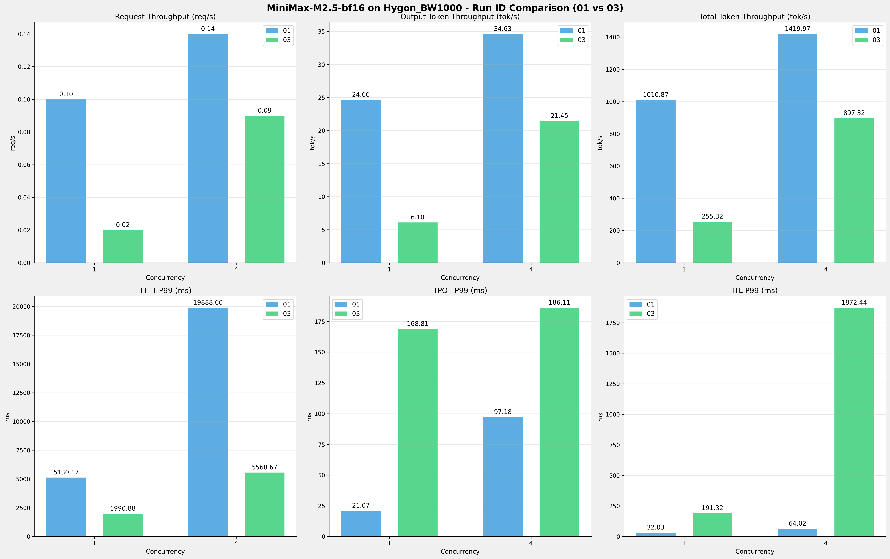

# MiniMax-M2.5-bf16模型在Hygon_BW1000上多次运行结果对比报告

**测试日期：** 2026-05-07

**对比RUN-ID：** 01 vs 03

---

## 测试场景
对比同一芯片、同一测试套件下,同一模型优化前后测试结果比对，分析性能差异。

**测试模型**  
第1轮测试（RUN-01）: MiniMax-M2.5-bf16  第2轮测试（RUN-03）: MiniMax-M2.5-bf16  

## 🤖 芯片和模型配置信息

| 参数名称                    | Hygon_BW1000 |
|------------------------|-------------|
| **model_name** | MiniMax-M2.5-bf16 |
| **quantization_config** | bf16 |
| **model_size** | 427G |
| **max_position_embeddings** | 196608 |
| **temperature** | N/A |
| **top_k** | N/A |
| **top_p** | N/A |
| **transformers_version** | 4.46.1 |
| **vllm_version** | 0.11.0+das.opt1.rc2.dtk2604.20260128.g0bf89b0c |
| **python_version** | 3.10.12 |

---

## 🤖 vLLM启动配置信息

| 参数名称                    | Hygon_BW1000 |
|------------------------|-------------|
| model_name | MiniMax-M2.5-bf16 |
| max-model-len | 196608 |
| max-num-seqs | 64 |
| max-num-batched-tokens | default |
| gpu-memory-utilization | 0.98 |
| dtype | bfloat16 |
| block_size | default |
| dp | 1 |
| tp | 8 |
| pp | 1 |
| enable-export-parallel | True |
| enable-auto-tool-choice | True |
| tool-call-parser | minimax_m2 |
| reasoning-parser | minimax_m2 (不生效) |

---

## 📊 测试概览

| 项目            | 配置                                    | 备注  |
|---------------|---------------------------------------|-----|
| **数据集**       | random                                |     |
| **并发数**       | [1, 2, 4, 8, 10, 16, 32, 64, 80, 128] |     |
| **总请求数**      | [320]                                 |     |
| **请求输入上下文长度** | [10240]                               |     |
| **请求输出上下文长度** | [256]                               |     |
| **模型**        | MiniMax-M2.5-bf16                          |     |
| **被测芯片**      | Hygon_BW1000                          |     |

**主要采集指标**：

| 指标                  | 单位         | 含义                                 |
|---------------------|------------|------------------------------------|
| TTFT                | ms         | Time To First Token，首 token 延迟     |
| TPOT                | ms/token   | Time Per Output Token，每 token 生成时间 |
| Throughput          | tokens/s   | 系统总吞吐                              |
| QPS                 | requests/s | 请求吞吐                               |
| P50/P95/P99 Latency | ms         | 延迟分位数                              |

---

## 📊 RUN-ID对比柱状图

---

## 各并发级别详细对比

### 并发级别: 1

#### 服务基准结果

| 指标 | RUN-01 | RUN-03 | 差异 | 百分比 |
|------|----------|---------|---------|---------|
| 成功请求数 | 320 | 320 | 0.00 | 0.0% |
| 失败请求数 | 0 | 0 | 0.00 | 0.0% |
| 测试持续时间 (s) | 3322.61 | 13148.00 | +9825.39 | +295.7% |
| 总输入 tokens | 3276800 | 3276748 | -52.00 | -0.0% |
| 总生成 tokens | 81920 | 80226 | -1694.00 | -2.1% |
| **请求吞吐量 (req/s)** | 0.10 | 0.02 | -0.08 | -80.0% |
| **输出 token 吞吐量 (tok/s)** | 24.66 | 6.10 | -18.56 | -75.3% |
| 峰值输出 token 吞吐量 (tok/s) | 50.00 | 8.00 | -42.00 | -84.0% |
| 峰值并发请求数 | 2.00 | 2.00 | 0.00 | 0.0% |
| **总 token 吞吐量 (tok/s)** | 1010.87 | 255.32 | -755.55 | -74.7% |

#### 首Token延迟 (TTFT)

| 指标 | RUN-01 | RUN-03 | 差异 | 百分比 |
|------|----------|---------|---------|---------|
| 平均 TTFT (ms) | 5026.61 | 1958.35 | -3068.26 | -61.0% |
| 中位 TTFT (ms) | 5041.22 | 1964.30 | -3076.92 | -61.0% |
| P95 TTFT (ms) | 5072.83 | 1977.98 | -3094.85 | -61.0% |
| P99 TTFT (ms) | 5130.17 | 1990.88 | -3139.29 | -61.2% |

#### 每Token生成时间 (TPOT)

| 指标 | RUN-01 | RUN-03 | 差异 | 百分比 |
|------|----------|---------|---------|---------|
| 平均 TPOT (ms) | 21.00 | 156.69 | +135.69 | +646.1% |
| 中位 TPOT (ms) | 21.01 | 156.16 | +135.15 | +643.3% |
| P95 TPOT (ms) | 21.05 | 163.40 | +142.35 | +676.2% |
| P99 TPOT (ms) | 21.07 | 168.81 | +147.74 | +701.2% |

#### Token间延迟 (ITL)

| 指标 | RUN-01 | RUN-03 | 差异 | 百分比 |
|------|----------|---------|---------|---------|
| 平均 ITL (ms) | 20.97 | 156.23 | +135.26 | +645.0% |
| 中位 ITL (ms) | 21.00 | 155.76 | +134.76 | +641.7% |
| P95 ITL (ms) | 21.70 | 162.28 | +140.58 | +647.8% |
| P99 ITL (ms) | 32.03 | 191.32 | +159.29 | +497.3% |

### 并发级别: 4

#### 服务基准结果

| 指标 | RUN-01 | RUN-03 | 差异 | 百分比 |
|------|----------|---------|---------|---------|
| 成功请求数 | 320 | 320 | 0.00 | 0.0% |
| 失败请求数 | 0 | 0 | 0.00 | 0.0% |
| 测试持续时间 (s) | 2365.34 | 3741.16 | +1375.82 | +58.2% |
| 总输入 tokens | 3276800 | 3276748 | -52.00 | -0.0% |
| 总生成 tokens | 81920 | 80266 | -1654.00 | -2.0% |
| **请求吞吐量 (req/s)** | 0.14 | 0.09 | -0.05 | -35.7% |
| **输出 token 吞吐量 (tok/s)** | 34.63 | 21.45 | -13.18 | -38.1% |
| 峰值输出 token 吞吐量 (tok/s) | 111.00 | 29.00 | -82.00 | -73.9% |
| 峰值并发请求数 | 8.00 | 7.00 | -1.00 | -12.5% |
| **总 token 吞吐量 (tok/s)** | 1419.97 | 897.32 | -522.65 | -36.8% |

#### 首Token延迟 (TTFT)

| 指标 | RUN-01 | RUN-03 | 差异 | 百分比 |
|------|----------|---------|---------|---------|
| 平均 TTFT (ms) | 16214.96 | 2185.58 | -14029.38 | -86.5% |
| 中位 TTFT (ms) | 19806.56 | 2038.85 | -17767.71 | -89.7% |
| P95 TTFT (ms) | 19874.02 | 3821.77 | -16052.25 | -80.8% |
| P99 TTFT (ms) | 19888.60 | 5568.67 | -14319.93 | -72.0% |

#### 每Token生成时间 (TPOT)

| 指标 | RUN-01 | RUN-03 | 差异 | 百分比 |
|------|----------|---------|---------|---------|
| 平均 TPOT (ms) | 52.36 | 177.49 | +125.13 | +239.0% |
| 中位 TPOT (ms) | 38.58 | 177.87 | +139.29 | +361.0% |
| P95 TPOT (ms) | 96.58 | 183.40 | +86.82 | +89.9% |
| P99 TPOT (ms) | 97.18 | 186.11 | +88.93 | +91.5% |

#### Token间延迟 (ITL)

| 指标 | RUN-01 | RUN-03 | 差异 | 百分比 |
|------|----------|---------|---------|---------|
| 平均 ITL (ms) | 52.22 | 176.98 | +124.76 | +238.9% |
| 中位 ITL (ms) | 38.47 | 157.22 | +118.75 | +308.7% |
| P95 ITL (ms) | 43.58 | 162.59 | +119.01 | +273.1% |
| P99 ITL (ms) | 64.02 | 1872.44 | +1808.42 | +2824.8% |

---

## 📝 分析总结

### 吞吐量对比

**请求吞吐量**: RUN-03 相比 RUN-01 平均变化 **-57.9%**

**输出Token吞吐量**: RUN-03 相比 RUN-01 平均变化 **-56.7%**

### 延迟对比

**TTFT P99**: RUN-03 相比 RUN-01 平均改善 **66.6%** (延迟降低)

**TPOT P99**: RUN-03 相比 RUN-01 平均增加 **396.3%** (延迟增加)

**ITL P99**: RUN-03 相比 RUN-01 平均增加 **1661.0%** (延迟增加)

---

*报告生成时间: 2026-05-07*

