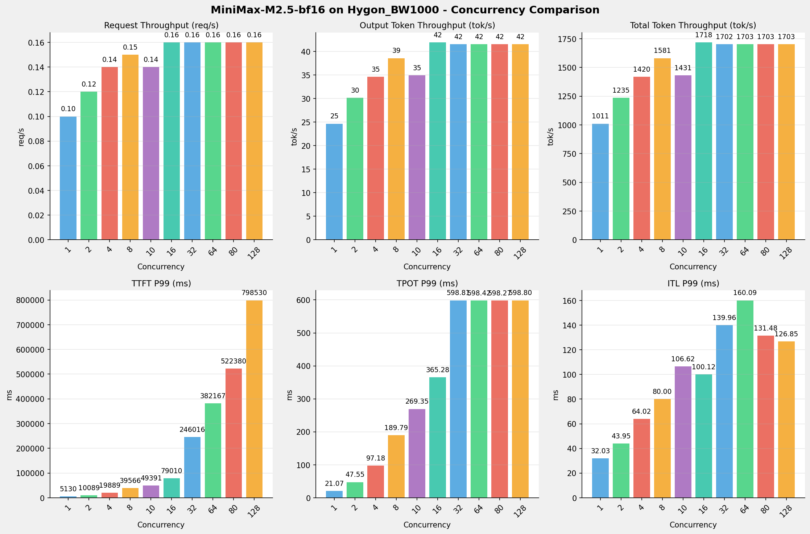
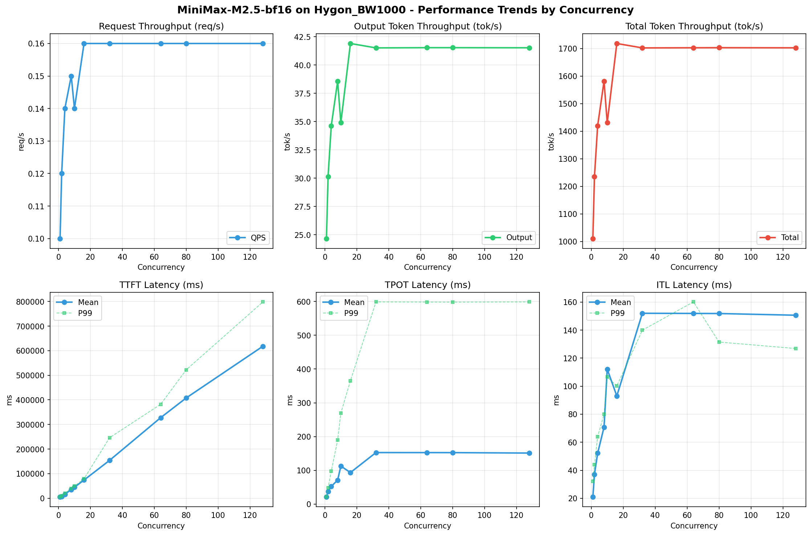

# MiniMax-M2.5-bf16模型在Hygon_BW1000上的Benchmark基准测试报告

**测试日期：** 2026-04-10

---

## 测试场景
在固定请求数，输入上下文和输出上下文长度下，使用vllm bench serve工具对并发数逐级增加场景的性能基准验证。分析同一芯片同一模型在不同并发级别下的性能指标变化趋势。

**主要采集指标**：

| 指标                  | 单位         | 含义                                 |
|---------------------|------------|------------------------------------|
| TTFT                | ms         | Time To First Token，首 token 延迟     |
| TPOT                | ms/token   | Time Per Output Token，每 token 生成时间 |
| Throughput          | tokens/s   | 系统总吞吐                              |
| QPS                 | requests/s | 请求吞吐                               |
| P50/P95/P99 Latency | ms         | 延迟分位数                              |

## 📊 测试概览

| 项目            | 配置                                     | 备注  |
|---------------|----------------------------------------|-----|
| **数据集**       | random                                 |     |
| **并发数**       | 1, 2, 4, 8, 10, 16, 32, 64, 80, 128    |     |
| **总请求数**      | 320                                    |     |
| **请求输入上下文长度** | 10240（10k）                             |     |
| **请求输出上下文长度** | 256（0.25k）                             |     |
| **模型**        | MiniMax-M2.5-bf16                           |     |
| **被测芯片**      | Hygon_BW1000 |     |

---

## 🤖 芯片和模型配置信息

| 参数名称                    | Hygon_BW1000 |
|------------------------|-------------|
| **model_name** | MiniMax-M2.5-bf16 |
| **quantization_config** | bf16 |
| **model_size** | 427G |
| **max_position_embeddings** | 196608 |
| **temperature** | N/A |
| **top_k** | N/A |
| **top_p** | N/A |
| **transformers_version** | 4.46.1 |
| **vllm_version** | 0.11.0+das.opt1.rc2.dtk2604.20260128.g0bf89b0c |
| **python_version** | 3.10.12 |

---

## 🤖 vLLM启动配置信息

| 参数名称                   | Hygon_BW1000 |
|------------------------|-------------|
| model_name | MiniMax-M2.5-bf16 |
| max-model-len | 196608 |
| max-num-seqs | 64 |
| max-num-batched-tokens | default |
| gpu-memory-utilization | 0.98 |
| dtype | bfloat16 |
| block_size | default |
| dp | 1 |
| tp | 8 |
| pp | 1 |
| enable-export-parallel | True |
| enable-auto-tool-choice | True |
| tool-call-parser | minimax_m2 |
| reasoning-parser | minimax_m2 (不生效) |

- **Hygon_BW1000**: 海光芯片专家并行配置

---

## 🎯 服务基准结果

| 指标 | 1 并发 | 2 并发 | 4 并发 | 8 并发 | 10 并发 | 16 并发 | 32 并发 | 64 并发 | 80 并发 | 128 并发 |
|------|----------- | ----------- | ----------- | ----------- | ----------- | ----------- | ----------- | ----------- | ----------- | -----------|
| 成功请求数 | 320 | 320 | 320 | 320 | 320 | 320 | 320 | 320 | 320 | 320 |
| 失败请求数 | 0 | 0 | 0 | 0 | 0 | 0 | 0 | 0 | 0 | 0 |
| 测试持续时间 (s) | 3322.61 | 2718.90 | 2365.34 | 2123.78 | 2347.19 | 1954.55 | 1972.97 | 1972.31 | 1972.05 | 1972.54 |
| 总输入 tokens | 3276800 | 3276800 | 3276800 | 3276800 | 3276800 | 3276800 | 3276800 | 3276800 | 3276800 | 3276800 |
| 总生成 tokens | 81920 | 81920 | 81920 | 81920 | 81920 | 81920 | 81920 | 81920 | 81920 | 81920 |
| **请求吞吐量 (req/s)** | 0.10 | 0.12 | 0.14 | 0.15 | 0.14 | 0.16 | 0.16 | 0.16 | 0.16 | 0.16 |
| **输出 token 吞吐量 (tok/s)** | 24.66 | 30.13 | 34.63 | 38.57 | 34.90 | 41.91 | 41.52 | 41.54 | 41.54 | 41.53 |
| 峰值输出 token 吞吐量 (tok/s) | 50.00 | 76.00 | 111.00 | 160.00 | 119.00 | 239.00 | 253.00 | 253.00 | 253.00 | 253.00 |
| 峰值并发请求数 | 2.00 | 4.00 | 8.00 | 16.00 | 20.00 | 32.00 | 54.00 | 86.00 | 102.00 | 150.00 |
| **总 token 吞吐量 (tok/s)** | 1010.87 | 1235.32 | 1419.97 | 1581.48 | 1430.96 | 1718.41 | 1702.37 | 1702.94 | 1703.16 | 1702.74 |

---

## ⏱️ 首Token延迟 (TTFT)

| 指标 | 1 并发 | 2 并发 | 4 并发 | 8 并发 | 10 并发 | 16 并发 | 32 并发 | 64 并发 | 80 并发 | 128 并发 |
|------|----------- | ----------- | ----------- | ----------- | ----------- | ----------- | ----------- | ----------- | ----------- | -----------|
| 平均 TTFT (ms) | 5026.61 | 7501.77 | 16214.96 | 34975.19 | 44636.12 | 73920.95 | 154015.23 | 327678.89 | 407916.98 | 618139.35 |
| 中位 TTFT (ms) | 5041.22 | 5186.88 | 19806.56 | 39435.78 | 49274.29 | 78728.14 | 109747.80 | 381111.53 | 382048.62 | 658558.23 |
| P95 TTFT (ms) | 5072.83 | 10045.05 | 19874.02 | 39548.64 | 49373.65 | 78938.77 | 245875.42 | 382160.76 | 522195.75 | 794480.39 |
| P99 TTFT (ms) | 5130.17 | 10088.82 | 19888.60 | 39566.34 | 49390.74 | 79009.53 | 246016.06 | 382166.79 | 522380.44 | 798530.33 |

---

## ⚡ 每Token生成时间 (TPOT)

| 指标 | 1 并发 | 2 并发 | 4 并发 | 8 并发 | 10 并发 | 16 并发 | 32 并发 | 64 并发 | 80 并发 | 128 并发 |
|------|----------- | ----------- | ----------- | ----------- | ----------- | ----------- | ----------- | ----------- | ----------- | -----------|
| 平均 TPOT (ms) | 21.00 | 37.22 | 52.36 | 71.05 | 112.59 | 93.35 | 152.59 | 152.48 | 152.41 | 151.12 |
| 中位 TPOT (ms) | 21.01 | 37.31 | 38.58 | 53.98 | 95.29 | 75.23 | 122.78 | 122.23 | 122.16 | 122.56 |
| P95 TPOT (ms) | 21.05 | 47.30 | 96.58 | 188.73 | 268.35 | 363.25 | 514.14 | 513.83 | 513.47 | 513.83 |
| P99 TPOT (ms) | 21.07 | 47.55 | 97.18 | 189.79 | 269.35 | 365.28 | 598.81 | 598.42 | 598.27 | 598.80 |

---

## 🔄 Token间延迟 (ITL)

| 指标 | 1 并发 | 2 并发 | 4 并发 | 8 并发 | 10 并发 | 16 并发 | 32 并发 | 64 并发 | 80 并发 | 128 并发 |
|------|----------- | ----------- | ----------- | ----------- | ----------- | ----------- | ----------- | ----------- | ----------- | -----------|
| 平均 ITL (ms) | 20.97 | 37.12 | 52.22 | 70.79 | 112.15 | 93.00 | 151.99 | 151.88 | 151.81 | 150.60 |
| 中位 ITL (ms) | 21.00 | 27.55 | 38.47 | 53.97 | 95.08 | 75.42 | 103.29 | 103.35 | 103.26 | 103.19 |
| P95 ITL (ms) | 21.70 | 28.71 | 43.58 | 58.48 | 98.28 | 80.18 | 111.32 | 118.51 | 109.22 | 108.58 |
| P99 ITL (ms) | 32.03 | 43.95 | 64.02 | 80.00 | 106.62 | 100.12 | 139.96 | 160.09 | 131.48 | 126.85 |

---

## 📊 各并发级别性能柱状图

---

## 📈 性能趋势分析

---

## 📝 分析总结

### 1. 吞吐量性能分析

**请求吞吐量 (QPS)**: 随着并发级别增加，QPS持续上升。
低并发(1,2,4)平均 QPS: 0.12 req/s；
中并发(8,10,16,32)平均 QPS: 0.15 req/s；
高并发(64,80,128)平均 QPS: 0.16 req/s；
最高 QPS 出现在 16 并发，达到 0.16 req/s。

**Token总吞吐量**: 最高达到 1718 tok/s (16 并发)。

### 2. 首Token延迟 (TTFT) 分析

TTFT随并发增加显著上升。
低并发平均 P99 TTFT: 11703ms；
高并发平均 P99 TTFT: 567693ms；
最高 P99 TTFT 出现在 128 并发，达到 798530ms。

### 3. Token生成时间 (TPOT) 分析

TPOT随并发增加也呈上升趋势。
低并发平均 P99 TPOT: 55.27ms；
高并发平均 P99 TPOT: 598.50ms；
最高 P99 TPOT 出现在 32 并发，达到 598.81ms。

### 4. Token间延迟 (ITL) 分析

ITL随并发增加呈上升趋势。
低并发平均 P99 ITL: 46.67ms；
高并发平均 P99 ITL: 139.47ms；
最高 P99 ITL 出现在 64 并发，达到 160.09ms。

### 5. 综合评估

**吞吐量增长**: 从最低并发到最高并发，QPS增长了 60.0%。
**TTFT延迟恶化**: 高并发相比低并发，TTFT P99增加了 6723.6%。
**TPOT延迟恶化**: 高并发相比低并发，TPOT P99增加了 983.5%。

---

*报告生成时间: 2026-04-10*

