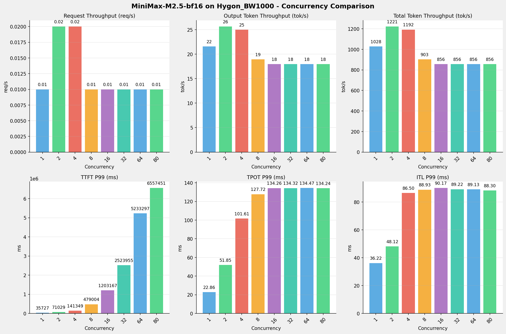
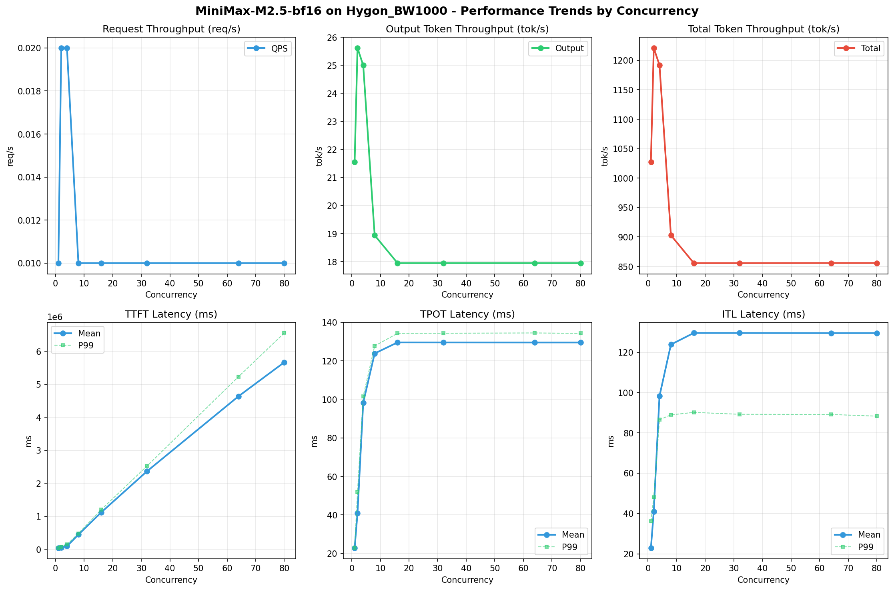

# MiniMax-M2.5-bf16模型在Hygon_BW1000上的Benchmark基准测试报告

**测试日期：** 2026-05-18

---

## 测试场景
使用vllm bench serve基准测试工具对不同并发数，请求上下文长度下的性能变化趋势。

**主要采集指标**：

| 指标                  | 单位         | 含义                                 |
|---------------------|------------|------------------------------------|
| Request throughput  | req/s      | 请求吞吐量                              |
| Output token throughput | tok/s  | 输出token吞吐量                        |
| Total token throughput | tok/s   | 总token吞吐量                         |
| TTFT                | ms         | Time To First Token，首 token 延迟     |
| TPOT                | ms/token   | Time Per Output Token，每 token 生成时间 |
| ITL                 | ms         | Inter-Token Latency，token间延迟       |

## 🤖 芯片和模型配置信息

| 参数名称                    | Hygon_BW1000 |
|------------------------|-------------|
| **model_name** | MiniMax-M2.5-bf16 |
| **quantization_config** | bf16 |
| **model_size** | 427G |
| **max_position_embeddings** | 196608 |
| **temperature** | N/A |
| **top_k** | N/A |
| **top_p** | N/A |
| **transformers_version** | 4.46.1 |
| **vllm_version** | 0.11.0+das.opt1.rc2.dtk2604.20260128.g0bf89b0c |
| **python_version** | 3.10.12 |

## 🤖 vLLM启动配置信息

| 参数名称                   | Hygon_BW1000 |
|------------------------|-------------|
| **Model Name** | MiniMax-M2.5-bf16 |
| **Max Model Len** | 196608 |
| **Max Num Seqs** | 64 |
| **Max Num Batched Tokens** | default |
| **Gpu Memory Utilization** | 0.98 |
| **Dtype** | bfloat16 |
| **Block Size** | default |
| **Dp** | 1 |
| **Tp** | 8 |
| **Pp** | 1 |
| **Enable Export Parallel** | True |
| **Enable Auto Tool Choice** | True |
| **Tool Call Parser** | minimax_m2 |
| **Reasoning Parser** | minimax_m2 (不生效) |
| **Compilation Config** | N/A |

- **Hygon_BW1000**: 海光芯片专家并行配置

## 📊 测试概览

| 项目            | 配置                                     | 备注  |
|---------------|----------------------------------------|-----|
| **数据集**       | random                                 |     |
| **并发数**       | 1, 2, 4, 8, 16, 32, 64, 80    |     |
| **总请求数**      | 300                                    |     |
| **请求输入上下文长度** | 70000（68k）                             |     |
| **请求输出上下文长度** | 1500（1k）                             |     |
| **模型**        | MiniMax-M2.5-bf16                           |     |
| **被测芯片**      | Hygon_BW1000 |     |

---

## 📋 测试结果汇总

| 并发数 | 请求吞吐量 (req/s) | 输出Token吞吐量 (tok/s) | 总Token吞吐量 (tok/s) | TTFT P99 (ms) | TPOT P99 (ms) | ITL P99 (ms) |
| ----------- | ----------- | ----------- | ----------- | ----------- | ----------- | ----------- |
| 1 | 0.01 | 21.56 | 1027.65 | 35726.72 | 22.86 | 36.22 |
| 2 | 0.02 | 25.62 | 1221.01 | 71028.70 | 51.85 | 48.12 |
| 4 | 0.02 | 25.00 | 1191.89 | 141348.75 | 101.61 | 86.50 |
| 8 | 0.01 | 18.94 | 902.91 | 479003.68 | 127.72 | 88.93 |
| 16 | 0.01 | 17.95 | 855.72 | 1203166.85 | 134.26 | 90.17 |
| 32 | 0.01 | 17.95 | 855.71 | 2523954.81 | 134.32 | 89.22 |
| 64 | 0.01 | 17.95 | 855.83 | 5233297.08 | 134.47 | 89.13 |
| 80 | 0.01 | 17.95 | 855.83 | 6557450.88 | 134.24 | 88.30 |

## 📊 各并发级别性能柱状图

## 📈 性能趋势分析

---

### 🎯 服务基准结果详情

| 指标 | 1 并发 | 2 并发 | 4 并发 | 8 并发 | 16 并发 | 32 并发 | 64 并发 | 80 并发 |
|------|----------- | ----------- | ----------- | ----------- | ----------- | ----------- | ----------- | -----------|
| 成功请求数 | 300 | 300 | 300 | 300 | 300 | 300 | 300 | 300 |
| 失败请求数 | 0 | 0 | 0 | 0 | 0 | 0 | 0 | 0 |
| 测试持续时间 (s) | 20872.79 | 17567.48 | 17996.56 | 23756.45 | 25066.68 | 25066.84 | 25063.49 | 25063.30 |
| 总输入 tokens | 21000000 | 21000000 | 21000000 | 21000000 | 21000000 | 21000000 | 21000000 | 21000000 |
| 总生成 tokens | 450000 | 450000 | 450000 | 450000 | 450000 | 450000 | 450000 | 450000 |
| **请求吞吐量 (req/s)** | 0.01 | 0.02 | 0.02 | 0.01 | 0.01 | 0.01 | 0.01 | 0.01 |
| **输出 token 吞吐量 (tok/s)** | 21.56 | 25.62 | 25.00 | 18.94 | 17.95 | 17.95 | 17.95 | 17.95 |
| 峰值输出 token 吞吐量 (tok/s) | 50.00 | 70.00 | 69.00 | 69.00 | 69.00 | 69.00 | 69.00 | 69.00 |
| 峰值并发请求数 | 2.00 | 4.00 | 5.00 | 9.00 | 17.00 | 33.00 | 65.00 | 81.00 |
| **总 token 吞吐量 (tok/s)** | 1027.65 | 1221.01 | 1191.89 | 902.91 | 855.72 | 855.71 | 855.83 | 855.83 |

### ⏱️ 首Token延迟 (TTFT)

| 指标 | 1 并发 | 2 并发 | 4 并发 | 8 并发 | 16 并发 | 32 并发 | 64 并发 | 80 并发 |
|------|----------- | ----------- | ----------- | ----------- | ----------- | ----------- | ----------- | -----------|
| 平均 TTFT (ms) | 35408.72 | 55724.75 | 92351.39 | 444430.97 | 1120105.78 | 2365050.77 | 4639166.81 | 5668660.43 |
| 中位 TTFT (ms) | 35525.05 | 41400.40 | 69745.26 | 471466.50 | 1128646.92 | 2512609.34 | 5158200.08 | 6485801.01 |
| P95 TTFT (ms) | 35642.55 | 70919.33 | 140496.55 | 477432.43 | 1199792.66 | 2521552.72 | 5229279.25 | 6554088.22 |
| P99 TTFT (ms) | 35726.72 | 71028.70 | 141348.75 | 479003.68 | 1203166.85 | 2523954.81 | 5233297.08 | 6557450.88 |

### ⚡ 每Token生成时间 (TPOT)

| 指标 | 1 并发 | 2 并发 | 4 并发 | 8 并发 | 16 并发 | 32 并发 | 64 并发 | 80 并发 |
|------|----------- | ----------- | ----------- | ----------- | ----------- | ----------- | ----------- | -----------|
| 平均 TPOT (ms) | 22.79 | 40.95 | 98.25 | 123.82 | 129.56 | 129.55 | 129.52 | 129.52 |
| 中位 TPOT (ms) | 22.79 | 41.20 | 98.03 | 124.10 | 130.40 | 130.31 | 130.23 | 130.27 |
| P95 TPOT (ms) | 22.85 | 51.48 | 101.17 | 127.26 | 133.78 | 133.78 | 133.87 | 133.82 |
| P99 TPOT (ms) | 22.86 | 51.85 | 101.61 | 127.72 | 134.26 | 134.32 | 134.47 | 134.24 |

### 🔄 Token间延迟 (ITL)

| 指标 | 1 并发 | 2 并发 | 4 并发 | 8 并发 | 16 并发 | 32 并发 | 64 并发 | 80 并发 |
|------|----------- | ----------- | ----------- | ----------- | ----------- | ----------- | ----------- | -----------|
| 平均 ITL (ms) | 22.85 | 40.99 | 98.23 | 123.83 | 129.57 | 129.56 | 129.52 | 129.53 |
| 中位 ITL (ms) | 22.79 | 31.15 | 48.49 | 48.48 | 48.51 | 48.48 | 48.44 | 48.45 |
| P95 ITL (ms) | 23.96 | 32.69 | 53.56 | 52.81 | 53.63 | 55.42 | 55.38 | 53.11 |
| P99 ITL (ms) | 36.22 | 48.12 | 86.50 | 88.93 | 90.17 | 89.22 | 89.13 | 88.30 |

---

## 📝 分析总结

### 1. 吞吐量性能分析

**请求吞吐量 (QPS)**: 随着并发级别增加，QPS持续上升。
低并发(1,2,4)平均 QPS: 0.02 req/s；
中并发(8,16,32)平均 QPS: 0.01 req/s；
高并发(64,80)平均 QPS: 0.01 req/s；
最高 QPS 出现在 2 并发，达到 0.02 req/s。

**Token总吞吐量**: 最高达到 1221 tok/s (2 并发)。

### 2. 首Token延迟 (TTFT) 分析

TTFT随并发增加显著上升。
低并发平均 P99 TTFT: 82701ms；
高并发平均 P99 TTFT: 5895374ms；
最高 P99 TTFT 出现在 80 并发，达到 6557451ms。

### 3. Token生成时间 (TPOT) 分析

TPOT随并发增加也呈上升趋势。
低并发平均 P99 TPOT: 58.77ms；
高并发平均 P99 TPOT: 134.36ms；
最高 P99 TPOT 出现在 64 并发，达到 134.47ms。

### 4. Token间延迟 (ITL) 分析

ITL随并发增加呈上升趋势。
低并发平均 P99 ITL: 56.95ms；
高并发平均 P99 ITL: 88.72ms；
最高 P99 ITL 出现在 16 并发，达到 90.17ms。

### 5. 综合评估

**吞吐量增长**: 从最低并发到最高并发，QPS增长了 0.0%。
**TTFT延迟恶化**: 高并发相比低并发，TTFT P99增加了 7829.1%。
**TPOT延迟恶化**: 高并发相比低并发，TPOT P99增加了 128.8%。

---

*报告生成时间: 2026-05-18*

