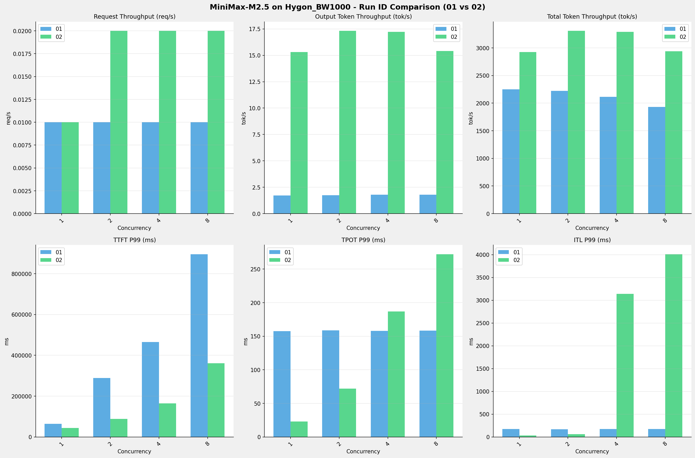

# MiniMax-M2.5模型在Hygon_BW1000上的RUN-ID对比报告

**测试日期：** 2026-04-01

**对比RUN-ID：** 01 vs 02

---

## 测试场景
对比同一芯片、同一测试套件下,同一模型优化前后测试结果比对，分析性能差异。

**测试模型**  
第一轮测试（RUN-01）: MiniMax-M2.5-bf16  
第二轮测试（RUN-02）: MiniMax-M2.5-W8A8

## 🤖 vLLM启动配置信息

| 参数名称                   | RUN-01     | RUN-02                                     |
|------------------------|------------|--------------------------------------------|
| max-model-len          | 196608     | 196608                                     |
| max-num-seqs           | 64         | 64                                         |
| max-num-batched-tokens | 8192       | N/A                                        |
| gpu-memory-utilization | 0.95       | 0.9                                        |
| dp                     | 1          | 1                                          |
| tp                     | 8          | 8                                          |
| pp                     | 1          | 1                                          |
| enable-export-parallel | False      | N/A                                        |
| tool-call-parser       | minimax_m2 | minimax_m2                                 |
| reasoning-parser       | minimax_m2 | N/A                                        |
| -cc                    | N/A        | {"pass_config": {"fuse_act_quant": false}} |

## 📊 测试概览

| 项目            | 配置               | 备注  |
|---------------|------------------|-----|
| **数据集**       | random           |     |
| **并发数**       | [1, 2, 4, 8, 10] |     |
| **总请求数**      | [100]            |     |
| **请求输入上下文长度** | [194560]         |     |
| **请求输出上下文长度** | [1024]           |     |
| **模型**        | MiniMax-M2.5     |     |
| **被测芯片**      | Hygon_BW1000     |     |

**主要采集指标**：

| 指标                  | 单位         | 含义                                 |
|---------------------|------------|------------------------------------|
| TTFT                | ms         | Time To First Token，首 token 延迟     |
| TPOT                | ms/token   | Time Per Output Token，每 token 生成时间 |
| Throughput          | tokens/s   | 系统总吞吐                              |
| QPS                 | requests/s | 请求吞吐                               |
| P50/P95/P99 Latency | ms         | 延迟分位数                              |

---

## 各并发级别详细对比

### 并发级别: 1

#### 服务基准结果

| 指标                       | RUN-01   | RUN-02   | 差异        | 百分比     |
|--------------------------|----------|----------|-----------|---------|
| 成功请求数                    | 100      | 100      | 0.00      | 0.0%    |
| 失败请求数                    | 0        | 0        | 0.00      | 0.0%    |
| 测试持续时间 (s)               | 8655.55  | 6683.31  | -1972.24  | -22.8%  |
| 总输入 tokens               | 19456000 | 19456000 | 0.00      | 0.0%    |
| 总生成 tokens               | 14970    | 102400   | +87430.00 | +584.0% |
| **请求吞吐量 (req/s)**        | 0.01     | 0.01     | 0.00      | 0.0%    |
| **输出 token 吞吐量 (tok/s)** | 1.73     | 15.32    | +13.59    | +785.5% |
| 峰值输出 token 吞吐量 (tok/s)   | 8.00     | 45.00    | +37.00    | +462.5% |
| 峰值并发请求数                  | 2.00     | 2.00     | 0.00      | 0.0%    |
| **总 token 吞吐量 (tok/s)**  | 2249.54  | 2926.45  | +676.91   | +30.1%  |

#### 首Token延迟 (TTFT)

| 指标            | RUN-01   | RUN-02   | 差异        | 百分比    |
|---------------|----------|----------|-----------|--------|
| 平均 TTFT (ms)  | 63442.80 | 43428.78 | -20014.02 | -31.5% |
| 中位 TTFT (ms)  | 64113.52 | 43851.66 | -20261.86 | -31.6% |
| P95 TTFT (ms) | 64263.01 | 44013.66 | -20249.35 | -31.5% |
| P99 TTFT (ms) | 64339.96 | 44044.79 | -20295.17 | -31.5% |

#### 每Token生成时间 (TPOT)

| 指标            | RUN-01 | RUN-02 | 差异      | 百分比    |
|---------------|--------|--------|---------|--------|
| 平均 TPOT (ms)  | 155.46 | 22.88  | -132.58 | -85.3% |
| 中位 TPOT (ms)  | 155.38 | 22.86  | -132.52 | -85.3% |
| P95 TPOT (ms) | 157.34 | 23.00  | -134.34 | -85.4% |
| P99 TPOT (ms) | 157.59 | 23.02  | -134.57 | -85.4% |

#### Token间延迟 (ITL)

| 指标           | RUN-01 | RUN-02 | 差异      | 百分比    |
|--------------|--------|--------|---------|--------|
| 平均 ITL (ms)  | 155.43 | 22.89  | -132.54 | -85.3% |
| 中位 ITL (ms)  | 155.08 | 22.87  | -132.21 | -85.3% |
| P95 ITL (ms) | 161.33 | 23.99  | -137.34 | -85.1% |
| P99 ITL (ms) | 171.35 | 32.91  | -138.44 | -80.8% |

### 并发级别: 2

#### 服务基准结果

| 指标                       | RUN-01   | RUN-02   | 差异        | 百分比     |
|--------------------------|----------|----------|-----------|---------|
| 成功请求数                    | 100      | 100      | 0.00      | 0.0%    |
| 失败请求数                    | 0        | 0        | 0.00      | 0.0%    |
| 测试持续时间 (s)               | 8755.03  | 5910.65  | -2844.38  | -32.5%  |
| 总输入 tokens               | 19456000 | 19456000 | 0.00      | 0.0%    |
| 总生成 tokens               | 15263    | 102400   | +87137.00 | +570.9% |
| **请求吞吐量 (req/s)**        | 0.01     | 0.02     | +0.01     | +100.0% |
| **输出 token 吞吐量 (tok/s)** | 1.74     | 17.32    | +15.58    | +895.4% |
| 峰值输出 token 吞吐量 (tok/s)   | 8.00     | 70.00    | +62.00    | +775.0% |
| 峰值并发请求数                  | 3.00     | 4.00     | +1.00     | +33.3%  |
| **总 token 吞吐量 (tok/s)**  | 2224.01  | 3309.01  | +1085.00  | +48.8%  |

#### 首Token延迟 (TTFT)

| 指标            | RUN-01    | RUN-02   | 差异         | 百分比    |
|---------------|-----------|----------|------------|--------|
| 平均 TTFT (ms)  | 150613.30 | 66161.43 | -84451.87  | -56.1% |
| 中位 TTFT (ms)  | 148787.19 | 47585.74 | -101201.45 | -68.0% |
| P95 TTFT (ms) | 166905.14 | 88211.91 | -78693.23  | -47.1% |
| P99 TTFT (ms) | 288709.33 | 88254.14 | -200455.19 | -69.4% |

#### 每Token生成时间 (TPOT)

| 指标            | RUN-01 | RUN-02 | 差异      | 百分比    |
|---------------|--------|--------|---------|--------|
| 平均 TPOT (ms)  | 155.72 | 50.88  | -104.84 | -67.3% |
| 中位 TPOT (ms)  | 155.74 | 50.90  | -104.84 | -67.3% |
| P95 TPOT (ms) | 157.55 | 71.62  | -85.93  | -54.5% |
| P99 TPOT (ms) | 158.61 | 71.98  | -86.63  | -54.6% |

#### Token间延迟 (ITL)

| 指标           | RUN-01 | RUN-02 | 差异      | 百分比    |
|--------------|--------|--------|---------|--------|
| 平均 ITL (ms)  | 155.59 | 50.84  | -104.75 | -67.3% |
| 中位 ITL (ms)  | 155.14 | 30.33  | -124.81 | -80.4% |
| P95 ITL (ms) | 161.19 | 32.04  | -129.15 | -80.1% |
| P99 ITL (ms) | 165.40 | 57.69  | -107.71 | -65.1% |

### 并发级别: 4

#### 服务基准结果

| 指标                       | RUN-01   | RUN-02   | 差异        | 百分比      |
|--------------------------|----------|----------|-----------|----------|
| 成功请求数                    | 100      | 100      | 0.00      | 0.0%     |
| 失败请求数                    | 0        | 0        | 0.00      | 0.0%     |
| 测试持续时间 (s)               | 9218.65  | 5942.46  | -3276.19  | -35.5%   |
| 总输入 tokens               | 19456000 | 19456000 | 0.00      | 0.0%     |
| 总生成 tokens               | 16504    | 102400   | +85896.00 | +520.5%  |
| **请求吞吐量 (req/s)**        | 0.01     | 0.02     | +0.01     | +100.0%  |
| **输出 token 吞吐量 (tok/s)** | 1.79     | 17.23    | +15.44    | +862.6%  |
| 峰值输出 token 吞吐量 (tok/s)   | 8.00     | 100.00   | +92.00    | +1150.0% |
| 峰值并发请求数                  | 5.00     | 6.00     | +1.00     | +20.0%   |
| **总 token 吞吐量 (tok/s)**  | 2112.29  | 3291.30  | +1179.01  | +55.8%   |

#### 首Token延迟 (TTFT)

| 指标            | RUN-01    | RUN-02    | 差异         | 百分比    |
|---------------|-----------|-----------|------------|--------|
| 平均 TTFT (ms)  | 337958.92 | 105931.79 | -232027.13 | -68.7% |
| 中位 TTFT (ms)  | 333410.25 | 95532.36  | -237877.89 | -71.3% |
| P95 TTFT (ms) | 408152.45 | 154928.92 | -253223.53 | -62.0% |
| P99 TTFT (ms) | 465366.18 | 164062.99 | -301303.19 | -64.7% |

#### 每Token生成时间 (TPOT)

| 指标            | RUN-01 | RUN-02 | 差异     | 百分比    |
|---------------|--------|--------|--------|--------|
| 平均 TPOT (ms)  | 155.34 | 128.77 | -26.57 | -17.1% |
| 中位 TPOT (ms)  | 155.21 | 140.70 | -14.51 | -9.3%  |
| P95 TPOT (ms) | 157.16 | 185.05 | +27.89 | +17.7% |
| P99 TPOT (ms) | 157.97 | 187.07 | +29.10 | +18.4% |

#### Token间延迟 (ITL)

| 指标           | RUN-01 | RUN-02  | 差异       | 百分比      |
|--------------|--------|---------|----------|----------|
| 平均 ITL (ms)  | 155.33 | 128.67  | -26.66   | -17.2%   |
| 中位 ITL (ms)  | 155.01 | 43.01   | -112.00  | -72.3%   |
| P95 ITL (ms) | 161.53 | 51.82   | -109.71  | -67.9%   |
| P99 ITL (ms) | 172.37 | 3138.27 | +2965.90 | +1720.7% |

### 并发级别: 8

#### 服务基准结果

| 指标                       | RUN-01   | RUN-02   | 差异        | 百分比      |
|--------------------------|----------|----------|-----------|----------|
| 成功请求数                    | 100      | 100      | 0.00      | 0.0%     |
| 失败请求数                    | 0        | 0        | 0.00      | 0.0%     |
| 测试持续时间 (s)               | 10080.21 | 6649.91  | -3430.30  | -34.0%   |
| 总输入 tokens               | 19456000 | 19456000 | 0.00      | 0.0%     |
| 总生成 tokens               | 18194    | 102400   | +84206.00 | +462.8%  |
| **请求吞吐量 (req/s)**        | 0.01     | 0.02     | +0.01     | +100.0%  |
| **输出 token 吞吐量 (tok/s)** | 1.80     | 15.40    | +13.60    | +755.6%  |
| 峰值输出 token 吞吐量 (tok/s)   | 8.00     | 135.00   | +127.00   | +1587.5% |
| 峰值并发请求数                  | 9.00     | 9.00     | 0.00      | 0.0%     |
| **总 token 吞吐量 (tok/s)**  | 1931.92  | 2941.15  | +1009.23  | +52.2%   |

#### 首Token延迟 (TTFT)

| 指标            | RUN-01    | RUN-02    | 差异         | 百分比    |
|---------------|-----------|-----------|------------|--------|
| 平均 TTFT (ms)  | 749261.20 | 261190.98 | -488070.22 | -65.1% |
| 中位 TTFT (ms)  | 753725.89 | 280961.74 | -472764.15 | -62.7% |
| P95 TTFT (ms) | 885387.37 | 307743.39 | -577643.98 | -65.2% |
| P99 TTFT (ms) | 895508.47 | 360845.68 | -534662.79 | -59.7% |

#### 每Token生成时间 (TPOT)

| 指标            | RUN-01 | RUN-02 | 差异      | 百分比    |
|---------------|--------|--------|---------|--------|
| 平均 TPOT (ms)  | 155.65 | 260.06 | +104.41 | +67.1% |
| 中位 TPOT (ms)  | 155.63 | 268.64 | +113.01 | +72.6% |
| P95 TPOT (ms) | 157.26 | 272.02 | +114.76 | +73.0% |
| P99 TPOT (ms) | 158.33 | 272.29 | +113.96 | +72.0% |

#### Token间延迟 (ITL)

| 指标           | RUN-01 | RUN-02  | 差异       | 百分比      |
|--------------|--------|---------|----------|----------|
| 平均 ITL (ms)  | 155.48 | 259.82  | +104.34  | +67.1%   |
| 中位 ITL (ms)  | 155.32 | 38.62   | -116.70  | -75.1%   |
| P95 ITL (ms) | 162.60 | 2674.29 | +2511.69 | +1544.7% |
| P99 ITL (ms) | 176.01 | 4011.51 | +3835.50 | +2179.1% |

---

## 📊 RUN-ID对比柱状图

---

## 📝 分析总结

### 吞吐量对比

**请求吞吐量**: RUN-02 相比 RUN-01 平均提升 **75.0%**

**输出Token吞吐量**: RUN-02 相比 RUN-01 平均提升 **824.8%**

### 延迟对比

**TTFT P99**: RUN-02 相比 RUN-01 平均改善 **56.4%** (延迟降低)
**TPOT P99**: RUN-02 相比 RUN-01 平均改善 **12.4%** (延迟降低)
**ITL P99**: RUN-02 相比 RUN-01 平均增加 **938.5%** (延迟增加)

---

*报告生成时间: 2026-04-01*

