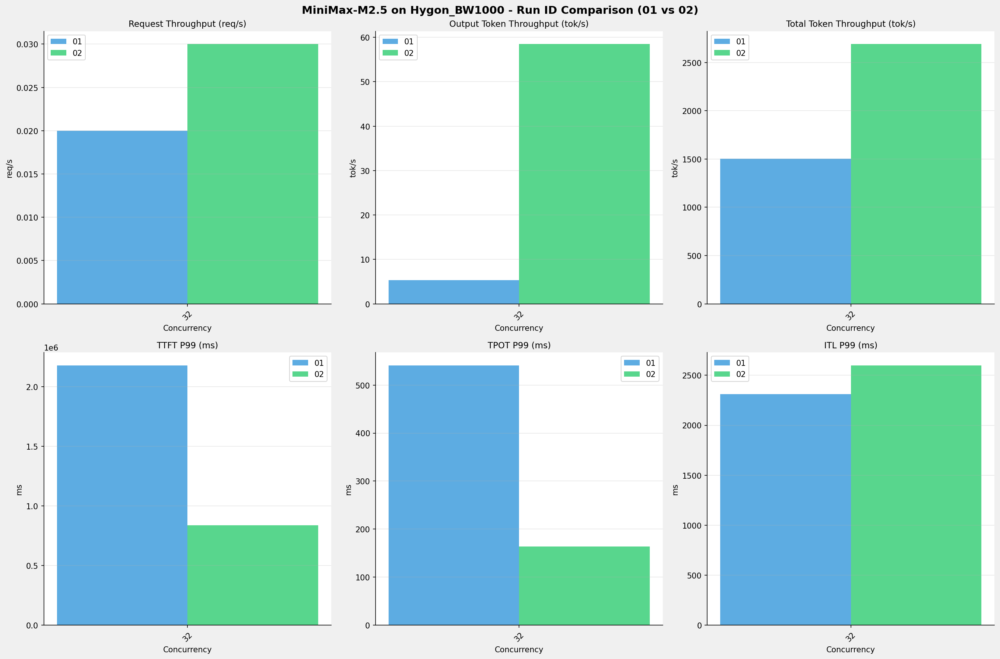

# MiniMax-M2.5模型在单节点Hygon_BW1000上高并发测试对比报告

**测试日期：** 2026-03-31

**对比RUN-ID：** 01 vs 02

---

## 测试场景
对比同一芯片、同一测试套件下,同一模型优化前后高并发测试结果比对，分析性能差异。

**测试模型**  
第一轮测试（RUN-01）: MiniMax-M2.5-bf16  
第二轮测试（RUN-02）: MiniMax-M2.5-W8A8

## 🤖 vLLM启动配置信息

| 参数名称                   | RUN-01     | RUN-02                                     |
|------------------------|------------|--------------------------------------------|
| max-model-len          | 196608     | 196608                                     |
| max-num-seqs           | 64         | 64                                         |
| max-num-batched-tokens | 8192       | N/A                                        |
| gpu-memory-utilization | 0.95       | 0.9                                        |
| dp                     | 1          | 1                                          |
| tp                     | 8          | 8                                          |
| pp                     | 1          | 1                                          |
| enable-export-parallel | False      | N/A                                        |
| tool-call-parser       | minimax_m2 | minimax_m2                                 |
| reasoning-parser       | minimax_m2 | N/A                                        |
| -cc                    | N/A        | {"pass_config": {"fuse_act_quant": false}} |

## 📊 测试概览

| 项目            | 配置           | 备注  |
|---------------|--------------|-----|
| **数据集**       | random       |     |
| **并发数**       | [32]         |     |
| **总请求数**      | [1000]       |     |
| **请求输入上下文长度** | [90000]      |     |
| **请求输出上下文长度** | [2000]       |     |
| **模型**        | MiniMax-M2.5 |     |
| **被测芯片**      | Hygon_BW1000 |     |

**主要采集指标**：

| 指标                  | 单位         | 含义                                 |
|---------------------|------------|------------------------------------|
| TTFT                | ms         | Time To First Token，首 token 延迟     |
| TPOT                | ms/token   | Time Per Output Token，每 token 生成时间 |
| Throughput          | tokens/s   | 系统总吞吐                              |
| QPS                 | requests/s | 请求吞吐                               |
| P50/P95/P99 Latency | ms         | 延迟分位数                              |

---

## 各并发级别详细对比

### 并发级别: 32

#### 服务基准结果

| 指标                       | RUN-01   | RUN-02   | 差异          | 百分比      |
|--------------------------|----------|----------|-------------|----------|
| 成功请求数                    | 1000     | 1000     | 0.00        | 0.0%     |
| 失败请求数                    | 0        | 0        | 0.00        | 0.0%     |
| 测试持续时间 (s)               | 60102.65 | 34205.42 | -25897.23   | -43.1%   |
| 总输入 tokens               | 90000000 | 90000000 | 0.00        | 0.0%     |
| 总生成 tokens               | 323447   | 2000000  | +1676553.00 | +518.3%  |
| **请求吞吐量 (req/s)**        | 0.02     | 0.03     | +0.01       | +50.0%   |
| **输出 token 吞吐量 (tok/s)** | 5.38     | 58.47    | +53.09      | +986.8%  |
| 峰值输出 token 吞吐量 (tok/s)   | 15.00    | 256.00   | +241.00     | +1606.7% |
| 峰值并发请求数                  | 34.00    | 33.00    | -1.00       | -2.9%    |
| **总 token 吞吐量 (tok/s)**  | 1502.82  | 2689.63  | +1186.81    | +79.0%   |

#### 首Token延迟 (TTFT)

| 指标            | RUN-01     | RUN-02    | 差异          | 百分比    |
|---------------|------------|-----------|-------------|--------|
| 平均 TTFT (ms)  | 1813110.36 | 762454.48 | -1050655.88 | -57.9% |
| 中位 TTFT (ms)  | 1826584.99 | 757405.72 | -1069179.27 | -58.5% |
| P95 TTFT (ms) | 2098647.67 | 837892.19 | -1260755.48 | -60.1% |
| P99 TTFT (ms) | 2179511.94 | 839223.46 | -1340288.48 | -61.5% |

#### 每Token生成时间 (TPOT)

| 指标            | RUN-01 | RUN-02 | 差异      | 百分比    |
|---------------|--------|--------|---------|--------|
| 平均 TPOT (ms)  | 270.88 | 161.82 | -109.06 | -40.3% |
| 中位 TPOT (ms)  | 275.03 | 162.74 | -112.29 | -40.8% |
| P95 TPOT (ms) | 441.40 | 163.57 | -277.83 | -62.9% |
| P99 TPOT (ms) | 540.88 | 164.10 | -376.78 | -69.7% |

#### Token间延迟 (ITL)

| 指标           | RUN-01  | RUN-02  | 差异      | 百分比    |
|--------------|---------|---------|---------|--------|
| 平均 ITL (ms)  | 265.46  | 161.76  | -103.70 | -39.1% |
| 中位 ITL (ms)  | 159.79  | 41.19   | -118.60 | -74.2% |
| P95 ITL (ms) | 167.54  | 48.99   | -118.55 | -70.8% |
| P99 ITL (ms) | 2310.17 | 2598.52 | +288.35 | +12.5% |

---

## 📊 RUN-ID对比柱状图

---

## 📝 分析总结

### 吞吐量对比

**请求吞吐量**: RUN-02 相比 RUN-01 平均提升 **50.0%**

**输出Token吞吐量**: RUN-02 相比 RUN-01 平均提升 **986.8%**

### 延迟对比

**TTFT P99**: RUN-02 相比 RUN-01 平均改善 **61.5%** (延迟降低)  
**TPOT P99**: RUN-02 相比 RUN-01 平均改善 **69.7%** (延迟降低)  
**ITL P99**: RUN-02 相比 RUN-01 平均增加 **12.5%** (延迟增加)

---

*报告生成时间: 2026-03-31*

