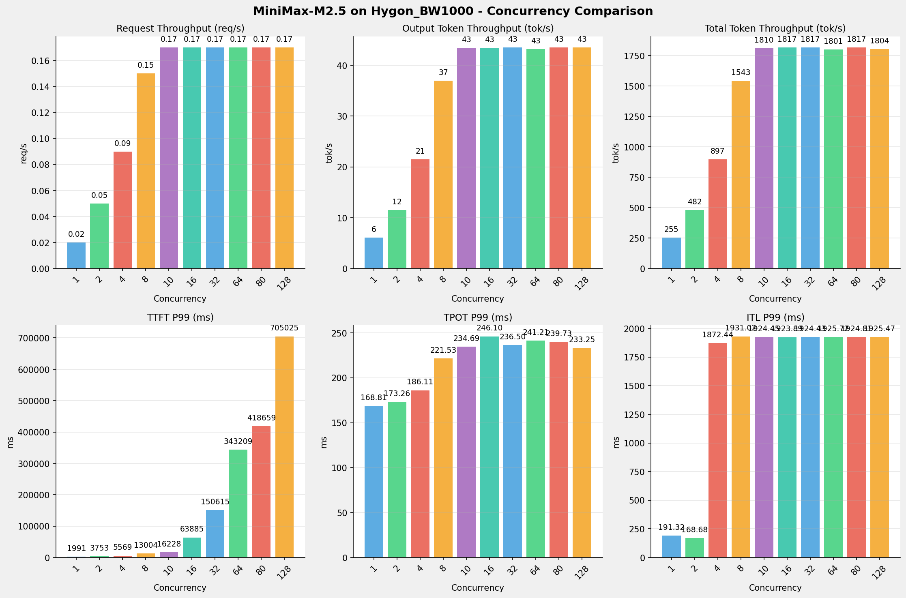
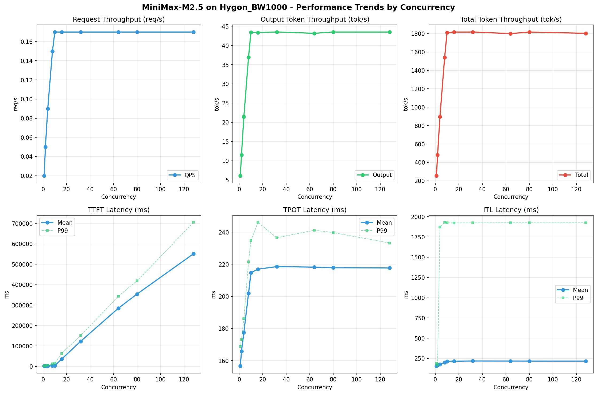

# MiniMax-M2.5模型在Hygon_BW1000上的Benchmark基准测试报告

**测试日期：** 2026-04-01

---

## 测试场景
在固定请求数，输入上下文和输出上下文长度下，使用vllm bench serve工具对并发数逐级增加场景的性能基准验证。分析同一芯片同一模型在不同并发级别下的性能指标变化趋势。

**主要采集指标**：

| 指标                  | 单位         | 含义                                 |
|---------------------|------------|------------------------------------|
| TTFT                | ms         | Time To First Token，首 token 延迟     |
| TPOT                | ms/token   | Time Per Output Token，每 token 生成时间 |
| Throughput          | tokens/s   | 系统总吞吐                              |
| QPS                 | requests/s | 请求吞吐                               |
| P50/P95/P99 Latency | ms         | 延迟分位数                              |

## 📊 测试概览

| 项目            | 配置                                     | 备注  |
|---------------|----------------------------------------|-----|
| **数据集**       | random                                 |     |
| **并发数**       | 1, 2, 4, 8, 10, 16, 32, 64, 80, 128    |     |
| **总请求数**      | 320                                    |     |
| **请求输入上下文长度** | 10240（10k）                             |     |
| **请求输出上下文长度** | 256（0.25k）                             |     |
| **模型**        | MiniMax-M2.5                           |     |
| **被测芯片**      | Hygon_BW1000 |     |

---

## 🤖 芯片和模型配置信息

| 芯片名称             | 模型路径                                           | vLLM版本 | Python版本 | 备注 |
|------------------|------------------------------------------------|----------|----------|------|
| **Hygon_BW1000** | /data/models/MiniMax-M2.5-bf16 | 0.11.0+das.opt1.rc2.dtk2604.20260128.g0bf89b0c | 3.10.12 | 海光BW1000芯片 |

---

## 🤖 vLLM启动配置信息

| 参数名称                   | Hygon_BW1000 |
|------------------------|-------------|
| max-model-len | 196608 |
| max-num-seqs | 10 |
| max-num-batched-tokens | 8192 |
| gpu-memory-utilization | 0.95 |
| dp | 1 |
| tp | 8 |
| pp | 1 |
| enable-export-parallel | True |
| tool-call-parser | minimax_m2 |
| reasoning-parser | minimax_m2 (不生效) |

- **Hygon_BW1000**: 海光芯片专家并行配置

---

## 🎯 服务基准结果

| 指标 | 1 并发 | 2 并发 | 4 并发 | 8 并发 | 10 并发 | 16 并发 | 32 并发 | 64 并发 | 80 并发 | 128 并发 |
|------|----------- | ----------- | ----------- | ----------- | ----------- | ----------- | ----------- | ----------- | ----------- | -----------|
| 成功请求数 | 320 | 320 | 320 | 320 | 320 | 320 | 320 | 320 | 320 | 320 |
| 失败请求数 |  |  |  |  |  |  |  |  |  |  |
| 测试持续时间 (s) | 13148.00 | 6965.73 | 3741.16 | 2176.31 | 1854.59 | 1847.45 | 1847.10 | 1864.45 | 1847.88 | 1861.45 |
| 总输入 tokens | 3276748 | 3276748 | 3276748 | 3276748 | 3276748 | 3276748 | 3276748 | 3276748 | 3276748 | 3276748 |
| 总生成 tokens | 80226 | 80297 | 80266 | 80442 | 80517 | 80132 | 80324 | 80461 | 80365 | 80952 |
| **请求吞吐量 (req/s)** | 0.02 | 0.05 | 0.09 | 0.15 | 0.17 | 0.17 | 0.17 | 0.17 | 0.17 | 0.17 |
| **输出 token 吞吐量 (tok/s)** | 6.10 | 11.53 | 21.45 | 36.96 | 43.42 | 43.37 | 43.49 | 43.16 | 43.49 | 43.49 |
| 峰值输出 token 吞吐量 (tok/s) | 8.00 | 15.00 | 29.00 | 59.00 | 73.00 | 71.00 | 71.00 | 71.00 | 71.00 | 71.00 |
| 峰值并发请求数 | 2.00 | 4.00 | 7.00 | 15.00 | 16.00 | 20.00 | 36.00 | 68.00 | 84.00 | 132.00 |
| **总 token 吞吐量 (tok/s)** | 255.32 | 481.94 | 897.32 | 1542.60 | 1810.25 | 1817.04 | 1817.48 | 1800.65 | 1816.74 | 1803.81 |

---

## ⏱️ 首Token延迟 (TTFT)

| 指标 | 1 并发 | 2 并发 | 4 并发 | 8 并发 | 10 并发 | 16 并发 | 32 并发 | 64 并发 | 80 并发 | 128 并发 |
|------|----------- | ----------- | ----------- | ----------- | ----------- | ----------- | ----------- | ----------- | ----------- | -----------|
| 平均 TTFT (ms) | 1958.35 | 2052.00 | 2185.58 | 3297.61 | 3593.83 | 36634.82 | 122875.63 | 284382.45 | 354268.91 | 551191.53 |
| 中位 TTFT (ms) | 1964.30 | 2024.87 | 2038.85 | 2089.60 | 2084.97 | 35931.86 | 124891.14 | 308175.63 | 402242.69 | 677657.74 |
| P95 TTFT (ms) | 1977.98 | 2038.41 | 3821.77 | 10888.09 | 10884.20 | 58125.31 | 147416.43 | 336951.30 | 409210.34 | 697287.77 |
| P99 TTFT (ms) | 1990.88 | 3752.70 | 5568.67 | 13004.02 | 16227.56 | 63884.93 | 150615.03 | 343209.29 | 418658.91 | 705024.57 |

---

## ⚡ 每Token生成时间 (TPOT)

| 指标 | 1 并发 | 2 并发 | 4 并发 | 8 并发 | 10 并发 | 16 并发 | 32 并发 | 64 并发 | 80 并发 | 128 并发 |
|------|----------- | ----------- | ----------- | ----------- | ----------- | ----------- | ----------- | ----------- | ----------- | -----------|
| 平均 TPOT (ms) | 156.69 | 165.84 | 177.49 | 201.95 | 214.72 | 216.95 | 218.56 | 218.23 | 217.84 | 217.69 |
| 中位 TPOT (ms) | 156.16 | 166.01 | 177.87 | 205.98 | 219.17 | 219.89 | 220.42 | 219.77 | 220.16 | 220.15 |
| P95 TPOT (ms) | 163.40 | 168.30 | 183.40 | 212.79 | 227.12 | 228.33 | 227.78 | 231.26 | 227.98 | 227.58 |
| P99 TPOT (ms) | 168.81 | 173.26 | 186.11 | 221.53 | 234.69 | 246.10 | 236.50 | 241.21 | 239.73 | 233.25 |

---

## 🔄 Token间延迟 (ITL)

| 指标 | 1 并发 | 2 并发 | 4 并发 | 8 并发 | 10 并发 | 16 并发 | 32 并发 | 64 并发 | 80 并发 | 128 并发 |
|------|----------- | ----------- | ----------- | ----------- | ----------- | ----------- | ----------- | ----------- | ----------- | -----------|
| 平均 ITL (ms) | 156.23 | 165.31 | 176.98 | 201.36 | 214.01 | 216.16 | 217.96 | 217.55 | 217.14 | 216.99 |
| 中位 ITL (ms) | 155.76 | 158.87 | 157.22 | 157.25 | 157.32 | 157.71 | 157.77 | 157.89 | 157.45 | 157.95 |
| P95 ITL (ms) | 162.28 | 164.70 | 162.59 | 163.19 | 163.94 | 164.13 | 165.32 | 168.53 | 164.60 | 164.61 |
| P99 ITL (ms) | 191.32 | 168.68 | 1872.44 | 1931.02 | 1924.45 | 1923.89 | 1924.43 | 1925.72 | 1924.81 | 1925.47 |

---

## 📊 各并发级别性能柱状图

---

## 📈 性能趋势分析

---

## 📝 分析总结

### 1. 吞吐量性能分析

**请求吞吐量 (QPS)**: 随着并发级别增加，QPS持续上升。
低并发(1,2,4)平均 QPS: 0.05 req/s；
中并发(8,10,16,32)平均 QPS: 0.17 req/s；
高并发(64,80,128)平均 QPS: 0.17 req/s；
最高 QPS 出现在 10 并发，达到 0.17 req/s。

**Token总吞吐量**: 最高达到 1817 tok/s (32 并发)。

### 2. 首Token延迟 (TTFT) 分析

TTFT随并发增加显著上升。
低并发平均 P99 TTFT: 3771ms；
高并发平均 P99 TTFT: 488964ms；
最高 P99 TTFT 出现在 128 并发，达到 705025ms。

### 3. Token生成时间 (TPOT) 分析

TPOT随并发增加也呈上升趋势。
低并发平均 P99 TPOT: 176.06ms；
高并发平均 P99 TPOT: 238.06ms；
最高 P99 TPOT 出现在 16 并发，达到 246.10ms。

### 4. Token间延迟 (ITL) 分析

ITL随并发增加呈上升趋势。
低并发平均 P99 ITL: 744.15ms；
高并发平均 P99 ITL: 1925.33ms；
最高 P99 ITL 出现在 8 并发，达到 1931.02ms。

### 5. 综合评估

**吞吐量增长**: 从最低并发到最高并发，QPS增长了 750.0%。
**TTFT延迟恶化**: 高并发相比低并发，TTFT P99增加了 18597.2%。
**TPOT延迟恶化**: 高并发相比低并发，TPOT P99增加了 39.8%。

---

*报告生成时间: 2026-04-01*

