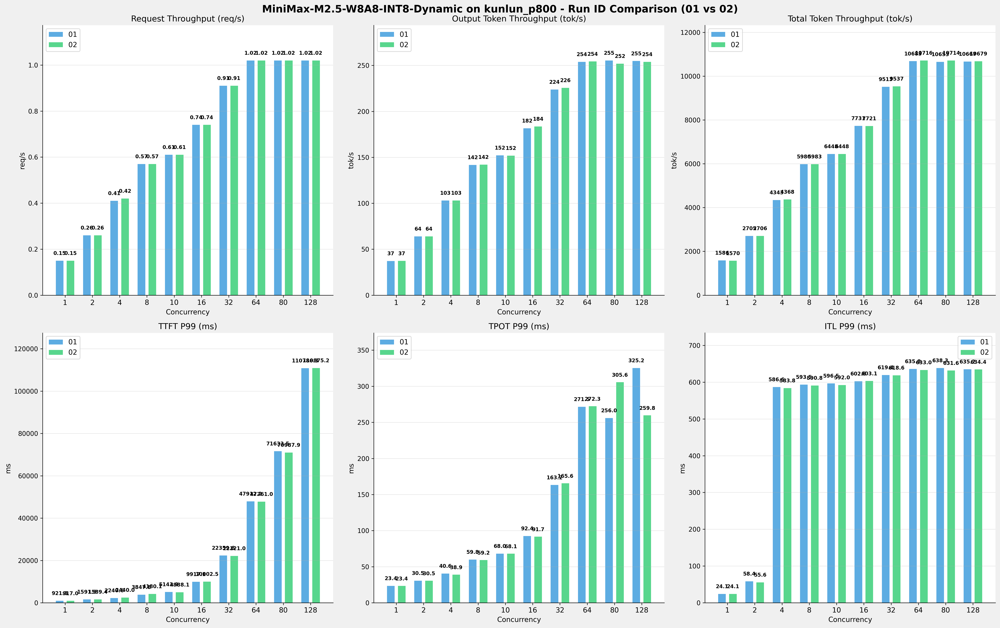

# MiniMax-M2.5-W8A8-INT8-Dynamic模型在kunlun_p800上多次运行结果对比报告

**测试日期：** 2026-05-18

**对比RUN-ID：** 01 vs 02

---

## 测试场景
对比同一芯片、同一测试套件下,同一模型优化前后测试结果比对，分析性能差异。

**测试模型**  
第1轮测试（RUN-01）: MiniMax-M2.5-W8A8-INT8-Dynamic  第2轮测试（RUN-02）: MiniMax-M2.5-W8A8-INT8-Dynamic  

## 🤖 芯片和模型配置信息

| 参数名称                    | kunlun_p800 |
|------------------------|-------------|
| **model_name** | MiniMax-M2.5-W8A8-INT8-Dynamic |
| **quantization_config** | int-8 |
| **model_size** | 215G |
| **max_position_embeddings** | 196608 |
| **temperature** | 1.0 |
| **top_k** | 40 |
| **top_p** | 0.95 |
| **transformers_version** | 4.46.1 |
| **vllm_version** | 0.11.0 |
| **python_version** | 3.10.15 |

---

## ⚙️ vLLM启动配置信息

| 参数名称                    | kunlun_p800 |
|------------------------|-------------|
| **Model Name** | MiniMax-M2.5-W8A8-INT8-Dynamic |
| **Max Model Len** | 196608 |
| **Max Num Seqs** | 64 |
| **Max Num Batched Tokens** | 8192 |
| **Gpu Memory Utilization** | 0.95 |
| **Dtype** | auto |
| **Block Size** | 128 |
| **Dp** | 1 |
| **Tp** | 8 |
| **Pp** | 1 |
| **Enable Export Parallel** | False |
| **Enable Auto Tool Choice** | True |
| **Tool Call Parser** | minimax_m2 |
| **Reasoning Parser** | minimax_m2 (不生效) |
| **Compilation Config** | {"splitting_ops":["vllm.unified_attention","vllm.unified_attention_with_output","vllm.unified_attention_with_output_kunlun","vllm.mamba_mixer2","vllm.mamba_mixer","vllm.short_conv","vllm.linear_attention","vllm.plamo2_mamba_mixer","vllm.gdn_attention","vllm.sparse_attn_indexer","vllm.sparse_attn_indexer_vllm_kunlun"]} |

---

## 📊 测试概览

| 项目            | 配置                                    | 备注  |
|---------------|---------------------------------------|-----|
| **测试套件**     | test_01                           |     |
| **数据集**       | random                                |     |
| **并发数**       | [1, 2, 4, 8, 10, 16, 32, 64, 80, 128] |     |
| **总请求数**      | [320]                                 |     |
| **请求输入上下文长度** | [10240]                               |     |
| **请求输出上下文长度** | [256]                               |     |
| **模型**        | MiniMax-M2.5-W8A8-INT8-Dynamic                          |     |
| **被测芯片**      | kunlun_p800                          |     |
| **测试场景**      | 单I/O测试                          |     |

**主要采集指标**：

| 指标                  | 单位         | 含义                                 |
|---------------------|------------|------------------------------------|
| TTFT                | ms         | Time To First Token，首 token 延迟     |
| TPOT                | ms/token   | Time Per Output Token，每 token 生成时间 |
| Throughput          | tokens/s   | 系统总吞吐                              |
| QPS                 | requests/s | 请求吞吐                               |
| P50/P95/P99 Latency | ms         | 延迟分位数                              |

---

## 📊 RUN-ID对比柱状图

---

## 各并发级别详细对比

### 并发级别: 1

#### 服务基准结果

| 指标 | RUN-01 | RUN-02 | 差异 | 百分比 |
|------|----------|---------|---------|---------|
| 成功请求数 | 320 | 320 | 0.00 | 0.0% |
| 失败请求数 | 0 | 0 | 0.00 | 0.0% |
| 测试持续时间 (s) | 2115.85 | 2138.36 | +22.51 | +1.1% |
| 总输入 tokens | 3276748 | 3276748 | 0.00 | 0.0% |
| 总生成 tokens | 78707 | 79708 | +1001.00 | +1.3% |
| 峰值并发请求数 | 2.00 | 2.00 | 0.00 | 0.0% |
| **请求吞吐量 (req/s)** | 0.15 | 0.15 | 0.00 | 0.0% |
| **输出 token 吞吐量 (tok/s)** | 37.20 | 37.28 | +0.08 | +0.2% |
| 峰值输出 token 吞吐量 (tok/s) | 44.00 | 44.00 | 0.00 | 0.0% |
| **总 token 吞吐量 (tok/s)** | 1585.87 | 1569.64 | -16.23 | -1.0% |

#### 首Token延迟 (TTFT)

| 指标 | RUN-01 | RUN-02 | 差异 | 百分比 |
|------|----------|---------|---------|---------|
| 平均 TTFT (ms) | 898.33 | 895.34 | -2.99 | -0.3% |
| 中位 TTFT (ms) | 901.43 | 897.61 | -3.82 | -0.4% |
| P95 TTFT (ms) | 915.80 | 911.74 | -4.06 | -0.4% |
| P99 TTFT (ms) | 921.76 | 917.04 | -4.72 | -0.5% |

#### 每Token生成时间 (TPOT)

| 指标 | RUN-01 | RUN-02 | 差异 | 百分比 |
|------|----------|---------|---------|---------|
| 平均 TPOT (ms) | 23.32 | 23.32 | 0.00 | 0.0% |
| 中位 TPOT (ms) | 23.32 | 23.32 | 0.00 | 0.0% |
| P95 TPOT (ms) | 23.36 | 23.36 | 0.00 | 0.0% |
| P99 TPOT (ms) | 23.38 | 23.39 | +0.01 | +0.0% |

#### Token间延迟 (ITL)

| 指标 | RUN-01 | RUN-02 | 差异 | 百分比 |
|------|----------|---------|---------|---------|
| 平均 ITL (ms) | 23.26 | 23.26 | 0.00 | 0.0% |
| 中位 ITL (ms) | 23.31 | 23.30 | -0.01 | -0.0% |
| P95 ITL (ms) | 23.49 | 23.47 | -0.02 | -0.1% |
| P99 ITL (ms) | 24.07 | 24.07 | 0.00 | 0.0% |

### 并发级别: 2

#### 服务基准结果

| 指标 | RUN-01 | RUN-02 | 差异 | 百分比 |
|------|----------|---------|---------|---------|
| 成功请求数 | 320 | 320 | 0.00 | 0.0% |
| 失败请求数 | 0 | 0 | 0.00 | 0.0% |
| 测试持续时间 (s) | 1240.67 | 1240.18 | -0.49 | -0.0% |
| 总输入 tokens | 3276748 | 3276748 | 0.00 | 0.0% |
| 总生成 tokens | 79423 | 79351 | -72.00 | -0.1% |
| 峰值并发请求数 | 4.00 | 4.00 | 0.00 | 0.0% |
| **请求吞吐量 (req/s)** | 0.26 | 0.26 | 0.00 | 0.0% |
| **输出 token 吞吐量 (tok/s)** | 64.02 | 63.98 | -0.04 | -0.1% |
| 峰值输出 token 吞吐量 (tok/s) | 83.00 | 83.00 | 0.00 | 0.0% |
| **总 token 吞吐量 (tok/s)** | 2705.12 | 2706.13 | +1.01 | +0.0% |

#### 首Token延迟 (TTFT)

| 指标 | RUN-01 | RUN-02 | 差异 | 百分比 |
|------|----------|---------|---------|---------|
| 平均 TTFT (ms) | 978.55 | 956.99 | -21.56 | -2.2% |
| 中位 TTFT (ms) | 923.32 | 920.09 | -3.23 | -0.3% |
| P95 TTFT (ms) | 1575.42 | 1301.46 | -273.96 | -17.4% |
| P99 TTFT (ms) | 1591.52 | 1589.39 | -2.13 | -0.1% |

#### 每Token生成时间 (TPOT)

| 指标 | RUN-01 | RUN-02 | 差异 | 百分比 |
|------|----------|---------|---------|---------|
| 平均 TPOT (ms) | 27.38 | 27.42 | +0.04 | +0.1% |
| 中位 TPOT (ms) | 27.56 | 27.56 | 0.00 | 0.0% |
| P95 TPOT (ms) | 28.88 | 28.89 | +0.01 | +0.0% |
| P99 TPOT (ms) | 30.53 | 30.51 | -0.02 | -0.1% |

#### Token间延迟 (ITL)

| 指标 | RUN-01 | RUN-02 | 差异 | 百分比 |
|------|----------|---------|---------|---------|
| 平均 ITL (ms) | 27.40 | 27.45 | +0.05 | +0.2% |
| 中位 ITL (ms) | 24.60 | 24.60 | 0.00 | 0.0% |
| P95 ITL (ms) | 24.82 | 24.81 | -0.01 | -0.0% |
| P99 ITL (ms) | 58.36 | 55.61 | -2.75 | -4.7% |

### 并发级别: 4

#### 服务基准结果

| 指标 | RUN-01 | RUN-02 | 差异 | 百分比 |
|------|----------|---------|---------|---------|
| 成功请求数 | 320 | 320 | 0.00 | 0.0% |
| 失败请求数 | 0 | 0 | 0.00 | 0.0% |
| 测试持续时间 (s) | 772.85 | 768.33 | -4.52 | -0.6% |
| 总输入 tokens | 3276748 | 3276748 | 0.00 | 0.0% |
| 总生成 tokens | 79574 | 79118 | -456.00 | -0.6% |
| 峰值并发请求数 | 8.00 | 8.00 | 0.00 | 0.0% |
| **请求吞吐量 (req/s)** | 0.41 | 0.42 | +0.01 | +2.4% |
| **输出 token 吞吐量 (tok/s)** | 102.96 | 102.97 | +0.01 | +0.0% |
| 峰值输出 token 吞吐量 (tok/s) | 157.00 | 157.00 | 0.00 | 0.0% |
| **总 token 吞吐量 (tok/s)** | 4342.80 | 4367.74 | +24.94 | +0.6% |

#### 首Token延迟 (TTFT)

| 指标 | RUN-01 | RUN-02 | 差异 | 百分比 |
|------|----------|---------|---------|---------|
| 平均 TTFT (ms) | 1017.52 | 1041.02 | +23.50 | +2.3% |
| 中位 TTFT (ms) | 915.96 | 911.84 | -4.12 | -0.4% |
| P95 TTFT (ms) | 1618.56 | 1613.33 | -5.23 | -0.3% |
| P99 TTFT (ms) | 2240.56 | 2440.03 | +199.47 | +8.9% |

#### 每Token生成时间 (TPOT)

| 指标 | RUN-01 | RUN-02 | 差异 | 百分比 |
|------|----------|---------|---------|---------|
| 平均 TPOT (ms) | 34.77 | 34.70 | -0.07 | -0.2% |
| 中位 TPOT (ms) | 34.97 | 34.95 | -0.02 | -0.1% |
| P95 TPOT (ms) | 37.89 | 37.90 | +0.01 | +0.0% |
| P99 TPOT (ms) | 40.56 | 38.93 | -1.63 | -4.0% |

#### Token间延迟 (ITL)

| 指标 | RUN-01 | RUN-02 | 差异 | 百分比 |
|------|----------|---------|---------|---------|
| 平均 ITL (ms) | 35.04 | 34.94 | -0.10 | -0.3% |
| 中位 ITL (ms) | 26.08 | 26.10 | +0.02 | +0.1% |
| P95 ITL (ms) | 27.03 | 27.04 | +0.01 | +0.0% |
| P99 ITL (ms) | 586.65 | 583.81 | -2.84 | -0.5% |

### 并发级别: 8

#### 服务基准结果

| 指标 | RUN-01 | RUN-02 | 差异 | 百分比 |
|------|----------|---------|---------|---------|
| 成功请求数 | 320 | 320 | 0.00 | 0.0% |
| 失败请求数 | 0 | 0 | 0.00 | 0.0% |
| 测试持续时间 (s) | 561.22 | 561.04 | -0.18 | -0.0% |
| 总输入 tokens | 3276748 | 3276748 | 0.00 | 0.0% |
| 总生成 tokens | 79521 | 79692 | +171.00 | +0.2% |
| 峰值并发请求数 | 11.00 | 14.00 | +3.00 | +27.3% |
| **请求吞吐量 (req/s)** | 0.57 | 0.57 | 0.00 | 0.0% |
| **输出 token 吞吐量 (tok/s)** | 141.69 | 142.04 | +0.35 | +0.2% |
| 峰值输出 token 吞吐量 (tok/s) | 257.00 | 257.00 | 0.00 | 0.0% |
| **总 token 吞吐量 (tok/s)** | 5980.27 | 5982.56 | +2.29 | +0.0% |

#### 首Token延迟 (TTFT)

| 指标 | RUN-01 | RUN-02 | 差异 | 百分比 |
|------|----------|---------|---------|---------|
| 平均 TTFT (ms) | 1159.47 | 1367.77 | +208.30 | +18.0% |
| 中位 TTFT (ms) | 936.85 | 934.53 | -2.32 | -0.2% |
| P95 TTFT (ms) | 1649.19 | 3577.48 | +1928.29 | +116.9% |
| P99 TTFT (ms) | 3847.84 | 4180.11 | +332.27 | +8.6% |

#### 每Token生成时间 (TPOT)

| 指标 | RUN-01 | RUN-02 | 差异 | 百分比 |
|------|----------|---------|---------|---------|
| 平均 TPOT (ms) | 51.78 | 50.84 | -0.94 | -1.8% |
| 中位 TPOT (ms) | 52.18 | 52.04 | -0.14 | -0.3% |
| P95 TPOT (ms) | 55.27 | 55.14 | -0.13 | -0.2% |
| P99 TPOT (ms) | 59.82 | 59.21 | -0.61 | -1.0% |

#### Token间延迟 (ITL)

| 指标 | RUN-01 | RUN-02 | 差异 | 百分比 |
|------|----------|---------|---------|---------|
| 平均 ITL (ms) | 51.62 | 50.53 | -1.09 | -2.1% |
| 中位 ITL (ms) | 31.87 | 31.88 | +0.01 | +0.0% |
| P95 ITL (ms) | 214.19 | 59.34 | -154.85 | -72.3% |
| P99 ITL (ms) | 593.49 | 590.81 | -2.68 | -0.5% |

### 并发级别: 10

#### 服务基准结果

| 指标 | RUN-01 | RUN-02 | 差异 | 百分比 |
|------|----------|---------|---------|---------|
| 成功请求数 | 320 | 320 | 0.00 | 0.0% |
| 失败请求数 | 0 | 0 | 0.00 | 0.0% |
| 测试持续时间 (s) | 520.44 | 520.41 | -0.03 | -0.0% |
| 总输入 tokens | 3276748 | 3276748 | 0.00 | 0.0% |
| 总生成 tokens | 79192 | 78993 | -199.00 | -0.3% |
| 峰值并发请求数 | 14.00 | 14.00 | 0.00 | 0.0% |
| **请求吞吐量 (req/s)** | 0.61 | 0.61 | 0.00 | 0.0% |
| **输出 token 吞吐量 (tok/s)** | 152.16 | 151.79 | -0.37 | -0.2% |
| 峰值输出 token 吞吐量 (tok/s) | 291.00 | 290.00 | -1.00 | -0.3% |
| **总 token 吞吐量 (tok/s)** | 6448.31 | 6448.24 | -0.07 | -0.0% |

#### 首Token延迟 (TTFT)

| 指标 | RUN-01 | RUN-02 | 差异 | 百分比 |
|------|----------|---------|---------|---------|
| 平均 TTFT (ms) | 1456.60 | 1307.13 | -149.47 | -10.3% |
| 中位 TTFT (ms) | 1282.49 | 941.36 | -341.13 | -26.6% |
| P95 TTFT (ms) | 3221.43 | 3139.44 | -81.99 | -2.5% |
| P99 TTFT (ms) | 5143.91 | 4988.09 | -155.82 | -3.0% |

#### 每Token生成时间 (TPOT)

| 指标 | RUN-01 | RUN-02 | 差异 | 百分比 |
|------|----------|---------|---------|---------|
| 平均 TPOT (ms) | 59.81 | 60.30 | +0.49 | +0.8% |
| 中位 TPOT (ms) | 60.91 | 61.32 | +0.41 | +0.7% |
| P95 TPOT (ms) | 65.57 | 65.62 | +0.05 | +0.1% |
| P99 TPOT (ms) | 68.00 | 68.12 | +0.12 | +0.2% |

#### Token间延迟 (ITL)

| 指标 | RUN-01 | RUN-02 | 差异 | 百分比 |
|------|----------|---------|---------|---------|
| 平均 ITL (ms) | 59.57 | 60.19 | +0.62 | +1.0% |
| 中位 ITL (ms) | 35.48 | 35.47 | -0.01 | -0.0% |
| P95 ITL (ms) | 217.00 | 217.22 | +0.22 | +0.1% |
| P99 ITL (ms) | 596.54 | 591.99 | -4.55 | -0.8% |

### 并发级别: 16

#### 服务基准结果

| 指标 | RUN-01 | RUN-02 | 差异 | 百分比 |
|------|----------|---------|---------|---------|
| 成功请求数 | 320 | 320 | 0.00 | 0.0% |
| 失败请求数 | 0 | 0 | 0.00 | 0.0% |
| 测试持续时间 (s) | 434.05 | 434.71 | +0.66 | +0.2% |
| 总输入 tokens | 3276748 | 3276748 | 0.00 | 0.0% |
| 总生成 tokens | 78788 | 79792 | +1004.00 | +1.3% |
| 峰值并发请求数 | 20.00 | 21.00 | +1.00 | +5.0% |
| **请求吞吐量 (req/s)** | 0.74 | 0.74 | 0.00 | 0.0% |
| **输出 token 吞吐量 (tok/s)** | 181.52 | 183.55 | +2.03 | +1.1% |
| 峰值输出 token 吞吐量 (tok/s) | 417.00 | 417.00 | 0.00 | 0.0% |
| **总 token 吞吐量 (tok/s)** | 7730.83 | 7721.28 | -9.55 | -0.1% |

#### 首Token延迟 (TTFT)

| 指标 | RUN-01 | RUN-02 | 差异 | 百分比 |
|------|----------|---------|---------|---------|
| 平均 TTFT (ms) | 1485.85 | 1656.75 | +170.90 | +11.5% |
| 中位 TTFT (ms) | 1296.89 | 1311.48 | +14.59 | +1.1% |
| P95 TTFT (ms) | 2324.89 | 3032.55 | +707.66 | +30.4% |
| P99 TTFT (ms) | 9917.09 | 10002.49 | +85.40 | +0.9% |

#### 每Token生成时间 (TPOT)

| 指标 | RUN-01 | RUN-02 | 差异 | 百分比 |
|------|----------|---------|---------|---------|
| 平均 TPOT (ms) | 81.64 | 80.16 | -1.48 | -1.8% |
| 中位 TPOT (ms) | 82.49 | 82.04 | -0.45 | -0.5% |
| P95 TPOT (ms) | 87.96 | 86.36 | -1.60 | -1.8% |
| P99 TPOT (ms) | 92.41 | 91.72 | -0.69 | -0.7% |

#### Token间延迟 (ITL)

| 指标 | RUN-01 | RUN-02 | 差异 | 百分比 |
|------|----------|---------|---------|---------|
| 平均 ITL (ms) | 81.44 | 79.95 | -1.49 | -1.8% |
| 中位 ITL (ms) | 39.41 | 39.44 | +0.03 | +0.1% |
| P95 ITL (ms) | 592.47 | 590.76 | -1.71 | -0.3% |
| P99 ITL (ms) | 602.60 | 603.12 | +0.52 | +0.1% |

### 并发级别: 32

#### 服务基准结果

| 指标 | RUN-01 | RUN-02 | 差异 | 百分比 |
|------|----------|---------|---------|---------|
| 成功请求数 | 320 | 320 | 0.00 | 0.0% |
| 失败请求数 | 0 | 0 | 0.00 | 0.0% |
| 测试持续时间 (s) | 352.75 | 351.92 | -0.83 | -0.2% |
| 总输入 tokens | 3276748 | 3276748 | 0.00 | 0.0% |
| 总生成 tokens | 78933 | 79376 | +443.00 | +0.6% |
| 峰值并发请求数 | 36.00 | 37.00 | +1.00 | +2.8% |
| **请求吞吐量 (req/s)** | 0.91 | 0.91 | 0.00 | 0.0% |
| **输出 token 吞吐量 (tok/s)** | 223.77 | 225.55 | +1.78 | +0.8% |
| 峰值输出 token 吞吐量 (tok/s) | 702.00 | 698.00 | -4.00 | -0.6% |
| **总 token 吞吐量 (tok/s)** | 9513.02 | 9536.58 | +23.56 | +0.2% |

#### 首Token延迟 (TTFT)

| 指标 | RUN-01 | RUN-02 | 差异 | 百分比 |
|------|----------|---------|---------|---------|
| 平均 TTFT (ms) | 2848.93 | 2995.44 | +146.51 | +5.1% |
| 中位 TTFT (ms) | 1715.48 | 1886.75 | +171.27 | +10.0% |
| P95 TTFT (ms) | 12301.42 | 12178.73 | -122.69 | -1.0% |
| P99 TTFT (ms) | 22359.61 | 22120.98 | -238.63 | -1.1% |

#### 每Token生成时间 (TPOT)

| 指标 | RUN-01 | RUN-02 | 差异 | 百分比 |
|------|----------|---------|---------|---------|
| 平均 TPOT (ms) | 130.25 | 129.20 | -1.05 | -0.8% |
| 中位 TPOT (ms) | 135.10 | 132.58 | -2.52 | -1.9% |
| P95 TPOT (ms) | 145.12 | 141.98 | -3.14 | -2.2% |
| P99 TPOT (ms) | 163.15 | 165.58 | +2.43 | +1.5% |

#### Token间延迟 (ITL)

| 指标 | RUN-01 | RUN-02 | 差异 | 百分比 |
|------|----------|---------|---------|---------|
| 平均 ITL (ms) | 130.13 | 128.54 | -1.59 | -1.2% |
| 中位 ITL (ms) | 47.63 | 47.65 | +0.02 | +0.0% |
| P95 ITL (ms) | 608.17 | 608.54 | +0.37 | +0.1% |
| P99 ITL (ms) | 619.41 | 618.57 | -0.84 | -0.1% |

### 并发级别: 64

#### 服务基准结果

| 指标 | RUN-01 | RUN-02 | 差异 | 百分比 |
|------|----------|---------|---------|---------|
| 成功请求数 | 320 | 320 | 0.00 | 0.0% |
| 失败请求数 | 0 | 0 | 0.00 | 0.0% |
| 测试持续时间 (s) | 314.19 | 313.21 | -0.98 | -0.3% |
| 总输入 tokens | 3276748 | 3276748 | 0.00 | 0.0% |
| 总生成 tokens | 79780 | 79646 | -134.00 | -0.2% |
| 峰值并发请求数 | 68.00 | 70.00 | +2.00 | +2.9% |
| **请求吞吐量 (req/s)** | 1.02 | 1.02 | 0.00 | 0.0% |
| **输出 token 吞吐量 (tok/s)** | 253.92 | 254.29 | +0.37 | +0.1% |
| 峰值输出 token 吞吐量 (tok/s) | 1024.00 | 1024.00 | 0.00 | 0.0% |
| **总 token 吞吐量 (tok/s)** | 10682.97 | 10715.95 | +32.98 | +0.3% |

#### 首Token延迟 (TTFT)

| 指标 | RUN-01 | RUN-02 | 差异 | 百分比 |
|------|----------|---------|---------|---------|
| 平均 TTFT (ms) | 6916.51 | 6966.31 | +49.80 | +0.7% |
| 中位 TTFT (ms) | 2495.19 | 2479.32 | -15.87 | -0.6% |
| P95 TTFT (ms) | 38095.53 | 37974.89 | -120.64 | -0.3% |
| P99 TTFT (ms) | 47912.19 | 47760.97 | -151.22 | -0.3% |

#### 每Token生成时间 (TPOT)

| 指标 | RUN-01 | RUN-02 | 差异 | 百分比 |
|------|----------|---------|---------|---------|
| 平均 TPOT (ms) | 222.66 | 221.76 | -0.90 | -0.4% |
| 中位 TPOT (ms) | 241.15 | 238.48 | -2.67 | -1.1% |
| P95 TPOT (ms) | 253.91 | 252.93 | -0.98 | -0.4% |
| P99 TPOT (ms) | 271.54 | 272.33 | +0.79 | +0.3% |

#### Token间延迟 (ITL)

| 指标 | RUN-01 | RUN-02 | 差异 | 百分比 |
|------|----------|---------|---------|---------|
| 平均 ITL (ms) | 222.08 | 221.30 | -0.78 | -0.4% |
| 中位 ITL (ms) | 65.24 | 65.38 | +0.14 | +0.2% |
| P95 ITL (ms) | 631.09 | 628.06 | -3.03 | -0.5% |
| P99 ITL (ms) | 635.84 | 632.98 | -2.86 | -0.4% |

### 并发级别: 80

#### 服务基准结果

| 指标 | RUN-01 | RUN-02 | 差异 | 百分比 |
|------|----------|---------|---------|---------|
| 成功请求数 | 320 | 320 | 0.00 | 0.0% |
| 失败请求数 | 0 | 0 | 0.00 | 0.0% |
| 测试持续时间 (s) | 315.14 | 313.21 | -1.93 | -0.6% |
| 总输入 tokens | 3276748 | 3276748 | 0.00 | 0.0% |
| 总生成 tokens | 80493 | 78881 | -1612.00 | -2.0% |
| 峰值并发请求数 | 83.00 | 83.00 | 0.00 | 0.0% |
| **请求吞吐量 (req/s)** | 1.02 | 1.02 | 0.00 | 0.0% |
| **输出 token 吞吐量 (tok/s)** | 255.42 | 251.85 | -3.57 | -1.4% |
| 峰值输出 token 吞吐量 (tok/s) | 1025.00 | 1025.00 | 0.00 | 0.0% |
| **总 token 吞吐量 (tok/s)** | 10653.29 | 10713.81 | +60.52 | +0.6% |

#### 首Token延迟 (TTFT)

| 指标 | RUN-01 | RUN-02 | 差异 | 百分比 |
|------|----------|---------|---------|---------|
| 平均 TTFT (ms) | 21074.74 | 20726.95 | -347.79 | -1.7% |
| 中位 TTFT (ms) | 15109.31 | 15203.36 | +94.05 | +0.6% |
| P95 TTFT (ms) | 50874.99 | 50188.15 | -686.84 | -1.4% |
| P99 TTFT (ms) | 71633.46 | 70987.86 | -645.60 | -0.9% |

#### 每Token生成时间 (TPOT)

| 指标 | RUN-01 | RUN-02 | 差异 | 百分比 |
|------|----------|---------|---------|---------|
| 平均 TPOT (ms) | 223.83 | 227.33 | +3.50 | +1.6% |
| 中位 TPOT (ms) | 243.06 | 244.53 | +1.47 | +0.6% |
| P95 TPOT (ms) | 251.21 | 261.60 | +10.39 | +4.1% |
| P99 TPOT (ms) | 255.96 | 305.58 | +49.62 | +19.4% |

#### Token间延迟 (ITL)

| 指标 | RUN-01 | RUN-02 | 差异 | 百分比 |
|------|----------|---------|---------|---------|
| 平均 ITL (ms) | 223.17 | 226.41 | +3.24 | +1.5% |
| 中位 ITL (ms) | 65.36 | 65.43 | +0.07 | +0.1% |
| P95 ITL (ms) | 630.93 | 623.41 | -7.52 | -1.2% |
| P99 ITL (ms) | 638.32 | 631.61 | -6.71 | -1.1% |

### 并发级别: 128

#### 服务基准结果

| 指标 | RUN-01 | RUN-02 | 差异 | 百分比 |
|------|----------|---------|---------|---------|
| 成功请求数 | 320 | 320 | 0.00 | 0.0% |
| 失败请求数 | 0 | 0 | 0.00 | 0.0% |
| 测试持续时间 (s) | 314.72 | 314.31 | -0.41 | -0.1% |
| 总输入 tokens | 3276748 | 3276748 | 0.00 | 0.0% |
| 总生成 tokens | 80186 | 79814 | -372.00 | -0.5% |
| 峰值并发请求数 | 131.00 | 131.00 | 0.00 | 0.0% |
| **请求吞吐量 (req/s)** | 1.02 | 1.02 | 0.00 | 0.0% |
| **输出 token 吞吐量 (tok/s)** | 254.79 | 253.94 | -0.85 | -0.3% |
| 峰值输出 token 吞吐量 (tok/s) | 1024.00 | 1024.00 | 0.00 | 0.0% |
| **总 token 吞吐量 (tok/s)** | 10666.52 | 10679.20 | +12.68 | +0.1% |

#### 首Token延迟 (TTFT)

| 指标 | RUN-01 | RUN-02 | 差异 | 百分比 |
|------|----------|---------|---------|---------|
| 平均 TTFT (ms) | 60948.41 | 61086.49 | +138.08 | +0.2% |
| 中位 TTFT (ms) | 63459.09 | 63389.32 | -69.77 | -0.1% |
| P95 TTFT (ms) | 101009.77 | 100621.19 | -388.58 | -0.4% |
| P99 TTFT (ms) | 110786.32 | 110875.17 | +88.85 | +0.1% |

#### 每Token生成时间 (TPOT)

| 指标 | RUN-01 | RUN-02 | 差异 | 百分比 |
|------|----------|---------|---------|---------|
| 平均 TPOT (ms) | 224.66 | 223.63 | -1.03 | -0.5% |
| 中位 TPOT (ms) | 241.98 | 241.70 | -0.28 | -0.1% |
| P95 TPOT (ms) | 251.19 | 250.90 | -0.29 | -0.1% |
| P99 TPOT (ms) | 325.18 | 259.78 | -65.40 | -20.1% |

#### Token间延迟 (ITL)

| 指标 | RUN-01 | RUN-02 | 差异 | 百分比 |
|------|----------|---------|---------|---------|
| 平均 ITL (ms) | 223.47 | 223.34 | -0.13 | -0.1% |
| 中位 ITL (ms) | 65.31 | 65.29 | -0.02 | -0.0% |
| P95 ITL (ms) | 627.22 | 627.25 | +0.03 | +0.0% |
| P99 ITL (ms) | 635.16 | 634.44 | -0.72 | -0.1% |

---

## 📝 分析总结

### 吞吐量对比

**请求吞吐量**: RUN-02 相比 RUN-01 平均提升 **0.2%**

**输出Token吞吐量**: RUN-02 相比 RUN-01 平均提升 **0.0%**

**总Token吞吐量**: RUN-02 相比 RUN-01 平均提升 **0.1%**

### 延迟对比

**TTFT P99**: RUN-02 相比 RUN-01 平均增加 **1.3%** (延迟增加)

**TPOT P99**: RUN-02 相比 RUN-01 平均改善 **0.5%** (延迟降低)

**ITL P99**: RUN-02 相比 RUN-01 平均改善 **0.8%** (延迟降低)

---

*报告生成时间: 2026-05-18*

