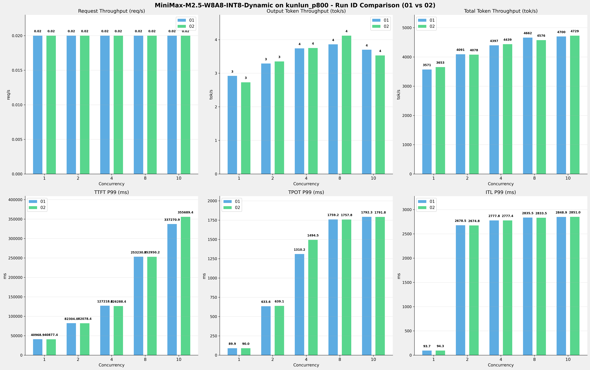

# MiniMax-M2.5-W8A8-INT8-Dynamic模型在kunlun_p800上多次运行结果对比报告

**测试日期：** 2026-05-18

**对比RUN-ID：** 01 vs 02

---

## 测试场景
对比同一芯片、同一测试套件下,同一模型优化前后测试结果比对，分析性能差异。

**测试模型**  
第1轮测试（RUN-01）: MiniMax-M2.5-W8A8-INT8-Dynamic  第2轮测试（RUN-02）: MiniMax-M2.5-W8A8-INT8-Dynamic  

## 🤖 芯片和模型配置信息

| 参数名称                    | kunlun_p800 |
|------------------------|-------------|
| **model_name** | MiniMax-M2.5-W8A8-INT8-Dynamic |
| **quantization_config** | int-8 |
| **model_size** | 215G |
| **max_position_embeddings** | 196608 |
| **temperature** | 1.0 |
| **top_k** | 40 |
| **top_p** | 0.95 |
| **transformers_version** | 4.46.1 |
| **vllm_version** | 0.11.0 |
| **python_version** | 3.10.15 |

---

## ⚙️ vLLM启动配置信息

| 参数名称                    | kunlun_p800 |
|------------------------|-------------|
| **Model Name** | MiniMax-M2.5-W8A8-INT8-Dynamic |
| **Max Model Len** | 196608 |
| **Max Num Seqs** | 64 |
| **Max Num Batched Tokens** | 8192 |
| **Gpu Memory Utilization** | 0.95 |
| **Dtype** | auto |
| **Block Size** | 128 |
| **Dp** | 1 |
| **Tp** | 8 |
| **Pp** | 1 |
| **Enable Export Parallel** | False |
| **Enable Auto Tool Choice** | True |
| **Tool Call Parser** | minimax_m2 |
| **Reasoning Parser** | minimax_m2 (不生效) |
| **Compilation Config** | {"splitting_ops":["vllm.unified_attention","vllm.unified_attention_with_output","vllm.unified_attention_with_output_kunlun","vllm.mamba_mixer2","vllm.mamba_mixer","vllm.short_conv","vllm.linear_attention","vllm.plamo2_mamba_mixer","vllm.gdn_attention","vllm.sparse_attn_indexer","vllm.sparse_attn_indexer_vllm_kunlun"]} |

---

## 📊 测试概览

| 项目            | 配置                                    | 备注  |
|---------------|---------------------------------------|-----|
| **测试套件**     | test_02                           |     |
| **数据集**       | random                                |     |
| **并发数**       | [1, 2, 4, 8, 10] |     |
| **总请求数**      | [100]                                 |     |
| **请求输入上下文长度** | [194560]                               |     |
| **请求输出上下文长度** | [1024]                               |     |
| **模型**        | MiniMax-M2.5-W8A8-INT8-Dynamic                          |     |
| **被测芯片**      | kunlun_p800                          |     |
| **测试场景**      | 单I/O测试                          |     |

**主要采集指标**：

| 指标                  | 单位         | 含义                                 |
|---------------------|------------|------------------------------------|
| TTFT                | ms         | Time To First Token，首 token 延迟     |
| TPOT                | ms/token   | Time Per Output Token，每 token 生成时间 |
| Throughput          | tokens/s   | 系统总吞吐                              |
| QPS                 | requests/s | 请求吞吐                               |
| P50/P95/P99 Latency | ms         | 延迟分位数                              |

---

## 📊 RUN-ID对比柱状图

---

## 各并发级别详细对比

### 并发级别: 1

#### 服务基准结果

| 指标 | RUN-01 | RUN-02 | 差异 | 百分比 |
|------|----------|---------|---------|---------|
| 成功请求数 | 100 | 100 | 0.00 | 0.0% |
| 失败请求数 | 0 | 0 | 0.00 | 0.0% |
| 测试持续时间 (s) | 5452.69 | 5329.44 | -123.25 | -2.3% |
| 总输入 tokens | 19456000 | 19456000 | 0.00 | 0.0% |
| 总生成 tokens | 15925 | 14576 | -1349.00 | -8.5% |
| 峰值并发请求数 | 2.00 | 2.00 | 0.00 | 0.0% |
| **请求吞吐量 (req/s)** | 0.02 | 0.02 | 0.00 | 0.0% |
| **输出 token 吞吐量 (tok/s)** | 2.92 | 2.73 | -0.19 | -6.5% |
| 峰值输出 token 吞吐量 (tok/s) | 13.00 | 13.00 | 0.00 | 0.0% |
| **总 token 吞吐量 (tok/s)** | 3571.06 | 3653.40 | +82.34 | +2.3% |

#### 首Token延迟 (TTFT)

| 指标 | RUN-01 | RUN-02 | 差异 | 百分比 |
|------|----------|---------|---------|---------|
| 平均 TTFT (ms) | 40485.44 | 40451.57 | -33.87 | -0.1% |
| 中位 TTFT (ms) | 40877.83 | 40850.14 | -27.69 | -0.1% |
| P95 TTFT (ms) | 40934.49 | 40871.59 | -62.90 | -0.2% |
| P99 TTFT (ms) | 40968.87 | 40877.44 | -91.43 | -0.2% |

#### 每Token生成时间 (TPOT)

| 指标 | RUN-01 | RUN-02 | 差异 | 百分比 |
|------|----------|---------|---------|---------|
| 平均 TPOT (ms) | 88.72 | 88.72 | 0.00 | 0.0% |
| 中位 TPOT (ms) | 88.67 | 88.67 | 0.00 | 0.0% |
| P95 TPOT (ms) | 88.90 | 88.77 | -0.13 | -0.1% |
| P99 TPOT (ms) | 89.90 | 89.98 | +0.08 | +0.1% |

#### Token间延迟 (ITL)

| 指标 | RUN-01 | RUN-02 | 差异 | 百分比 |
|------|----------|---------|---------|---------|
| 平均 ITL (ms) | 88.82 | 88.71 | -0.11 | -0.1% |
| 中位 ITL (ms) | 88.67 | 88.65 | -0.02 | -0.0% |
| P95 ITL (ms) | 89.13 | 88.97 | -0.16 | -0.2% |
| P99 ITL (ms) | 93.69 | 94.35 | +0.66 | +0.7% |

### 并发级别: 2

#### 服务基准结果

| 指标 | RUN-01 | RUN-02 | 差异 | 百分比 |
|------|----------|---------|---------|---------|
| 成功请求数 | 100 | 100 | 0.00 | 0.0% |
| 失败请求数 | 0 | 0 | 0.00 | 0.0% |
| 测试持续时间 (s) | 4760.12 | 4774.67 | +14.55 | +0.3% |
| 总输入 tokens | 19456000 | 19456000 | 0.00 | 0.0% |
| 总生成 tokens | 15646 | 16017 | +371.00 | +2.4% |
| 峰值并发请求数 | 4.00 | 4.00 | 0.00 | 0.0% |
| **请求吞吐量 (req/s)** | 0.02 | 0.02 | 0.00 | 0.0% |
| **输出 token 吞吐量 (tok/s)** | 3.29 | 3.35 | +0.06 | +1.8% |
| 峰值输出 token 吞吐量 (tok/s) | 24.00 | 24.00 | 0.00 | 0.0% |
| **总 token 吞吐量 (tok/s)** | 4090.58 | 4078.19 | -12.39 | -0.3% |

#### 首Token延迟 (TTFT)

| 指标 | RUN-01 | RUN-02 | 差异 | 百分比 |
|------|----------|---------|---------|---------|
| 平均 TTFT (ms) | 46527.53 | 46615.35 | +87.82 | +0.2% |
| 中位 TTFT (ms) | 42626.91 | 42603.80 | -23.11 | -0.1% |
| P95 TTFT (ms) | 74577.69 | 81928.81 | +7351.12 | +9.9% |
| P99 TTFT (ms) | 82303.98 | 82078.41 | -225.57 | -0.3% |

#### 每Token生成时间 (TPOT)

| 指标 | RUN-01 | RUN-02 | 差异 | 百分比 |
|------|----------|---------|---------|---------|
| 平均 TPOT (ms) | 313.86 | 298.69 | -15.17 | -4.8% |
| 中位 TPOT (ms) | 347.41 | 325.45 | -21.96 | -6.3% |
| P95 TPOT (ms) | 561.79 | 571.21 | +9.42 | +1.7% |
| P99 TPOT (ms) | 633.61 | 639.14 | +5.53 | +0.9% |

#### Token间延迟 (ITL)

| 指标 | RUN-01 | RUN-02 | 差异 | 百分比 |
|------|----------|---------|---------|---------|
| 平均 ITL (ms) | 312.49 | 306.36 | -6.13 | -2.0% |
| 中位 ITL (ms) | 89.91 | 89.90 | -0.01 | -0.0% |
| P95 ITL (ms) | 2006.61 | 2004.51 | -2.10 | -0.1% |
| P99 ITL (ms) | 2678.51 | 2674.77 | -3.74 | -0.1% |

### 并发级别: 4

#### 服务基准结果

| 指标 | RUN-01 | RUN-02 | 差异 | 百分比 |
|------|----------|---------|---------|---------|
| 成功请求数 | 100 | 100 | 0.00 | 0.0% |
| 失败请求数 | 0 | 0 | 0.00 | 0.0% |
| 测试持续时间 (s) | 4428.84 | 4387.05 | -41.79 | -0.9% |
| 总输入 tokens | 19456000 | 19456000 | 0.00 | 0.0% |
| 总生成 tokens | 16561 | 16431 | -130.00 | -0.8% |
| 峰值并发请求数 | 6.00 | 7.00 | +1.00 | +16.7% |
| **请求吞吐量 (req/s)** | 0.02 | 0.02 | 0.00 | 0.0% |
| **输出 token 吞吐量 (tok/s)** | 3.74 | 3.75 | +0.01 | +0.3% |
| 峰值输出 token 吞吐量 (tok/s) | 44.00 | 45.00 | +1.00 | +2.3% |
| **总 token 吞吐量 (tok/s)** | 4396.76 | 4438.62 | +41.86 | +1.0% |

#### 首Token延迟 (TTFT)

| 指标 | RUN-01 | RUN-02 | 差异 | 百分比 |
|------|----------|---------|---------|---------|
| 平均 TTFT (ms) | 56989.82 | 57963.01 | +973.19 | +1.7% |
| 中位 TTFT (ms) | 42836.09 | 42809.35 | -26.74 | -0.1% |
| P95 TTFT (ms) | 114330.64 | 116681.25 | +2350.61 | +2.1% |
| P99 TTFT (ms) | 127218.01 | 126288.35 | -929.66 | -0.7% |

#### 每Token生成时间 (TPOT)

| 指标 | RUN-01 | RUN-02 | 差异 | 百分比 |
|------|----------|---------|---------|---------|
| 平均 TPOT (ms) | 769.14 | 722.59 | -46.55 | -6.1% |
| 中位 TPOT (ms) | 776.15 | 730.55 | -45.60 | -5.9% |
| P95 TPOT (ms) | 1221.06 | 1219.86 | -1.20 | -0.1% |
| P99 TPOT (ms) | 1310.25 | 1494.53 | +184.28 | +14.1% |

#### Token间延迟 (ITL)

| 指标 | RUN-01 | RUN-02 | 差异 | 百分比 |
|------|----------|---------|---------|---------|
| 平均 ITL (ms) | 718.05 | 715.90 | -2.15 | -0.3% |
| 中位 ITL (ms) | 91.66 | 91.68 | +0.02 | +0.0% |
| P95 ITL (ms) | 2512.41 | 2512.02 | -0.39 | -0.0% |
| P99 ITL (ms) | 2777.75 | 2777.37 | -0.38 | -0.0% |

### 并发级别: 8

#### 服务基准结果

| 指标 | RUN-01 | RUN-02 | 差异 | 百分比 |
|------|----------|---------|---------|---------|
| 成功请求数 | 100 | 100 | 0.00 | 0.0% |
| 失败请求数 | 0 | 0 | 0.00 | 0.0% |
| 测试持续时间 (s) | 4176.66 | 4255.55 | +78.89 | +1.9% |
| 总输入 tokens | 19456000 | 19456000 | 0.00 | 0.0% |
| 总生成 tokens | 16141 | 17529 | +1388.00 | +8.6% |
| 峰值并发请求数 | 10.00 | 10.00 | 0.00 | 0.0% |
| **请求吞吐量 (req/s)** | 0.02 | 0.02 | 0.00 | 0.0% |
| **输出 token 吞吐量 (tok/s)** | 3.86 | 4.12 | +0.26 | +6.7% |
| 峰值输出 token 吞吐量 (tok/s) | 88.00 | 88.00 | 0.00 | 0.0% |
| **总 token 吞吐量 (tok/s)** | 4662.13 | 4576.03 | -86.10 | -1.8% |

#### 首Token延迟 (TTFT)

| 指标 | RUN-01 | RUN-02 | 差异 | 百分比 |
|------|----------|---------|---------|---------|
| 平均 TTFT (ms) | 103297.80 | 101895.17 | -1402.63 | -1.4% |
| 中位 TTFT (ms) | 96018.34 | 99420.50 | +3402.16 | +3.5% |
| P95 TTFT (ms) | 194710.33 | 169452.67 | -25257.66 | -13.0% |
| P99 TTFT (ms) | 253230.60 | 252950.17 | -280.43 | -0.1% |

#### 每Token生成时间 (TPOT)

| 指标 | RUN-01 | RUN-02 | 差异 | 百分比 |
|------|----------|---------|---------|---------|
| 平均 TPOT (ms) | 1441.64 | 1476.92 | +35.28 | +2.4% |
| 中位 TPOT (ms) | 1553.46 | 1604.12 | +50.66 | +3.3% |
| P95 TPOT (ms) | 1731.22 | 1745.57 | +14.35 | +0.8% |
| P99 TPOT (ms) | 1759.18 | 1757.80 | -1.38 | -0.1% |

#### Token间延迟 (ITL)

| 指标 | RUN-01 | RUN-02 | 差异 | 百分比 |
|------|----------|---------|---------|---------|
| 平均 ITL (ms) | 1430.94 | 1332.44 | -98.50 | -6.9% |
| 中位 ITL (ms) | 1470.10 | 1364.55 | -105.55 | -7.2% |
| P95 ITL (ms) | 2710.31 | 2698.39 | -11.92 | -0.4% |
| P99 ITL (ms) | 2835.54 | 2833.51 | -2.03 | -0.1% |

### 并发级别: 10

#### 服务基准结果

| 指标 | RUN-01 | RUN-02 | 差异 | 百分比 |
|------|----------|---------|---------|---------|
| 成功请求数 | 100 | 62 | -38.00 | -38.0% |
| 失败请求数 | 0 | 0 | 0.00 | 0.0% |
| 测试持续时间 (s) | 4143.20 | 2552.51 | -1590.69 | -38.4% |
| 总输入 tokens | 19456000 | 12062720 | -7393280.00 | -38.0% |
| 总生成 tokens | 15343 | 9013 | -6330.00 | -41.3% |
| 峰值并发请求数 | 11.00 | 11.00 | 0.00 | 0.0% |
| **请求吞吐量 (req/s)** | 0.02 | 0.02 | 0.00 | 0.0% |
| **输出 token 吞吐量 (tok/s)** | 3.70 | 3.53 | -0.17 | -4.6% |
| 峰值输出 token 吞吐量 (tok/s) | 19.00 | 20.00 | +1.00 | +5.3% |
| **总 token 吞吐量 (tok/s)** | 4699.60 | 4729.36 | +29.76 | +0.6% |

#### 首Token延迟 (TTFT)

| 指标 | RUN-01 | RUN-02 | 差异 | 百分比 |
|------|----------|---------|---------|---------|
| 平均 TTFT (ms) | 149787.10 | 161202.45 | +11415.35 | +7.6% |
| 中位 TTFT (ms) | 154911.93 | 153726.35 | -1185.58 | -0.8% |
| P95 TTFT (ms) | 221884.89 | 292673.10 | +70788.21 | +31.9% |
| P99 TTFT (ms) | 337270.92 | 355689.44 | +18418.52 | +5.5% |

#### 每Token生成时间 (TPOT)

| 指标 | RUN-01 | RUN-02 | 差异 | 百分比 |
|------|----------|---------|---------|---------|
| 平均 TPOT (ms) | 1728.70 | 1726.57 | -2.13 | -0.1% |
| 中位 TPOT (ms) | 1727.79 | 1724.11 | -3.68 | -0.2% |
| P95 TPOT (ms) | 1774.08 | 1778.08 | +4.00 | +0.2% |
| P99 TPOT (ms) | 1792.32 | 1791.77 | -0.55 | -0.0% |

#### Token间延迟 (ITL)

| 指标 | RUN-01 | RUN-02 | 差异 | 百分比 |
|------|----------|---------|---------|---------|
| 平均 ITL (ms) | 1732.23 | 1730.06 | -2.17 | -0.1% |
| 中位 ITL (ms) | 1717.47 | 1714.96 | -2.51 | -0.1% |
| P95 ITL (ms) | 2749.37 | 2746.92 | -2.45 | -0.1% |
| P99 ITL (ms) | 2848.90 | 2850.98 | +2.08 | +0.1% |

---

## 📝 分析总结

### 吞吐量对比

**请求吞吐量**: RUN-02 相比 RUN-01 平均变化 **0.0%**

**输出Token吞吐量**: RUN-02 相比 RUN-01 平均变化 **-0.5%**

**总Token吞吐量**: RUN-02 相比 RUN-01 平均提升 **0.3%**

### 延迟对比

**TTFT P99**: RUN-02 相比 RUN-01 平均增加 **0.8%** (延迟增加)

**TPOT P99**: RUN-02 相比 RUN-01 平均增加 **3.0%** (延迟增加)

**ITL P99**: RUN-02 相比 RUN-01 平均增加 **0.1%** (延迟增加)

---

*报告生成时间: 2026-05-18*

