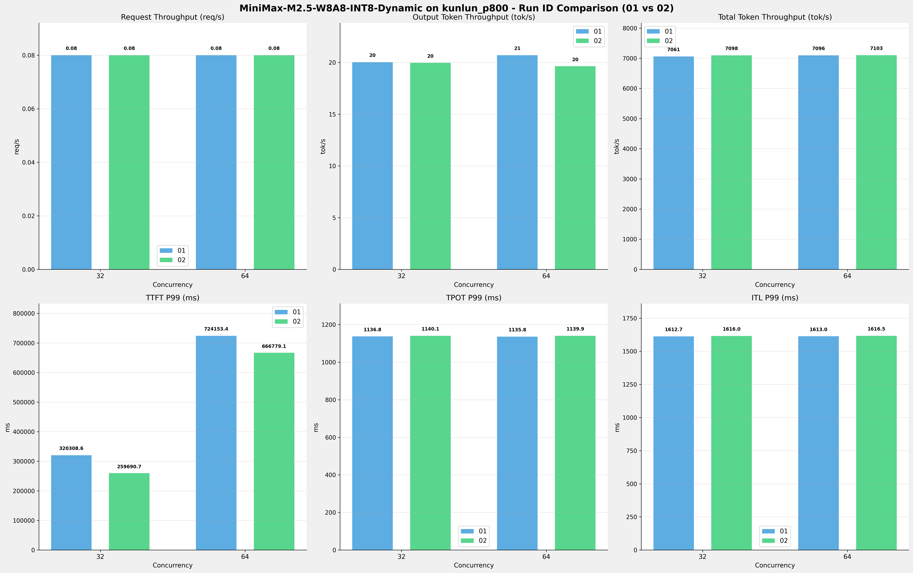

# MiniMax-M2.5-W8A8-INT8-Dynamic模型在kunlun_p800上多次运行结果对比报告

**测试日期：** 2026-05-18

**对比RUN-ID：** 01 vs 02

---

## 测试场景
对比同一芯片、同一测试套件下,同一模型优化前后测试结果比对，分析性能差异。

**测试模型**  
第1轮测试（RUN-01）: MiniMax-M2.5-W8A8-INT8-Dynamic  第2轮测试（RUN-02）: MiniMax-M2.5-W8A8-INT8-Dynamic  

## 🤖 芯片和模型配置信息

| 参数名称                    | kunlun_p800 |
|------------------------|-------------|
| **model_name** | MiniMax-M2.5-W8A8-INT8-Dynamic |
| **quantization_config** | int-8 |
| **model_size** | 215G |
| **max_position_embeddings** | 196608 |
| **temperature** | 1.0 |
| **top_k** | 40 |
| **top_p** | 0.95 |
| **transformers_version** | 4.46.1 |
| **vllm_version** | 0.11.0 |
| **python_version** | 3.10.15 |

---

## ⚙️ vLLM启动配置信息

| 参数名称                    | kunlun_p800 |
|------------------------|-------------|
| **Model Name** | MiniMax-M2.5-W8A8-INT8-Dynamic |
| **Max Model Len** | 196608 |
| **Max Num Seqs** | 64 |
| **Max Num Batched Tokens** | 8192 |
| **Gpu Memory Utilization** | 0.95 |
| **Dtype** | auto |
| **Block Size** | 128 |
| **Dp** | 1 |
| **Tp** | 8 |
| **Pp** | 1 |
| **Enable Export Parallel** | False |
| **Enable Auto Tool Choice** | True |
| **Tool Call Parser** | minimax_m2 |
| **Reasoning Parser** | minimax_m2 (不生效) |
| **Compilation Config** | {"splitting_ops":["vllm.unified_attention","vllm.unified_attention_with_output","vllm.unified_attention_with_output_kunlun","vllm.mamba_mixer2","vllm.mamba_mixer","vllm.short_conv","vllm.linear_attention","vllm.plamo2_mamba_mixer","vllm.gdn_attention","vllm.sparse_attn_indexer","vllm.sparse_attn_indexer_vllm_kunlun"]} |

---

## 📊 测试概览

| 项目            | 配置                                    | 备注  |
|---------------|---------------------------------------|-----|
| **测试套件**     | test_03                           |     |
| **数据集**       | random                                |     |
| **并发数**       | [32, 64] |     |
| **总请求数**      | [1000]                                 |     |
| **请求输入上下文长度** | [90000]                               |     |
| **请求输出上下文长度** | [2000]                               |     |
| **模型**        | MiniMax-M2.5-W8A8-INT8-Dynamic                          |     |
| **被测芯片**      | kunlun_p800                          |     |
| **测试场景**      | 单I/O测试                          |     |

**主要采集指标**：

| 指标                  | 单位         | 含义                                 |
|---------------------|------------|------------------------------------|
| TTFT                | ms         | Time To First Token，首 token 延迟     |
| TPOT                | ms/token   | Time Per Output Token，每 token 生成时间 |
| Throughput          | tokens/s   | 系统总吞吐                              |
| QPS                 | requests/s | 请求吞吐                               |
| P50/P95/P99 Latency | ms         | 延迟分位数                              |

---

## 📊 RUN-ID对比柱状图

---

## 各并发级别详细对比

### 并发级别: 32

#### 服务基准结果

| 指标 | RUN-01 | RUN-02 | 差异 | 百分比 |
|------|----------|---------|---------|---------|
| 成功请求数 | 512 | 1000 | +488.00 | +95.3% |
| 失败请求数 | 0 | 0 | 0.00 | 0.0% |
| 测试持续时间 (s) | 6544.58 | 12716.29 | +6171.71 | +94.3% |
| 总输入 tokens | 46080000 | 90000000 | +43920000.00 | +95.3% |
| 总生成 tokens | 131114 | 253835 | +122721.00 | +93.6% |
| 峰值并发请求数 | 34.00 | 35.00 | +1.00 | +2.9% |
| **请求吞吐量 (req/s)** | 0.08 | 0.08 | 0.00 | 0.0% |
| **输出 token 吞吐量 (tok/s)** | 20.03 | 19.96 | -0.07 | -0.3% |
| 峰值输出 token 吞吐量 (tok/s) | 240.00 | 252.00 | +12.00 | +5.0% |
| **总 token 吞吐量 (tok/s)** | 7060.97 | 7097.50 | +36.53 | +0.5% |

#### 首Token延迟 (TTFT)

| 指标 | RUN-01 | RUN-02 | 差异 | 百分比 |
|------|----------|---------|---------|---------|
| 平均 TTFT (ms) | 152142.37 | 148188.94 | -3953.43 | -2.6% |
| 中位 TTFT (ms) | 144761.98 | 144656.35 | -105.63 | -0.1% |
| P95 TTFT (ms) | 206370.88 | 186577.85 | -19793.03 | -9.6% |
| P99 TTFT (ms) | 320308.58 | 259690.69 | -60617.89 | -18.9% |

#### 每Token生成时间 (TPOT)

| 指标 | RUN-01 | RUN-02 | 差异 | 百分比 |
|------|----------|---------|---------|---------|
| 平均 TPOT (ms) | 1017.97 | 1023.13 | +5.16 | +0.5% |
| 中位 TPOT (ms) | 1058.57 | 1040.08 | -18.49 | -1.7% |
| P95 TPOT (ms) | 1132.74 | 1134.86 | +2.12 | +0.2% |
| P99 TPOT (ms) | 1136.82 | 1140.06 | +3.24 | +0.3% |

#### Token间延迟 (ITL)

| 指标 | RUN-01 | RUN-02 | 差异 | 百分比 |
|------|----------|---------|---------|---------|
| 平均 ITL (ms) | 979.89 | 1008.41 | +28.52 | +2.9% |
| 中位 ITL (ms) | 1045.99 | 1064.16 | +18.17 | +1.7% |
| P95 ITL (ms) | 1565.66 | 1568.60 | +2.94 | +0.2% |
| P99 ITL (ms) | 1612.65 | 1616.03 | +3.38 | +0.2% |

### 并发级别: 64

#### 服务基准结果

| 指标 | RUN-01 | RUN-02 | 差异 | 百分比 |
|------|----------|---------|---------|---------|
| 成功请求数 | 512 | 1000 | +488.00 | +95.3% |
| 失败请求数 | 0 | 0 | 0.00 | 0.0% |
| 测试持续时间 (s) | 6512.73 | 12705.77 | +6193.04 | +95.1% |
| 总输入 tokens | 46080000 | 90000000 | +43920000.00 | +95.3% |
| 总生成 tokens | 134787 | 249469 | +114682.00 | +85.1% |
| 峰值并发请求数 | 66.00 | 67.00 | +1.00 | +1.5% |
| **请求吞吐量 (req/s)** | 0.08 | 0.08 | 0.00 | 0.0% |
| **输出 token 吞吐量 (tok/s)** | 20.70 | 19.63 | -1.07 | -5.2% |
| 峰值输出 token 吞吐量 (tok/s) | 253.00 | 253.00 | 0.00 | 0.0% |
| **总 token 吞吐量 (tok/s)** | 7096.07 | 7103.03 | +6.96 | +0.1% |

#### 首Token延迟 (TTFT)

| 指标 | RUN-01 | RUN-02 | 差异 | 百分比 |
|------|----------|---------|---------|---------|
| 平均 TTFT (ms) | 529931.46 | 542201.84 | +12270.38 | +2.3% |
| 中位 TTFT (ms) | 543948.14 | 549301.21 | +5353.07 | +1.0% |
| P95 TTFT (ms) | 601842.13 | 591795.52 | -10046.61 | -1.7% |
| P99 TTFT (ms) | 724153.37 | 666779.10 | -57374.27 | -7.9% |

#### 每Token生成时间 (TPOT)

| 指标 | RUN-01 | RUN-02 | 差异 | 百分比 |
|------|----------|---------|---------|---------|
| 平均 TPOT (ms) | 985.06 | 1040.36 | +55.30 | +5.6% |
| 中位 TPOT (ms) | 1006.79 | 1063.67 | +56.88 | +5.6% |
| P95 TPOT (ms) | 1131.47 | 1135.68 | +4.21 | +0.4% |
| P99 TPOT (ms) | 1135.81 | 1139.86 | +4.05 | +0.4% |

#### Token间延迟 (ITL)

| 指标 | RUN-01 | RUN-02 | 差异 | 百分比 |
|------|----------|---------|---------|---------|
| 平均 ITL (ms) | 973.01 | 1021.00 | +47.99 | +4.9% |
| 中位 ITL (ms) | 1042.70 | 1073.12 | +30.42 | +2.9% |
| P95 ITL (ms) | 1561.54 | 1568.48 | +6.94 | +0.4% |
| P99 ITL (ms) | 1612.99 | 1616.47 | +3.48 | +0.2% |

---

## 📝 分析总结

### 吞吐量对比

**请求吞吐量**: RUN-02 相比 RUN-01 平均变化 **0.0%**

**输出Token吞吐量**: RUN-02 相比 RUN-01 平均变化 **-2.8%**

**总Token吞吐量**: RUN-02 相比 RUN-01 平均提升 **0.3%**

### 延迟对比

**TTFT P99**: RUN-02 相比 RUN-01 平均改善 **13.4%** (延迟降低)

**TPOT P99**: RUN-02 相比 RUN-01 平均增加 **0.3%** (延迟增加)

**ITL P99**: RUN-02 相比 RUN-01 平均增加 **0.2%** (延迟增加)

---

*报告生成时间: 2026-05-18*

