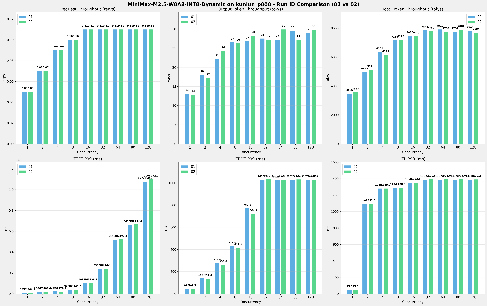

# MiniMax-M2.5-W8A8-INT8-Dynamic模型在kunlun_p800上多次运行结果对比报告

**测试日期：** 2026-05-18

**对比RUN-ID：** 01 vs 02

---

## 测试场景
对比同一芯片、同一测试套件下,同一模型优化前后测试结果比对，分析性能差异。

**测试模型**  
第1轮测试（RUN-01）: MiniMax-M2.5-W8A8-INT8-Dynamic  第2轮测试（RUN-02）: MiniMax-M2.5-W8A8-INT8-Dynamic  

## 🤖 芯片和模型配置信息

| 参数名称                    | kunlun_p800 |
|------------------------|-------------|
| **model_name** | MiniMax-M2.5-W8A8-INT8-Dynamic |
| **quantization_config** | int-8 |
| **model_size** | 215G |
| **max_position_embeddings** | 196608 |
| **temperature** | 1.0 |
| **top_k** | 40 |
| **top_p** | 0.95 |
| **transformers_version** | 4.46.1 |
| **vllm_version** | 0.11.0 |
| **python_version** | 3.10.15 |

---

## ⚙️ vLLM启动配置信息

| 参数名称                    | kunlun_p800 |
|------------------------|-------------|
| **Model Name** | MiniMax-M2.5-W8A8-INT8-Dynamic |
| **Max Model Len** | 196608 |
| **Max Num Seqs** | 64 |
| **Max Num Batched Tokens** | 8192 |
| **Gpu Memory Utilization** | 0.95 |
| **Dtype** | auto |
| **Block Size** | 128 |
| **Dp** | 1 |
| **Tp** | 8 |
| **Pp** | 1 |
| **Enable Export Parallel** | False |
| **Enable Auto Tool Choice** | True |
| **Tool Call Parser** | minimax_m2 |
| **Reasoning Parser** | minimax_m2 (不生效) |
| **Compilation Config** | {"splitting_ops":["vllm.unified_attention","vllm.unified_attention_with_output","vllm.unified_attention_with_output_kunlun","vllm.mamba_mixer2","vllm.mamba_mixer","vllm.short_conv","vllm.linear_attention","vllm.plamo2_mamba_mixer","vllm.gdn_attention","vllm.sparse_attn_indexer","vllm.sparse_attn_indexer_vllm_kunlun"]} |

---

## 📊 测试概览

| 项目            | 配置                                    | 备注  |
|---------------|---------------------------------------|-----|
| **测试套件**     | test_04                           |     |
| **数据集**       | random                                |     |
| **并发数**       | [1, 2, 4, 8, 16, 32, 64, 80, 128] |     |
| **总请求数**      | [300]                                 |     |
| **请求输入上下文长度** | [70000]                               |     |
| **请求输出上下文长度** | [1500]                               |     |
| **模型**        | MiniMax-M2.5-W8A8-INT8-Dynamic                          |     |
| **被测芯片**      | kunlun_p800                          |     |
| **测试场景**      | 单I/O测试                          |     |

**主要采集指标**：

| 指标                  | 单位         | 含义                                 |
|---------------------|------------|------------------------------------|
| TTFT                | ms         | Time To First Token，首 token 延迟     |
| TPOT                | ms/token   | Time Per Output Token，每 token 生成时间 |
| Throughput          | tokens/s   | 系统总吞吐                              |
| QPS                 | requests/s | 请求吞吐                               |
| P50/P95/P99 Latency | ms         | 延迟分位数                              |

---

## 📊 RUN-ID对比柱状图

---

## 各并发级别详细对比

### 并发级别: 1

#### 服务基准结果

| 指标 | RUN-01 | RUN-02 | 差异 | 百分比 |
|------|----------|---------|---------|---------|
| 成功请求数 | 300 | 300 | 0.00 | 0.0% |
| 失败请求数 | 0 | 0 | 0.00 | 0.0% |
| 测试持续时间 (s) | 6083.46 | 5915.98 | -167.48 | -2.8% |
| 总输入 tokens | 21000000 | 21000000 | 0.00 | 0.0% |
| 总生成 tokens | 79843 | 76002 | -3841.00 | -4.8% |
| 峰值并发请求数 | 2.00 | 2.00 | 0.00 | 0.0% |
| **请求吞吐量 (req/s)** | 0.05 | 0.05 | 0.00 | 0.0% |
| **输出 token 吞吐量 (tok/s)** | 13.12 | 12.85 | -0.27 | -2.1% |
| 峰值输出 token 吞吐量 (tok/s) | 24.00 | 24.00 | 0.00 | 0.0% |
| **总 token 吞吐量 (tok/s)** | 3465.11 | 3562.56 | +97.45 | +2.8% |

#### 首Token延迟 (TTFT)

| 指标 | RUN-01 | RUN-02 | 差异 | 百分比 |
|------|----------|---------|---------|---------|
| 平均 TTFT (ms) | 8456.37 | 8474.27 | +17.90 | +0.2% |
| 中位 TTFT (ms) | 8492.34 | 8501.64 | +9.30 | +0.1% |
| P95 TTFT (ms) | 8525.89 | 8530.50 | +4.61 | +0.1% |
| P99 TTFT (ms) | 8532.99 | 8547.15 | +14.16 | +0.2% |

#### 每Token生成时间 (TPOT)

| 指标 | RUN-01 | RUN-02 | 差异 | 百分比 |
|------|----------|---------|---------|---------|
| 平均 TPOT (ms) | 44.56 | 44.54 | -0.02 | -0.0% |
| 中位 TPOT (ms) | 44.53 | 44.52 | -0.01 | -0.0% |
| P95 TPOT (ms) | 44.75 | 44.67 | -0.08 | -0.2% |
| P99 TPOT (ms) | 44.88 | 44.94 | +0.06 | +0.1% |

#### Token间延迟 (ITL)

| 指标 | RUN-01 | RUN-02 | 差异 | 百分比 |
|------|----------|---------|---------|---------|
| 平均 ITL (ms) | 44.58 | 44.56 | -0.02 | -0.0% |
| 中位 ITL (ms) | 44.55 | 44.53 | -0.02 | -0.0% |
| P95 ITL (ms) | 44.91 | 44.87 | -0.04 | -0.1% |
| P99 ITL (ms) | 45.29 | 45.45 | +0.16 | +0.4% |

### 并发级别: 2

#### 服务基准结果

| 指标 | RUN-01 | RUN-02 | 差异 | 百分比 |
|------|----------|---------|---------|---------|
| 成功请求数 | 300 | 300 | 0.00 | 0.0% |
| 失败请求数 | 0 | 0 | 0.00 | 0.0% |
| 测试持续时间 (s) | 4253.56 | 4122.37 | -131.19 | -3.1% |
| 总输入 tokens | 21000000 | 21000000 | 0.00 | 0.0% |
| 总生成 tokens | 76539 | 70767 | -5772.00 | -7.5% |
| 峰值并发请求数 | 4.00 | 4.00 | 0.00 | 0.0% |
| **请求吞吐量 (req/s)** | 0.07 | 0.07 | 0.00 | 0.0% |
| **输出 token 吞吐量 (tok/s)** | 17.99 | 17.17 | -0.82 | -4.6% |
| 峰值输出 token 吞吐量 (tok/s) | 45.00 | 45.00 | 0.00 | 0.0% |
| **总 token 吞吐量 (tok/s)** | 4955.03 | 5111.32 | +156.29 | +3.2% |

#### 首Token延迟 (TTFT)

| 指标 | RUN-01 | RUN-02 | 差异 | 百分比 |
|------|----------|---------|---------|---------|
| 平均 TTFT (ms) | 9012.99 | 9271.26 | +258.27 | +2.9% |
| 中位 TTFT (ms) | 8757.15 | 8772.34 | +15.19 | +0.2% |
| P95 TTFT (ms) | 8938.05 | 16022.33 | +7084.28 | +79.3% |
| P99 TTFT (ms) | 16605.08 | 16807.41 | +202.33 | +1.2% |

#### 每Token生成时间 (TPOT)

| 指标 | RUN-01 | RUN-02 | 差异 | 百分比 |
|------|----------|---------|---------|---------|
| 平均 TPOT (ms) | 75.11 | 76.80 | +1.69 | +2.3% |
| 中位 TPOT (ms) | 78.81 | 79.53 | +0.72 | +0.9% |
| P95 TPOT (ms) | 117.14 | 114.76 | -2.38 | -2.0% |
| P99 TPOT (ms) | 139.69 | 132.83 | -6.86 | -4.9% |

#### Token间延迟 (ITL)

| 指标 | RUN-01 | RUN-02 | 差异 | 百分比 |
|------|----------|---------|---------|---------|
| 平均 ITL (ms) | 75.91 | 77.33 | +1.42 | +1.9% |
| 中位 ITL (ms) | 45.83 | 45.80 | -0.03 | -0.1% |
| P95 ITL (ms) | 47.02 | 48.51 | +1.49 | +3.2% |
| P99 ITL (ms) | 1089.63 | 1092.29 | +2.66 | +0.2% |

### 并发级别: 4

#### 服务基准结果

| 指标 | RUN-01 | RUN-02 | 差异 | 百分比 |
|------|----------|---------|---------|---------|
| 成功请求数 | 300 | 300 | 0.00 | 0.0% |
| 失败请求数 | 0 | 0 | 0.00 | 0.0% |
| 测试持续时间 (s) | 3313.06 | 3430.79 | +117.73 | +3.6% |
| 总输入 tokens | 21000000 | 21000000 | 0.00 | 0.0% |
| 总生成 tokens | 73352 | 83111 | +9759.00 | +13.3% |
| 峰值并发请求数 | 7.00 | 6.00 | -1.00 | -14.3% |
| **请求吞吐量 (req/s)** | 0.09 | 0.09 | 0.00 | 0.0% |
| **输出 token 吞吐量 (tok/s)** | 22.14 | 24.23 | +2.09 | +9.4% |
| 峰值输出 token 吞吐量 (tok/s) | 89.00 | 88.00 | -1.00 | -1.1% |
| **总 token 吞吐量 (tok/s)** | 6360.69 | 6145.27 | -215.42 | -3.4% |

#### 首Token延迟 (TTFT)

| 指标 | RUN-01 | RUN-02 | 差异 | 百分比 |
|------|----------|---------|---------|---------|
| 平均 TTFT (ms) | 9996.71 | 9923.20 | -73.51 | -0.7% |
| 中位 TTFT (ms) | 8788.63 | 8784.87 | -3.76 | -0.0% |
| P95 TTFT (ms) | 17029.01 | 16971.42 | -57.59 | -0.3% |
| P99 TTFT (ms) | 22980.25 | 17376.23 | -5604.02 | -24.4% |

#### 每Token生成时间 (TPOT)

| 指标 | RUN-01 | RUN-02 | 差异 | 百分比 |
|------|----------|---------|---------|---------|
| 平均 TPOT (ms) | 140.78 | 130.72 | -10.06 | -7.1% |
| 中位 TPOT (ms) | 138.47 | 128.53 | -9.94 | -7.2% |
| P95 TPOT (ms) | 210.96 | 207.37 | -3.59 | -1.7% |
| P99 TPOT (ms) | 275.00 | 258.58 | -16.42 | -6.0% |

#### Token间延迟 (ITL)

| 指标 | RUN-01 | RUN-02 | 差异 | 百分比 |
|------|----------|---------|---------|---------|
| 平均 ITL (ms) | 140.12 | 129.57 | -10.55 | -7.5% |
| 中位 ITL (ms) | 47.41 | 47.48 | +0.07 | +0.1% |
| P95 ITL (ms) | 900.66 | 896.69 | -3.97 | -0.4% |
| P99 ITL (ms) | 1280.40 | 1280.05 | -0.35 | -0.0% |

### 并发级别: 8

#### 服务基准结果

| 指标 | RUN-01 | RUN-02 | 差异 | 百分比 |
|------|----------|---------|---------|---------|
| 成功请求数 | 300 | 300 | 0.00 | 0.0% |
| 失败请求数 | 0 | 0 | 0.00 | 0.0% |
| 测试持续时间 (s) | 2945.64 | 2936.26 | -9.38 | -0.3% |
| 总输入 tokens | 21000000 | 21000000 | 0.00 | 0.0% |
| 总生成 tokens | 78130 | 77040 | -1090.00 | -1.4% |
| 峰值并发请求数 | 11.00 | 11.00 | 0.00 | 0.0% |
| **请求吞吐量 (req/s)** | 0.10 | 0.10 | 0.00 | 0.0% |
| **输出 token 吞吐量 (tok/s)** | 26.52 | 26.24 | -0.28 | -1.1% |
| 峰值输出 token 吞吐量 (tok/s) | 153.00 | 153.00 | 0.00 | 0.0% |
| **总 token 吞吐量 (tok/s)** | 7155.70 | 7178.20 | +22.50 | +0.3% |

#### 首Token延迟 (TTFT)

| 指标 | RUN-01 | RUN-02 | 差异 | 百分比 |
|------|----------|---------|---------|---------|
| 平均 TTFT (ms) | 12097.78 | 11542.77 | -555.01 | -4.6% |
| 中位 TTFT (ms) | 8979.81 | 8995.56 | +15.75 | +0.2% |
| P95 TTFT (ms) | 24560.75 | 17775.85 | -6784.90 | -27.6% |
| P99 TTFT (ms) | 37682.66 | 34881.49 | -2801.17 | -7.4% |

#### 每Token生成时间 (TPOT)

| 指标 | RUN-01 | RUN-02 | 差异 | 百分比 |
|------|----------|---------|---------|---------|
| 平均 TPOT (ms) | 255.50 | 262.14 | +6.64 | +2.6% |
| 中位 TPOT (ms) | 254.32 | 263.27 | +8.95 | +3.5% |
| P95 TPOT (ms) | 371.87 | 366.80 | -5.07 | -1.4% |
| P99 TPOT (ms) | 429.03 | 414.63 | -14.40 | -3.4% |

#### Token间延迟 (ITL)

| 指标 | RUN-01 | RUN-02 | 差异 | 百分比 |
|------|----------|---------|---------|---------|
| 平均 ITL (ms) | 253.65 | 258.96 | +5.31 | +2.1% |
| 中位 ITL (ms) | 53.44 | 53.37 | -0.07 | -0.1% |
| P95 ITL (ms) | 1172.27 | 1179.52 | +7.25 | +0.6% |
| P99 ITL (ms) | 1286.06 | 1288.46 | +2.40 | +0.2% |

### 并发级别: 16

#### 服务基准结果

| 指标 | RUN-01 | RUN-02 | 差异 | 百分比 |
|------|----------|---------|---------|---------|
| 成功请求数 | 300 | 300 | 0.00 | 0.0% |
| 失败请求数 | 0 | 0 | 0.00 | 0.0% |
| 测试持续时间 (s) | 2823.18 | 2833.17 | +9.99 | +0.4% |
| 总输入 tokens | 21000000 | 21000000 | 0.00 | 0.0% |
| 总生成 tokens | 75640 | 80080 | +4440.00 | +5.9% |
| 峰值并发请求数 | 19.00 | 19.00 | 0.00 | 0.0% |
| **请求吞吐量 (req/s)** | 0.11 | 0.11 | 0.00 | 0.0% |
| **输出 token 吞吐量 (tok/s)** | 26.79 | 28.27 | +1.48 | +5.5% |
| 峰值输出 token 吞吐量 (tok/s) | 208.00 | 208.00 | 0.00 | 0.0% |
| **总 token 吞吐量 (tok/s)** | 7465.21 | 7440.45 | -24.76 | -0.3% |

#### 首Token延迟 (TTFT)

| 指标 | RUN-01 | RUN-02 | 差异 | 百分比 |
|------|----------|---------|---------|---------|
| 平均 TTFT (ms) | 16912.75 | 17108.27 | +195.52 | +1.2% |
| 中位 TTFT (ms) | 12720.78 | 12055.83 | -664.95 | -5.2% |
| P95 TTFT (ms) | 33437.70 | 38206.23 | +4768.53 | +14.3% |
| P99 TTFT (ms) | 101721.21 | 101338.13 | -383.08 | -0.4% |

#### 每Token生成时间 (TPOT)

| 指标 | RUN-01 | RUN-02 | 差异 | 百分比 |
|------|----------|---------|---------|---------|
| 平均 TPOT (ms) | 536.77 | 502.99 | -33.78 | -6.3% |
| 中位 TPOT (ms) | 549.25 | 499.25 | -50.00 | -9.1% |
| P95 TPOT (ms) | 695.23 | 665.78 | -29.45 | -4.2% |
| P99 TPOT (ms) | 769.91 | 723.26 | -46.65 | -6.1% |

#### Token间延迟 (ITL)

| 指标 | RUN-01 | RUN-02 | 差异 | 百分比 |
|------|----------|---------|---------|---------|
| 平均 ITL (ms) | 520.52 | 496.31 | -24.21 | -4.7% |
| 中位 ITL (ms) | 94.65 | 84.38 | -10.27 | -10.9% |
| P95 ITL (ms) | 1295.83 | 1287.25 | -8.58 | -0.7% |
| P99 ITL (ms) | 1350.35 | 1352.50 | +2.15 | +0.2% |

### 并发级别: 32

#### 服务基准结果

| 指标 | RUN-01 | RUN-02 | 差异 | 百分比 |
|------|----------|---------|---------|---------|
| 成功请求数 | 300 | 300 | 0.00 | 0.0% |
| 失败请求数 | 0 | 0 | 0.00 | 0.0% |
| 测试持续时间 (s) | 2685.80 | 2708.10 | +22.30 | +0.8% |
| 总输入 tokens | 21000000 | 21000000 | 0.00 | 0.0% |
| 总生成 tokens | 73903 | 73348 | -555.00 | -0.8% |
| 峰值并发请求数 | 35.00 | 35.00 | 0.00 | 0.0% |
| **请求吞吐量 (req/s)** | 0.11 | 0.11 | 0.00 | 0.0% |
| **输出 token 吞吐量 (tok/s)** | 27.52 | 27.08 | -0.44 | -1.6% |
| 峰值输出 token 吞吐量 (tok/s) | 287.00 | 276.00 | -11.00 | -3.8% |
| **总 token 吞吐量 (tok/s)** | 7846.40 | 7781.60 | -64.80 | -0.8% |

#### 首Token延迟 (TTFT)

| 指标 | RUN-01 | RUN-02 | 差异 | 百分比 |
|------|----------|---------|---------|---------|
| 平均 TTFT (ms) | 63705.06 | 62320.24 | -1384.82 | -2.2% |
| 中位 TTFT (ms) | 56668.46 | 53015.68 | -3652.78 | -6.4% |
| P95 TTFT (ms) | 161781.39 | 145876.41 | -15904.98 | -9.8% |
| P99 TTFT (ms) | 238963.07 | 240142.59 | +1179.52 | +0.5% |

#### 每Token生成时间 (TPOT)

| 指标 | RUN-01 | RUN-02 | 差异 | 百分比 |
|------|----------|---------|---------|---------|
| 平均 TPOT (ms) | 928.73 | 945.63 | +16.90 | +1.8% |
| 中位 TPOT (ms) | 999.30 | 1008.39 | +9.09 | +0.9% |
| P95 TPOT (ms) | 1022.31 | 1026.47 | +4.16 | +0.4% |
| P99 TPOT (ms) | 1026.88 | 1032.43 | +5.55 | +0.5% |

#### Token间延迟 (ITL)

| 指标 | RUN-01 | RUN-02 | 差异 | 百分比 |
|------|----------|---------|---------|---------|
| 平均 ITL (ms) | 889.28 | 902.33 | +13.05 | +1.5% |
| 中位 ITL (ms) | 958.74 | 968.70 | +9.96 | +1.0% |
| P95 ITL (ms) | 1348.00 | 1350.08 | +2.08 | +0.2% |
| P99 ITL (ms) | 1387.43 | 1391.64 | +4.21 | +0.3% |

### 并发级别: 64

#### 服务基准结果

| 指标 | RUN-01 | RUN-02 | 差异 | 百分比 |
|------|----------|---------|---------|---------|
| 成功请求数 | 300 | 300 | 0.00 | 0.0% |
| 失败请求数 | 0 | 0 | 0.00 | 0.0% |
| 测试持续时间 (s) | 2663.96 | 2725.79 | +61.83 | +2.3% |
| 总输入 tokens | 21000000 | 21000000 | 0.00 | 0.0% |
| 总生成 tokens | 72516 | 81480 | +8964.00 | +12.4% |
| 峰值并发请求数 | 66.00 | 66.00 | 0.00 | 0.0% |
| **请求吞吐量 (req/s)** | 0.11 | 0.11 | 0.00 | 0.0% |
| **输出 token 吞吐量 (tok/s)** | 27.22 | 29.89 | +2.67 | +9.8% |
| 峰值输出 token 吞吐量 (tok/s) | 272.00 | 270.00 | -2.00 | -0.7% |
| **总 token 吞吐量 (tok/s)** | 7910.21 | 7734.08 | -176.13 | -2.2% |

#### 首Token延迟 (TTFT)

| 指标 | RUN-01 | RUN-02 | 差异 | 百分比 |
|------|----------|---------|---------|---------|
| 平均 TTFT (ms) | 323673.60 | 320609.23 | -3064.37 | -0.9% |
| 中位 TTFT (ms) | 333583.66 | 327759.99 | -5823.67 | -1.7% |
| P95 TTFT (ms) | 417605.16 | 433455.28 | +15850.12 | +3.8% |
| P99 TTFT (ms) | 519571.52 | 522197.49 | +2625.97 | +0.5% |

#### 每Token生成时间 (TPOT)

| 指标 | RUN-01 | RUN-02 | 差异 | 百分比 |
|------|----------|---------|---------|---------|
| 平均 TPOT (ms) | 923.49 | 889.00 | -34.49 | -3.7% |
| 中位 TPOT (ms) | 972.12 | 934.80 | -37.32 | -3.8% |
| P95 TPOT (ms) | 1018.68 | 1025.68 | +7.00 | +0.7% |
| P99 TPOT (ms) | 1023.67 | 1029.66 | +5.99 | +0.6% |

#### Token间延迟 (ITL)

| 指标 | RUN-01 | RUN-02 | 差异 | 百分比 |
|------|----------|---------|---------|---------|
| 平均 ITL (ms) | 908.26 | 849.56 | -58.70 | -6.5% |
| 中位 ITL (ms) | 968.28 | 941.92 | -26.36 | -2.7% |
| P95 ITL (ms) | 1347.86 | 1349.00 | +1.14 | +0.1% |
| P99 ITL (ms) | 1387.90 | 1390.98 | +3.08 | +0.2% |

### 并发级别: 80

#### 服务基准结果

| 指标 | RUN-01 | RUN-02 | 差异 | 百分比 |
|------|----------|---------|---------|---------|
| 成功请求数 | 300 | 300 | 0.00 | 0.0% |
| 失败请求数 | 0 | 0 | 0.00 | 0.0% |
| 测试持续时间 (s) | 2726.24 | 2672.68 | -53.56 | -2.0% |
| 总输入 tokens | 21000000 | 21000000 | 0.00 | 0.0% |
| 总生成 tokens | 80504 | 72600 | -7904.00 | -9.8% |
| 峰值并发请求数 | 83.00 | 82.00 | -1.00 | -1.2% |
| **请求吞吐量 (req/s)** | 0.11 | 0.11 | 0.00 | 0.0% |
| **输出 token 吞吐量 (tok/s)** | 29.53 | 27.16 | -2.37 | -8.0% |
| 峰值输出 token 吞吐量 (tok/s) | 287.00 | 285.00 | -2.00 | -0.7% |
| **总 token 吞吐量 (tok/s)** | 7732.45 | 7884.43 | +151.98 | +2.0% |

#### 首Token延迟 (TTFT)

| 指标 | RUN-01 | RUN-02 | 差异 | 百分比 |
|------|----------|---------|---------|---------|
| 平均 TTFT (ms) | 437025.14 | 443911.77 | +6886.63 | +1.6% |
| 中位 TTFT (ms) | 465733.40 | 475632.68 | +9899.28 | +2.1% |
| P95 TTFT (ms) | 573614.28 | 566062.15 | -7552.13 | -1.3% |
| P99 TTFT (ms) | 661388.52 | 665367.52 | +3979.00 | +0.6% |

#### 每Token生成时间 (TPOT)

| 指标 | RUN-01 | RUN-02 | 差异 | 百分比 |
|------|----------|---------|---------|---------|
| 平均 TPOT (ms) | 889.75 | 920.47 | +30.72 | +3.5% |
| 中位 TPOT (ms) | 948.23 | 987.34 | +39.11 | +4.1% |
| P95 TPOT (ms) | 1021.75 | 1028.62 | +6.87 | +0.7% |
| P99 TPOT (ms) | 1025.81 | 1031.31 | +5.50 | +0.5% |

#### Token间延迟 (ITL)

| 指标 | RUN-01 | RUN-02 | 差异 | 百分比 |
|------|----------|---------|---------|---------|
| 平均 ITL (ms) | 867.78 | 913.47 | +45.69 | +5.3% |
| 中位 ITL (ms) | 945.21 | 973.29 | +28.08 | +3.0% |
| P95 ITL (ms) | 1346.92 | 1351.45 | +4.53 | +0.3% |
| P99 ITL (ms) | 1387.65 | 1391.97 | +4.32 | +0.3% |

### 并发级别: 128

#### 服务基准结果

| 指标 | RUN-01 | RUN-02 | 差异 | 百分比 |
|------|----------|---------|---------|---------|
| 成功请求数 | 300 | 300 | 0.00 | 0.0% |
| 失败请求数 | 0 | 0 | 0.00 | 0.0% |
| 测试持续时间 (s) | 2704.95 | 2740.01 | +35.06 | +1.3% |
| 总输入 tokens | 21000000 | 21000000 | 0.00 | 0.0% |
| 总生成 tokens | 78164 | 81672 | +3508.00 | +4.5% |
| 峰值并发请求数 | 130.00 | 130.00 | 0.00 | 0.0% |
| **请求吞吐量 (req/s)** | 0.11 | 0.11 | 0.00 | 0.0% |
| **输出 token 吞吐量 (tok/s)** | 28.90 | 29.81 | +0.91 | +3.1% |
| 峰值输出 token 吞吐量 (tok/s) | 271.00 | 275.00 | +4.00 | +1.5% |
| **总 token 吞吐量 (tok/s)** | 7792.43 | 7694.00 | -98.43 | -1.3% |

#### 首Token延迟 (TTFT)

| 指标 | RUN-01 | RUN-02 | 差异 | 百分比 |
|------|----------|---------|---------|---------|
| 平均 TTFT (ms) | 754365.60 | 759631.00 | +5265.40 | +0.7% |
| 中位 TTFT (ms) | 889742.82 | 896693.21 | +6950.39 | +0.8% |
| P95 TTFT (ms) | 980646.93 | 989498.75 | +8851.82 | +0.9% |
| P99 TTFT (ms) | 1077460.34 | 1098992.16 | +21531.82 | +2.0% |

#### 每Token生成时间 (TPOT)

| 指标 | RUN-01 | RUN-02 | 差异 | 百分比 |
|------|----------|---------|---------|---------|
| 平均 TPOT (ms) | 908.92 | 882.77 | -26.15 | -2.9% |
| 中位 TPOT (ms) | 978.09 | 943.55 | -34.54 | -3.5% |
| P95 TPOT (ms) | 1018.79 | 1024.76 | +5.97 | +0.6% |
| P99 TPOT (ms) | 1027.96 | 1030.58 | +2.62 | +0.3% |

#### Token间延迟 (ITL)

| 指标 | RUN-01 | RUN-02 | 差异 | 百分比 |
|------|----------|---------|---------|---------|
| 平均 ITL (ms) | 863.34 | 848.19 | -15.15 | -1.8% |
| 中位 ITL (ms) | 942.89 | 940.54 | -2.35 | -0.2% |
| P95 ITL (ms) | 1344.67 | 1349.28 | +4.61 | +0.3% |
| P99 ITL (ms) | 1387.61 | 1390.23 | +2.62 | +0.2% |

---

## 📝 分析总结

### 吞吐量对比

**请求吞吐量**: RUN-02 相比 RUN-01 平均变化 **0.0%**

**输出Token吞吐量**: RUN-02 相比 RUN-01 平均提升 **1.2%**

**总Token吞吐量**: RUN-02 相比 RUN-01 平均提升 **0.0%**

### 延迟对比

**TTFT P99**: RUN-02 相比 RUN-01 平均改善 **3.0%** (延迟降低)

**TPOT P99**: RUN-02 相比 RUN-01 平均改善 **2.0%** (延迟降低)

**ITL P99**: RUN-02 相比 RUN-01 平均增加 **0.2%** (延迟增加)

---

*报告生成时间: 2026-05-18*

