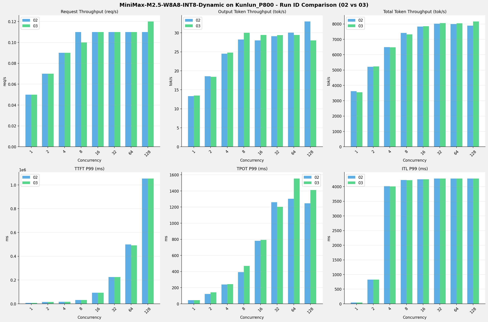

# MiniMax-M2.5-W8A8-INT8-Dynamic模型在Kunlun_P800上的RUN-ID对比报告

**测试日期：** 2026-04-13

**对比RUN-ID：** 02 vs 03

---

## 测试场景
对比同一芯片、同一测试套件下,同一模型优化前后测试结果比对，分析性能差异。

**测试模型**  
第1轮测试（RUN-02）: MiniMax-M2.5-W8A8-INT8-Dynamic  第2轮测试（RUN-03）: MiniMax-M2.5-W8A8-INT8-Dynamic  

## 🤖 芯片和模型配置信息

| 参数名称                    | Kunlun_P800 |
|------------------------|-------------|
| **model_name** | MiniMax-M2.5-W8A8-INT8-Dynamic |
| **quantization_config** | int-8 |
| **model_size** | 215G |
| **max_position_embeddings** | 196608 |
| **temperature** | 1.0 |
| **top_k** | 40 |
| **top_p** | 0.95 |
| **transformers_version** | 4.46.1 |
| **vllm_version** | 0.11.0 |
| **python_version** | 3.10.15 |

---

## 🤖 vLLM启动配置信息

| 参数名称                    | Kunlun_P800 |
|------------------------|-------------|
| model_name | MiniMax-M2.5-W8A8-INT8-Dynamic |
| max-model-len | 196608 |
| max-num-seqs | 64 |
| max-num-batched-tokens | 8192 |
| gpu-memory-utilization | 0.95 |
| dtype | auto |
| block_size | 128 |
| dp | 1 |
| tp | 8 |
| pp | 1 |
| enable-export-parallel | False |
| enable-auto-tool-choice | True |
| tool-call-parser | minimax_m2 |
| reasoning-parser | minimax_m2 (不生效) |

---

## 📊 测试概览

| 项目            | 配置                                    | 备注  |
|---------------|---------------------------------------|-----|
| **数据集**       | random                                |     |
| **并发数**       | [1, 2, 4, 8, 16, 32, 64, 80, 128] |     |
| **总请求数**      | [300]                                 |     |
| **请求输入上下文长度** | [70000]                               |     |
| **请求输出上下文长度** | [1500]                               |     |
| **模型**        | MiniMax-M2.5-W8A8-INT8-Dynamic                          |     |
| **被测芯片**      | Kunlun_P800                          |     |

**主要采集指标**：

| 指标                  | 单位         | 含义                                 |
|---------------------|------------|------------------------------------|
| TTFT                | ms         | Time To First Token，首 token 延迟     |
| TPOT                | ms/token   | Time Per Output Token，每 token 生成时间 |
| Throughput          | tokens/s   | 系统总吞吐                              |
| QPS                 | requests/s | 请求吞吐                               |
| P50/P95/P99 Latency | ms         | 延迟分位数                              |

---

## 各并发级别详细对比

### 并发级别: 1

#### 服务基准结果

| 指标 | RUN-02 | RUN-03 | 差异 | 百分比 |
|------|----------|---------|---------|---------|
| 成功请求数 | 300 | 300 | 0.00 | 0.0% |
| 失败请求数 | 0 | 0 | 0.00 | 0.0% |
| 测试持续时间 (s) | 5813.67 | 5943.57 | +129.90 | +2.2% |
| 总输入 tokens | 21000000 | 21000000 | 0.00 | 0.0% |
| 总生成 tokens | 77423 | 80226 | +2803.00 | +3.6% |
| **请求吞吐量 (req/s)** | 0.05 | 0.05 | 0.00 | 0.0% |
| **输出 token 吞吐量 (tok/s)** | 13.32 | 13.50 | +0.18 | +1.4% |
| 峰值输出 token 吞吐量 (tok/s) | 24.00 | 24.00 | 0.00 | 0.0% |
| 峰值并发请求数 | 2.00 | 2.00 | 0.00 | 0.0% |
| **总 token 吞吐量 (tok/s)** | 3625.50 | 3546.73 | -78.77 | -2.2% |

#### 首Token延迟 (TTFT)

| 指标 | RUN-02 | RUN-03 | 差异 | 百分比 |
|------|----------|---------|---------|---------|
| 平均 TTFT (ms) | 7928.62 | 7939.32 | +10.70 | +0.1% |
| 中位 TTFT (ms) | 7959.54 | 7965.89 | +6.35 | +0.1% |
| P95 TTFT (ms) | 7986.90 | 7997.29 | +10.39 | +0.1% |
| P99 TTFT (ms) | 7997.17 | 8011.94 | +14.77 | +0.2% |

#### 每Token生成时间 (TPOT)

| 指标 | RUN-02 | RUN-03 | 差异 | 百分比 |
|------|----------|---------|---------|---------|
| 平均 TPOT (ms) | 44.52 | 44.53 | +0.01 | +0.0% |
| 中位 TPOT (ms) | 44.51 | 44.52 | +0.01 | +0.0% |
| P95 TPOT (ms) | 44.60 | 44.68 | +0.08 | +0.2% |
| P99 TPOT (ms) | 44.70 | 44.85 | +0.15 | +0.3% |

#### Token间延迟 (ITL)

| 指标 | RUN-02 | RUN-03 | 差异 | 百分比 |
|------|----------|---------|---------|---------|
| 平均 ITL (ms) | 44.37 | 44.40 | +0.03 | +0.1% |
| 中位 ITL (ms) | 44.52 | 44.53 | +0.01 | +0.0% |
| P95 ITL (ms) | 44.75 | 44.91 | +0.16 | +0.4% |
| P99 ITL (ms) | 44.98 | 45.60 | +0.62 | +1.4% |

### 并发级别: 2

#### 服务基准结果

| 指标 | RUN-02 | RUN-03 | 差异 | 百分比 |
|------|----------|---------|---------|---------|
| 成功请求数 | 300 | 300 | 0.00 | 0.0% |
| 失败请求数 | 0 | 0 | 0.00 | 0.0% |
| 测试持续时间 (s) | 4045.87 | 4029.32 | -16.55 | -0.4% |
| 总输入 tokens | 21000000 | 21000000 | 0.00 | 0.0% |
| 总生成 tokens | 74991 | 74297 | -694.00 | -0.9% |
| **请求吞吐量 (req/s)** | 0.07 | 0.07 | 0.00 | 0.0% |
| **输出 token 吞吐量 (tok/s)** | 18.54 | 18.44 | -0.10 | -0.5% |
| 峰值输出 token 吞吐量 (tok/s) | 45.00 | 45.00 | 0.00 | 0.0% |
| 峰值并发请求数 | 4.00 | 4.00 | 0.00 | 0.0% |
| **总 token 吞吐量 (tok/s)** | 5209.01 | 5230.23 | +21.22 | +0.4% |

#### 首Token延迟 (TTFT)

| 指标 | RUN-02 | RUN-03 | 差异 | 百分比 |
|------|----------|---------|---------|---------|
| 平均 TTFT (ms) | 8430.94 | 8433.86 | +2.92 | +0.0% |
| 中位 TTFT (ms) | 8083.69 | 8046.76 | -36.93 | -0.5% |
| P95 TTFT (ms) | 10126.21 | 10128.27 | +2.06 | +0.0% |
| P99 TTFT (ms) | 15413.55 | 15444.76 | +31.21 | +0.2% |

#### 每Token生成时间 (TPOT)

| 指标 | RUN-02 | RUN-03 | 差异 | 百分比 |
|------|----------|---------|---------|---------|
| 平均 TPOT (ms) | 73.98 | 76.42 | +2.44 | +3.3% |
| 中位 TPOT (ms) | 76.40 | 75.98 | -0.42 | -0.5% |
| P95 TPOT (ms) | 113.25 | 120.63 | +7.38 | +6.5% |
| P99 TPOT (ms) | 120.93 | 143.01 | +22.08 | +18.3% |

#### Token间延迟 (ITL)

| 指标 | RUN-02 | RUN-03 | 差异 | 百分比 |
|------|----------|---------|---------|---------|
| 平均 ITL (ms) | 74.14 | 74.32 | +0.18 | +0.2% |
| 中位 ITL (ms) | 45.74 | 45.72 | -0.02 | -0.0% |
| P95 ITL (ms) | 46.18 | 46.18 | 0.00 | 0.0% |
| P99 ITL (ms) | 824.36 | 824.18 | -0.18 | -0.0% |

### 并发级别: 4

#### 服务基准结果

| 指标 | RUN-02 | RUN-03 | 差异 | 百分比 |
|------|----------|---------|---------|---------|
| 成功请求数 | 300 | 300 | 0.00 | 0.0% |
| 失败请求数 | 0 | 0 | 0.00 | 0.0% |
| 测试持续时间 (s) | 3251.30 | 3252.19 | +0.89 | +0.0% |
| 总输入 tokens | 21000000 | 21000000 | 0.00 | 0.0% |
| 总生成 tokens | 79648 | 80660 | +1012.00 | +1.3% |
| **请求吞吐量 (req/s)** | 0.09 | 0.09 | 0.00 | 0.0% |
| **输出 token 吞吐量 (tok/s)** | 24.50 | 24.80 | +0.30 | +1.2% |
| 峰值输出 token 吞吐量 (tok/s) | 89.00 | 88.00 | -1.00 | -1.1% |
| 峰值并发请求数 | 6.00 | 6.00 | 0.00 | 0.0% |
| **总 token 吞吐量 (tok/s)** | 6483.46 | 6481.99 | -1.47 | -0.0% |

#### 首Token延迟 (TTFT)

| 指标 | RUN-02 | RUN-03 | 差异 | 百分比 |
|------|----------|---------|---------|---------|
| 平均 TTFT (ms) | 8920.27 | 8988.69 | +68.42 | +0.8% |
| 中位 TTFT (ms) | 8068.92 | 8067.06 | -1.86 | -0.0% |
| P95 TTFT (ms) | 15501.22 | 15462.76 | -38.46 | -0.2% |
| P99 TTFT (ms) | 17427.28 | 17290.16 | -137.12 | -0.8% |

#### 每Token生成时间 (TPOT)

| 指标 | RUN-02 | RUN-03 | 差异 | 百分比 |
|------|----------|---------|---------|---------|
| 平均 TPOT (ms) | 128.63 | 128.82 | +0.19 | +0.1% |
| 中位 TPOT (ms) | 129.31 | 126.50 | -2.81 | -2.2% |
| P95 TPOT (ms) | 193.57 | 208.44 | +14.87 | +7.7% |
| P99 TPOT (ms) | 238.71 | 244.23 | +5.52 | +2.3% |

#### Token间延迟 (ITL)

| 指标 | RUN-02 | RUN-03 | 差异 | 百分比 |
|------|----------|---------|---------|---------|
| 平均 ITL (ms) | 129.09 | 127.70 | -1.39 | -1.1% |
| 中位 ITL (ms) | 47.36 | 47.34 | -0.02 | -0.0% |
| P95 ITL (ms) | 51.25 | 51.22 | -0.03 | -0.1% |
| P99 ITL (ms) | 4013.94 | 4010.12 | -3.82 | -0.1% |

### 并发级别: 8

#### 服务基准结果

| 指标 | RUN-02 | RUN-03 | 差异 | 百分比 |
|------|----------|---------|---------|---------|
| 成功请求数 | 300 | 300 | 0.00 | 0.0% |
| 失败请求数 | 0 | 0 | 0.00 | 0.0% |
| 测试持续时间 (s) | 2842.33 | 2883.49 | +41.16 | +1.4% |
| 总输入 tokens | 21000000 | 21000000 | 0.00 | 0.0% |
| 总生成 tokens | 80280 | 86529 | +6249.00 | +7.8% |
| **请求吞吐量 (req/s)** | 0.11 | 0.10 | -0.01 | -9.1% |
| **输出 token 吞吐量 (tok/s)** | 28.24 | 30.01 | +1.77 | +6.3% |
| 峰值输出 token 吞吐量 (tok/s) | 153.00 | 153.00 | 0.00 | 0.0% |
| 峰值并发请求数 | 11.00 | 11.00 | 0.00 | 0.0% |
| **总 token 吞吐量 (tok/s)** | 7416.54 | 7312.84 | -103.70 | -1.4% |

#### 首Token延迟 (TTFT)

| 指标 | RUN-02 | RUN-03 | 差异 | 百分比 |
|------|----------|---------|---------|---------|
| 平均 TTFT (ms) | 10475.86 | 9798.23 | -677.63 | -6.5% |
| 中位 TTFT (ms) | 8108.59 | 8062.04 | -46.55 | -0.6% |
| P95 TTFT (ms) | 17234.10 | 15644.50 | -1589.60 | -9.2% |
| P99 TTFT (ms) | 32329.42 | 32425.82 | +96.40 | +0.3% |

#### 每Token生成时间 (TPOT)

| 指标 | RUN-02 | RUN-03 | 差异 | 百分比 |
|------|----------|---------|---------|---------|
| 平均 TPOT (ms) | 248.54 | 232.91 | -15.63 | -6.3% |
| 中位 TPOT (ms) | 253.68 | 232.41 | -21.27 | -8.4% |
| P95 TPOT (ms) | 348.35 | 338.43 | -9.92 | -2.8% |
| P99 TPOT (ms) | 392.92 | 469.82 | +76.90 | +19.6% |

#### Token间延迟 (ITL)

| 指标 | RUN-02 | RUN-03 | 差异 | 百分比 |
|------|----------|---------|---------|---------|
| 平均 ITL (ms) | 240.29 | 229.46 | -10.83 | -4.5% |
| 中位 ITL (ms) | 53.24 | 53.37 | +0.13 | +0.2% |
| P95 ITL (ms) | 2053.18 | 830.17 | -1223.01 | -59.6% |
| P99 ITL (ms) | 4222.34 | 4221.48 | -0.86 | -0.0% |

### 并发级别: 16

#### 服务基准结果

| 指标 | RUN-02 | RUN-03 | 差异 | 百分比 |
|------|----------|---------|---------|---------|
| 成功请求数 | 300 | 300 | 0.00 | 0.0% |
| 失败请求数 | 0 | 0 | 0.00 | 0.0% |
| 测试持续时间 (s) | 2693.20 | 2683.40 | -9.80 | -0.4% |
| 总输入 tokens | 21000000 | 21000000 | 0.00 | 0.0% |
| 总生成 tokens | 75458 | 79025 | +3567.00 | +4.7% |
| **请求吞吐量 (req/s)** | 0.11 | 0.11 | 0.00 | 0.0% |
| **输出 token 吞吐量 (tok/s)** | 28.02 | 29.45 | +1.43 | +5.1% |
| 峰值输出 token 吞吐量 (tok/s) | 209.00 | 209.00 | 0.00 | 0.0% |
| 峰值并发请求数 | 19.00 | 19.00 | 0.00 | 0.0% |
| **总 token 吞吐量 (tok/s)** | 7825.43 | 7855.35 | +29.92 | +0.4% |

#### 首Token延迟 (TTFT)

| 指标 | RUN-02 | RUN-03 | 差异 | 百分比 |
|------|----------|---------|---------|---------|
| 平均 TTFT (ms) | 13652.71 | 13045.56 | -607.15 | -4.4% |
| 中位 TTFT (ms) | 10208.94 | 8224.45 | -1984.49 | -19.4% |
| P95 TTFT (ms) | 24561.17 | 23247.02 | -1314.15 | -5.4% |
| P99 TTFT (ms) | 92709.37 | 93213.69 | +504.32 | +0.5% |

#### 每Token生成时间 (TPOT)

| 指标 | RUN-02 | RUN-03 | 差异 | 百分比 |
|------|----------|---------|---------|---------|
| 平均 TPOT (ms) | 522.77 | 498.64 | -24.13 | -4.6% |
| 中位 TPOT (ms) | 530.87 | 503.60 | -27.27 | -5.1% |
| P95 TPOT (ms) | 703.15 | 663.11 | -40.04 | -5.7% |
| P99 TPOT (ms) | 780.78 | 792.42 | +11.64 | +1.5% |

#### Token间延迟 (ITL)

| 指标 | RUN-02 | RUN-03 | 差异 | 百分比 |
|------|----------|---------|---------|---------|
| 平均 ITL (ms) | 505.55 | 489.56 | -15.99 | -3.2% |
| 中位 ITL (ms) | 82.09 | 82.14 | +0.05 | +0.1% |
| P95 ITL (ms) | 4014.94 | 4013.21 | -1.73 | -0.0% |
| P99 ITL (ms) | 4250.60 | 4249.10 | -1.50 | -0.0% |

### 并发级别: 32

#### 服务基准结果

| 指标 | RUN-02 | RUN-03 | 差异 | 百分比 |
|------|----------|---------|---------|---------|
| 成功请求数 | 300 | 300 | 0.00 | 0.0% |
| 失败请求数 | 0 | 0 | 0.00 | 0.0% |
| 测试持续时间 (s) | 2628.99 | 2617.93 | -11.06 | -0.4% |
| 总输入 tokens | 21000000 | 21000000 | 0.00 | 0.0% |
| 总生成 tokens | 76534 | 76890 | +356.00 | +0.5% |
| **请求吞吐量 (req/s)** | 0.11 | 0.11 | 0.00 | 0.0% |
| **输出 token 吞吐量 (tok/s)** | 29.11 | 29.37 | +0.26 | +0.9% |
| 峰值输出 token 吞吐量 (tok/s) | 288.00 | 288.00 | 0.00 | 0.0% |
| 峰值并发请求数 | 34.00 | 34.00 | 0.00 | 0.0% |
| **总 token 吞吐量 (tok/s)** | 8016.97 | 8050.97 | +34.00 | +0.4% |

#### 首Token延迟 (TTFT)

| 指标 | RUN-02 | RUN-03 | 差异 | 百分比 |
|------|----------|---------|---------|---------|
| 平均 TTFT (ms) | 67481.82 | 67577.02 | +95.20 | +0.1% |
| 中位 TTFT (ms) | 60417.55 | 60855.87 | +438.32 | +0.7% |
| P95 TTFT (ms) | 125341.42 | 125851.73 | +510.31 | +0.4% |
| P99 TTFT (ms) | 224903.44 | 224954.82 | +51.38 | +0.0% |

#### 每Token生成时间 (TPOT)

| 指标 | RUN-02 | RUN-03 | 差异 | 百分比 |
|------|----------|---------|---------|---------|
| 平均 TPOT (ms) | 838.90 | 827.48 | -11.42 | -1.4% |
| 中位 TPOT (ms) | 853.09 | 848.71 | -4.38 | -0.5% |
| P95 TPOT (ms) | 1076.07 | 1070.01 | -6.06 | -0.6% |
| P99 TPOT (ms) | 1258.80 | 1202.25 | -56.55 | -4.5% |

#### Token间延迟 (ITL)

| 指标 | RUN-02 | RUN-03 | 差异 | 百分比 |
|------|----------|---------|---------|---------|
| 平均 ITL (ms) | 807.57 | 804.07 | -3.50 | -0.4% |
| 中位 ITL (ms) | 111.66 | 111.78 | +0.12 | +0.1% |
| P95 ITL (ms) | 4253.59 | 4251.57 | -2.02 | -0.0% |
| P99 ITL (ms) | 4276.15 | 4274.77 | -1.38 | -0.0% |

### 并发级别: 64

#### 服务基准结果

| 指标 | RUN-02 | RUN-03 | 差异 | 百分比 |
|------|----------|---------|---------|---------|
| 成功请求数 | 300 | 300 | 0.00 | 0.0% |
| 失败请求数 | 0 | 0 | 0.00 | 0.0% |
| 测试持续时间 (s) | 2637.13 | 2622.88 | -14.25 | -0.5% |
| 总输入 tokens | 21000000 | 21000000 | 0.00 | 0.0% |
| 总生成 tokens | 79243 | 77241 | -2002.00 | -2.5% |
| **请求吞吐量 (req/s)** | 0.11 | 0.11 | 0.00 | 0.0% |
| **输出 token 吞吐量 (tok/s)** | 30.05 | 29.45 | -0.60 | -2.0% |
| 峰值输出 token 吞吐量 (tok/s) | 269.00 | 281.00 | +12.00 | +4.5% |
| 峰值并发请求数 | 67.00 | 67.00 | 0.00 | 0.0% |
| **总 token 吞吐量 (tok/s)** | 7993.25 | 8035.93 | +42.68 | +0.5% |

#### 首Token延迟 (TTFT)

| 指标 | RUN-02 | RUN-03 | 差异 | 百分比 |
|------|----------|---------|---------|---------|
| 平均 TTFT (ms) | 320371.39 | 319321.19 | -1050.20 | -0.3% |
| 中位 TTFT (ms) | 337213.73 | 335453.71 | -1760.02 | -0.5% |
| P95 TTFT (ms) | 395083.29 | 394707.07 | -376.22 | -0.1% |
| P99 TTFT (ms) | 498799.66 | 490909.07 | -7890.59 | -1.6% |

#### 每Token生成时间 (TPOT)

| 指标 | RUN-02 | RUN-03 | 差异 | 百分比 |
|------|----------|---------|---------|---------|
| 平均 TPOT (ms) | 827.99 | 854.94 | +26.95 | +3.3% |
| 中位 TPOT (ms) | 825.29 | 863.48 | +38.19 | +4.6% |
| P95 TPOT (ms) | 1105.60 | 1214.82 | +109.22 | +9.9% |
| P99 TPOT (ms) | 1301.63 | 1553.84 | +252.21 | +19.4% |

#### Token间延迟 (ITL)

| 指标 | RUN-02 | RUN-03 | 差异 | 百分比 |
|------|----------|---------|---------|---------|
| 平均 ITL (ms) | 783.04 | 796.06 | +13.02 | +1.7% |
| 中位 ITL (ms) | 111.92 | 111.59 | -0.33 | -0.3% |
| P95 ITL (ms) | 4253.08 | 4251.42 | -1.66 | -0.0% |
| P99 ITL (ms) | 4275.81 | 4275.36 | -0.45 | -0.0% |

### 并发级别: 128

#### 服务基准结果

| 指标 | RUN-02 | RUN-03 | 差异 | 百分比 |
|------|----------|---------|---------|---------|
| 成功请求数 | 300 | 300 | 0.00 | 0.0% |
| 失败请求数 | 0 | 0 | 0.00 | 0.0% |
| 测试持续时间 (s) | 2673.86 | 2583.13 | -90.73 | -3.4% |
| 总输入 tokens | 21000000 | 21000000 | 0.00 | 0.0% |
| 总生成 tokens | 88170 | 72309 | -15861.00 | -18.0% |
| **请求吞吐量 (req/s)** | 0.11 | 0.12 | +0.01 | +9.1% |
| **输出 token 吞吐量 (tok/s)** | 32.97 | 27.99 | -4.98 | -15.1% |
| 峰值输出 token 吞吐量 (tok/s) | 288.00 | 248.00 | -40.00 | -13.9% |
| 峰值并发请求数 | 130.00 | 130.00 | 0.00 | 0.0% |
| **总 token 吞吐量 (tok/s)** | 7886.79 | 8157.66 | +270.87 | +3.4% |

#### 首Token延迟 (TTFT)

| 指标 | RUN-02 | RUN-03 | 差异 | 百分比 |
|------|----------|---------|---------|---------|
| 平均 TTFT (ms) | 744977.63 | 732834.41 | -12143.22 | -1.6% |
| 中位 TTFT (ms) | 897249.61 | 877582.86 | -19666.75 | -2.2% |
| P95 TTFT (ms) | 946898.43 | 946476.74 | -421.69 | -0.0% |
| P99 TTFT (ms) | 1052839.33 | 1053749.08 | +909.75 | +0.1% |

#### 每Token生成时间 (TPOT)

| 指标 | RUN-02 | RUN-03 | 差异 | 百分比 |
|------|----------|---------|---------|---------|
| 平均 TPOT (ms) | 773.61 | 874.37 | +100.76 | +13.0% |
| 中位 TPOT (ms) | 768.80 | 886.79 | +117.99 | +15.3% |
| P95 TPOT (ms) | 1007.92 | 1094.37 | +86.45 | +8.6% |
| P99 TPOT (ms) | 1246.05 | 1411.24 | +165.19 | +13.3% |

#### Token间延迟 (ITL)

| 指标 | RUN-02 | RUN-03 | 差异 | 百分比 |
|------|----------|---------|---------|---------|
| 平均 ITL (ms) | 712.48 | 847.30 | +134.82 | +18.9% |
| 中位 ITL (ms) | 111.78 | 111.58 | -0.20 | -0.2% |
| P95 ITL (ms) | 4251.83 | 4252.72 | +0.89 | +0.0% |
| P99 ITL (ms) | 4275.63 | 4274.75 | -0.88 | -0.0% |

---

## 📊 RUN-ID对比柱状图

---

## 📝 分析总结

### 吞吐量对比

**请求吞吐量**: RUN-03 相比 RUN-02 平均变化 **0.0%**

**输出Token吞吐量**: RUN-03 相比 RUN-02 平均变化 **-0.4%**

### 延迟对比

**TTFT P99**: RUN-03 相比 RUN-02 平均改善 **0.1%** (延迟降低)

**TPOT P99**: RUN-03 相比 RUN-02 平均增加 **8.8%** (延迟增加)

**ITL P99**: RUN-03 相比 RUN-02 平均增加 **0.1%** (延迟增加)

---

*报告生成时间: 2026-04-13*

