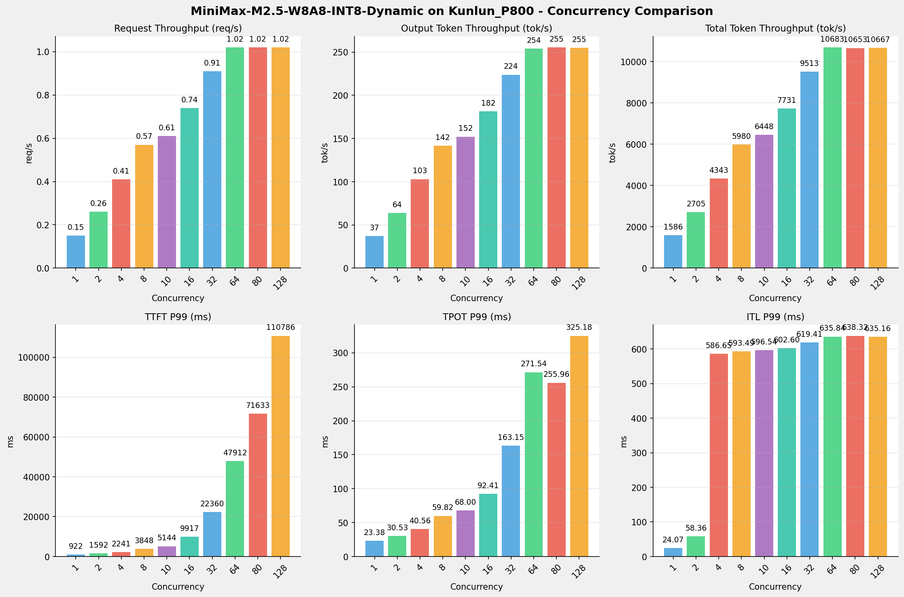
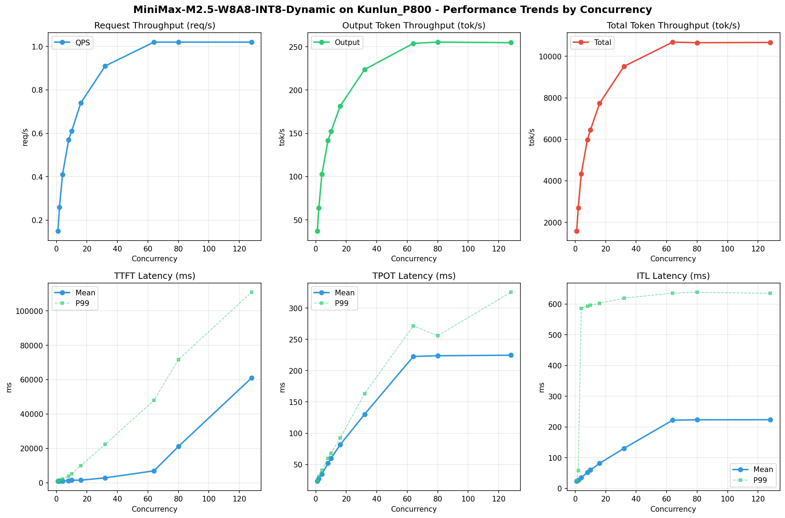

# MiniMax-M2.5-W8A8-INT8-Dynamic模型在Kunlun_P800上的Benchmark基准测试报告

**测试日期：** 2026-05-18

---

## 测试场景
使用vllm bench serve基准测试工具对不同并发数，请求上下文长度下的性能变化趋势。

**主要采集指标**：

| 指标                  | 单位         | 含义                                 |
|---------------------|------------|------------------------------------|
| Request throughput  | req/s      | 请求吞吐量                              |
| Output token throughput | tok/s  | 输出token吞吐量                        |
| Total token throughput | tok/s   | 总token吞吐量                         |
| TTFT                | ms         | Time To First Token，首 token 延迟     |
| TPOT                | ms/token   | Time Per Output Token，每 token 生成时间 |
| ITL                 | ms         | Inter-Token Latency，token间延迟       |

## 🤖 芯片和模型配置信息

| 参数名称                    | Kunlun_P800 |
|------------------------|-------------|
| **model_name** | MiniMax-M2.5-W8A8-INT8-Dynamic |
| **quantization_config** | int-8 |
| **model_size** | 215G |
| **max_position_embeddings** | 196608 |
| **temperature** | 1.0 |
| **top_k** | 40 |
| **top_p** | 0.95 |
| **transformers_version** | 4.46.1 |
| **vllm_version** | 0.11.0 |
| **python_version** | 3.10.15 |

## 🤖 vLLM启动配置信息

| 参数名称                   | Kunlun_P800 |
|------------------------|-------------|
| **Model Name** | MiniMax-M2.5-W8A8-INT8-Dynamic |
| **Max Model Len** | 196608 |
| **Max Num Seqs** | 64 |
| **Max Num Batched Tokens** | 8192 |
| **Gpu Memory Utilization** | 0.95 |
| **Dtype** | auto |
| **Block Size** | 128 |
| **Dp** | 1 |
| **Tp** | 8 |
| **Pp** | 1 |
| **Enable Export Parallel** | False |
| **Enable Auto Tool Choice** | True |
| **Tool Call Parser** | minimax_m2 |
| **Reasoning Parser** | minimax_m2 (不生效) |
| **Compilation Config** | {"splitting_ops":["vllm.unified_attention","vllm.unified_attention_with_output","vllm.unified_attention_with_output_kunlun","vllm.mamba_mixer2","vllm.mamba_mixer","vllm.short_conv","vllm.linear_attention","vllm.plamo2_mamba_mixer","vllm.gdn_attention","vllm.sparse_attn_indexer","vllm.sparse_attn_indexer_vllm_kunlun"]} |

- **Kunlun_P800**: 昆仑芯不启用专家并行避免通信问题

## 📊 测试概览

| 项目            | 配置                                     | 备注  |
|---------------|----------------------------------------|-----|
| **数据集**       | random                                 |     |
| **并发数**       | 1, 2, 4, 8, 10, 16, 32, 64, 80, 128    |     |
| **总请求数**      | 320                                    |     |
| **请求输入上下文长度** | 10240（10k）                             |     |
| **请求输出上下文长度** | 256（0.25k）                             |     |
| **模型**        | MiniMax-M2.5-W8A8-INT8-Dynamic                           |     |
| **被测芯片**      | Kunlun_P800 |     |

---

## 📋 测试结果汇总

| 并发数 | 请求吞吐量 (req/s) | 输出Token吞吐量 (tok/s) | 总Token吞吐量 (tok/s) | TTFT P99 (ms) | TPOT P99 (ms) | ITL P99 (ms) |
| ----------- | ----------- | ----------- | ----------- | ----------- | ----------- | ----------- |
| 1 | 0.15 | 37.20 | 1585.87 | 921.76 | 23.38 | 24.07 |
| 2 | 0.26 | 64.02 | 2705.12 | 1591.52 | 30.53 | 58.36 |
| 4 | 0.41 | 102.96 | 4342.80 | 2240.56 | 40.56 | 586.65 |
| 8 | 0.57 | 141.69 | 5980.27 | 3847.84 | 59.82 | 593.49 |
| 10 | 0.61 | 152.16 | 6448.31 | 5143.91 | 68.00 | 596.54 |
| 16 | 0.74 | 181.52 | 7730.83 | 9917.09 | 92.41 | 602.60 |
| 32 | 0.91 | 223.77 | 9513.02 | 22359.61 | 163.15 | 619.41 |
| 64 | 1.02 | 253.92 | 10682.97 | 47912.19 | 271.54 | 635.84 |
| 80 | 1.02 | 255.42 | 10653.29 | 71633.46 | 255.96 | 638.32 |
| 128 | 1.02 | 254.79 | 10666.52 | 110786.32 | 325.18 | 635.16 |

## 📊 各并发级别性能柱状图

## 📈 性能趋势分析

---

### 🎯 服务基准结果详情

| 指标 | 1 并发 | 2 并发 | 4 并发 | 8 并发 | 10 并发 | 16 并发 | 32 并发 | 64 并发 | 80 并发 | 128 并发 |
|------|----------- | ----------- | ----------- | ----------- | ----------- | ----------- | ----------- | ----------- | ----------- | -----------|
| 成功请求数 | 320 | 320 | 320 | 320 | 320 | 320 | 320 | 320 | 320 | 320 |
| 失败请求数 | 0 | 0 | 0 | 0 | 0 | 0 | 0 | 0 | 0 | 0 |
| 测试持续时间 (s) | 2115.85 | 1240.67 | 772.85 | 561.22 | 520.44 | 434.05 | 352.75 | 314.19 | 315.14 | 314.72 |
| 总输入 tokens | 3276748 | 3276748 | 3276748 | 3276748 | 3276748 | 3276748 | 3276748 | 3276748 | 3276748 | 3276748 |
| 总生成 tokens | 78707 | 79423 | 79574 | 79521 | 79192 | 78788 | 78933 | 79780 | 80493 | 80186 |
| **请求吞吐量 (req/s)** | 0.15 | 0.26 | 0.41 | 0.57 | 0.61 | 0.74 | 0.91 | 1.02 | 1.02 | 1.02 |
| **输出 token 吞吐量 (tok/s)** | 37.20 | 64.02 | 102.96 | 141.69 | 152.16 | 181.52 | 223.77 | 253.92 | 255.42 | 254.79 |
| 峰值输出 token 吞吐量 (tok/s) | 44.00 | 83.00 | 157.00 | 257.00 | 291.00 | 417.00 | 702.00 | 1024.00 | 1025.00 | 1024.00 |
| 峰值并发请求数 | 2.00 | 4.00 | 8.00 | 11.00 | 14.00 | 20.00 | 36.00 | 68.00 | 83.00 | 131.00 |
| **总 token 吞吐量 (tok/s)** | 1585.87 | 2705.12 | 4342.80 | 5980.27 | 6448.31 | 7730.83 | 9513.02 | 10682.97 | 10653.29 | 10666.52 |

### ⏱️ 首Token延迟 (TTFT)

| 指标 | 1 并发 | 2 并发 | 4 并发 | 8 并发 | 10 并发 | 16 并发 | 32 并发 | 64 并发 | 80 并发 | 128 并发 |
|------|----------- | ----------- | ----------- | ----------- | ----------- | ----------- | ----------- | ----------- | ----------- | -----------|
| 平均 TTFT (ms) | 898.33 | 978.55 | 1017.52 | 1159.47 | 1456.60 | 1485.85 | 2848.93 | 6916.51 | 21074.74 | 60948.41 |
| 中位 TTFT (ms) | 901.43 | 923.32 | 915.96 | 936.85 | 1282.49 | 1296.89 | 1715.48 | 2495.19 | 15109.31 | 63459.09 |
| P95 TTFT (ms) | 915.80 | 1575.42 | 1618.56 | 1649.19 | 3221.43 | 2324.89 | 12301.42 | 38095.53 | 50874.99 | 101009.77 |
| P99 TTFT (ms) | 921.76 | 1591.52 | 2240.56 | 3847.84 | 5143.91 | 9917.09 | 22359.61 | 47912.19 | 71633.46 | 110786.32 |

### ⚡ 每Token生成时间 (TPOT)

| 指标 | 1 并发 | 2 并发 | 4 并发 | 8 并发 | 10 并发 | 16 并发 | 32 并发 | 64 并发 | 80 并发 | 128 并发 |
|------|----------- | ----------- | ----------- | ----------- | ----------- | ----------- | ----------- | ----------- | ----------- | -----------|
| 平均 TPOT (ms) | 23.32 | 27.38 | 34.77 | 51.78 | 59.81 | 81.64 | 130.25 | 222.66 | 223.83 | 224.66 |
| 中位 TPOT (ms) | 23.32 | 27.56 | 34.97 | 52.18 | 60.91 | 82.49 | 135.10 | 241.15 | 243.06 | 241.98 |
| P95 TPOT (ms) | 23.36 | 28.88 | 37.89 | 55.27 | 65.57 | 87.96 | 145.12 | 253.91 | 251.21 | 251.19 |
| P99 TPOT (ms) | 23.38 | 30.53 | 40.56 | 59.82 | 68.00 | 92.41 | 163.15 | 271.54 | 255.96 | 325.18 |

### 🔄 Token间延迟 (ITL)

| 指标 | 1 并发 | 2 并发 | 4 并发 | 8 并发 | 10 并发 | 16 并发 | 32 并发 | 64 并发 | 80 并发 | 128 并发 |
|------|----------- | ----------- | ----------- | ----------- | ----------- | ----------- | ----------- | ----------- | ----------- | -----------|
| 平均 ITL (ms) | 23.26 | 27.40 | 35.04 | 51.62 | 59.57 | 81.44 | 130.13 | 222.08 | 223.17 | 223.47 |
| 中位 ITL (ms) | 23.31 | 24.60 | 26.08 | 31.87 | 35.48 | 39.41 | 47.63 | 65.24 | 65.36 | 65.31 |
| P95 ITL (ms) | 23.49 | 24.82 | 27.03 | 214.19 | 217.00 | 592.47 | 608.17 | 631.09 | 630.93 | 627.22 |
| P99 ITL (ms) | 24.07 | 58.36 | 586.65 | 593.49 | 596.54 | 602.60 | 619.41 | 635.84 | 638.32 | 635.16 |

---

## 📝 分析总结

### 1. 吞吐量性能分析

**请求吞吐量 (QPS)**: 随着并发级别增加，QPS持续上升。
低并发(1,2,4)平均 QPS: 0.27 req/s；
中并发(8,10,16,32)平均 QPS: 0.71 req/s；
高并发(64,80,128)平均 QPS: 1.02 req/s；
最高 QPS 出现在 64 并发，达到 1.02 req/s。

**Token总吞吐量**: 最高达到 10683 tok/s (64 并发)。

### 2. 首Token延迟 (TTFT) 分析

TTFT随并发增加显著上升。
低并发平均 P99 TTFT: 1585ms；
高并发平均 P99 TTFT: 76777ms；
最高 P99 TTFT 出现在 128 并发，达到 110786ms。

### 3. Token生成时间 (TPOT) 分析

TPOT随并发增加也呈上升趋势。
低并发平均 P99 TPOT: 31.49ms；
高并发平均 P99 TPOT: 284.23ms；
最高 P99 TPOT 出现在 128 并发，达到 325.18ms。

### 4. Token间延迟 (ITL) 分析

ITL随并发增加呈上升趋势。
低并发平均 P99 ITL: 223.03ms；
高并发平均 P99 ITL: 636.44ms；
最高 P99 ITL 出现在 80 并发，达到 638.32ms。

### 5. 综合评估

**吞吐量增长**: 从最低并发到最高并发，QPS增长了 580.0%。
**TTFT延迟恶化**: 高并发相比低并发，TTFT P99增加了 6891.4%。
**TPOT延迟恶化**: 高并发相比低并发，TPOT P99增加了 932.6%。

---

*报告生成时间: 2026-05-18*

