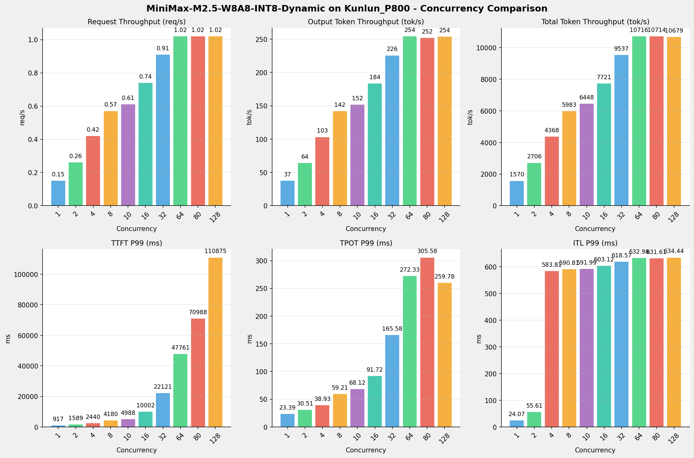
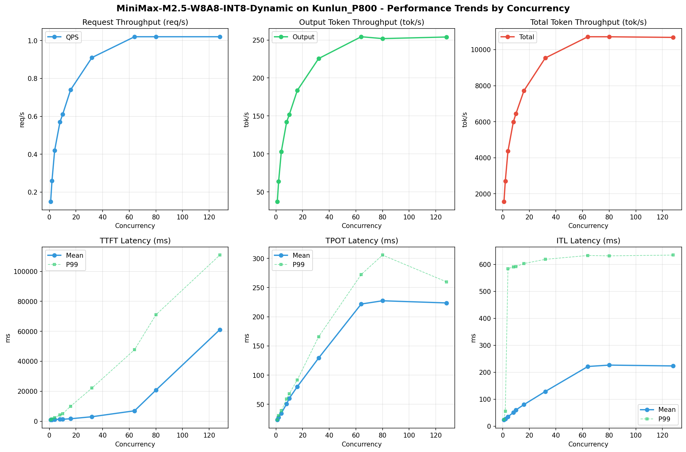

# MiniMax-M2.5-W8A8-INT8-Dynamic模型在Kunlun_P800上的Benchmark基准测试报告

**测试日期：** 2026-05-18

---

## 测试场景
使用vllm bench serve基准测试工具对不同并发数，请求上下文长度下的性能变化趋势。

**主要采集指标**：

| 指标                  | 单位         | 含义                                 |
|---------------------|------------|------------------------------------|
| Request throughput  | req/s      | 请求吞吐量                              |
| Output token throughput | tok/s  | 输出token吞吐量                        |
| Total token throughput | tok/s   | 总token吞吐量                         |
| TTFT                | ms         | Time To First Token，首 token 延迟     |
| TPOT                | ms/token   | Time Per Output Token，每 token 生成时间 |
| ITL                 | ms         | Inter-Token Latency，token间延迟       |

## 🤖 芯片和模型配置信息

| 参数名称                    | Kunlun_P800 |
|------------------------|-------------|
| **model_name** | MiniMax-M2.5-W8A8-INT8-Dynamic |
| **quantization_config** | int-8 |
| **model_size** | 215G |
| **max_position_embeddings** | 196608 |
| **temperature** | 1.0 |
| **top_k** | 40 |
| **top_p** | 0.95 |
| **transformers_version** | 4.46.1 |
| **vllm_version** | 0.11.0 |
| **python_version** | 3.10.15 |

## 🤖 vLLM启动配置信息

| 参数名称                   | Kunlun_P800 |
|------------------------|-------------|
| **Model Name** | MiniMax-M2.5-W8A8-INT8-Dynamic |
| **Max Model Len** | 196608 |
| **Max Num Seqs** | 64 |
| **Max Num Batched Tokens** | 8192 |
| **Gpu Memory Utilization** | 0.95 |
| **Dtype** | auto |
| **Block Size** | 128 |
| **Dp** | 1 |
| **Tp** | 8 |
| **Pp** | 1 |
| **Enable Export Parallel** | False |
| **Enable Auto Tool Choice** | True |
| **Tool Call Parser** | minimax_m2 |
| **Reasoning Parser** | minimax_m2 (不生效) |
| **Compilation Config** | {"splitting_ops":["vllm.unified_attention","vllm.unified_attention_with_output","vllm.unified_attention_with_output_kunlun","vllm.mamba_mixer2","vllm.mamba_mixer","vllm.short_conv","vllm.linear_attention","vllm.plamo2_mamba_mixer","vllm.gdn_attention","vllm.sparse_attn_indexer","vllm.sparse_attn_indexer_vllm_kunlun"]} |

- **Kunlun_P800**: 昆仑芯不启用专家并行避免通信问题

## 📊 测试概览

| 项目            | 配置                                     | 备注  |
|---------------|----------------------------------------|-----|
| **数据集**       | random                                 |     |
| **并发数**       | 1, 2, 4, 8, 10, 16, 32, 64, 80, 128    |     |
| **总请求数**      | 320                                    |     |
| **请求输入上下文长度** | 10240（10k）                             |     |
| **请求输出上下文长度** | 256（0.25k）                             |     |
| **模型**        | MiniMax-M2.5-W8A8-INT8-Dynamic                           |     |
| **被测芯片**      | Kunlun_P800 |     |

---

## 📋 测试结果汇总

| 并发数 | 请求吞吐量 (req/s) | 输出Token吞吐量 (tok/s) | 总Token吞吐量 (tok/s) | TTFT P99 (ms) | TPOT P99 (ms) | ITL P99 (ms) |
| ----------- | ----------- | ----------- | ----------- | ----------- | ----------- | ----------- |
| 1 | 0.15 | 37.28 | 1569.64 | 917.04 | 23.39 | 24.07 |
| 2 | 0.26 | 63.98 | 2706.13 | 1589.39 | 30.51 | 55.61 |
| 4 | 0.42 | 102.97 | 4367.74 | 2440.03 | 38.93 | 583.81 |
| 8 | 0.57 | 142.04 | 5982.56 | 4180.11 | 59.21 | 590.81 |
| 10 | 0.61 | 151.79 | 6448.24 | 4988.09 | 68.12 | 591.99 |
| 16 | 0.74 | 183.55 | 7721.28 | 10002.49 | 91.72 | 603.12 |
| 32 | 0.91 | 225.55 | 9536.58 | 22120.98 | 165.58 | 618.57 |
| 64 | 1.02 | 254.29 | 10715.95 | 47760.97 | 272.33 | 632.98 |
| 80 | 1.02 | 251.85 | 10713.81 | 70987.86 | 305.58 | 631.61 |
| 128 | 1.02 | 253.94 | 10679.20 | 110875.17 | 259.78 | 634.44 |

## 📊 各并发级别性能柱状图

## 📈 性能趋势分析

---

### 🎯 服务基准结果详情

| 指标 | 1 并发 | 2 并发 | 4 并发 | 8 并发 | 10 并发 | 16 并发 | 32 并发 | 64 并发 | 80 并发 | 128 并发 |
|------|----------- | ----------- | ----------- | ----------- | ----------- | ----------- | ----------- | ----------- | ----------- | -----------|
| 成功请求数 | 320 | 320 | 320 | 320 | 320 | 320 | 320 | 320 | 320 | 320 |
| 失败请求数 | 0 | 0 | 0 | 0 | 0 | 0 | 0 | 0 | 0 | 0 |
| 测试持续时间 (s) | 2138.36 | 1240.18 | 768.33 | 561.04 | 520.41 | 434.71 | 351.92 | 313.21 | 313.21 | 314.31 |
| 总输入 tokens | 3276748 | 3276748 | 3276748 | 3276748 | 3276748 | 3276748 | 3276748 | 3276748 | 3276748 | 3276748 |
| 总生成 tokens | 79708 | 79351 | 79118 | 79692 | 78993 | 79792 | 79376 | 79646 | 78881 | 79814 |
| **请求吞吐量 (req/s)** | 0.15 | 0.26 | 0.42 | 0.57 | 0.61 | 0.74 | 0.91 | 1.02 | 1.02 | 1.02 |
| **输出 token 吞吐量 (tok/s)** | 37.28 | 63.98 | 102.97 | 142.04 | 151.79 | 183.55 | 225.55 | 254.29 | 251.85 | 253.94 |
| 峰值输出 token 吞吐量 (tok/s) | 44.00 | 83.00 | 157.00 | 257.00 | 290.00 | 417.00 | 698.00 | 1024.00 | 1025.00 | 1024.00 |
| 峰值并发请求数 | 2.00 | 4.00 | 8.00 | 14.00 | 14.00 | 21.00 | 37.00 | 70.00 | 83.00 | 131.00 |
| **总 token 吞吐量 (tok/s)** | 1569.64 | 2706.13 | 4367.74 | 5982.56 | 6448.24 | 7721.28 | 9536.58 | 10715.95 | 10713.81 | 10679.20 |

### ⏱️ 首Token延迟 (TTFT)

| 指标 | 1 并发 | 2 并发 | 4 并发 | 8 并发 | 10 并发 | 16 并发 | 32 并发 | 64 并发 | 80 并发 | 128 并发 |
|------|----------- | ----------- | ----------- | ----------- | ----------- | ----------- | ----------- | ----------- | ----------- | -----------|
| 平均 TTFT (ms) | 895.34 | 956.99 | 1041.02 | 1367.77 | 1307.13 | 1656.75 | 2995.44 | 6966.31 | 20726.95 | 61086.49 |
| 中位 TTFT (ms) | 897.61 | 920.09 | 911.84 | 934.53 | 941.36 | 1311.48 | 1886.75 | 2479.32 | 15203.36 | 63389.32 |
| P95 TTFT (ms) | 911.74 | 1301.46 | 1613.33 | 3577.48 | 3139.44 | 3032.55 | 12178.73 | 37974.89 | 50188.15 | 100621.19 |
| P99 TTFT (ms) | 917.04 | 1589.39 | 2440.03 | 4180.11 | 4988.09 | 10002.49 | 22120.98 | 47760.97 | 70987.86 | 110875.17 |

### ⚡ 每Token生成时间 (TPOT)

| 指标 | 1 并发 | 2 并发 | 4 并发 | 8 并发 | 10 并发 | 16 并发 | 32 并发 | 64 并发 | 80 并发 | 128 并发 |
|------|----------- | ----------- | ----------- | ----------- | ----------- | ----------- | ----------- | ----------- | ----------- | -----------|
| 平均 TPOT (ms) | 23.32 | 27.42 | 34.70 | 50.84 | 60.30 | 80.16 | 129.20 | 221.76 | 227.33 | 223.63 |
| 中位 TPOT (ms) | 23.32 | 27.56 | 34.95 | 52.04 | 61.32 | 82.04 | 132.58 | 238.48 | 244.53 | 241.70 |
| P95 TPOT (ms) | 23.36 | 28.89 | 37.90 | 55.14 | 65.62 | 86.36 | 141.98 | 252.93 | 261.60 | 250.90 |
| P99 TPOT (ms) | 23.39 | 30.51 | 38.93 | 59.21 | 68.12 | 91.72 | 165.58 | 272.33 | 305.58 | 259.78 |

### 🔄 Token间延迟 (ITL)

| 指标 | 1 并发 | 2 并发 | 4 并发 | 8 并发 | 10 并发 | 16 并发 | 32 并发 | 64 并发 | 80 并发 | 128 并发 |
|------|----------- | ----------- | ----------- | ----------- | ----------- | ----------- | ----------- | ----------- | ----------- | -----------|
| 平均 ITL (ms) | 23.26 | 27.45 | 34.94 | 50.53 | 60.19 | 79.95 | 128.54 | 221.30 | 226.41 | 223.34 |
| 中位 ITL (ms) | 23.30 | 24.60 | 26.10 | 31.88 | 35.47 | 39.44 | 47.65 | 65.38 | 65.43 | 65.29 |
| P95 ITL (ms) | 23.47 | 24.81 | 27.04 | 59.34 | 217.22 | 590.76 | 608.54 | 628.06 | 623.41 | 627.25 |
| P99 ITL (ms) | 24.07 | 55.61 | 583.81 | 590.81 | 591.99 | 603.12 | 618.57 | 632.98 | 631.61 | 634.44 |

---

## 📝 分析总结

### 1. 吞吐量性能分析

**请求吞吐量 (QPS)**: 随着并发级别增加，QPS持续上升。
低并发(1,2,4)平均 QPS: 0.28 req/s；
中并发(8,10,16,32)平均 QPS: 0.71 req/s；
高并发(64,80,128)平均 QPS: 1.02 req/s；
最高 QPS 出现在 64 并发，达到 1.02 req/s。

**Token总吞吐量**: 最高达到 10716 tok/s (64 并发)。

### 2. 首Token延迟 (TTFT) 分析

TTFT随并发增加显著上升。
低并发平均 P99 TTFT: 1649ms；
高并发平均 P99 TTFT: 76541ms；
最高 P99 TTFT 出现在 128 并发，达到 110875ms。

### 3. Token生成时间 (TPOT) 分析

TPOT随并发增加也呈上升趋势。
低并发平均 P99 TPOT: 30.94ms；
高并发平均 P99 TPOT: 279.23ms；
最高 P99 TPOT 出现在 80 并发，达到 305.58ms。

### 4. Token间延迟 (ITL) 分析

ITL随并发增加呈上升趋势。
低并发平均 P99 ITL: 221.16ms；
高并发平均 P99 ITL: 633.01ms；
最高 P99 ITL 出现在 128 并发，达到 634.44ms。

### 5. 综合评估

**吞吐量增长**: 从最低并发到最高并发，QPS增长了 580.0%。
**TTFT延迟恶化**: 高并发相比低并发，TTFT P99增加了 6624.5%。
**TPOT延迟恶化**: 高并发相比低并发，TPOT P99增加了 887.5%。

---

*报告生成时间: 2026-05-18*

