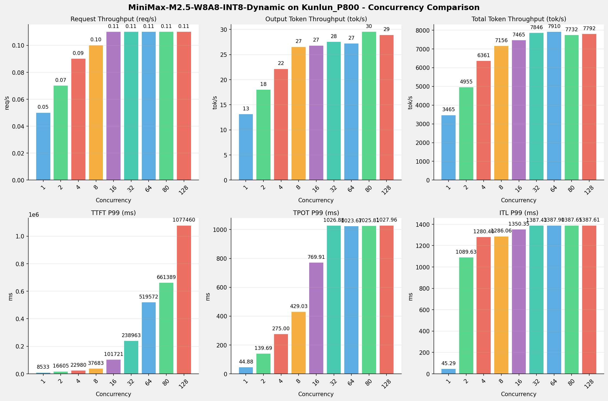
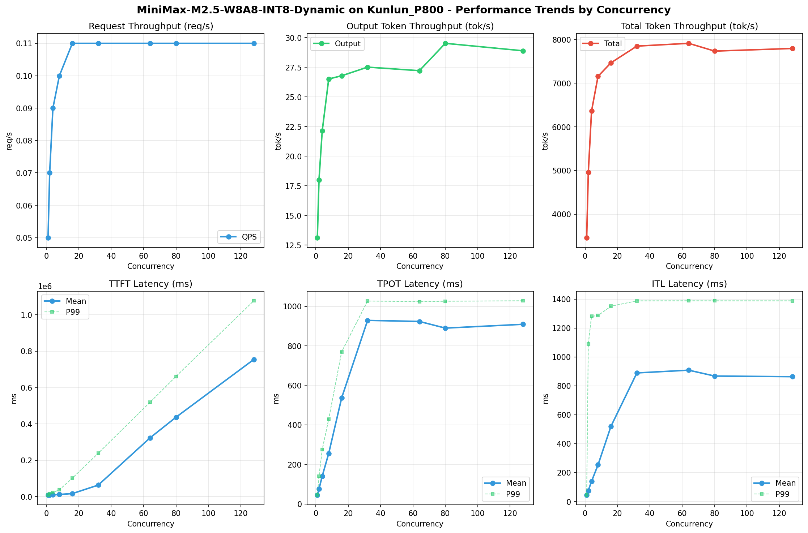

# MiniMax-M2.5-W8A8-INT8-Dynamic模型在Kunlun_P800上的Benchmark基准测试报告

**测试日期：** 2026-05-18

---

## 测试场景
使用vllm bench serve基准测试工具对不同并发数，请求上下文长度下的性能变化趋势。

**主要采集指标**：

| 指标                  | 单位         | 含义                                 |
|---------------------|------------|------------------------------------|
| Request throughput  | req/s      | 请求吞吐量                              |
| Output token throughput | tok/s  | 输出token吞吐量                        |
| Total token throughput | tok/s   | 总token吞吐量                         |
| TTFT                | ms         | Time To First Token，首 token 延迟     |
| TPOT                | ms/token   | Time Per Output Token，每 token 生成时间 |
| ITL                 | ms         | Inter-Token Latency，token间延迟       |

## 🤖 芯片和模型配置信息

| 参数名称                    | Kunlun_P800 |
|------------------------|-------------|
| **model_name** | MiniMax-M2.5-W8A8-INT8-Dynamic |
| **quantization_config** | int-8 |
| **model_size** | 215G |
| **max_position_embeddings** | 196608 |
| **temperature** | 1.0 |
| **top_k** | 40 |
| **top_p** | 0.95 |
| **transformers_version** | 4.46.1 |
| **vllm_version** | 0.11.0 |
| **python_version** | 3.10.15 |

## 🤖 vLLM启动配置信息

| 参数名称                   | Kunlun_P800 |
|------------------------|-------------|
| **Model Name** | MiniMax-M2.5-W8A8-INT8-Dynamic |
| **Max Model Len** | 196608 |
| **Max Num Seqs** | 64 |
| **Max Num Batched Tokens** | 8192 |
| **Gpu Memory Utilization** | 0.95 |
| **Dtype** | auto |
| **Block Size** | 128 |
| **Dp** | 1 |
| **Tp** | 8 |
| **Pp** | 1 |
| **Enable Export Parallel** | False |
| **Enable Auto Tool Choice** | True |
| **Tool Call Parser** | minimax_m2 |
| **Reasoning Parser** | minimax_m2 (不生效) |
| **Compilation Config** | {"splitting_ops":["vllm.unified_attention","vllm.unified_attention_with_output","vllm.unified_attention_with_output_kunlun","vllm.mamba_mixer2","vllm.mamba_mixer","vllm.short_conv","vllm.linear_attention","vllm.plamo2_mamba_mixer","vllm.gdn_attention","vllm.sparse_attn_indexer","vllm.sparse_attn_indexer_vllm_kunlun"]} |

- **Kunlun_P800**: 昆仑芯不启用专家并行避免通信问题

## 📊 测试概览

| 项目            | 配置                                     | 备注  |
|---------------|----------------------------------------|-----|
| **数据集**       | random                                 |     |
| **并发数**       | 1, 2, 4, 8, 16, 32, 64, 80, 128    |     |
| **总请求数**      | 300                                    |     |
| **请求输入上下文长度** | 70000（68k）                             |     |
| **请求输出上下文长度** | 1500（1k）                             |     |
| **模型**        | MiniMax-M2.5-W8A8-INT8-Dynamic                           |     |
| **被测芯片**      | Kunlun_P800 |     |

---

## 📋 测试结果汇总

| 并发数 | 请求吞吐量 (req/s) | 输出Token吞吐量 (tok/s) | 总Token吞吐量 (tok/s) | TTFT P99 (ms) | TPOT P99 (ms) | ITL P99 (ms) |
| ----------- | ----------- | ----------- | ----------- | ----------- | ----------- | ----------- |
| 1 | 0.05 | 13.12 | 3465.11 | 8532.99 | 44.88 | 45.29 |
| 2 | 0.07 | 17.99 | 4955.03 | 16605.08 | 139.69 | 1089.63 |
| 4 | 0.09 | 22.14 | 6360.69 | 22980.25 | 275.00 | 1280.40 |
| 8 | 0.10 | 26.52 | 7155.70 | 37682.66 | 429.03 | 1286.06 |
| 16 | 0.11 | 26.79 | 7465.21 | 101721.21 | 769.91 | 1350.35 |
| 32 | 0.11 | 27.52 | 7846.40 | 238963.07 | 1026.88 | 1387.43 |
| 64 | 0.11 | 27.22 | 7910.21 | 519571.52 | 1023.67 | 1387.90 |
| 80 | 0.11 | 29.53 | 7732.45 | 661388.52 | 1025.81 | 1387.65 |
| 128 | 0.11 | 28.90 | 7792.43 | 1077460.34 | 1027.96 | 1387.61 |

## 📊 各并发级别性能柱状图

## 📈 性能趋势分析

---

### 🎯 服务基准结果详情

| 指标 | 1 并发 | 2 并发 | 4 并发 | 8 并发 | 16 并发 | 32 并发 | 64 并发 | 80 并发 | 128 并发 |
|------|----------- | ----------- | ----------- | ----------- | ----------- | ----------- | ----------- | ----------- | -----------|
| 成功请求数 | 300 | 300 | 300 | 300 | 300 | 300 | 300 | 300 | 300 |
| 失败请求数 | 0 | 0 | 0 | 0 | 0 | 0 | 0 | 0 | 0 |
| 测试持续时间 (s) | 6083.46 | 4253.56 | 3313.06 | 2945.64 | 2823.18 | 2685.80 | 2663.96 | 2726.24 | 2704.95 |
| 总输入 tokens | 21000000 | 21000000 | 21000000 | 21000000 | 21000000 | 21000000 | 21000000 | 21000000 | 21000000 |
| 总生成 tokens | 79843 | 76539 | 73352 | 78130 | 75640 | 73903 | 72516 | 80504 | 78164 |
| **请求吞吐量 (req/s)** | 0.05 | 0.07 | 0.09 | 0.10 | 0.11 | 0.11 | 0.11 | 0.11 | 0.11 |
| **输出 token 吞吐量 (tok/s)** | 13.12 | 17.99 | 22.14 | 26.52 | 26.79 | 27.52 | 27.22 | 29.53 | 28.90 |
| 峰值输出 token 吞吐量 (tok/s) | 24.00 | 45.00 | 89.00 | 153.00 | 208.00 | 287.00 | 272.00 | 287.00 | 271.00 |
| 峰值并发请求数 | 2.00 | 4.00 | 7.00 | 11.00 | 19.00 | 35.00 | 66.00 | 83.00 | 130.00 |
| **总 token 吞吐量 (tok/s)** | 3465.11 | 4955.03 | 6360.69 | 7155.70 | 7465.21 | 7846.40 | 7910.21 | 7732.45 | 7792.43 |

### ⏱️ 首Token延迟 (TTFT)

| 指标 | 1 并发 | 2 并发 | 4 并发 | 8 并发 | 16 并发 | 32 并发 | 64 并发 | 80 并发 | 128 并发 |
|------|----------- | ----------- | ----------- | ----------- | ----------- | ----------- | ----------- | ----------- | -----------|
| 平均 TTFT (ms) | 8456.37 | 9012.99 | 9996.71 | 12097.78 | 16912.75 | 63705.06 | 323673.60 | 437025.14 | 754365.60 |
| 中位 TTFT (ms) | 8492.34 | 8757.15 | 8788.63 | 8979.81 | 12720.78 | 56668.46 | 333583.66 | 465733.40 | 889742.82 |
| P95 TTFT (ms) | 8525.89 | 8938.05 | 17029.01 | 24560.75 | 33437.70 | 161781.39 | 417605.16 | 573614.28 | 980646.93 |
| P99 TTFT (ms) | 8532.99 | 16605.08 | 22980.25 | 37682.66 | 101721.21 | 238963.07 | 519571.52 | 661388.52 | 1077460.34 |

### ⚡ 每Token生成时间 (TPOT)

| 指标 | 1 并发 | 2 并发 | 4 并发 | 8 并发 | 16 并发 | 32 并发 | 64 并发 | 80 并发 | 128 并发 |
|------|----------- | ----------- | ----------- | ----------- | ----------- | ----------- | ----------- | ----------- | -----------|
| 平均 TPOT (ms) | 44.56 | 75.11 | 140.78 | 255.50 | 536.77 | 928.73 | 923.49 | 889.75 | 908.92 |
| 中位 TPOT (ms) | 44.53 | 78.81 | 138.47 | 254.32 | 549.25 | 999.30 | 972.12 | 948.23 | 978.09 |
| P95 TPOT (ms) | 44.75 | 117.14 | 210.96 | 371.87 | 695.23 | 1022.31 | 1018.68 | 1021.75 | 1018.79 |
| P99 TPOT (ms) | 44.88 | 139.69 | 275.00 | 429.03 | 769.91 | 1026.88 | 1023.67 | 1025.81 | 1027.96 |

### 🔄 Token间延迟 (ITL)

| 指标 | 1 并发 | 2 并发 | 4 并发 | 8 并发 | 16 并发 | 32 并发 | 64 并发 | 80 并发 | 128 并发 |
|------|----------- | ----------- | ----------- | ----------- | ----------- | ----------- | ----------- | ----------- | -----------|
| 平均 ITL (ms) | 44.58 | 75.91 | 140.12 | 253.65 | 520.52 | 889.28 | 908.26 | 867.78 | 863.34 |
| 中位 ITL (ms) | 44.55 | 45.83 | 47.41 | 53.44 | 94.65 | 958.74 | 968.28 | 945.21 | 942.89 |
| P95 ITL (ms) | 44.91 | 47.02 | 900.66 | 1172.27 | 1295.83 | 1348.00 | 1347.86 | 1346.92 | 1344.67 |
| P99 ITL (ms) | 45.29 | 1089.63 | 1280.40 | 1286.06 | 1350.35 | 1387.43 | 1387.90 | 1387.65 | 1387.61 |

---

## 📝 分析总结

### 1. 吞吐量性能分析

**请求吞吐量 (QPS)**: 随着并发级别增加，QPS持续上升。
低并发(1,2,4)平均 QPS: 0.07 req/s；
中并发(8,16,32)平均 QPS: 0.11 req/s；
高并发(64,80,128)平均 QPS: 0.11 req/s；
最高 QPS 出现在 16 并发，达到 0.11 req/s。

**Token总吞吐量**: 最高达到 7910 tok/s (64 并发)。

### 2. 首Token延迟 (TTFT) 分析

TTFT随并发增加显著上升。
低并发平均 P99 TTFT: 16039ms；
高并发平均 P99 TTFT: 752807ms；
最高 P99 TTFT 出现在 128 并发，达到 1077460ms。

### 3. Token生成时间 (TPOT) 分析

TPOT随并发增加也呈上升趋势。
低并发平均 P99 TPOT: 153.19ms；
高并发平均 P99 TPOT: 1025.81ms；
最高 P99 TPOT 出现在 128 并发，达到 1027.96ms。

### 4. Token间延迟 (ITL) 分析

ITL随并发增加呈上升趋势。
低并发平均 P99 ITL: 805.11ms；
高并发平均 P99 ITL: 1387.72ms；
最高 P99 ITL 出现在 64 并发，达到 1387.90ms。

### 5. 综合评估

**吞吐量增长**: 从最低并发到最高并发，QPS增长了 120.0%。
**TTFT延迟恶化**: 高并发相比低并发，TTFT P99增加了 6617.6%。
**TPOT延迟恶化**: 高并发相比低并发，TPOT P99增加了 571.0%。

---

*报告生成时间: 2026-05-18*

