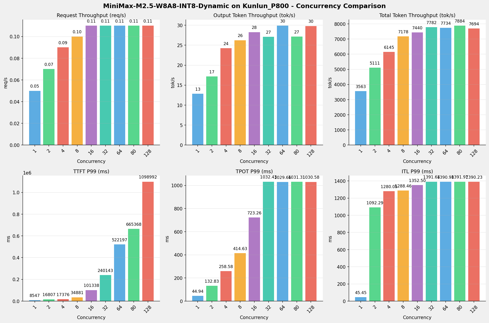
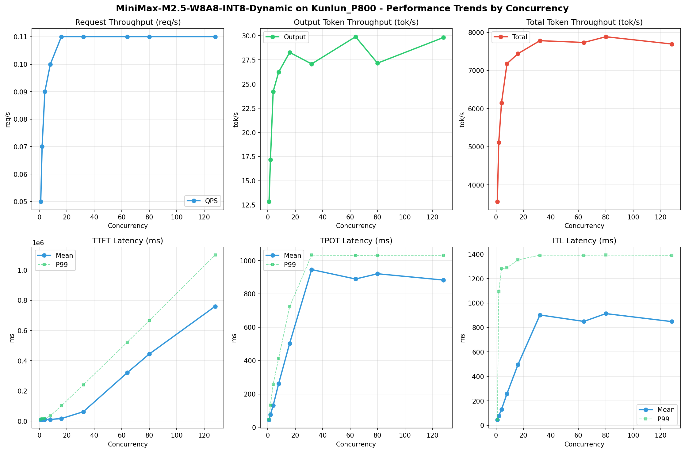

# MiniMax-M2.5-W8A8-INT8-Dynamic模型在Kunlun_P800上的Benchmark基准测试报告

**测试日期：** 2026-05-18

---

## 测试场景
使用vllm bench serve基准测试工具对不同并发数，请求上下文长度下的性能变化趋势。

**主要采集指标**：

| 指标                  | 单位         | 含义                                 |
|---------------------|------------|------------------------------------|
| Request throughput  | req/s      | 请求吞吐量                              |
| Output token throughput | tok/s  | 输出token吞吐量                        |
| Total token throughput | tok/s   | 总token吞吐量                         |
| TTFT                | ms         | Time To First Token，首 token 延迟     |
| TPOT                | ms/token   | Time Per Output Token，每 token 生成时间 |
| ITL                 | ms         | Inter-Token Latency，token间延迟       |

## 🤖 芯片和模型配置信息

| 参数名称                    | Kunlun_P800 |
|------------------------|-------------|
| **model_name** | MiniMax-M2.5-W8A8-INT8-Dynamic |
| **quantization_config** | int-8 |
| **model_size** | 215G |
| **max_position_embeddings** | 196608 |
| **temperature** | 1.0 |
| **top_k** | 40 |
| **top_p** | 0.95 |
| **transformers_version** | 4.46.1 |
| **vllm_version** | 0.11.0 |
| **python_version** | 3.10.15 |

## 🤖 vLLM启动配置信息

| 参数名称                   | Kunlun_P800 |
|------------------------|-------------|
| **Model Name** | MiniMax-M2.5-W8A8-INT8-Dynamic |
| **Max Model Len** | 196608 |
| **Max Num Seqs** | 64 |
| **Max Num Batched Tokens** | 8192 |
| **Gpu Memory Utilization** | 0.95 |
| **Dtype** | auto |
| **Block Size** | 128 |
| **Dp** | 1 |
| **Tp** | 8 |
| **Pp** | 1 |
| **Enable Export Parallel** | False |
| **Enable Auto Tool Choice** | True |
| **Tool Call Parser** | minimax_m2 |
| **Reasoning Parser** | minimax_m2 (不生效) |
| **Compilation Config** | {"splitting_ops":["vllm.unified_attention","vllm.unified_attention_with_output","vllm.unified_attention_with_output_kunlun","vllm.mamba_mixer2","vllm.mamba_mixer","vllm.short_conv","vllm.linear_attention","vllm.plamo2_mamba_mixer","vllm.gdn_attention","vllm.sparse_attn_indexer","vllm.sparse_attn_indexer_vllm_kunlun"]} |

- **Kunlun_P800**: 昆仑芯不启用专家并行避免通信问题

## 📊 测试概览

| 项目            | 配置                                     | 备注  |
|---------------|----------------------------------------|-----|
| **数据集**       | random                                 |     |
| **并发数**       | 1, 2, 4, 8, 16, 32, 64, 80, 128    |     |
| **总请求数**      | 300                                    |     |
| **请求输入上下文长度** | 70000（68k）                             |     |
| **请求输出上下文长度** | 1500（1k）                             |     |
| **模型**        | MiniMax-M2.5-W8A8-INT8-Dynamic                           |     |
| **被测芯片**      | Kunlun_P800 |     |

---

## 📋 测试结果汇总

| 并发数 | 请求吞吐量 (req/s) | 输出Token吞吐量 (tok/s) | 总Token吞吐量 (tok/s) | TTFT P99 (ms) | TPOT P99 (ms) | ITL P99 (ms) |
| ----------- | ----------- | ----------- | ----------- | ----------- | ----------- | ----------- |
| 1 | 0.05 | 12.85 | 3562.56 | 8547.15 | 44.94 | 45.45 |
| 2 | 0.07 | 17.17 | 5111.32 | 16807.41 | 132.83 | 1092.29 |
| 4 | 0.09 | 24.23 | 6145.27 | 17376.23 | 258.58 | 1280.05 |
| 8 | 0.10 | 26.24 | 7178.20 | 34881.49 | 414.63 | 1288.46 |
| 16 | 0.11 | 28.27 | 7440.45 | 101338.13 | 723.26 | 1352.50 |
| 32 | 0.11 | 27.08 | 7781.60 | 240142.59 | 1032.43 | 1391.64 |
| 64 | 0.11 | 29.89 | 7734.08 | 522197.49 | 1029.66 | 1390.98 |
| 80 | 0.11 | 27.16 | 7884.43 | 665367.52 | 1031.31 | 1391.97 |
| 128 | 0.11 | 29.81 | 7694.00 | 1098992.16 | 1030.58 | 1390.23 |

## 📊 各并发级别性能柱状图

## 📈 性能趋势分析

---

### 🎯 服务基准结果详情

| 指标 | 1 并发 | 2 并发 | 4 并发 | 8 并发 | 16 并发 | 32 并发 | 64 并发 | 80 并发 | 128 并发 |
|------|----------- | ----------- | ----------- | ----------- | ----------- | ----------- | ----------- | ----------- | -----------|
| 成功请求数 | 300 | 300 | 300 | 300 | 300 | 300 | 300 | 300 | 300 |
| 失败请求数 | 0 | 0 | 0 | 0 | 0 | 0 | 0 | 0 | 0 |
| 测试持续时间 (s) | 5915.98 | 4122.37 | 3430.79 | 2936.26 | 2833.17 | 2708.10 | 2725.79 | 2672.68 | 2740.01 |
| 总输入 tokens | 21000000 | 21000000 | 21000000 | 21000000 | 21000000 | 21000000 | 21000000 | 21000000 | 21000000 |
| 总生成 tokens | 76002 | 70767 | 83111 | 77040 | 80080 | 73348 | 81480 | 72600 | 81672 |
| **请求吞吐量 (req/s)** | 0.05 | 0.07 | 0.09 | 0.10 | 0.11 | 0.11 | 0.11 | 0.11 | 0.11 |
| **输出 token 吞吐量 (tok/s)** | 12.85 | 17.17 | 24.23 | 26.24 | 28.27 | 27.08 | 29.89 | 27.16 | 29.81 |
| 峰值输出 token 吞吐量 (tok/s) | 24.00 | 45.00 | 88.00 | 153.00 | 208.00 | 276.00 | 270.00 | 285.00 | 275.00 |
| 峰值并发请求数 | 2.00 | 4.00 | 6.00 | 11.00 | 19.00 | 35.00 | 66.00 | 82.00 | 130.00 |
| **总 token 吞吐量 (tok/s)** | 3562.56 | 5111.32 | 6145.27 | 7178.20 | 7440.45 | 7781.60 | 7734.08 | 7884.43 | 7694.00 |

### ⏱️ 首Token延迟 (TTFT)

| 指标 | 1 并发 | 2 并发 | 4 并发 | 8 并发 | 16 并发 | 32 并发 | 64 并发 | 80 并发 | 128 并发 |
|------|----------- | ----------- | ----------- | ----------- | ----------- | ----------- | ----------- | ----------- | -----------|
| 平均 TTFT (ms) | 8474.27 | 9271.26 | 9923.20 | 11542.77 | 17108.27 | 62320.24 | 320609.23 | 443911.77 | 759631.00 |
| 中位 TTFT (ms) | 8501.64 | 8772.34 | 8784.87 | 8995.56 | 12055.83 | 53015.68 | 327759.99 | 475632.68 | 896693.21 |
| P95 TTFT (ms) | 8530.50 | 16022.33 | 16971.42 | 17775.85 | 38206.23 | 145876.41 | 433455.28 | 566062.15 | 989498.75 |
| P99 TTFT (ms) | 8547.15 | 16807.41 | 17376.23 | 34881.49 | 101338.13 | 240142.59 | 522197.49 | 665367.52 | 1098992.16 |

### ⚡ 每Token生成时间 (TPOT)

| 指标 | 1 并发 | 2 并发 | 4 并发 | 8 并发 | 16 并发 | 32 并发 | 64 并发 | 80 并发 | 128 并发 |
|------|----------- | ----------- | ----------- | ----------- | ----------- | ----------- | ----------- | ----------- | -----------|
| 平均 TPOT (ms) | 44.54 | 76.80 | 130.72 | 262.14 | 502.99 | 945.63 | 889.00 | 920.47 | 882.77 |
| 中位 TPOT (ms) | 44.52 | 79.53 | 128.53 | 263.27 | 499.25 | 1008.39 | 934.80 | 987.34 | 943.55 |
| P95 TPOT (ms) | 44.67 | 114.76 | 207.37 | 366.80 | 665.78 | 1026.47 | 1025.68 | 1028.62 | 1024.76 |
| P99 TPOT (ms) | 44.94 | 132.83 | 258.58 | 414.63 | 723.26 | 1032.43 | 1029.66 | 1031.31 | 1030.58 |

### 🔄 Token间延迟 (ITL)

| 指标 | 1 并发 | 2 并发 | 4 并发 | 8 并发 | 16 并发 | 32 并发 | 64 并发 | 80 并发 | 128 并发 |
|------|----------- | ----------- | ----------- | ----------- | ----------- | ----------- | ----------- | ----------- | -----------|
| 平均 ITL (ms) | 44.56 | 77.33 | 129.57 | 258.96 | 496.31 | 902.33 | 849.56 | 913.47 | 848.19 |
| 中位 ITL (ms) | 44.53 | 45.80 | 47.48 | 53.37 | 84.38 | 968.70 | 941.92 | 973.29 | 940.54 |
| P95 ITL (ms) | 44.87 | 48.51 | 896.69 | 1179.52 | 1287.25 | 1350.08 | 1349.00 | 1351.45 | 1349.28 |
| P99 ITL (ms) | 45.45 | 1092.29 | 1280.05 | 1288.46 | 1352.50 | 1391.64 | 1390.98 | 1391.97 | 1390.23 |

---

## 📝 分析总结

### 1. 吞吐量性能分析

**请求吞吐量 (QPS)**: 随着并发级别增加，QPS持续上升。
低并发(1,2,4)平均 QPS: 0.07 req/s；
中并发(8,16,32)平均 QPS: 0.11 req/s；
高并发(64,80,128)平均 QPS: 0.11 req/s；
最高 QPS 出现在 16 并发，达到 0.11 req/s。

**Token总吞吐量**: 最高达到 7884 tok/s (80 并发)。

### 2. 首Token延迟 (TTFT) 分析

TTFT随并发增加显著上升。
低并发平均 P99 TTFT: 14244ms；
高并发平均 P99 TTFT: 762186ms；
最高 P99 TTFT 出现在 128 并发，达到 1098992ms。

### 3. Token生成时间 (TPOT) 分析

TPOT随并发增加也呈上升趋势。
低并发平均 P99 TPOT: 145.45ms；
高并发平均 P99 TPOT: 1030.52ms；
最高 P99 TPOT 出现在 32 并发，达到 1032.43ms。

### 4. Token间延迟 (ITL) 分析

ITL随并发增加呈上升趋势。
低并发平均 P99 ITL: 805.93ms；
高并发平均 P99 ITL: 1391.06ms；
最高 P99 ITL 出现在 80 并发，达到 1391.97ms。

### 5. 综合评估

**吞吐量增长**: 从最低并发到最高并发，QPS增长了 120.0%。
**TTFT延迟恶化**: 高并发相比低并发，TTFT P99增加了 7615.7%。
**TPOT延迟恶化**: 高并发相比低并发，TPOT P99增加了 609.8%。

---

*报告生成时间: 2026-05-18*

