# MiniMax-M2.5-W8A8-INT8-Dynamic模型在Kunlun_P800上的多I/O测试报告

**测试日期：** 2026-05-18

---

## 测试场景
测试不同输入输出长度和并发级别下的性能表现，分析同一芯片同一模型在不同输入输出长度和并发级别下的性能指标变化趋势。

**主要采集指标**：

| 指标                  | 单位         | 含义                                 |
|---------------------|------------|------------------------------------|
| Request throughput  | req/s      | 请求吞吐量                              |
| Output token throughput | tok/s  | 输出token吞吐量                        |
| Total token throughput | tok/s   | 总token吞吐量                         |
| TTFT                | ms         | Time To First Token，首 token 延迟     |
| TPOT                | ms/token   | Time Per Output Token，每 token 生成时间 |
| ITL                 | ms         | Inter-Token Latency，token间延迟       |

## 🤖 芯片和模型配置信息

| 参数名称                    | Kunlun_P800 |
|------------------------|-------------|
| **model_name** | MiniMax-M2.5-W8A8-INT8-Dynamic |
| **quantization_config** | int-8 |
| **model_size** | 215G |
| **max_position_embeddings** | 196608 |
| **temperature** | 1.0 |
| **top_k** | 40 |
| **top_p** | 0.95 |
| **transformers_version** | 4.46.1 |
| **vllm_version** | 0.11.0 |
| **python_version** | 3.10.15 |

## 🤖 vLLM启动配置信息

| 参数名称                   | Kunlun_P800 |
|------------------------|-------------|
| **Model Name** | MiniMax-M2.5-W8A8-INT8-Dynamic |
| **Max Model Len** | 196608 |
| **Max Num Seqs** | 64 |
| **Max Num Batched Tokens** | 8192 |
| **Gpu Memory Utilization** | 0.95 |
| **Dtype** | auto |
| **Block Size** | 128 |
| **Dp** | 1 |
| **Tp** | 8 |
| **Pp** | 1 |
| **Enable Export Parallel** | False |
| **Enable Auto Tool Choice** | True |
| **Tool Call Parser** | minimax_m2 |
| **Reasoning Parser** | minimax_m2 (不生效) |
| **Compilation Config** | {"splitting_ops":["vllm.unified_attention","vllm.unified_attention_with_output","vllm.unified_attention_with_output_kunlun","vllm.mamba_mixer2","vllm.mamba_mixer","vllm.short_conv","vllm.linear_attention","vllm.plamo2_mamba_mixer","vllm.gdn_attention","vllm.sparse_attn_indexer","vllm.sparse_attn_indexer_vllm_kunlun"]} |

- **Kunlun_P800**: 昆仑芯不启用专家并行避免通信问题

## 📊 测试概览

| 项目            | 配置                                     | 备注  |
|---------------|----------------------------------------|-----|
| **数据集**       | random                                 |     |
| **并发数**       | 1, 4, 8, 16, 32, 64, 128    |     |
| **总请求数**      | 1000                                    |     |
| **输入输出长度** | (128, 128), (512, 256), (1024, 512), (2048, 1024), (4096, 2048), (8192, 1024) |     |
| **模型**        | MiniMax-M2.5-W8A8-INT8-Dynamic                           |     |
| **被测芯片**      | Kunlun_P800 |     |

---

## 📋 各I/O测试汇总（固定上下文长度，随并发变化）

### input: 128, output: 128

| 并发数 | 请求吞吐量 (req/s) | 输出Token吞吐量 (tok/s) | 总Token吞吐量 (tok/s) | TTFT P99 (ms) | TPOT P99 (ms) | ITL P99 (ms) |
| --------------- | --------------- | --------------- | --------------- | --------------- | --------------- | --------------- |
| 1 | 0.37 | 47.82 | 95.63 | 184.99 | 19.78 | 20.48 |
| 4 | 1.27 | 162.42 | 324.95 | 323.88 | 23.21 | 25.54 |
| 8 | 2.02 | 259.06 | 518.09 | 379.57 | 28.95 | 30.85 |
| 16 | 3.42 | 437.59 | 875.22 | 584.02 | 36.33 | 121.22 |
| 32 | 5.65 | 722.72 | 1445.33 | 1006.26 | 42.34 | 126.23 |
| 64 | 8.75 | 1119.62 | 2239.07 | 1888.41 | 50.65 | 128.44 |
| 128 | 9.94 | 1272.83 | 2545.47 | 9704.00 | 48.43 | 139.48 |

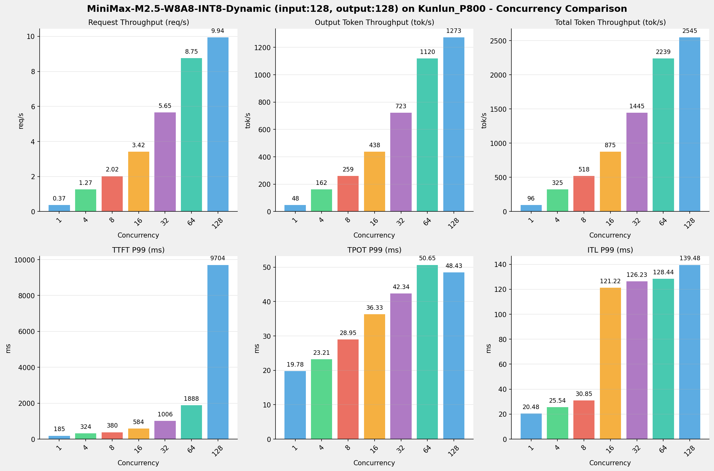

---

### input: 512, output: 256

| 并发数 | 请求吞吐量 (req/s) | 输出Token吞吐量 (tok/s) | 总Token吞吐量 (tok/s) | TTFT P99 (ms) | TPOT P99 (ms) | ITL P99 (ms) |
| --------------- | --------------- | --------------- | --------------- | --------------- | --------------- | --------------- |
| 1 | 0.19 | 48.82 | 147.45 | 191.87 | 19.92 | 20.42 |
| 4 | 0.65 | 164.75 | 496.80 | 228.68 | 24.09 | 79.23 |
| 8 | 1.01 | 256.36 | 772.95 | 488.42 | 31.41 | 122.22 |
| 16 | 1.69 | 429.77 | 1297.33 | 784.91 | 38.33 | 122.71 |
| 32 | 2.86 | 726.68 | 2192.55 | 1527.13 | 44.79 | 130.47 |
| 64 | 4.43 | 1124.09 | 3389.25 | 2807.47 | 56.55 | 147.93 |
| 128 | 4.47 | 1131.92 | 3419.10 | 17130.20 | 58.80 | 139.94 |

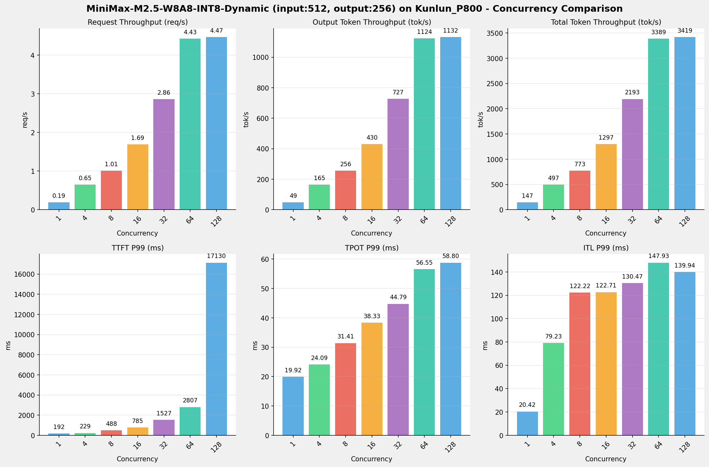

---

### input: 1024, output: 512

| 并发数 | 请求吞吐量 (req/s) | 输出Token吞吐量 (tok/s) | 总Token吞吐量 (tok/s) | TTFT P99 (ms) | TPOT P99 (ms) | ITL P99 (ms) |
| --------------- | --------------- | --------------- | --------------- | --------------- | --------------- | --------------- |
| 1 | 0.12 | 48.80 | 170.80 | 200.73 | 20.13 | 20.77 |
| 4 | 0.41 | 165.80 | 585.79 | 286.29 | 24.11 | 56.47 |
| 8 | 0.64 | 259.93 | 915.98 | 304.54 | 31.08 | 121.96 |
| 16 | 1.07 | 433.34 | 1528.33 | 929.12 | 37.39 | 123.72 |
| 32 | 1.72 | 711.67 | 2474.31 | 1790.60 | 45.28 | 127.48 |
| 64 | 2.72 | 1098.57 | 3877.92 | 3433.76 | 58.28 | 133.87 |
| 128 | 2.65 | 1087.30 | 3802.21 | 31783.31 | 59.77 | 130.03 |

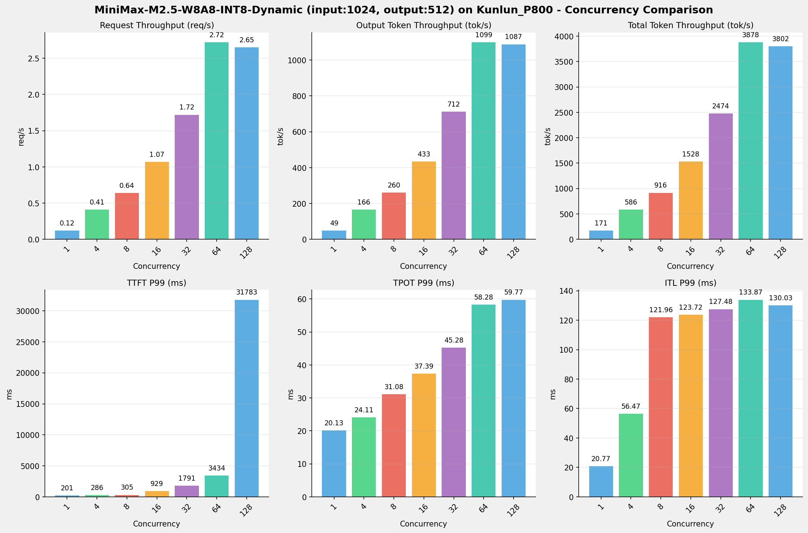

---

### input: 2048, output: 1024

| 并发数 | 请求吞吐量 (req/s) | 输出Token吞吐量 (tok/s) | 总Token吞吐量 (tok/s) | TTFT P99 (ms) | TPOT P99 (ms) | ITL P99 (ms) |
| --------------- | --------------- | --------------- | --------------- | --------------- | --------------- | --------------- |
| 1 | 0.10 | 47.79 | 257.41 | 273.32 | 20.56 | 21.06 |
| 4 | 0.34 | 162.02 | 865.05 | 418.58 | 25.26 | 54.91 |
| 8 | 0.55 | 252.90 | 1386.84 | 434.00 | 32.96 | 124.17 |
| 16 | 0.89 | 415.84 | 2233.97 | 1013.51 | 40.49 | 189.61 |
| 32 | 1.40 | 657.56 | 3525.41 | 2400.05 | 51.93 | 194.35 |
| 64 | 2.06 | 959.29 | 5178.85 | 5180.56 | 71.24 | 205.61 |
| 128 | 2.04 | 960.51 | 5145.30 | 38140.98 | 70.65 | 197.58 |

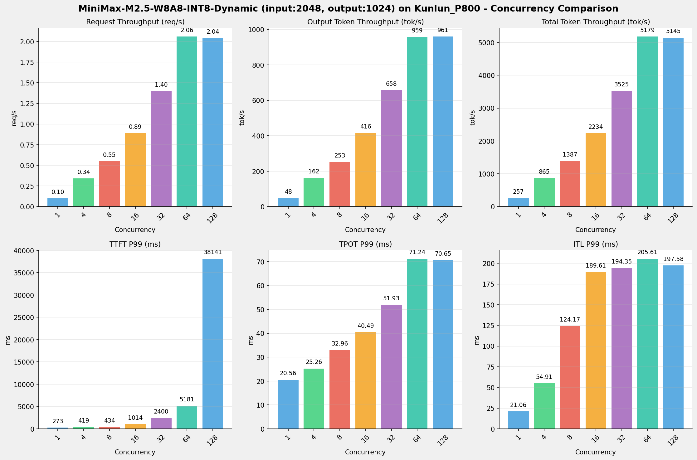

---

### input: 4096, output: 2048

| 并发数 | 请求吞吐量 (req/s) | 输出Token吞吐量 (tok/s) | 总Token吞吐量 (tok/s) | TTFT P99 (ms) | TPOT P99 (ms) | ITL P99 (ms) |
| --------------- | --------------- | --------------- | --------------- | --------------- | --------------- | --------------- |
| 1 | 0.09 | 45.44 | 415.54 | 426.06 | 21.45 | 21.96 |
| 4 | 0.31 | 148.88 | 1413.98 | 705.23 | 27.88 | 56.44 |
| 8 | 0.46 | 224.93 | 2106.90 | 732.07 | 37.12 | 322.83 |
| 16 | 0.71 | 351.86 | 3270.47 | 2192.59 | 48.74 | 326.38 |
| 32 | 1.01 | 509.39 | 4639.40 | 6976.90 | 69.12 | 332.54 |
| 64 | 1.33 | 680.61 | 6121.15 | 16670.25 | 107.32 | 577.19 |
| 128 | 1.33 | 683.20 | 6146.78 | 64386.11 | 101.57 | 341.79 |

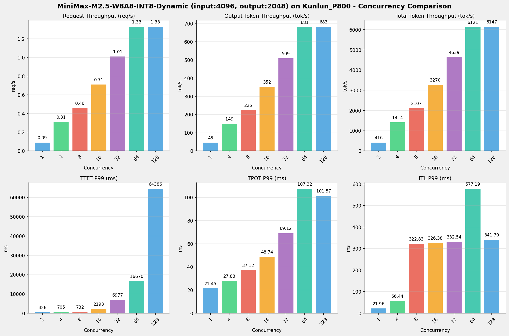

---

### input: 8192, output: 1024

| 并发数 | 请求吞吐量 (req/s) | 输出Token吞吐量 (tok/s) | 总Token吞吐量 (tok/s) | TTFT P99 (ms) | TPOT P99 (ms) | ITL P99 (ms) |
| --------------- | --------------- | --------------- | --------------- | --------------- | --------------- | --------------- |
| 1 | 0.10 | 41.23 | 826.58 | 739.49 | 22.74 | 23.28 |
| 4 | 0.30 | 128.01 | 2567.54 | 1308.30 | 33.38 | 57.84 |
| 8 | 0.44 | 187.92 | 3772.55 | 1482.68 | 47.13 | 588.96 |
| 16 | 0.63 | 263.08 | 5457.67 | 4050.05 | 68.13 | 596.39 |
| 32 | 0.83 | 352.07 | 7133.48 | 13748.61 | 102.33 | 602.78 |
| 64 | 0.97 | 418.85 | 8369.48 | 33683.94 | 182.13 | 619.65 |
| 128 | 0.98 | 411.01 | 8408.86 | 102674.50 | 182.47 | 613.45 |

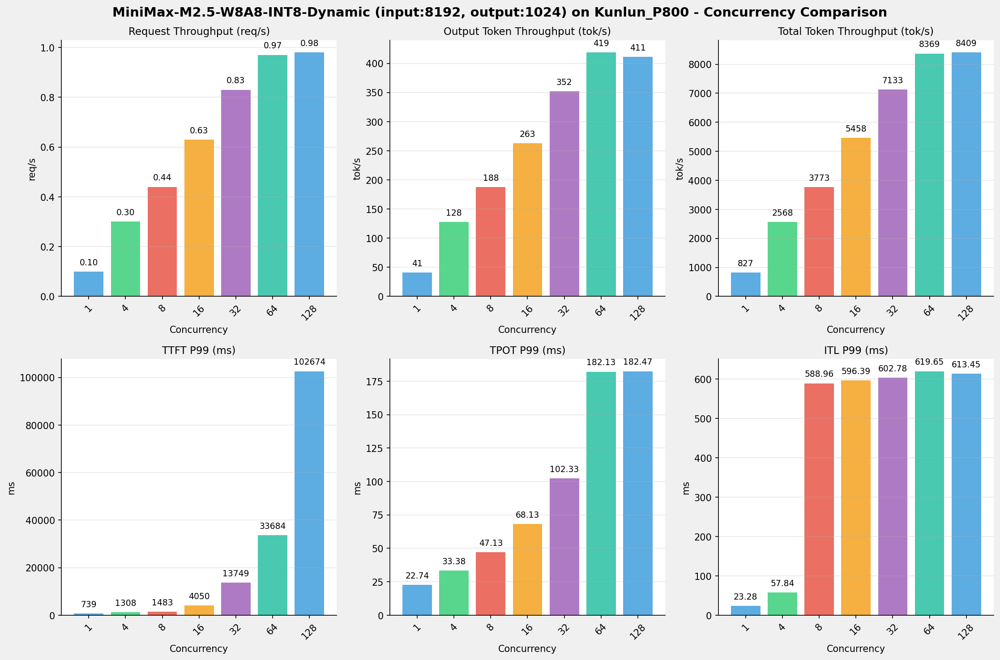

---

## 📊 I/O对比（固定并发数，随上下文长度变化）

### 并发数 = 1

| 指标 | i128_o128 | i512_o256 | i1024_o512 | i2048_o1024 | i4096_o2048 | i8192_o1024 |
| --- | --- | --- | --- | --- | --- | --- |
| 请求吞吐量 (req/s) | 0.37 | 0.19 | 0.12 | 0.10 | 0.09 | 0.10 |
| 输出Token吞吐量 (tok/s) | 47.82 | 48.82 | 48.80 | 47.79 | 45.44 | 41.23 |
| 总Token吞吐量 (tok/s) | 95.63 | 147.45 | 170.80 | 257.41 | 415.54 | 826.58 |
| TTFT P99 (ms) | 184.99 | 191.87 | 200.73 | 273.32 | 426.06 | 739.49 |
| TPOT P99 (ms) | 19.78 | 19.92 | 20.13 | 20.56 | 21.45 | 22.74 |
| ITL P99 (ms) | 20.48 | 20.42 | 20.77 | 21.06 | 21.96 | 23.28 |

---

### 并发数 = 4

| 指标 | i128_o128 | i512_o256 | i1024_o512 | i2048_o1024 | i4096_o2048 | i8192_o1024 |
| --- | --- | --- | --- | --- | --- | --- |
| 请求吞吐量 (req/s) | 1.27 | 0.65 | 0.41 | 0.34 | 0.31 | 0.30 |
| 输出Token吞吐量 (tok/s) | 162.42 | 164.75 | 165.80 | 162.02 | 148.88 | 128.01 |
| 总Token吞吐量 (tok/s) | 324.95 | 496.80 | 585.79 | 865.05 | 1413.98 | 2567.54 |
| TTFT P99 (ms) | 323.88 | 228.68 | 286.29 | 418.58 | 705.23 | 1308.30 |
| TPOT P99 (ms) | 23.21 | 24.09 | 24.11 | 25.26 | 27.88 | 33.38 |
| ITL P99 (ms) | 25.54 | 79.23 | 56.47 | 54.91 | 56.44 | 57.84 |

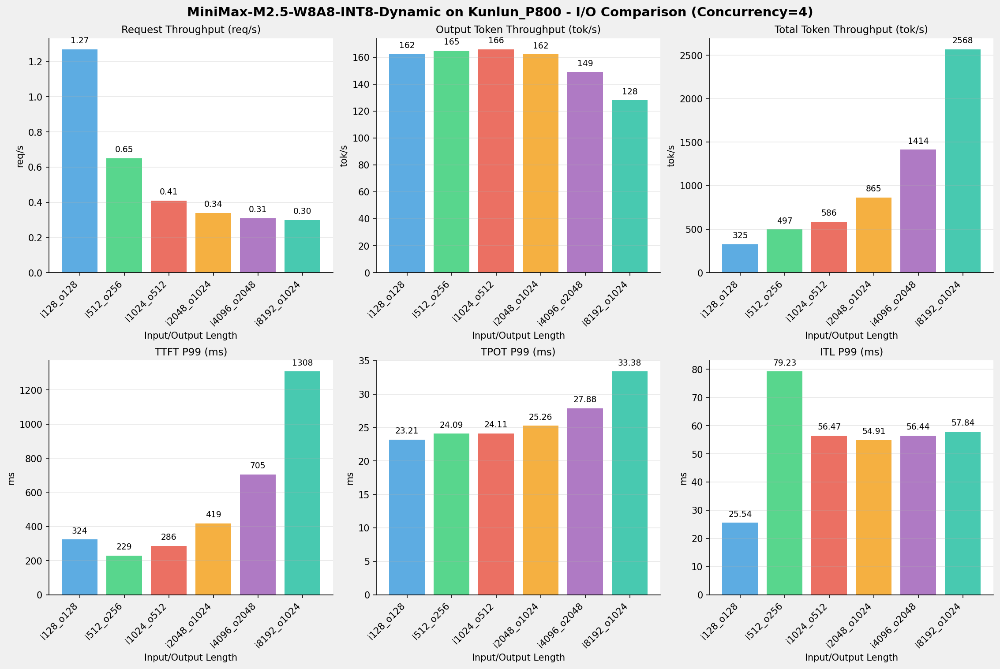

---

### 并发数 = 8

| 指标 | i128_o128 | i512_o256 | i1024_o512 | i2048_o1024 | i4096_o2048 | i8192_o1024 |
| --- | --- | --- | --- | --- | --- | --- |
| 请求吞吐量 (req/s) | 2.02 | 1.01 | 0.64 | 0.55 | 0.46 | 0.44 |
| 输出Token吞吐量 (tok/s) | 259.06 | 256.36 | 259.93 | 252.90 | 224.93 | 187.92 |
| 总Token吞吐量 (tok/s) | 518.09 | 772.95 | 915.98 | 1386.84 | 2106.90 | 3772.55 |
| TTFT P99 (ms) | 379.57 | 488.42 | 304.54 | 434.00 | 732.07 | 1482.68 |
| TPOT P99 (ms) | 28.95 | 31.41 | 31.08 | 32.96 | 37.12 | 47.13 |
| ITL P99 (ms) | 30.85 | 122.22 | 121.96 | 124.17 | 322.83 | 588.96 |

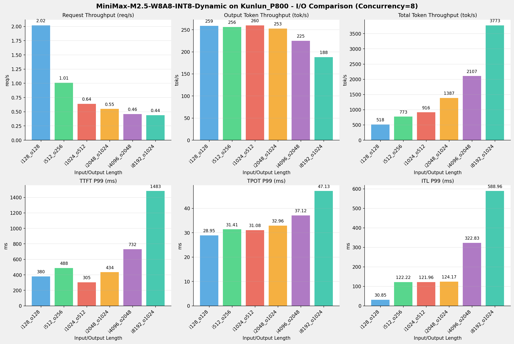

---

### 并发数 = 16

| 指标 | i128_o128 | i512_o256 | i1024_o512 | i2048_o1024 | i4096_o2048 | i8192_o1024 |
| --- | --- | --- | --- | --- | --- | --- |
| 请求吞吐量 (req/s) | 3.42 | 1.69 | 1.07 | 0.89 | 0.71 | 0.63 |
| 输出Token吞吐量 (tok/s) | 437.59 | 429.77 | 433.34 | 415.84 | 351.86 | 263.08 |
| 总Token吞吐量 (tok/s) | 875.22 | 1297.33 | 1528.33 | 2233.97 | 3270.47 | 5457.67 |
| TTFT P99 (ms) | 584.02 | 784.91 | 929.12 | 1013.51 | 2192.59 | 4050.05 |
| TPOT P99 (ms) | 36.33 | 38.33 | 37.39 | 40.49 | 48.74 | 68.13 |
| ITL P99 (ms) | 121.22 | 122.71 | 123.72 | 189.61 | 326.38 | 596.39 |

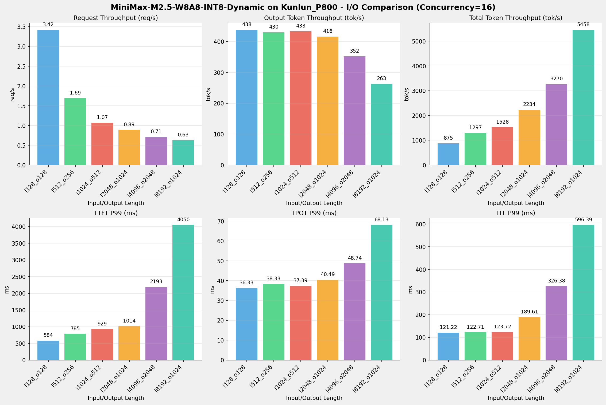

---

### 并发数 = 32

| 指标 | i128_o128 | i512_o256 | i1024_o512 | i2048_o1024 | i4096_o2048 | i8192_o1024 |
| --- | --- | --- | --- | --- | --- | --- |
| 请求吞吐量 (req/s) | 5.65 | 2.86 | 1.72 | 1.40 | 1.01 | 0.83 |
| 输出Token吞吐量 (tok/s) | 722.72 | 726.68 | 711.67 | 657.56 | 509.39 | 352.07 |
| 总Token吞吐量 (tok/s) | 1445.33 | 2192.55 | 2474.31 | 3525.41 | 4639.40 | 7133.48 |
| TTFT P99 (ms) | 1006.26 | 1527.13 | 1790.60 | 2400.05 | 6976.90 | 13748.61 |
| TPOT P99 (ms) | 42.34 | 44.79 | 45.28 | 51.93 | 69.12 | 102.33 |
| ITL P99 (ms) | 126.23 | 130.47 | 127.48 | 194.35 | 332.54 | 602.78 |

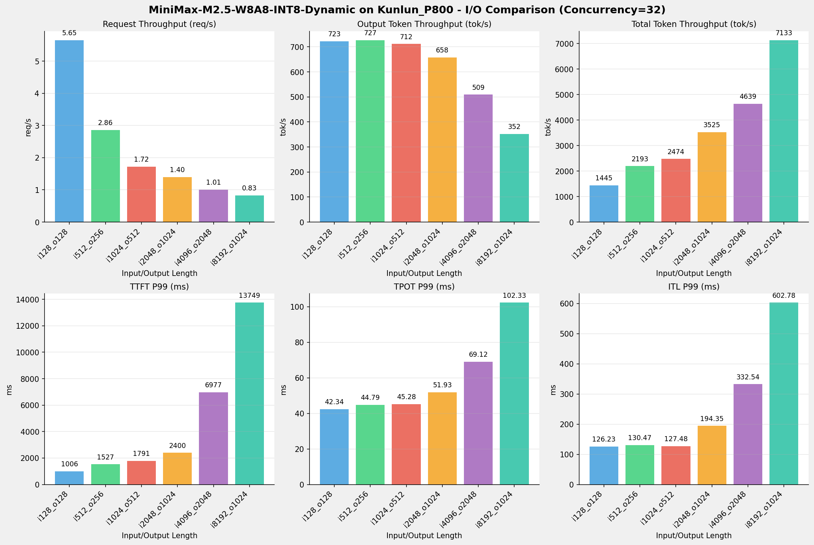

---

### 并发数 = 64

| 指标 | i128_o128 | i512_o256 | i1024_o512 | i2048_o1024 | i4096_o2048 | i8192_o1024 |
| --- | --- | --- | --- | --- | --- | --- |
| 请求吞吐量 (req/s) | 8.75 | 4.43 | 2.72 | 2.06 | 1.33 | 0.97 |
| 输出Token吞吐量 (tok/s) | 1119.62 | 1124.09 | 1098.57 | 959.29 | 680.61 | 418.85 |
| 总Token吞吐量 (tok/s) | 2239.07 | 3389.25 | 3877.92 | 5178.85 | 6121.15 | 8369.48 |
| TTFT P99 (ms) | 1888.41 | 2807.47 | 3433.76 | 5180.56 | 16670.25 | 33683.94 |
| TPOT P99 (ms) | 50.65 | 56.55 | 58.28 | 71.24 | 107.32 | 182.13 |
| ITL P99 (ms) | 128.44 | 147.93 | 133.87 | 205.61 | 577.19 | 619.65 |

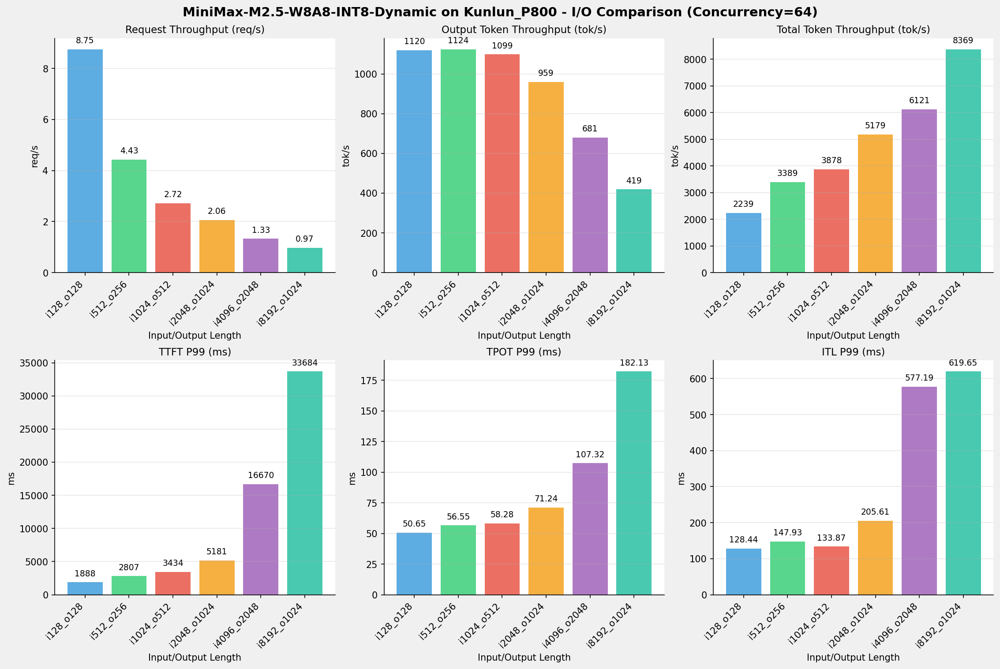

---

### 并发数 = 128

| 指标 | i128_o128 | i512_o256 | i1024_o512 | i2048_o1024 | i4096_o2048 | i8192_o1024 |
| --- | --- | --- | --- | --- | --- | --- |
| 请求吞吐量 (req/s) | 9.94 | 4.47 | 2.65 | 2.04 | 1.33 | 0.98 |
| 输出Token吞吐量 (tok/s) | 1272.83 | 1131.92 | 1087.30 | 960.51 | 683.20 | 411.01 |
| 总Token吞吐量 (tok/s) | 2545.47 | 3419.10 | 3802.21 | 5145.30 | 6146.78 | 8408.86 |
| TTFT P99 (ms) | 9704.00 | 17130.20 | 31783.31 | 38140.98 | 64386.11 | 102674.50 |
| TPOT P99 (ms) | 48.43 | 58.80 | 59.77 | 70.65 | 101.57 | 182.47 |
| ITL P99 (ms) | 139.48 | 139.94 | 130.03 | 197.58 | 341.79 | 613.45 |

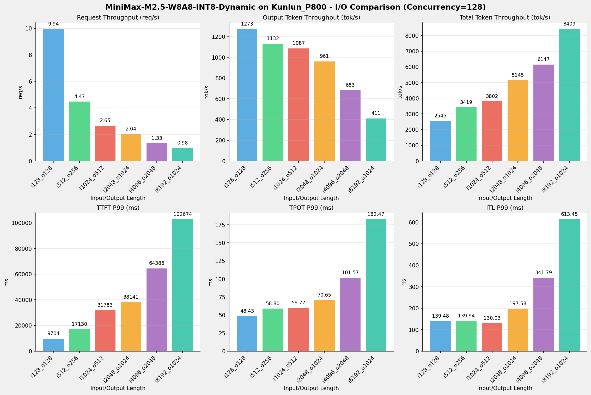

---

## 📝 详细性能数据

### input: 128, output: 128

#### 服务基准结果

| 指标 | 1 并发 | 4 并发 | 8 并发 | 16 并发 | 32 并发 | 64 并发 | 128 并发 |
| ----------- | ----------- | ----------- | ----------- | ----------- | ----------- | ----------- | ----------- |
| 成功请求数 | 1000 | 1000 | 1000 | 1000 | 1000 | 1000 | 1000 |
| 失败请求数 | 0 | 0 | 0 | 0 | 0 | 0 | 0 |
| 测试持续时间 (s) | 2676.72 | 787.46 | 494.09 | 292.44 | 177.11 | 114.32 | 100.56 |
| 总输入 tokens | 127981 | 127981 | 127981 | 127981 | 127981 | 127981 | 127981 |
| 总生成 tokens | 128000 | 127901 | 128000 | 127968 | 128000 | 128000 | 128000 |
| **请求吞吐量 (req/s)** | 0.37 | 1.27 | 2.02 | 3.42 | 5.65 | 8.75 | 9.94 |
| **输出 token 吞吐量 (tok/s)** | 47.82 | 162.42 | 259.06 | 437.59 | 722.72 | 1119.62 | 1272.83 |
| 峰值输出 token 吞吐量 (tok/s) | 52.00 | 183.00 | 295.00 | 524.00 | 927.00 | 1568.00 | 1600.00 |
| 峰值并发请求数 | 2.00 | 8.00 | 16.00 | 32.00 | 64.00 | 128.00 | 192.00 |
| **总 token 吞吐量 (tok/s)** | 95.63 | 324.95 | 518.09 | 875.22 | 1445.33 | 2239.07 | 2545.47 |

#### TTFT

| 指标 | 1 并发 | 4 并发 | 8 并发 | 16 并发 | 32 并发 | 64 并发 | 128 并发 |
|----------- | ----------- | ----------- | ----------- | ----------- | ----------- | ----------- | -----------|
| 平均 TTFT (ms) | 177.88 | 260.62 | 341.57 | 294.19 | 539.44 | 1284.38 | 6613.13 |
| 中位 TTFT (ms) | 178.41 | 302.97 | 370.19 | 268.29 | 547.68 | 1410.86 | 6804.89 |
| P95 TTFT (ms) | 180.85 | 309.24 | 376.94 | 521.64 | 994.08 | 1795.11 | 9204.05 |
| P99 TTFT (ms) | 184.99 | 323.88 | 379.57 | 584.02 | 1006.26 | 1888.41 | 9704.00 |

#### TPOT

| 指标 | 1 并发 | 4 并发 | 8 并发 | 16 并发 | 32 并发 | 64 并发 | 128 并发 |
|----------- | ----------- | ----------- | ----------- | ----------- | ----------- | ----------- | -----------|
| 平均 TPOT (ms) | 19.67 | 22.74 | 28.42 | 34.39 | 39.90 | 46.08 | 44.62 |
| 中位 TPOT (ms) | 19.67 | 22.66 | 28.37 | 34.79 | 39.96 | 46.08 | 44.94 |
| P95 TPOT (ms) | 19.72 | 23.17 | 28.87 | 35.71 | 41.89 | 50.20 | 47.37 |
| P99 TPOT (ms) | 19.78 | 23.21 | 28.95 | 36.33 | 42.34 | 50.65 | 48.43 |

#### ITL

| 指标 | 1 并发 | 4 并发 | 8 并发 | 16 并发 | 32 并发 | 64 并发 | 128 并发 |
|----------- | ----------- | ----------- | ----------- | ----------- | ----------- | ----------- | -----------|
| 平均 ITL (ms) | 19.52 | 22.57 | 28.20 | 34.72 | 40.89 | 47.28 | 47.57 |
| 中位 ITL (ms) | 19.65 | 22.39 | 28.20 | 32.20 | 36.87 | 43.89 | 43.87 |
| P95 ITL (ms) | 19.81 | 22.64 | 28.47 | 55.08 | 74.92 | 59.35 | 44.77 |
| P99 ITL (ms) | 20.48 | 25.54 | 30.85 | 121.22 | 126.23 | 128.44 | 139.48 |

---

### input: 512, output: 256

#### 服务基准结果

| 指标 | 1 并发 | 4 并发 | 8 并发 | 16 并发 | 32 并发 | 64 并发 | 128 并发 |
| ----------- | ----------- | ----------- | ----------- | ----------- | ----------- | ----------- | ----------- |
| 成功请求数 | 1000 | 1000 | 1000 | 1000 | 1000 | 1000 | 1000 |
| 失败请求数 | 0 | 0 | 0 | 0 | 0 | 0 | 0 |
| 测试持续时间 (s) | 5190.01 | 1541.56 | 990.85 | 590.01 | 349.19 | 225.97 | 223.80 |
| 总输入 tokens | 511867 | 511867 | 511867 | 511867 | 511867 | 511867 | 511867 |
| 总生成 tokens | 253377 | 253974 | 254016 | 253573 | 253748 | 254014 | 253321 |
| **请求吞吐量 (req/s)** | 0.19 | 0.65 | 1.01 | 1.69 | 2.86 | 4.43 | 4.47 |
| **输出 token 吞吐量 (tok/s)** | 48.82 | 164.75 | 256.36 | 429.77 | 726.68 | 1124.09 | 1131.92 |
| 峰值输出 token 吞吐量 (tok/s) | 52.00 | 181.00 | 291.00 | 512.00 | 896.00 | 1483.00 | 1508.00 |
| 峰值并发请求数 | 2.00 | 7.00 | 16.00 | 30.00 | 62.00 | 116.00 | 164.00 |
| **总 token 吞吐量 (tok/s)** | 147.45 | 496.80 | 772.95 | 1297.33 | 2192.55 | 3389.25 | 3419.10 |

#### TTFT

| 指标 | 1 并发 | 4 并发 | 8 并发 | 16 并发 | 32 并发 | 64 并发 | 128 并发 |
|----------- | ----------- | ----------- | ----------- | ----------- | ----------- | ----------- | -----------|
| 平均 TTFT (ms) | 182.34 | 188.47 | 212.44 | 263.57 | 378.90 | 793.11 | 13743.45 |
| 中位 TTFT (ms) | 184.41 | 188.04 | 206.09 | 218.00 | 268.99 | 341.31 | 14500.80 |
| P95 TTFT (ms) | 188.81 | 225.36 | 323.90 | 550.04 | 1128.92 | 2225.45 | 16236.65 |
| P99 TTFT (ms) | 191.87 | 228.68 | 488.42 | 784.91 | 1527.13 | 2807.47 | 17130.20 |

#### TPOT

| 指标 | 1 并发 | 4 并发 | 8 并发 | 16 并发 | 32 并发 | 64 并发 | 128 并发 |
|----------- | ----------- | ----------- | ----------- | ----------- | ----------- | ----------- | -----------|
| 平均 TPOT (ms) | 19.84 | 23.60 | 30.41 | 36.13 | 42.23 | 52.78 | 53.77 |
| 中位 TPOT (ms) | 19.84 | 23.76 | 30.91 | 36.42 | 43.07 | 53.91 | 55.15 |
| P95 TPOT (ms) | 19.88 | 23.86 | 31.09 | 38.08 | 44.48 | 56.16 | 58.00 |
| P99 TPOT (ms) | 19.92 | 24.09 | 31.41 | 38.33 | 44.79 | 56.55 | 58.80 |

#### ITL

| 指标 | 1 并发 | 4 并发 | 8 并发 | 16 并发 | 32 并发 | 64 并发 | 128 并发 |
|----------- | ----------- | ----------- | ----------- | ----------- | ----------- | ----------- | -----------|
| 平均 ITL (ms) | 19.78 | 23.79 | 30.90 | 36.14 | 42.85 | 53.53 | 53.60 |
| 中位 ITL (ms) | 19.82 | 22.61 | 28.44 | 32.65 | 37.39 | 44.78 | 44.61 |
| P95 ITL (ms) | 19.99 | 22.98 | 31.95 | 56.60 | 124.39 | 127.90 | 125.83 |
| P99 ITL (ms) | 20.42 | 79.23 | 122.22 | 122.71 | 130.47 | 147.93 | 139.94 |

---

### input: 1024, output: 512

#### 服务基准结果

| 指标 | 1 并发 | 4 并发 | 8 并发 | 16 并发 | 32 并发 | 64 并发 | 128 并发 |
| ----------- | ----------- | ----------- | ----------- | ----------- | ----------- | ----------- | ----------- |
| 成功请求数 | 1000 | 1000 | 1000 | 1000 | 1000 | 1000 | 1000 |
| 失败请求数 | 0 | 0 | 0 | 0 | 0 | 0 | 0 |
| 测试持续时间 (s) | 8388.98 | 2436.89 | 1560.03 | 934.69 | 580.65 | 368.24 | 376.98 |
| 总输入 tokens | 1023468 | 1023468 | 1023468 | 1023468 | 1023468 | 1023468 | 1023468 |
| 总生成 tokens | 409391 | 404037 | 405494 | 405040 | 413227 | 404538 | 409890 |
| **请求吞吐量 (req/s)** | 0.12 | 0.41 | 0.64 | 1.07 | 1.72 | 2.72 | 2.65 |
| **输出 token 吞吐量 (tok/s)** | 48.80 | 165.80 | 259.93 | 433.34 | 711.67 | 1098.57 | 1087.30 |
| 峰值输出 token 吞吐量 (tok/s) | 52.00 | 180.00 | 288.00 | 513.00 | 896.00 | 1472.00 | 1472.00 |
| 峰值并发请求数 | 2.00 | 7.00 | 12.00 | 21.00 | 41.00 | 80.00 | 143.00 |
| **总 token 吞吐量 (tok/s)** | 170.80 | 585.79 | 915.98 | 1528.33 | 2474.31 | 3877.92 | 3802.21 |

#### TTFT

| 指标 | 1 并发 | 4 并发 | 8 并发 | 16 并发 | 32 并发 | 64 并发 | 128 并发 |
|----------- | ----------- | ----------- | ----------- | ----------- | ----------- | ----------- | -----------|
| 平均 TTFT (ms) | 189.88 | 213.65 | 207.11 | 235.85 | 278.24 | 412.69 | 22636.32 |
| 中位 TTFT (ms) | 191.82 | 212.13 | 206.91 | 221.02 | 237.60 | 218.07 | 23759.75 |
| P95 TTFT (ms) | 195.12 | 227.14 | 237.05 | 285.94 | 312.15 | 1825.99 | 26359.90 |
| P99 TTFT (ms) | 200.73 | 286.29 | 304.54 | 929.12 | 1790.60 | 3433.76 | 31783.31 |

#### TPOT

| 指标 | 1 并发 | 4 并发 | 8 并发 | 16 并发 | 32 并发 | 64 并发 | 128 并发 |
|----------- | ----------- | ----------- | ----------- | ----------- | ----------- | ----------- | -----------|
| 平均 TPOT (ms) | 20.07 | 23.59 | 30.26 | 36.22 | 43.79 | 55.84 | 56.81 |
| 中位 TPOT (ms) | 20.07 | 23.61 | 30.26 | 36.26 | 44.00 | 56.48 | 57.43 |
| P95 TPOT (ms) | 20.11 | 23.94 | 30.79 | 37.03 | 44.82 | 57.65 | 58.98 |
| P99 TPOT (ms) | 20.13 | 24.11 | 31.08 | 37.39 | 45.28 | 58.28 | 59.77 |

#### ITL

| 指标 | 1 并发 | 4 并发 | 8 并发 | 16 并发 | 32 并发 | 64 并发 | 128 并发 |
|----------- | ----------- | ----------- | ----------- | ----------- | ----------- | ----------- | -----------|
| 平均 ITL (ms) | 20.06 | 23.75 | 30.50 | 36.22 | 43.84 | 55.88 | 56.77 |
| 中位 ITL (ms) | 20.05 | 22.87 | 28.73 | 33.13 | 38.25 | 46.49 | 46.35 |
| P95 ITL (ms) | 20.25 | 23.17 | 29.47 | 56.73 | 125.84 | 129.65 | 126.97 |
| P99 ITL (ms) | 20.77 | 56.47 | 121.96 | 123.72 | 127.48 | 133.87 | 130.03 |

---

### input: 2048, output: 1024

#### 服务基准结果

| 指标 | 1 并发 | 4 并发 | 8 并发 | 16 并发 | 32 并发 | 64 并发 | 128 并发 |
| ----------- | ----------- | ----------- | ----------- | ----------- | ----------- | ----------- | ----------- |
| 成功请求数 | 1000 | 1000 | 1000 | 1000 | 1000 | 1000 | 1000 |
| 失败请求数 | 0 | 0 | 0 | 0 | 0 | 0 | 0 |
| 测试持续时间 (s) | 9764.27 | 2911.30 | 1804.98 | 1125.74 | 713.68 | 485.06 | 489.09 |
| 总输入 tokens | 2046732 | 2046732 | 2046732 | 2046732 | 2046732 | 2046732 | 2046732 |
| 总生成 tokens | 466656 | 471680 | 456485 | 468132 | 469286 | 465313 | 469772 |
| **请求吞吐量 (req/s)** | 0.10 | 0.34 | 0.55 | 0.89 | 1.40 | 2.06 | 2.04 |
| **输出 token 吞吐量 (tok/s)** | 47.79 | 162.02 | 252.90 | 415.84 | 657.56 | 959.29 | 960.51 |
| 峰值输出 token 吞吐量 (tok/s) | 51.00 | 176.00 | 281.00 | 481.00 | 833.00 | 1408.00 | 1345.00 |
| 峰值并发请求数 | 2.00 | 7.00 | 11.00 | 20.00 | 37.00 | 71.00 | 135.00 |
| **总 token 吞吐量 (tok/s)** | 257.41 | 865.05 | 1386.84 | 2233.97 | 3525.41 | 5178.85 | 5145.30 |

#### TTFT

| 指标 | 1 并发 | 4 并发 | 8 并发 | 16 并发 | 32 并发 | 64 并发 | 128 并发 |
|----------- | ----------- | ----------- | ----------- | ----------- | ----------- | ----------- | -----------|
| 平均 TTFT (ms) | 234.07 | 241.04 | 247.14 | 285.00 | 351.85 | 537.33 | 28635.89 |
| 中位 TTFT (ms) | 207.26 | 217.80 | 240.26 | 287.48 | 276.04 | 303.23 | 30492.71 |
| P95 TTFT (ms) | 271.90 | 282.74 | 305.99 | 424.82 | 447.77 | 2354.81 | 33900.32 |
| P99 TTFT (ms) | 273.32 | 418.58 | 434.00 | 1013.51 | 2400.05 | 5180.56 | 38140.98 |

#### TPOT

| 指标 | 1 并发 | 4 并发 | 8 并发 | 16 并发 | 32 并发 | 64 并发 | 128 并发 |
|----------- | ----------- | ----------- | ----------- | ----------- | ----------- | ----------- | -----------|
| 平均 TPOT (ms) | 20.45 | 24.11 | 31.05 | 37.68 | 46.92 | 62.95 | 63.07 |
| 中位 TPOT (ms) | 20.44 | 24.06 | 30.92 | 37.34 | 46.21 | 61.03 | 61.45 |
| P95 TPOT (ms) | 20.54 | 24.82 | 32.27 | 39.92 | 50.88 | 70.26 | 69.76 |
| P99 TPOT (ms) | 20.56 | 25.26 | 32.96 | 40.49 | 51.93 | 71.24 | 70.65 |

#### ITL

| 指标 | 1 并发 | 4 并发 | 8 并发 | 16 并发 | 32 并发 | 64 并发 | 128 并发 |
|----------- | ----------- | ----------- | ----------- | ----------- | ----------- | ----------- | -----------|
| 平均 ITL (ms) | 20.46 | 24.24 | 31.12 | 37.68 | 46.93 | 62.74 | 62.85 |
| 中位 ITL (ms) | 20.44 | 23.30 | 29.20 | 33.97 | 39.58 | 48.86 | 48.91 |
| P95 ITL (ms) | 20.70 | 23.64 | 29.85 | 56.55 | 127.56 | 197.31 | 192.64 |
| P99 ITL (ms) | 21.06 | 54.91 | 124.17 | 189.61 | 194.35 | 205.61 | 197.58 |

---

### input: 4096, output: 2048

#### 服务基准结果

| 指标 | 1 并发 | 4 并发 | 8 并发 | 16 并发 | 32 并发 | 64 并发 | 128 并发 |
| ----------- | ----------- | ----------- | ----------- | ----------- | ----------- | ----------- | ----------- |
| 成功请求数 | 1000 | 1000 | 1000 | 1000 | 1000 | 1000 | 1000 |
| 失败请求数 | 0 | 0 | 0 | 0 | 0 | 0 | 0 |
| 测试持续时间 (s) | 11059.86 | 3235.52 | 2174.99 | 1402.48 | 991.10 | 752.36 | 749.19 |
| 总输入 tokens | 4093271 | 4093271 | 4093271 | 4093271 | 4093271 | 4093271 | 4093271 |
| 总生成 tokens | 502512 | 481697 | 489219 | 493479 | 504857 | 512068 | 511846 |
| **请求吞吐量 (req/s)** | 0.09 | 0.31 | 0.46 | 0.71 | 1.01 | 1.33 | 1.33 |
| **输出 token 吞吐量 (tok/s)** | 45.44 | 148.88 | 224.93 | 351.86 | 509.39 | 680.61 | 683.20 |
| 峰值输出 token 吞吐量 (tok/s) | 49.00 | 173.00 | 273.00 | 465.00 | 801.00 | 1280.00 | 1280.00 |
| 峰值并发请求数 | 2.00 | 7.00 | 11.00 | 19.00 | 37.00 | 69.00 | 132.00 |
| **总 token 吞吐量 (tok/s)** | 415.54 | 1413.98 | 2106.90 | 3270.47 | 4639.40 | 6121.15 | 6146.78 |

#### TTFT

| 指标 | 1 并发 | 4 并发 | 8 并发 | 16 并发 | 32 并发 | 64 并发 | 128 并发 |
|----------- | ----------- | ----------- | ----------- | ----------- | ----------- | ----------- | -----------|
| 平均 TTFT (ms) | 410.39 | 428.72 | 459.27 | 504.90 | 667.53 | 1231.01 | 44039.79 |
| 中位 TTFT (ms) | 412.42 | 418.80 | 442.06 | 431.05 | 452.94 | 491.46 | 45703.23 |
| P95 TTFT (ms) | 421.51 | 443.95 | 682.26 | 709.41 | 907.94 | 5270.37 | 50554.98 |
| P99 TTFT (ms) | 426.06 | 705.23 | 732.07 | 2192.59 | 6976.90 | 16670.25 | 64386.11 |

#### TPOT

| 指标 | 1 并发 | 4 并发 | 8 并发 | 16 并发 | 32 并发 | 64 并发 | 128 并发 |
|----------- | ----------- | ----------- | ----------- | ----------- | ----------- | ----------- | -----------|
| 平均 TPOT (ms) | 21.18 | 25.93 | 34.22 | 44.17 | 59.36 | 87.10 | 87.44 |
| 中位 TPOT (ms) | 21.17 | 25.96 | 34.26 | 44.19 | 59.60 | 87.63 | 88.27 |
| P95 TPOT (ms) | 21.34 | 27.26 | 36.29 | 47.13 | 63.96 | 95.34 | 95.39 |
| P99 TPOT (ms) | 21.45 | 27.88 | 37.12 | 48.74 | 69.12 | 107.32 | 101.57 |

#### ITL

| 指标 | 1 并发 | 4 并发 | 8 并发 | 16 并发 | 32 并发 | 64 并发 | 128 并发 |
|----------- | ----------- | ----------- | ----------- | ----------- | ----------- | ----------- | -----------|
| 平均 ITL (ms) | 21.23 | 26.11 | 34.21 | 44.22 | 59.16 | 86.34 | 86.64 |
| 中位 ITL (ms) | 21.18 | 24.08 | 30.11 | 35.66 | 42.13 | 53.58 | 53.73 |
| P95 ITL (ms) | 21.64 | 24.67 | 30.97 | 56.41 | 327.18 | 341.76 | 335.91 |
| P99 ITL (ms) | 21.96 | 56.44 | 322.83 | 326.38 | 332.54 | 577.19 | 341.79 |

---

### input: 8192, output: 1024

#### 服务基准结果

| 指标 | 1 并发 | 4 并发 | 8 并发 | 16 并发 | 32 并发 | 64 并发 | 128 并发 |
| ----------- | ----------- | ----------- | ----------- | ----------- | ----------- | ----------- | ----------- |
| 成功请求数 | 1000 | 1000 | 1000 | 1000 | 1000 | 1000 | 1000 |
| 失败请求数 | 0 | 0 | 0 | 0 | 0 | 0 | 0 |
| 测试持续时间 (s) | 10428.26 | 3357.13 | 2284.71 | 1576.61 | 1207.69 | 1030.09 | 1024.00 |
| 总输入 tokens | 8189832 | 8189832 | 8189832 | 8189832 | 8189832 | 8189832 | 8189832 |
| 总生成 tokens | 430008 | 429742 | 429340 | 414780 | 425192 | 431450 | 420876 |
| **请求吞吐量 (req/s)** | 0.10 | 0.30 | 0.44 | 0.63 | 0.83 | 0.97 | 0.98 |
| **输出 token 吞吐量 (tok/s)** | 41.23 | 128.01 | 187.92 | 263.08 | 352.07 | 418.85 | 411.01 |
| 峰值输出 token 吞吐量 (tok/s) | 46.00 | 161.00 | 264.00 | 432.00 | 736.00 | 1088.00 | 1088.00 |
| 峰值并发请求数 | 2.00 | 6.00 | 11.00 | 19.00 | 36.00 | 69.00 | 131.00 |
| **总 token 吞吐量 (tok/s)** | 826.58 | 2567.54 | 3772.55 | 5457.67 | 7133.48 | 8369.48 | 8408.86 |

#### TTFT

| 指标 | 1 并发 | 4 并发 | 8 并发 | 16 并发 | 32 并发 | 64 并发 | 128 并发 |
|----------- | ----------- | ----------- | ----------- | ----------- | ----------- | ----------- | -----------|
| 平均 TTFT (ms) | 718.44 | 775.20 | 831.83 | 956.62 | 1323.88 | 2447.36 | 63310.90 |
| 中位 TTFT (ms) | 724.03 | 737.69 | 761.01 | 763.25 | 803.93 | 1333.78 | 65051.83 |
| P95 TTFT (ms) | 735.34 | 1269.62 | 1306.60 | 1345.55 | 1936.13 | 9674.11 | 68975.45 |
| P99 TTFT (ms) | 739.49 | 1308.30 | 1482.68 | 4050.05 | 13748.61 | 33683.94 | 102674.50 |

#### TPOT

| 指标 | 1 并发 | 4 并发 | 8 并发 | 16 并发 | 32 并发 | 64 并发 | 128 并发 |
|----------- | ----------- | ----------- | ----------- | ----------- | ----------- | ----------- | -----------|
| 平均 TPOT (ms) | 22.61 | 29.45 | 40.48 | 58.34 | 86.88 | 144.58 | 147.95 |
| 中位 TPOT (ms) | 22.61 | 29.41 | 40.47 | 58.33 | 87.55 | 146.43 | 150.41 |
| P95 TPOT (ms) | 22.70 | 32.00 | 44.71 | 64.75 | 96.66 | 162.33 | 165.15 |
| P99 TPOT (ms) | 22.74 | 33.38 | 47.13 | 68.13 | 102.33 | 182.13 | 182.47 |

#### ITL

| 指标 | 1 并发 | 4 并发 | 8 并发 | 16 并发 | 32 并发 | 64 并发 | 128 并发 |
|----------- | ----------- | ----------- | ----------- | ----------- | ----------- | ----------- | -----------|
| 平均 ITL (ms) | 22.63 | 29.64 | 40.47 | 58.31 | 86.70 | 143.96 | 147.04 |
| 中位 ITL (ms) | 22.61 | 25.45 | 31.33 | 38.20 | 46.01 | 61.77 | 61.77 |
| P95 ITL (ms) | 22.87 | 25.90 | 34.92 | 58.79 | 597.01 | 615.21 | 610.11 |
| P99 ITL (ms) | 23.28 | 57.84 | 588.96 | 596.39 | 602.78 | 619.65 | 613.45 |

---

*报告生成时间: 2026-05-18*

