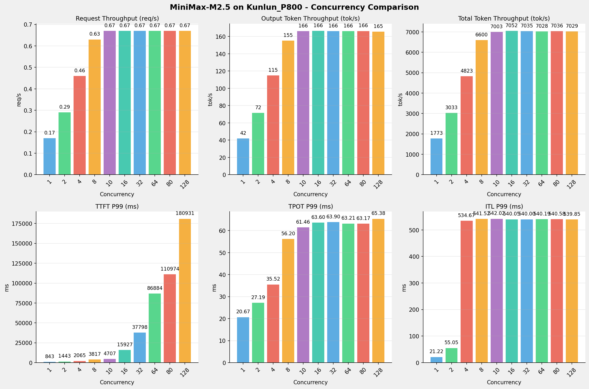
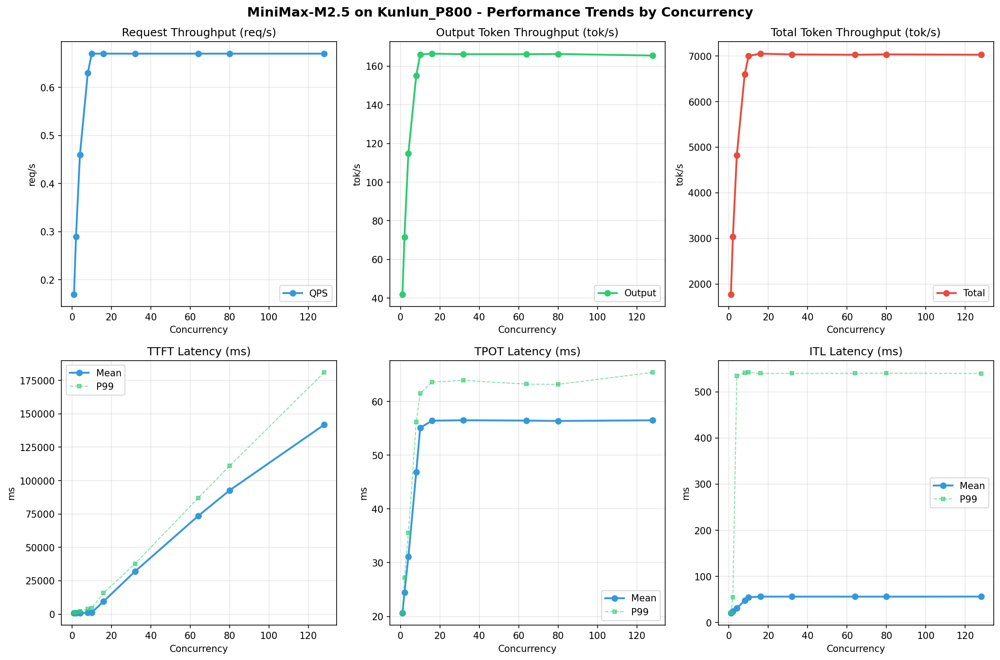

# MiniMax-M2.5模型在Kunlun_P800上的Benchmark基准测试报告

**测试日期：** 2026-03-27

---

## 测试场景
在固定请求数，输入上下文和输出上下文长度下，使用vllm bench serve工具对并发数逐级增加场景的性能基准验证。分析同一芯片同一模型在不同并发级别下的性能指标变化趋势。

**主要采集指标**：

| 指标                  | 单位         | 含义                                 |
|---------------------|------------|------------------------------------|
| TTFT                | ms         | Time To First Token，首 token 延迟     |
| TPOT                | ms/token   | Time Per Output Token，每 token 生成时间 |
| Throughput          | tokens/s   | 系统总吞吐                              |
| QPS                 | requests/s | 请求吞吐                               |
| P50/P95/P99 Latency | ms         | 延迟分位数                              |

## 📊 测试概览

| 项目            | 配置                                     | 备注  |
|---------------|----------------------------------------|-----|
| **数据集**       | random                                 |     |
| **并发数**       | 1, 2, 4, 8, 10, 16, 32, 64, 80, 128    |     |
| **总请求数**      | 320                                    |     |
| **请求输入上下文长度** | 10240（10k）                             |     |
| **请求输出上下文长度** | 256（0.25k）                             |     |
| **模型**        | MiniMax-M2.5                           |     |
| **被测芯片**      | Kunlun_P800 |     |

---

## 🤖 芯片和模型配置信息

| 芯片名称             | 模型精度              | vLLM版本                                         | Python版本 | 备注         |
|------------------|-------------------|------------------------------------------------|----------|------------|
| **Kunlun_P800** | W8A8-INT8-Dynamic | 0.11.0 | 3.10.15 | 昆仑芯P800芯片 |

---

## 🤖 vLLM启动配置信息

| 参数名称                   | Kunlun_P800 |
|------------------------|-------------|
| max-model-len | 196608 |
| max-num-seqs | 10 |
| max-num-batched-tokens | 8192 |
| gpu-memory-utilization | 0.95 |
| dp | 1 |
| tp | 8 |
| pp | 1 |
| enable-export-parallel | False |
| tool-call-parser | minimax_m2 |
| reasoning-parser | minimax_m2 (不生效) |

- **Kunlun_P800**: 昆仑芯不启用专家并行避免通信问题

---

## 🎯 服务基准结果

| 指标 | 1 并发 | 2 并发 | 4 并发 | 8 并发 | 10 并发 | 16 并发 | 32 并发 | 64 并发 | 80 并发 | 128 并发 |
|------|----------- | ----------- | ----------- | ----------- | ----------- | ----------- | ----------- | ----------- | ----------- | -----------|
| 成功请求数 | 320 | 320 | 320 | 320 | 320 | 320 | 320 | 320 | 320 | 320 |
| 失败请求数 |  |  |  |  |  |  |  |  |  |  |
| 测试持续时间 (s) | 1892.60 | 1106.64 | 696.02 | 508.44 | 479.27 | 475.87 | 477.04 | 477.53 | 476.99 | 477.43 |
| 总输入 tokens | 3276748 | 3276748 | 3276748 | 3276748 | 3276748 | 3276748 | 3276748 | 3276748 | 3276748 | 3276748 |
| 总生成 tokens | 79410 | 79281 | 79960 | 78888 | 79598 | 79221 | 79281 | 79358 | 79327 | 79008 |
| **请求吞吐量 (req/s)** | 0.17 | 0.29 | 0.46 | 0.63 | 0.67 | 0.67 | 0.67 | 0.67 | 0.67 | 0.67 |
| **输出 token 吞吐量 (tok/s)** | 41.96 | 71.64 | 114.88 | 155.16 | 166.08 | 166.48 | 166.19 | 166.18 | 166.31 | 165.49 |
| 峰值输出 token 吞吐量 (tok/s) | 50.00 | 93.00 | 173.00 | 280.00 | 311.00 | 311.00 | 311.00 | 310.00 | 311.00 | 310.00 |
| 峰值并发请求数 | 2.00 | 4.00 | 7.00 | 13.00 | 15.00 | 18.00 | 34.00 | 67.00 | 82.00 | 131.00 |
| **总 token 吞吐量 (tok/s)** | 1773.30 | 3032.63 | 4822.70 | 6599.86 | 7003.02 | 7052.24 | 7035.16 | 7027.99 | 7035.98 | 7028.75 |

---

## ⏱️ 首Token延迟 (TTFT)

| 指标 | 1 并发 | 2 并发 | 4 并发 | 8 并发 | 10 并发 | 16 并发 | 32 并发 | 64 并发 | 80 并发 | 128 并发 |
|------|----------- | ----------- | ----------- | ----------- | ----------- | ----------- | ----------- | ----------- | ----------- | -----------|
| 平均 TTFT (ms) | 817.94 | 874.08 | 930.47 | 1140.45 | 1232.27 | 9584.38 | 32040.77 | 73483.64 | 92691.66 | 141780.60 |
| 中位 TTFT (ms) | 824.23 | 833.51 | 843.28 | 847.01 | 859.67 | 9886.81 | 32900.58 | 80355.19 | 104622.58 | 174046.20 |
| P95 TTFT (ms) | 835.94 | 1182.06 | 1458.49 | 2055.50 | 2782.24 | 11728.12 | 36489.30 | 83007.06 | 106423.96 | 176900.75 |
| P99 TTFT (ms) | 842.86 | 1442.65 | 2064.95 | 3816.59 | 4707.14 | 15927.16 | 37797.90 | 86884.30 | 110973.71 | 180930.81 |

---

## ⚡ 每Token生成时间 (TPOT)

| 指标 | 1 并发 | 2 并发 | 4 并发 | 8 并发 | 10 并发 | 16 并发 | 32 并发 | 64 并发 | 80 并发 | 128 并发 |
|------|----------- | ----------- | ----------- | ----------- | ----------- | ----------- | ----------- | ----------- | ----------- | -----------|
| 平均 TPOT (ms) | 20.62 | 24.43 | 31.10 | 46.86 | 55.09 | 56.41 | 56.49 | 56.43 | 56.36 | 56.48 |
| 中位 TPOT (ms) | 20.62 | 24.54 | 31.38 | 47.37 | 56.07 | 56.34 | 56.33 | 56.32 | 56.32 | 56.36 |
| P95 TPOT (ms) | 20.65 | 25.69 | 34.01 | 50.43 | 59.03 | 59.38 | 60.89 | 61.17 | 60.21 | 61.46 |
| P99 TPOT (ms) | 20.67 | 27.19 | 35.52 | 56.20 | 61.46 | 63.60 | 63.90 | 63.21 | 63.17 | 65.38 |

---

## 🔄 Token间延迟 (ITL)

| 指标 | 1 并发 | 2 并发 | 4 并发 | 8 并发 | 10 并发 | 16 并发 | 32 并发 | 64 并发 | 80 并发 | 128 并发 |
|------|----------- | ----------- | ----------- | ----------- | ----------- | ----------- | ----------- | ----------- | ----------- | -----------|
| 平均 ITL (ms) | 20.56 | 24.46 | 31.29 | 47.59 | 54.93 | 56.28 | 56.27 | 56.24 | 56.17 | 56.35 |
| 中位 ITL (ms) | 20.60 | 21.87 | 23.38 | 29.16 | 32.95 | 32.98 | 32.96 | 32.93 | 32.94 | 32.95 |
| P95 ITL (ms) | 20.77 | 22.10 | 24.17 | 60.47 | 188.79 | 188.87 | 188.78 | 188.83 | 188.95 | 188.89 |
| P99 ITL (ms) | 21.22 | 55.05 | 534.67 | 541.52 | 542.02 | 540.05 | 540.00 | 540.19 | 540.58 | 539.85 |

---

## 📊 各并发级别性能柱状图

---

## 📈 性能趋势分析

---

## 📝 分析总结

### 1. 吞吐量性能分析

**请求吞吐量 (QPS)**: 随着并发级别增加，QPS持续上升。
低并发(1,2,4)平均 QPS: 0.31 req/s；
中并发(8,10,16,32)平均 QPS: 0.66 req/s；
高并发(64,80,128)平均 QPS: 0.67 req/s；
最高 QPS 出现在 10 并发，达到 0.67 req/s。

**Token总吞吐量**: 最高达到 7052 tok/s (16 并发)。

### 2. 首Token延迟 (TTFT) 分析

TTFT随并发增加显著上升。
低并发平均 P99 TTFT: 1450ms；
高并发平均 P99 TTFT: 126263ms；
最高 P99 TTFT 出现在 128 并发，达到 180931ms。

### 3. Token生成时间 (TPOT) 分析

TPOT随并发增加也呈上升趋势。
低并发平均 P99 TPOT: 27.79ms；
高并发平均 P99 TPOT: 63.92ms；
最高 P99 TPOT 出现在 128 并发，达到 65.38ms。

### 4. Token间延迟 (ITL) 分析

ITL随并发增加呈上升趋势。
低并发平均 P99 ITL: 203.65ms；
高并发平均 P99 ITL: 540.21ms；
最高 P99 ITL 出现在 10 并发，达到 542.02ms。

### 5. 综合评估

**吞吐量增长**: 从最低并发到最高并发，QPS增长了 294.1%。
**TTFT延迟恶化**: 高并发相比低并发，TTFT P99增加了 12376.7%。
**TPOT延迟恶化**: 高并发相比低并发，TPOT P99增加了 135.2%。

---

*报告生成时间: 2026-03-27*

