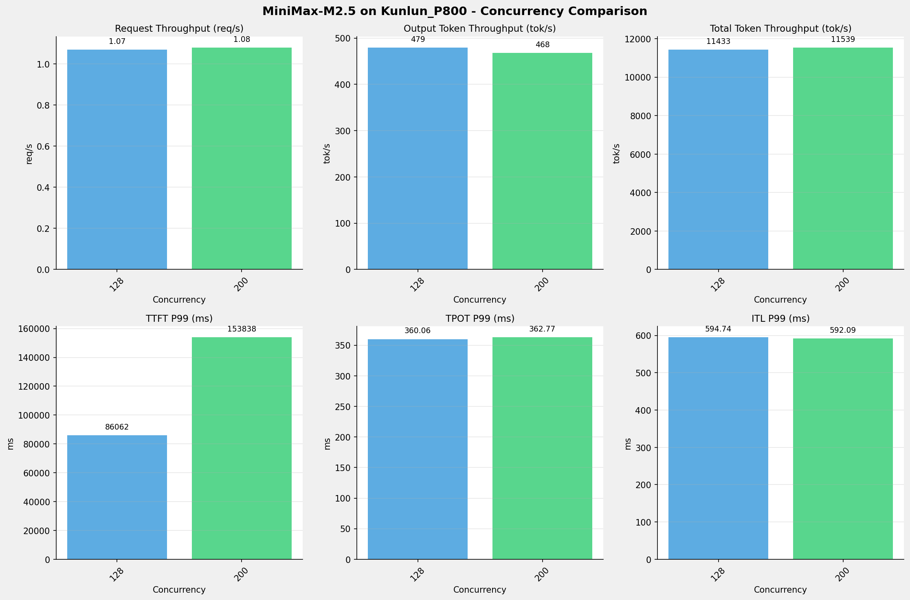
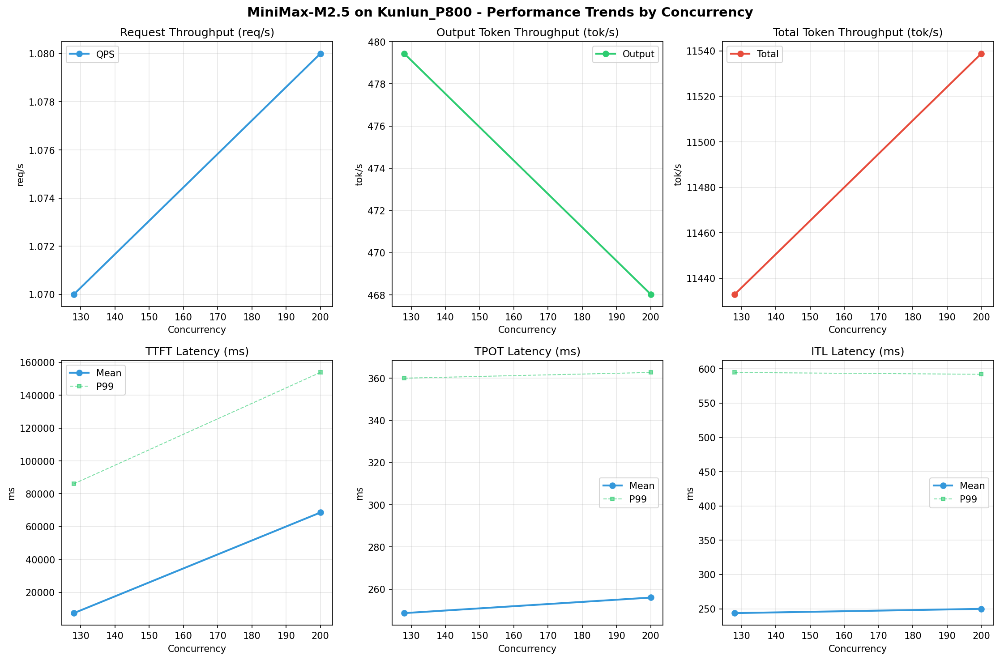

# MiniMax-M2.5模型在昆仑芯_P800上的Benchmark基准测试报告

**测试日期：** 2026-03-26

---

## 测试场景
在固定请求数，输入上下文和输出上下文长度下，使用vllm bench serve工具对并发数逐级增加场景的性能基准验证。分析同一芯片同一模型在不同并发级别下的性能指标变化趋势。

**主要采集指标**：

| 指标                  | 单位         | 含义                                 |
|---------------------|------------|------------------------------------|
| TTFT                | ms         | Time To First Token，首 token 延迟     |
| TPOT                | ms/token   | Time Per Output Token，每 token 生成时间 |
| Throughput          | tokens/s   | 系统总吞吐                              |
| QPS                 | requests/s | 请求吞吐                               |
| P50/P95/P99 Latency | ms         | 延迟分位数                              |

## 📊 测试概览

| 项目            | 配置                                     | 备注  |
|---------------|----------------------------------------|-----|
| **数据集**       | random                                 |     |
| **并发数**       | 128, 200    |     |
| **总请求数**      | 320                                    |     |
| **请求输入上下文长度** | 10240（10k）                             |     |
| **请求输出上下文长度** | 256（0.25k）                             |     |
| **模型**        | MiniMax-M2.5                           |     |
| **被测芯片**      | 昆仑芯_P800 |     |

---

## 🤖 芯片和模型配置信息

| 芯片名称             | 模型精度              | vLLM版本                                         | Python版本 | 备注         |
|------------------|-------------------|------------------------------------------------|----------|------------|
| **昆仑芯_P800** | W8A8-INT8-Dynamic | 0.11.0 | 3.10.15 | 昆仑芯P800芯片 |

---

## 🤖 vLLM启动配置信息

| 参数名称                   | 昆仑芯_P800      |
|------------------------|------------------|
| max-model-len          | 196608           |
| max-num-seqs           | 10               |
| max-num-batched-tokens | 8192             |
| gpu-memory-utilization | 0.95             |
| dp                     | 1                |
| tp                     | 8                |
| pp                     | 1                |
| enable-export-parallel | False            |
| tool-call-parser       | minimax_m2       |
| reasoning-parser       | minimax_m2 (不生效) |

- **昆仑芯_P800**: 昆仑芯不启用专家并行避免通信问题

---

## 🎯 服务基准结果

| 指标                       | 128 并发   | 200 并发   |
|--------------------------|----------|----------|
| 成功请求数                    | 1024     | 1024     |
| 失败请求数                    |          |          |
| 测试持续时间 (s)               | 957.16   | 947.02   |
| 总输入 tokens               | 10484271 | 10484271 |
| 总生成 tokens               | 458893   | 443230   |
| **请求吞吐量 (req/s)**        | 1.07     | 1.08     |
| **输出 token 吞吐量 (tok/s)** | 479.43   | 468.03   |
| 峰值输出 token 吞吐量 (tok/s)   | 1792.00  | 1790.00  |
| 峰值并发请求数                  | 133.00   | 206.00   |
| **总 token 吞吐量 (tok/s)**  | 11432.97 | 11538.81 |

---

## ⏱️ 首Token延迟 (TTFT)

| 指标 | 128 并发 | 200 并发 |
|------|----------- | -----------|
| 平均 TTFT (ms) | 7325.87 | 68541.39 |
| 中位 TTFT (ms) | 1518.51 | 66100.68 |
| P95 TTFT (ms) | 56247.06 | 119234.28 |
| P99 TTFT (ms) | 86062.46 | 153837.73 |

---

## ⚡ 每Token生成时间 (TPOT)

| 指标 | 128 并发 | 200 并发 |
|------|----------- | -----------|
| 平均 TPOT (ms) | 248.61 | 255.98 |
| 中位 TPOT (ms) | 256.64 | 262.00 |
| P95 TPOT (ms) | 292.34 | 315.67 |
| P99 TPOT (ms) | 360.06 | 362.77 |

---

## 🔄 Token间延迟 (ITL)

| 指标 | 128 并发 | 200 并发 |
|------|----------- | -----------|
| 平均 ITL (ms) | 243.74 | 249.94 |
| 中位 ITL (ms) | 77.90 | 78.23 |
| P95 ITL (ms) | 585.87 | 582.28 |
| P99 ITL (ms) | 594.74 | 592.09 |

---

## 📊 各并发级别性能柱状图

---

## 📈 性能趋势分析

---

## 📝 分析总结

### 1. 吞吐量性能分析

**请求吞吐量 (QPS)**: 随着并发级别增加，QPS持续上升。
高并发(128,200)平均 QPS: 1.08 req/s；
最高 QPS 出现在 200 并发，达到 1.08 req/s。

**Token总吞吐量**: 最高达到 11539 tok/s (200 并发)。

### 2. 首Token延迟 (TTFT) 分析

TTFT随并发增加显著上升。
高并发平均 P99 TTFT: 119950ms；
最高 P99 TTFT 出现在 200 并发，达到 153838ms。

### 3. Token生成时间 (TPOT) 分析

TPOT随并发增加也呈上升趋势。
高并发平均 P99 TPOT: 361.41ms；
最高 P99 TPOT 出现在 200 并发，达到 362.77ms。

### 4. Token间延迟 (ITL) 分析

ITL随并发增加呈上升趋势。
高并发平均 P99 ITL: 593.41ms；
最高 P99 ITL 出现在 128 并发，达到 594.74ms。

### 5. 综合评估

**吞吐量增长**: 从最低并发到最高并发，QPS增长了 0.9%。

---

*报告生成时间: 2026-03-26*

