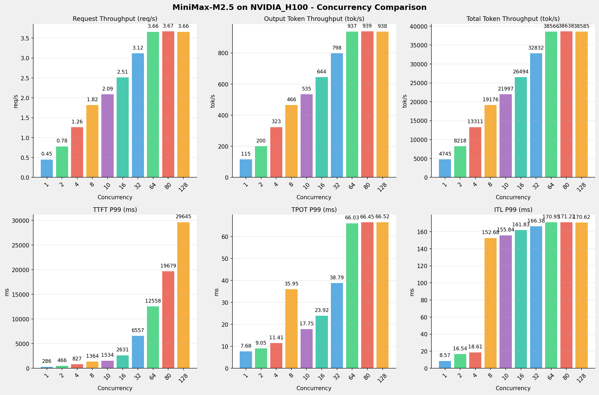
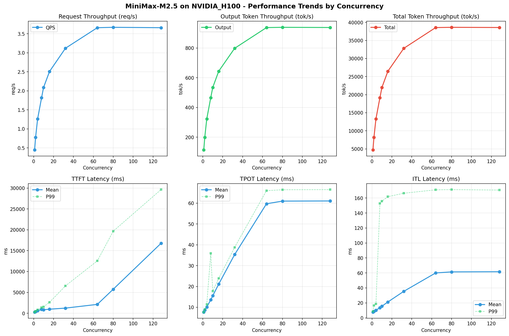

# MiniMax-M2.5模型在NVIDIA_H100上的Benchmark基准测试报告

**测试日期：** 2026-05-18

---

## 测试场景
使用vllm bench serve基准测试工具对不同并发数，请求上下文长度下的性能变化趋势。

**主要采集指标**：

| 指标                  | 单位         | 含义                                 |
|---------------------|------------|------------------------------------|
| Request throughput  | req/s      | 请求吞吐量                              |
| Output token throughput | tok/s  | 输出token吞吐量                        |
| Total token throughput | tok/s   | 总token吞吐量                         |
| TTFT                | ms         | Time To First Token，首 token 延迟     |
| TPOT                | ms/token   | Time Per Output Token，每 token 生成时间 |
| ITL                 | ms         | Inter-Token Latency，token间延迟       |

## 🤖 芯片和模型配置信息

| 参数名称                    | NVIDIA_H100 |
|------------------------|-------------|
| **model_name** | MiniMax-M2.5 |
| **quantization_config** | FP16 |
| **model_size** | 215G |
| **max_position_embeddings** | 196608 |
| **temperature** | N/A |
| **top_k** | N/A |
| **top_p** | N/A |
| **transformers_version** | 4.46.1 |
| **vllm_version** | 0.15.1 |
| **python_version** | 3.12.3 |

## 🤖 vLLM启动配置信息

| 参数名称                   | NVIDIA_H100 |
|------------------------|-------------|
| **Model Name** | MiniMax-M2.5 |
| **Max Model Len** | 196608 |
| **Max Num Seqs** | 10 |
| **Max Num Batched Tokens** | 8192 |
| **Gpu Memory Utilization** | 0.85 |
| **Dtype** | default |
| **Block Size** | default |
| **Dp** | 1 |
| **Tp** | 8 |
| **Pp** | 1 |
| **Enable Export Parallel** | True |
| **Enable Auto Tool Choice** | True |
| **Tool Call Parser** | minimax_m2 |
| **Reasoning Parser** | minimax_m2 |

- **NVIDIA_H100**: 英伟达H100标准配置

## 📊 测试概览

| 项目            | 配置                                     | 备注  |
|---------------|----------------------------------------|-----|
| **数据集**       | random                                 |     |
| **并发数**       | 1, 2, 4, 8, 10, 16, 32, 64, 80, 128    |     |
| **总请求数**      | 320                                    |     |
| **请求输入上下文长度** | 10240（10k）                             |     |
| **请求输出上下文长度** | 256（0.25k）                             |     |
| **模型**        | MiniMax-M2.5                           |     |
| **被测芯片**      | NVIDIA_H100 |     |

---

## 📋 测试结果汇总

| 并发数 | 请求吞吐量 (req/s) | 输出Token吞吐量 (tok/s) | 总Token吞吐量 (tok/s) | TTFT P99 (ms) | TPOT P99 (ms) | ITL P99 (ms) |
| ----------- | ----------- | ----------- | ----------- | ----------- | ----------- | ----------- |
| 1 | 0.45 | 115.31 | 4745.14 | 286.01 | 7.68 | 8.57 |
| 2 | 0.78 | 199.70 | 8217.92 | 466.40 | 9.05 | 16.54 |
| 4 | 1.26 | 323.45 | 13310.92 | 826.89 | 11.41 | 18.61 |
| 8 | 1.82 | 465.99 | 19176.39 | 1364.44 | 35.95 | 152.68 |
| 10 | 2.09 | 534.52 | 21996.95 | 1534.23 | 17.75 | 155.84 |
| 16 | 2.51 | 643.80 | 26494.03 | 2630.84 | 23.92 | 161.83 |
| 32 | 3.12 | 797.81 | 32831.81 | 6556.86 | 38.79 | 166.38 |
| 64 | 3.66 | 937.16 | 38566.45 | 12557.76 | 66.03 | 170.95 |
| 80 | 3.67 | 938.91 | 38638.21 | 19679.20 | 66.45 | 171.22 |
| 128 | 3.66 | 937.61 | 38585.00 | 29645.32 | 66.52 | 170.62 |

## 📊 各并发级别性能柱状图

## 📈 性能趋势分析

---

### 🎯 服务基准结果详情

| 指标 | 1 并发 | 2 并发 | 4 并发 | 8 并发 | 10 并发 | 16 并发 | 32 并发 | 64 并发 | 80 并发 | 128 并发 |
|------|----------- | ----------- | ----------- | ----------- | ----------- | ----------- | ----------- | ----------- | ----------- | -----------|
| 成功请求数 | 320 | 320 | 320 | 320 | 320 | 320 | 320 | 320 | 320 | 320 |
| 失败请求数 | 0 | 0 | 0 | 0 | 0 | 0 | 0 | 0 | 0 | 0 |
| 测试持续时间 (s) | 710.45 | 410.23 | 253.27 | 175.80 | 153.26 | 127.24 | 102.68 | 87.41 | 87.25 | 87.37 |
| 总输入 tokens | 3289280 | 3289280 | 3289280 | 3289280 | 3289280 | 3289280 | 3289280 | 3289280 | 3289280 | 3289280 |
| 总生成 tokens | 81920 | 81920 | 81920 | 81920 | 81920 | 81920 | 81920 | 81920 | 81920 | 81920 |
| **请求吞吐量 (req/s)** | 0.45 | 0.78 | 1.26 | 1.82 | 2.09 | 2.51 | 3.12 | 3.66 | 3.67 | 3.66 |
| **输出 token 吞吐量 (tok/s)** | 115.31 | 199.70 | 323.45 | 465.99 | 534.52 | 643.80 | 797.81 | 937.16 | 938.91 | 937.61 |
| 峰值输出 token 吞吐量 (tok/s) | 132.00 | 244.00 | 436.00 | 760.00 | 900.00 | 1248.00 | 1920.00 | 2878.00 | 2880.00 | 2874.00 |
| 峰值并发请求数 | 2.00 | 4.00 | 8.00 | 16.00 | 19.00 | 26.00 | 40.00 | 72.00 | 86.00 | 134.00 |
| **总 token 吞吐量 (tok/s)** | 4745.14 | 8217.92 | 13310.92 | 19176.39 | 21996.95 | 26494.03 | 32831.81 | 38566.45 | 38638.21 | 38585.00 |

### ⏱️ 首Token延迟 (TTFT)

| 指标 | 1 并发 | 2 并发 | 4 并发 | 8 并发 | 10 并发 | 16 并发 | 32 并发 | 64 并发 | 80 并发 | 128 并发 |
|------|----------- | ----------- | ----------- | ----------- | ----------- | ----------- | ----------- | ----------- | ----------- | -----------|
| 平均 TTFT (ms) | 264.19 | 360.79 | 584.15 | 931.63 | 827.89 | 967.22 | 1227.85 | 2119.88 | 5759.41 | 16764.52 |
| 中位 TTFT (ms) | 264.45 | 284.36 | 582.44 | 935.84 | 875.37 | 1032.07 | 968.59 | 981.41 | 3936.04 | 17718.86 |
| P95 TTFT (ms) | 275.76 | 463.55 | 821.10 | 1245.61 | 1309.06 | 1697.66 | 3978.00 | 10055.31 | 13080.99 | 27005.85 |
| P99 TTFT (ms) | 286.01 | 466.40 | 826.89 | 1364.44 | 1534.23 | 2630.84 | 6556.86 | 12557.76 | 19679.20 | 29645.32 |

### ⚡ 每Token生成时间 (TPOT)

| 指标 | 1 并发 | 2 并发 | 4 并发 | 8 并发 | 10 并发 | 16 并发 | 32 并发 | 64 并发 | 80 并发 | 128 并发 |
|------|----------- | ----------- | ----------- | ----------- | ----------- | ----------- | ----------- | ----------- | ----------- | -----------|
| 平均 TPOT (ms) | 7.67 | 8.64 | 10.12 | 13.58 | 15.52 | 21.13 | 35.33 | 59.72 | 61.00 | 61.07 |
| 中位 TPOT (ms) | 7.67 | 8.65 | 10.02 | 13.24 | 15.31 | 20.85 | 36.07 | 63.77 | 65.44 | 65.51 |
| P95 TPOT (ms) | 7.68 | 9.04 | 11.39 | 15.59 | 17.71 | 23.79 | 38.47 | 64.94 | 65.70 | 65.86 |
| P99 TPOT (ms) | 7.68 | 9.05 | 11.41 | 35.95 | 17.75 | 23.92 | 38.79 | 66.03 | 66.45 | 66.52 |

### 🔄 Token间延迟 (ITL)

| 指标 | 1 并发 | 2 并发 | 4 并发 | 8 并发 | 10 并发 | 16 并发 | 32 并发 | 64 并发 | 80 并发 | 128 并发 |
|------|----------- | ----------- | ----------- | ----------- | ----------- | ----------- | ----------- | ----------- | ----------- | -----------|
| 平均 ITL (ms) | 7.70 | 8.68 | 10.20 | 13.66 | 15.60 | 21.27 | 35.48 | 60.01 | 61.40 | 61.61 |
| 中位 ITL (ms) | 7.69 | 8.28 | 9.24 | 10.60 | 11.23 | 13.09 | 16.79 | 22.71 | 22.72 | 22.76 |
| P95 ITL (ms) | 7.83 | 8.46 | 9.57 | 11.15 | 12.43 | 150.58 | 161.31 | 166.68 | 167.68 | 167.75 |
| P99 ITL (ms) | 8.57 | 16.54 | 18.61 | 152.68 | 155.84 | 161.83 | 166.38 | 170.95 | 171.22 | 170.62 |

---

## 📝 分析总结

### 1. 吞吐量性能分析

**请求吞吐量 (QPS)**: 随着并发级别增加，QPS持续上升。
低并发(1,2,4)平均 QPS: 0.83 req/s；
中并发(8,10,16,32)平均 QPS: 2.38 req/s；
高并发(64,80,128)平均 QPS: 3.66 req/s；
最高 QPS 出现在 80 并发，达到 3.67 req/s。

**Token总吞吐量**: 最高达到 38638 tok/s (80 并发)。

### 2. 首Token延迟 (TTFT) 分析

TTFT随并发增加显著上升。
低并发平均 P99 TTFT: 526ms；
高并发平均 P99 TTFT: 20627ms；
最高 P99 TTFT 出现在 128 并发，达到 29645ms。

### 3. Token生成时间 (TPOT) 分析

TPOT随并发增加也呈上升趋势。
低并发平均 P99 TPOT: 9.38ms；
高并发平均 P99 TPOT: 66.33ms；
最高 P99 TPOT 出现在 128 并发，达到 66.52ms。

### 4. Token间延迟 (ITL) 分析

ITL随并发增加呈上升趋势。
低并发平均 P99 ITL: 14.57ms；
高并发平均 P99 ITL: 170.93ms；
最高 P99 ITL 出现在 80 并发，达到 171.22ms。

### 5. 综合评估

**吞吐量增长**: 从最低并发到最高并发，QPS增长了 713.3%。
**TTFT延迟恶化**: 高并发相比低并发，TTFT P99增加了 5531.4%。
**TPOT延迟恶化**: 高并发相比低并发，TPOT P99增加了 609.2%。

---

*报告生成时间: 2026-05-18*

