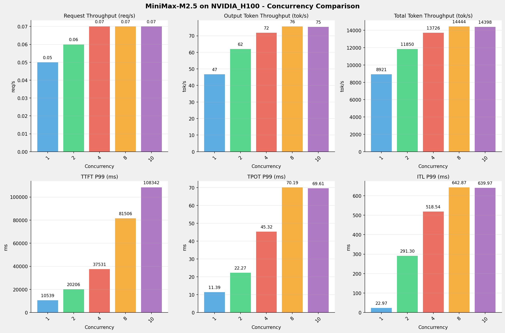
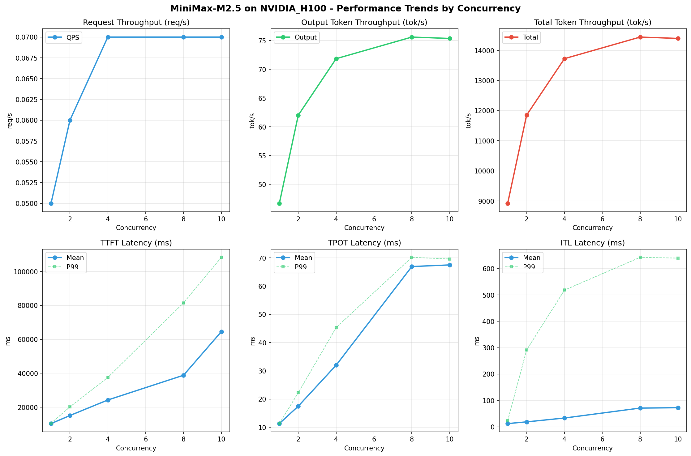

# MiniMax-M2.5模型在NVIDIA_H100上的Benchmark基准测试报告

**测试日期：** 2026-05-18

---

## 测试场景
使用vllm bench serve基准测试工具对不同并发数，请求上下文长度下的性能变化趋势。

**主要采集指标**：

| 指标                  | 单位         | 含义                                 |
|---------------------|------------|------------------------------------|
| Request throughput  | req/s      | 请求吞吐量                              |
| Output token throughput | tok/s  | 输出token吞吐量                        |
| Total token throughput | tok/s   | 总token吞吐量                         |
| TTFT                | ms         | Time To First Token，首 token 延迟     |
| TPOT                | ms/token   | Time Per Output Token，每 token 生成时间 |
| ITL                 | ms         | Inter-Token Latency，token间延迟       |

## 🤖 芯片和模型配置信息

| 参数名称                    | NVIDIA_H100 |
|------------------------|-------------|
| **model_name** | MiniMax-M2.5 |
| **quantization_config** | FP16 |
| **model_size** | 215G |
| **max_position_embeddings** | 196608 |
| **temperature** | N/A |
| **top_k** | N/A |
| **top_p** | N/A |
| **transformers_version** | 4.46.1 |
| **vllm_version** | 0.15.1 |
| **python_version** | 3.12.3 |

## 🤖 vLLM启动配置信息

| 参数名称                   | NVIDIA_H100 |
|------------------------|-------------|
| **Model Name** | MiniMax-M2.5 |
| **Max Model Len** | 196608 |
| **Max Num Seqs** | 10 |
| **Max Num Batched Tokens** | 8192 |
| **Gpu Memory Utilization** | 0.85 |
| **Dtype** | default |
| **Block Size** | default |
| **Dp** | 1 |
| **Tp** | 8 |
| **Pp** | 1 |
| **Enable Export Parallel** | True |
| **Enable Auto Tool Choice** | True |
| **Tool Call Parser** | minimax_m2 |
| **Reasoning Parser** | minimax_m2 |

- **NVIDIA_H100**: 英伟达H100标准配置

## 📊 测试概览

| 项目            | 配置                                     | 备注  |
|---------------|----------------------------------------|-----|
| **数据集**       | random                                 |     |
| **并发数**       | 1, 2, 4, 8, 10    |     |
| **总请求数**      | 100                                    |     |
| **请求输入上下文长度** | 194560（190k）                             |     |
| **请求输出上下文长度** | 1024（1k）                             |     |
| **模型**        | MiniMax-M2.5                           |     |
| **被测芯片**      | NVIDIA_H100 |     |

---

## 📋 测试结果汇总

| 并发数 | 请求吞吐量 (req/s) | 输出Token吞吐量 (tok/s) | 总Token吞吐量 (tok/s) | TTFT P99 (ms) | TPOT P99 (ms) | ITL P99 (ms) |
| ----------- | ----------- | ----------- | ----------- | ----------- | ----------- | ----------- |
| 1 | 0.05 | 46.70 | 8921.40 | 10539.10 | 11.39 | 22.97 |
| 2 | 0.06 | 62.03 | 11850.06 | 20205.87 | 22.27 | 291.30 |
| 4 | 0.07 | 71.85 | 13726.45 | 37530.99 | 45.32 | 518.54 |
| 8 | 0.07 | 75.61 | 14443.68 | 81506.35 | 70.19 | 642.87 |
| 10 | 0.07 | 75.37 | 14398.41 | 108342.29 | 69.61 | 639.97 |

## 📊 各并发级别性能柱状图

## 📈 性能趋势分析

---

### 🎯 服务基准结果详情

| 指标 | 1 并发 | 2 并发 | 4 并发 | 8 并发 | 10 并发 |
|------|----------- | ----------- | ----------- | ----------- | -----------|
| 成功请求数 | 100 | 100 | 100 | 100 | 100 |
| 失败请求数 | 0 | 0 | 0 | 0 | 0 |
| 测试持续时间 (s) | 2192.74 | 1650.82 | 1425.15 | 1354.38 | 1358.64 |
| 总输入 tokens | 19459900 | 19459900 | 19459900 | 19459900 | 19459900 |
| 总生成 tokens | 102400 | 102400 | 102400 | 102400 | 102400 |
| **请求吞吐量 (req/s)** | 0.05 | 0.06 | 0.07 | 0.07 | 0.07 |
| **输出 token 吞吐量 (tok/s)** | 46.70 | 62.03 | 71.85 | 75.61 | 75.37 |
| 峰值输出 token 吞吐量 (tok/s) | 88.00 | 158.00 | 232.00 | 279.00 | 275.00 |
| 峰值并发请求数 | 2.00 | 4.00 | 7.00 | 10.00 | 11.00 |
| **总 token 吞吐量 (tok/s)** | 8921.40 | 11850.06 | 13726.45 | 14443.68 | 14398.41 |

### ⏱️ 首Token延迟 (TTFT)

| 指标 | 1 并发 | 2 并发 | 4 并发 | 8 并发 | 10 并发 |
|------|----------- | ----------- | ----------- | ----------- | -----------|
| 平均 TTFT (ms) | 10341.23 | 15109.52 | 24251.84 | 38837.88 | 64545.59 |
| 中位 TTFT (ms) | 10434.85 | 11322.53 | 21340.43 | 31592.69 | 63613.81 |
| P95 TTFT (ms) | 10504.46 | 20196.38 | 36452.26 | 51466.23 | 72047.66 |
| P99 TTFT (ms) | 10539.10 | 20205.87 | 37530.99 | 81506.35 | 108342.29 |

### ⚡ 每Token生成时间 (TPOT)

| 指标 | 1 并发 | 2 并发 | 4 并发 | 8 并发 | 10 并发 |
|------|----------- | ----------- | ----------- | ----------- | -----------|
| 平均 TPOT (ms) | 11.33 | 17.50 | 32.00 | 66.93 | 67.50 |
| 中位 TPOT (ms) | 11.32 | 18.37 | 31.06 | 69.00 | 69.02 |
| P95 TPOT (ms) | 11.38 | 22.27 | 45.29 | 69.56 | 69.59 |
| P99 TPOT (ms) | 11.39 | 22.27 | 45.32 | 70.19 | 69.61 |

### 🔄 Token间延迟 (ITL)

| 指标 | 1 并发 | 2 并发 | 4 并发 | 8 并发 | 10 并发 |
|------|----------- | ----------- | ----------- | ----------- | -----------|
| 平均 ITL (ms) | 12.11 | 18.68 | 33.27 | 71.06 | 72.39 |
| 中位 ITL (ms) | 11.42 | 12.86 | 17.27 | 21.89 | 21.91 |
| P95 ITL (ms) | 12.01 | 25.64 | 34.62 | 439.76 | 440.01 |
| P99 ITL (ms) | 22.97 | 291.30 | 518.54 | 642.87 | 639.97 |

---

## 📝 分析总结

### 1. 吞吐量性能分析

**请求吞吐量 (QPS)**: 随着并发级别增加，QPS持续上升。
低并发(1,2,4)平均 QPS: 0.06 req/s；
中并发(8,10)平均 QPS: 0.07 req/s；
最高 QPS 出现在 4 并发，达到 0.07 req/s。

**Token总吞吐量**: 最高达到 14444 tok/s (8 并发)。

### 2. 首Token延迟 (TTFT) 分析

TTFT随并发增加显著上升。
低并发平均 P99 TTFT: 22759ms；
最高 P99 TTFT 出现在 10 并发，达到 108342ms。

### 3. Token生成时间 (TPOT) 分析

TPOT随并发增加也呈上升趋势。
低并发平均 P99 TPOT: 26.33ms；
最高 P99 TPOT 出现在 8 并发，达到 70.19ms。

### 4. Token间延迟 (ITL) 分析

ITL随并发增加呈上升趋势。
低并发平均 P99 ITL: 277.60ms；
最高 P99 ITL 出现在 8 并发，达到 642.87ms。

### 5. 综合评估

**吞吐量增长**: 从最低并发到最高并发，QPS增长了 40.0%。
**TTFT延迟恶化**: 高并发相比低并发，TTFT P99增加了 376.0%。
**TPOT延迟恶化**: 高并发相比低并发，TPOT P99增加了 166.6%。

---

*报告生成时间: 2026-05-18*

