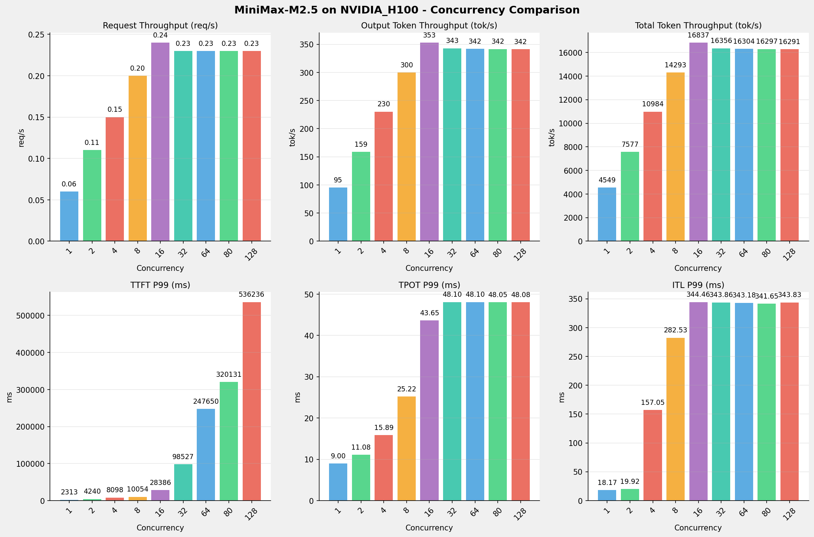
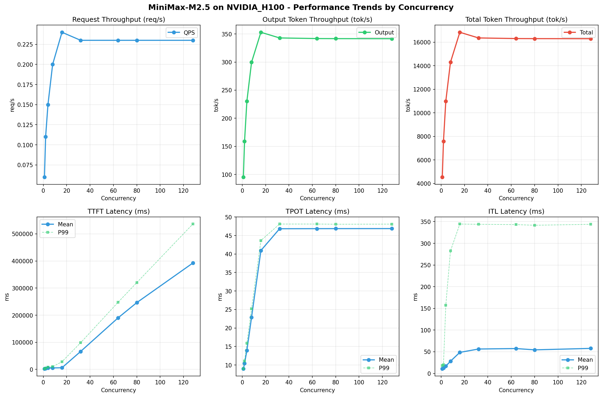

# MiniMax-M2.5模型在NVIDIA_H100上的Benchmark基准测试报告

**测试日期：** 2026-05-25

---

## 测试场景
使用vllm bench serve基准测试工具对不同并发数，请求上下文长度下的性能变化趋势。

**主要采集指标**：

| 指标                  | 单位         | 含义                                 |
|---------------------|------------|------------------------------------|
| Request throughput  | req/s      | 请求吞吐量                              |
| Output token throughput | tok/s  | 输出token吞吐量                        |
| Total token throughput | tok/s   | 总token吞吐量                         |
| TTFT                | ms         | Time To First Token，首 token 延迟     |
| TPOT                | ms/token   | Time Per Output Token，每 token 生成时间 |
| ITL                 | ms         | Inter-Token Latency，token间延迟       |

## 🤖 芯片和模型配置信息

| 参数名称                    | NVIDIA_H100 |
|------------------------|-------------|
| **model_name** | MiniMax-M2.5 |
| **quantization_config** | FP8 |
| **model_size** | 215G |
| **max_position_embeddings** | 196608 |
| **temperature** | 1.0 |
| **top_k** | 40 |
| **top_p** | 0.95 |
| **transformers_version** | 4.46.1 |
| **vllm_version** | 0.20.0 |
| **python_version** | 3.12.3 |

## 🤖 vLLM启动配置信息

| 参数名称                   | NVIDIA_H100 |
|------------------------|-------------|
| **Model Name** | MiniMax-M2.5 |
| **Max Model Len** | 196608 |
| **Max Num Seqs** | 64 |
| **Max Num Batched Tokens** | 8192 |
| **Gpu Memory Utilization** | 0.85 |
| **Dtype** | default |
| **Block Size** | default |
| **Dp** | 1 |
| **Tp** | 8 |
| **Pp** | 1 |
| **Enable Export Parallel** | True |
| **Enable Auto Tool Choice** | True |
| **Tool Call Parser** | minimax_m2 |
| **Reasoning Parser** | minimax_m2 |

- **NVIDIA_H100**: 英伟达H100标准配置

## 📊 测试概览

| 项目            | 配置                                     | 备注  |
|---------------|----------------------------------------|-----|
| **数据集**       | random                                 |     |
| **并发数**       | 1, 2, 4, 8, 16, 32, 64, 80, 128    |     |
| **总请求数**      | 300                                    |     |
| **请求输入上下文长度** | 70000（68k）                             |     |
| **请求输出上下文长度** | 1500（1k）                             |     |
| **模型**        | MiniMax-M2.5                           |     |
| **被测芯片**      | NVIDIA_H100 |     |

---

## 📋 测试结果汇总

| 并发数 | 请求吞吐量 (req/s) | 输出Token吞吐量 (tok/s) | 总Token吞吐量 (tok/s) | TTFT P99 (ms) | TPOT P99 (ms) | ITL P99 (ms) |
| ----------- | ----------- | ----------- | ----------- | ----------- | ----------- | ----------- |
| 1 | 0.06 | 95.39 | 4549.40 | 2312.95 | 9.00 | 18.17 |
| 2 | 0.11 | 158.87 | 7577.10 | 4240.42 | 11.08 | 19.92 |
| 4 | 0.15 | 230.31 | 10984.25 | 8098.15 | 15.89 | 157.05 |
| 8 | 0.20 | 299.68 | 14292.56 | 10054.11 | 25.22 | 282.53 |
| 16 | 0.24 | 353.03 | 16836.89 | 28385.80 | 43.65 | 344.46 |
| 32 | 0.23 | 342.94 | 16355.82 | 98526.87 | 48.10 | 343.86 |
| 64 | 0.23 | 341.85 | 16303.60 | 247650.08 | 48.10 | 343.18 |
| 80 | 0.23 | 341.72 | 16297.33 | 320130.95 | 48.05 | 341.65 |
| 128 | 0.23 | 341.57 | 16290.56 | 536235.57 | 48.08 | 343.83 |

## 📊 各并发级别性能柱状图

## 📈 性能趋势分析

---

### 🎯 服务基准结果详情

| 指标 | 1 并发 | 2 并发 | 4 并发 | 8 并发 | 16 并发 | 32 并发 | 64 并发 | 80 并发 | 128 并发 |
|------|----------- | ----------- | ----------- | ----------- | ----------- | ----------- | ----------- | ----------- | -----------|
| 成功请求数 | 300 | 300 | 300 | 300 | 300 | 300 | 300 | 300 | 300 |
| 失败请求数 | 0 | 0 | 0 | 0 | 0 | 0 | 0 | 0 | 0 |
| 测试持续时间 (s) | 4717.48 | 2832.44 | 1953.86 | 1501.60 | 1274.68 | 1312.18 | 1316.38 | 1316.88 | 1317.43 |
| 总输入 tokens | 21011700 | 21011700 | 21011700 | 21011700 | 21011700 | 21011700 | 21011700 | 21011700 | 21011700 |
| 总生成 tokens | 450000 | 450000 | 450000 | 450000 | 450000 | 450000 | 450000 | 450000 | 450000 |
| **请求吞吐量 (req/s)** | 0.06 | 0.11 | 0.15 | 0.20 | 0.24 | 0.23 | 0.23 | 0.23 | 0.23 |
| **输出 token 吞吐量 (tok/s)** | 95.39 | 158.87 | 230.31 | 299.68 | 353.03 | 342.94 | 341.85 | 341.72 | 341.57 |
| 峰值输出 token 吞吐量 (tok/s) | 113.00 | 206.00 | 336.00 | 504.00 | 700.00 | 655.00 | 627.00 | 665.00 | 660.00 |
| 峰值并发请求数 | 2.00 | 4.00 | 8.00 | 12.00 | 18.00 | 34.00 | 65.00 | 81.00 | 129.00 |
| **总 token 吞吐量 (tok/s)** | 4549.40 | 7577.10 | 10984.25 | 14292.56 | 16836.89 | 16355.82 | 16303.60 | 16297.33 | 16290.56 |

### ⏱️ 首Token延迟 (TTFT)

| 指标 | 1 并发 | 2 并发 | 4 并发 | 8 并发 | 16 并发 | 32 并发 | 64 并发 | 80 并发 | 128 并发 |
|------|----------- | ----------- | ----------- | ----------- | ----------- | ----------- | ----------- | ----------- | -----------|
| 平均 TTFT (ms) | 2265.26 | 3258.76 | 5199.14 | 5445.97 | 6148.44 | 66344.50 | 190118.45 | 246314.20 | 392383.12 |
| 中位 TTFT (ms) | 2271.20 | 2492.32 | 4769.26 | 6441.27 | 5940.84 | 72321.67 | 216059.14 | 287938.63 | 467565.25 |
| P95 TTFT (ms) | 2298.66 | 4233.81 | 8071.32 | 7118.12 | 6378.03 | 74808.85 | 217071.88 | 288750.19 | 504667.37 |
| P99 TTFT (ms) | 2312.95 | 4240.42 | 8098.15 | 10054.11 | 28385.80 | 98526.87 | 247650.08 | 320130.95 | 536235.57 |

### ⚡ 每Token生成时间 (TPOT)

| 指标 | 1 并发 | 2 并发 | 4 并发 | 8 并发 | 16 并发 | 32 并发 | 64 并发 | 80 并发 | 128 并发 |
|------|----------- | ----------- | ----------- | ----------- | ----------- | ----------- | ----------- | ----------- | -----------|
| 平均 TPOT (ms) | 8.98 | 10.42 | 13.91 | 22.90 | 40.95 | 46.83 | 46.85 | 46.86 | 46.87 |
| 中位 TPOT (ms) | 8.98 | 10.38 | 13.76 | 22.40 | 41.27 | 47.79 | 47.78 | 47.79 | 47.77 |
| P95 TPOT (ms) | 9.00 | 11.07 | 15.87 | 25.08 | 43.50 | 48.00 | 48.00 | 47.99 | 48.00 |
| P99 TPOT (ms) | 9.00 | 11.08 | 15.89 | 25.22 | 43.65 | 48.10 | 48.10 | 48.05 | 48.08 |

### 🔄 Token间延迟 (ITL)

| 指标 | 1 并发 | 2 并发 | 4 并发 | 8 并发 | 16 并发 | 32 并发 | 64 并发 | 80 并发 | 128 并发 |
|------|----------- | ----------- | ----------- | ----------- | ----------- | ----------- | ----------- | ----------- | -----------|
| 平均 ITL (ms) | 10.75 | 12.47 | 16.87 | 28.18 | 48.57 | 56.34 | 57.42 | 54.43 | 57.77 |
| 中位 ITL (ms) | 9.01 | 9.83 | 12.09 | 15.99 | 23.15 | 28.08 | 28.25 | 28.22 | 28.25 |
| P95 ITL (ms) | 18.04 | 19.69 | 24.19 | 32.17 | 240.07 | 253.78 | 256.07 | 246.76 | 256.28 |
| P99 ITL (ms) | 18.17 | 19.92 | 157.05 | 282.53 | 344.46 | 343.86 | 343.18 | 341.65 | 343.83 |

---

## 📝 分析总结

### 1. 吞吐量性能分析

**请求吞吐量 (QPS)**: 随着并发级别增加，QPS持续上升。
低并发(1,2,4)平均 QPS: 0.11 req/s；
中并发(8,16,32)平均 QPS: 0.22 req/s；
高并发(64,80,128)平均 QPS: 0.23 req/s；
最高 QPS 出现在 16 并发，达到 0.24 req/s。

**Token总吞吐量**: 最高达到 16837 tok/s (16 并发)。

### 2. 首Token延迟 (TTFT) 分析

TTFT随并发增加显著上升。
低并发平均 P99 TTFT: 4884ms；
高并发平均 P99 TTFT: 368006ms；
最高 P99 TTFT 出现在 128 并发，达到 536236ms。

### 3. Token生成时间 (TPOT) 分析

TPOT随并发增加也呈上升趋势。
低并发平均 P99 TPOT: 11.99ms；
高并发平均 P99 TPOT: 48.08ms；
最高 P99 TPOT 出现在 32 并发，达到 48.10ms。

### 4. Token间延迟 (ITL) 分析

ITL随并发增加呈上升趋势。
低并发平均 P99 ITL: 65.05ms；
高并发平均 P99 ITL: 342.89ms；
最高 P99 ITL 出现在 16 并发，达到 344.46ms。

### 5. 综合评估

**吞吐量增长**: 从最低并发到最高并发，QPS增长了 283.3%。
**TTFT延迟恶化**: 高并发相比低并发，TTFT P99增加了 10879.8%。
**TPOT延迟恶化**: 高并发相比低并发，TPOT P99增加了 301.2%。

---

*报告生成时间: 2026-05-25*

