# MiniMax-M2.5模型在NVIDIA_H100上的多I/O测试报告

**测试日期：** 2026-05-25

---

## 测试场景
测试不同输入输出长度和并发级别下的性能表现，分析同一芯片同一模型在不同输入输出长度和并发级别下的性能指标变化趋势。

**主要采集指标**：

| 指标                  | 单位         | 含义                                 |
|---------------------|------------|------------------------------------|
| Request throughput  | req/s      | 请求吞吐量                              |
| Output token throughput | tok/s  | 输出token吞吐量                        |
| Total token throughput | tok/s   | 总token吞吐量                         |
| TTFT                | ms         | Time To First Token，首 token 延迟     |
| TPOT                | ms/token   | Time Per Output Token，每 token 生成时间 |
| ITL                 | ms         | Inter-Token Latency，token间延迟       |

## 🤖 芯片和模型配置信息

| 参数名称                    | NVIDIA_H100 |
|------------------------|-------------|
| **model_name** | MiniMax-M2.5 |
| **quantization_config** | FP8 |
| **model_size** | 215G |
| **max_position_embeddings** | 196608 |
| **temperature** | 1.0 |
| **top_k** | 40 |
| **top_p** | 0.95 |
| **transformers_version** | 4.46.1 |
| **vllm_version** | 0.20.0 |
| **python_version** | 3.12.3 |

## 🤖 vLLM启动配置信息

| 参数名称                   | NVIDIA_H100 |
|------------------------|-------------|
| **Model Name** | MiniMax-M2.5 |
| **Max Model Len** | 196608 |
| **Max Num Seqs** | 64 |
| **Max Num Batched Tokens** | 8192 |
| **Gpu Memory Utilization** | 0.85 |
| **Dtype** | default |
| **Block Size** | default |
| **Dp** | 1 |
| **Tp** | 8 |
| **Pp** | 1 |
| **Enable Export Parallel** | True |
| **Enable Auto Tool Choice** | True |
| **Tool Call Parser** | minimax_m2 |
| **Reasoning Parser** | minimax_m2 |

- **NVIDIA_H100**: 英伟达H100标准配置

## 📊 测试概览

| 项目            | 配置                                     | 备注  |
|---------------|----------------------------------------|-----|
| **数据集**       | random                                 |     |
| **并发数**       | 1, 4, 8, 16, 32, 64, 128    |     |
| **总请求数**      | 1000                                    |     |
| **输入输出长度** | (128, 128), (512, 256), (1024, 512), (2048, 1024), (4096, 2048), (8192, 1024) |     |
| **模型**        | MiniMax-M2.5                           |     |
| **被测芯片**      | NVIDIA_H100 |     |

---

## 📋 各I/O测试汇总（固定上下文长度，随并发变化）

### input: 128, output: 128

| 并发数 | 请求吞吐量 (req/s) | 输出Token吞吐量 (tok/s) | 总Token吞吐量 (tok/s) | TTFT P99 (ms) | TPOT P99 (ms) | ITL P99 (ms) |
| --------------- | --------------- | --------------- | --------------- | --------------- | --------------- | --------------- |
| 1 | 1.03 | 132.10 | 304.45 | 29.15 | 7.43 | 7.81 |
| 4 | 3.34 | 427.14 | 984.42 | 105.78 | 9.31 | 9.81 |
| 8 | 6.02 | 770.36 | 1775.45 | 153.33 | 10.22 | 10.83 |
| 16 | 10.09 | 1291.07 | 2975.50 | 116.92 | 12.53 | 19.61 |
| 32 | 17.11 | 2190.57 | 5048.59 | 256.75 | 14.25 | 19.96 |
| 64 | 27.90 | 3571.65 | 8231.54 | 354.30 | 17.66 | 23.73 |
| 128 | 28.81 | 3687.40 | 8498.30 | 2585.21 | 16.86 | 21.18 |

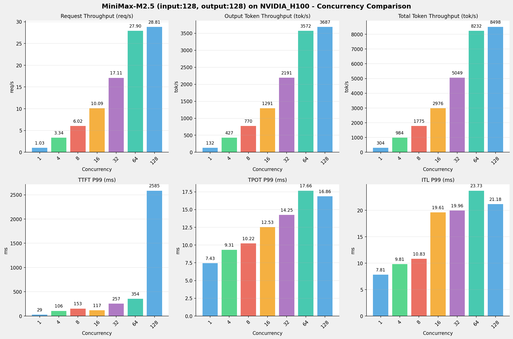

---

### input: 512, output: 256

| 并发数 | 请求吞吐量 (req/s) | 输出Token吞吐量 (tok/s) | 总Token吞吐量 (tok/s) | TTFT P99 (ms) | TPOT P99 (ms) | ITL P99 (ms) |
| --------------- | --------------- | --------------- | --------------- | --------------- | --------------- | --------------- |
| 1 | 0.50 | 129.25 | 407.43 | 101.94 | 7.45 | 7.97 |
| 4 | 1.67 | 426.71 | 1345.13 | 170.36 | 9.29 | 9.95 |
| 8 | 3.06 | 782.80 | 2467.65 | 165.00 | 9.98 | 10.91 |
| 16 | 5.17 | 1322.61 | 4169.31 | 199.16 | 11.85 | 13.06 |
| 32 | 8.41 | 2153.58 | 6788.82 | 357.62 | 14.49 | 27.58 |
| 64 | 13.68 | 3502.52 | 11041.15 | 531.95 | 17.74 | 57.55 |
| 128 | 13.68 | 3502.84 | 11042.17 | 5255.30 | 17.79 | 60.71 |

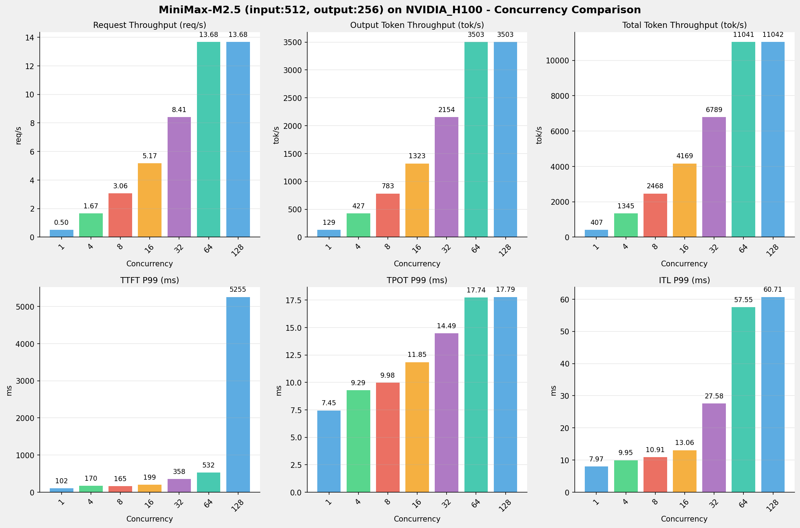

---

### input: 1024, output: 512

| 并发数 | 请求吞吐量 (req/s) | 输出Token吞吐量 (tok/s) | 总Token吞吐量 (tok/s) | TTFT P99 (ms) | TPOT P99 (ms) | ITL P99 (ms) |
| --------------- | --------------- | --------------- | --------------- | --------------- | --------------- | --------------- |
| 1 | 0.26 | 131.35 | 404.06 | 105.19 | 7.47 | 15.01 |
| 4 | 0.86 | 439.84 | 1353.02 | 177.82 | 8.99 | 17.86 |
| 8 | 1.55 | 792.15 | 2436.78 | 208.22 | 10.11 | 19.82 |
| 16 | 2.62 | 1339.60 | 4120.83 | 337.29 | 11.90 | 23.16 |
| 32 | 4.22 | 2161.89 | 6650.35 | 483.29 | 14.73 | 29.45 |
| 64 | 6.70 | 3430.95 | 10554.20 | 779.16 | 18.78 | 71.82 |
| 128 | 6.78 | 3469.97 | 10674.24 | 10222.45 | 18.59 | 56.76 |

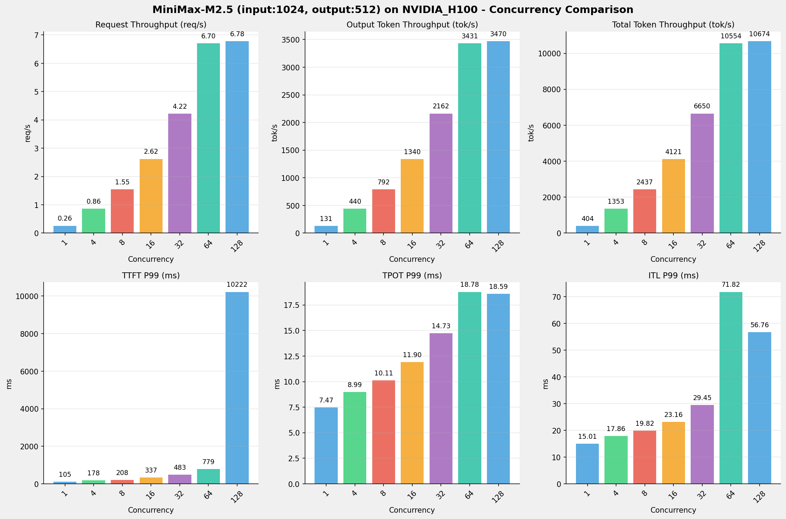

---

### input: 2048, output: 1024

| 并发数 | 请求吞吐量 (req/s) | 输出Token吞吐量 (tok/s) | 总Token吞吐量 (tok/s) | TTFT P99 (ms) | TPOT P99 (ms) | ITL P99 (ms) |
| --------------- | --------------- | --------------- | --------------- | --------------- | --------------- | --------------- |
| 1 | 0.13 | 132.15 | 401.49 | 111.86 | 7.49 | 15.14 |
| 4 | 0.43 | 444.20 | 1349.53 | 225.74 | 9.05 | 18.00 |
| 8 | 0.78 | 796.35 | 2419.37 | 361.65 | 10.13 | 20.01 |
| 16 | 1.31 | 1338.77 | 4067.31 | 579.97 | 12.00 | 23.49 |
| 32 | 2.06 | 2108.53 | 6405.90 | 1137.22 | 15.01 | 29.04 |
| 64 | 3.18 | 3257.09 | 9895.33 | 2322.59 | 19.34 | 146.03 |
| 128 | 3.18 | 3260.17 | 9904.68 | 21939.31 | 19.38 | 145.04 |

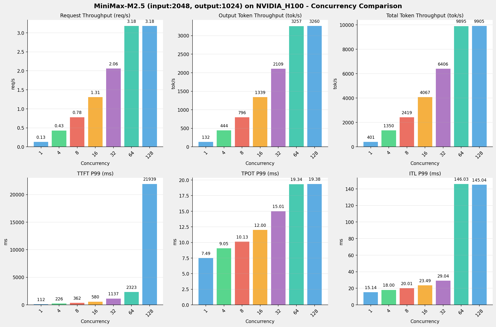

---

### input: 4096, output: 2048

| 并发数 | 请求吞吐量 (req/s) | 输出Token吞吐量 (tok/s) | 总Token吞吐量 (tok/s) | TTFT P99 (ms) | TPOT P99 (ms) | ITL P99 (ms) |
| --------------- | --------------- | --------------- | --------------- | --------------- | --------------- | --------------- |
| 1 | 0.06 | 131.17 | 396.00 | 126.64 | 7.59 | 15.39 |
| 4 | 0.22 | 441.66 | 1333.39 | 347.71 | 9.15 | 18.28 |
| 8 | 0.38 | 782.67 | 2362.93 | 625.36 | 10.40 | 20.56 |
| 16 | 0.64 | 1303.31 | 3934.74 | 887.67 | 12.43 | 24.37 |
| 32 | 0.99 | 2030.40 | 6129.87 | 2019.10 | 15.85 | 31.03 |
| 64 | 1.48 | 3026.85 | 9138.18 | 4507.91 | 20.95 | 151.06 |
| 128 | 1.48 | 3025.82 | 9135.07 | 46883.70 | 21.04 | 151.92 |

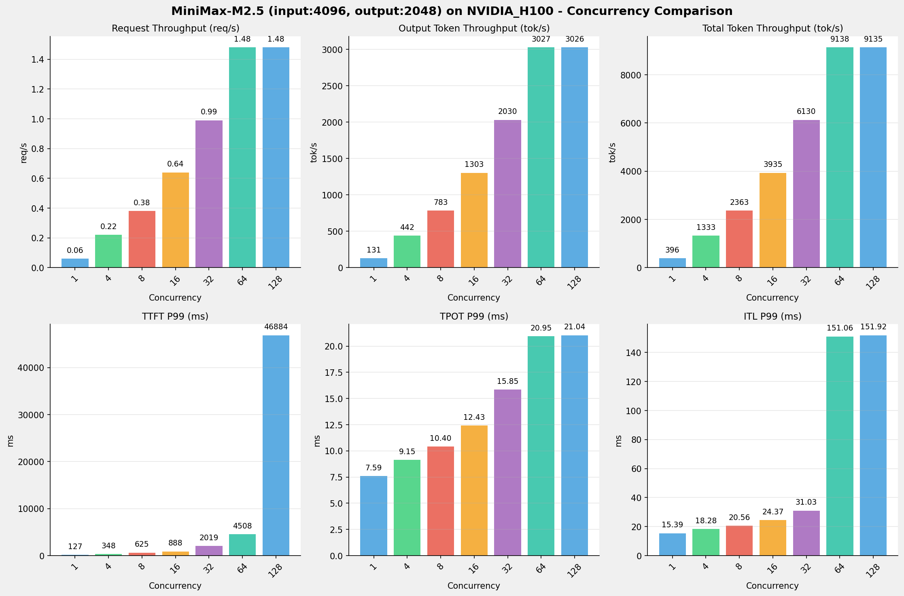

---

### input: 8192, output: 1024

| 并发数 | 请求吞吐量 (req/s) | 输出Token吞吐量 (tok/s) | 总Token吞吐量 (tok/s) | TTFT P99 (ms) | TPOT P99 (ms) | ITL P99 (ms) |
| --------------- | --------------- | --------------- | --------------- | --------------- | --------------- | --------------- |
| 1 | 0.12 | 127.41 | 1151.56 | 219.81 | 7.67 | 15.53 |
| 4 | 0.40 | 410.74 | 3712.34 | 656.13 | 9.65 | 18.64 |
| 8 | 0.68 | 695.31 | 6284.28 | 1095.11 | 11.50 | 21.33 |
| 16 | 1.06 | 1083.50 | 9792.79 | 1314.68 | 14.71 | 152.01 |
| 32 | 1.52 | 1557.65 | 14078.15 | 4184.75 | 20.26 | 159.35 |
| 64 | 2.05 | 2104.06 | 19016.63 | 9208.08 | 29.92 | 183.86 |
| 128 | 2.06 | 2106.36 | 19037.48 | 39923.84 | 29.85 | 317.44 |

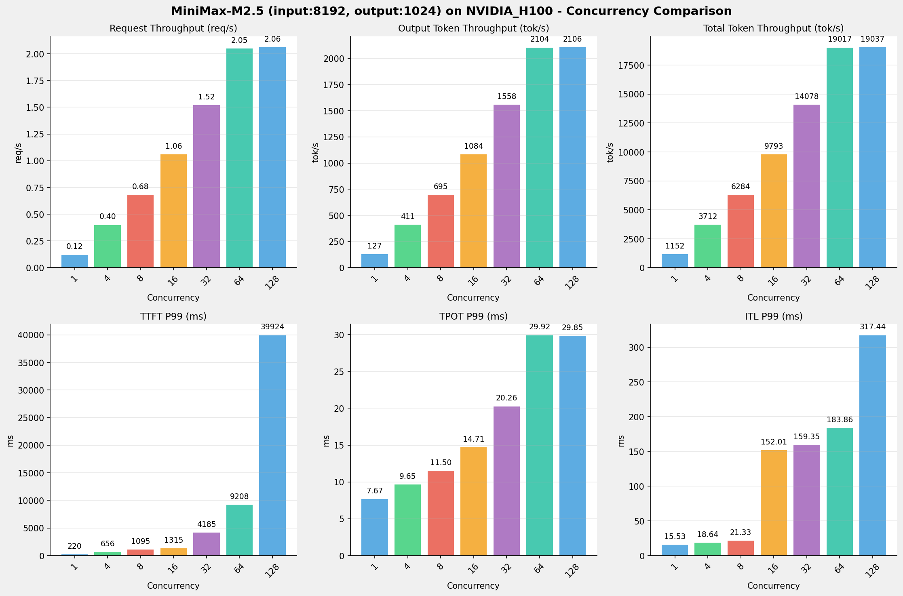

---

## 📊 I/O对比（固定并发数，随上下文长度变化）

### 并发数 = 1

| 指标 | i128_o128 | i512_o256 | i1024_o512 | i2048_o1024 | i4096_o2048 | i8192_o1024 |
| --- | --- | --- | --- | --- | --- | --- |
| 请求吞吐量 (req/s) | 1.03 | 0.50 | 0.26 | 0.13 | 0.06 | 0.12 |
| 输出Token吞吐量 (tok/s) | 132.10 | 129.25 | 131.35 | 132.15 | 131.17 | 127.41 |
| 总Token吞吐量 (tok/s) | 304.45 | 407.43 | 404.06 | 401.49 | 396.00 | 1151.56 |
| TTFT P99 (ms) | 29.15 | 101.94 | 105.19 | 111.86 | 126.64 | 219.81 |
| TPOT P99 (ms) | 7.43 | 7.45 | 7.47 | 7.49 | 7.59 | 7.67 |
| ITL P99 (ms) | 7.81 | 7.97 | 15.01 | 15.14 | 15.39 | 15.53 |

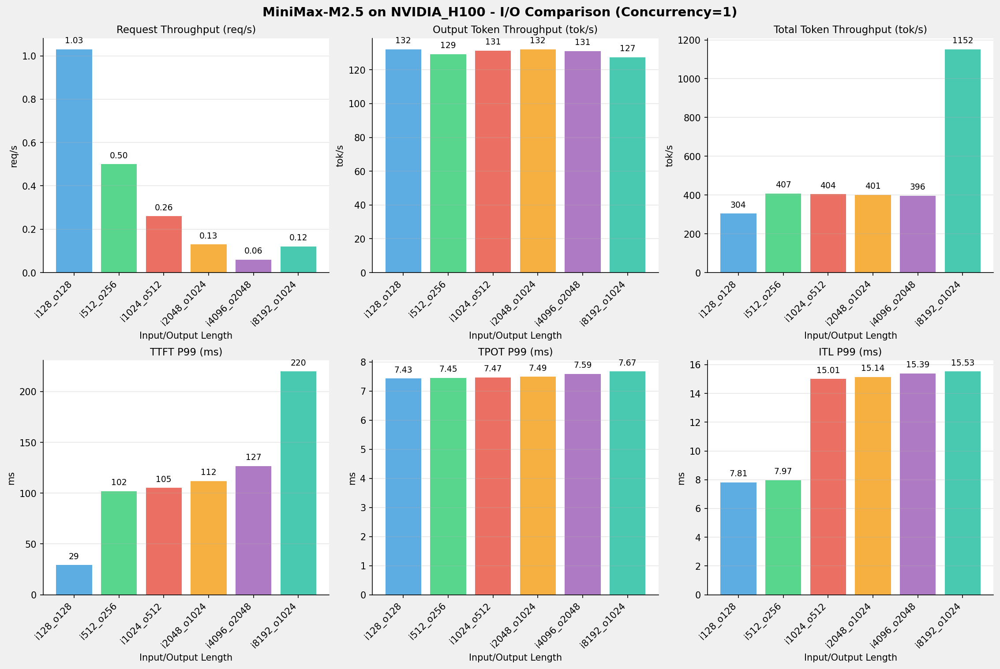

---

### 并发数 = 4

| 指标 | i128_o128 | i512_o256 | i1024_o512 | i2048_o1024 | i4096_o2048 | i8192_o1024 |
| --- | --- | --- | --- | --- | --- | --- |
| 请求吞吐量 (req/s) | 3.34 | 1.67 | 0.86 | 0.43 | 0.22 | 0.40 |
| 输出Token吞吐量 (tok/s) | 427.14 | 426.71 | 439.84 | 444.20 | 441.66 | 410.74 |
| 总Token吞吐量 (tok/s) | 984.42 | 1345.13 | 1353.02 | 1349.53 | 1333.39 | 3712.34 |
| TTFT P99 (ms) | 105.78 | 170.36 | 177.82 | 225.74 | 347.71 | 656.13 |
| TPOT P99 (ms) | 9.31 | 9.29 | 8.99 | 9.05 | 9.15 | 9.65 |
| ITL P99 (ms) | 9.81 | 9.95 | 17.86 | 18.00 | 18.28 | 18.64 |

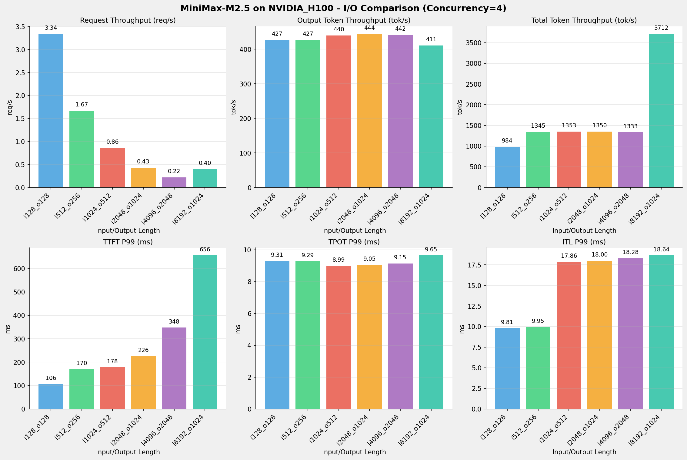

---

### 并发数 = 8

| 指标 | i128_o128 | i512_o256 | i1024_o512 | i2048_o1024 | i4096_o2048 | i8192_o1024 |
| --- | --- | --- | --- | --- | --- | --- |
| 请求吞吐量 (req/s) | 6.02 | 3.06 | 1.55 | 0.78 | 0.38 | 0.68 |
| 输出Token吞吐量 (tok/s) | 770.36 | 782.80 | 792.15 | 796.35 | 782.67 | 695.31 |
| 总Token吞吐量 (tok/s) | 1775.45 | 2467.65 | 2436.78 | 2419.37 | 2362.93 | 6284.28 |
| TTFT P99 (ms) | 153.33 | 165.00 | 208.22 | 361.65 | 625.36 | 1095.11 |
| TPOT P99 (ms) | 10.22 | 9.98 | 10.11 | 10.13 | 10.40 | 11.50 |
| ITL P99 (ms) | 10.83 | 10.91 | 19.82 | 20.01 | 20.56 | 21.33 |

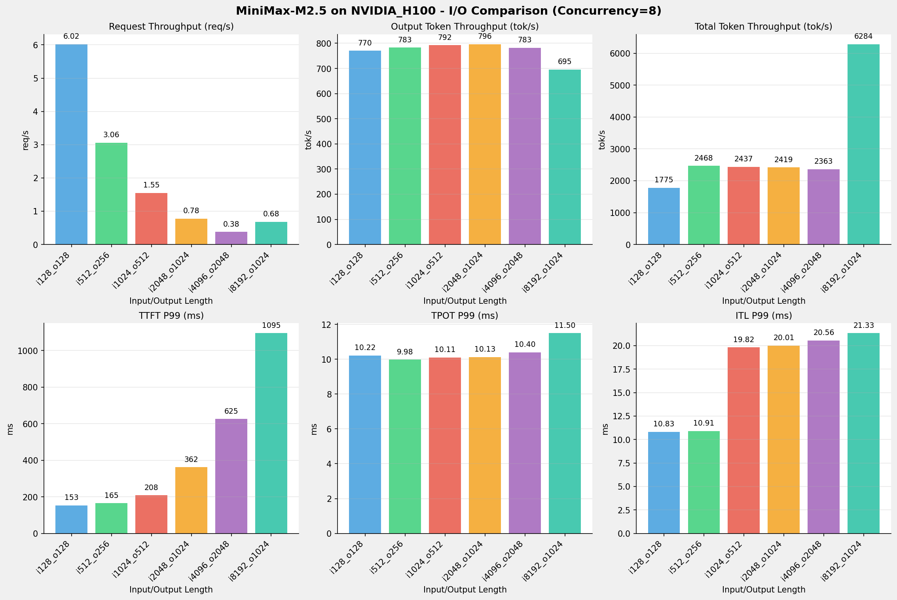

---

### 并发数 = 16

| 指标 | i128_o128 | i512_o256 | i1024_o512 | i2048_o1024 | i4096_o2048 | i8192_o1024 |
| --- | --- | --- | --- | --- | --- | --- |
| 请求吞吐量 (req/s) | 10.09 | 5.17 | 2.62 | 1.31 | 0.64 | 1.06 |
| 输出Token吞吐量 (tok/s) | 1291.07 | 1322.61 | 1339.60 | 1338.77 | 1303.31 | 1083.50 |
| 总Token吞吐量 (tok/s) | 2975.50 | 4169.31 | 4120.83 | 4067.31 | 3934.74 | 9792.79 |
| TTFT P99 (ms) | 116.92 | 199.16 | 337.29 | 579.97 | 887.67 | 1314.68 |
| TPOT P99 (ms) | 12.53 | 11.85 | 11.90 | 12.00 | 12.43 | 14.71 |
| ITL P99 (ms) | 19.61 | 13.06 | 23.16 | 23.49 | 24.37 | 152.01 |

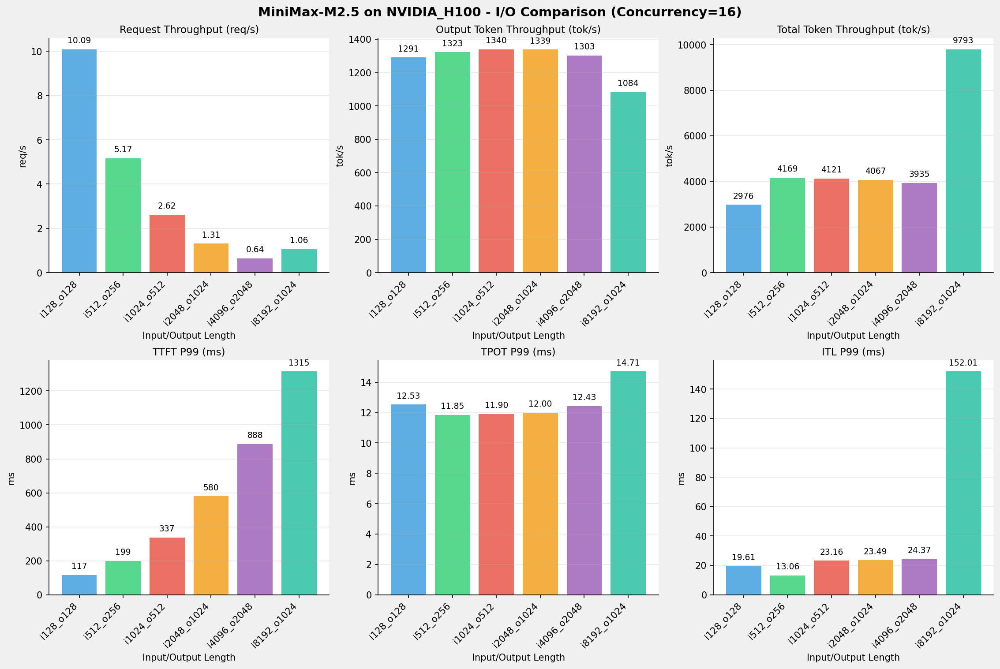

---

### 并发数 = 32

| 指标 | i128_o128 | i512_o256 | i1024_o512 | i2048_o1024 | i4096_o2048 | i8192_o1024 |
| --- | --- | --- | --- | --- | --- | --- |
| 请求吞吐量 (req/s) | 17.11 | 8.41 | 4.22 | 2.06 | 0.99 | 1.52 |
| 输出Token吞吐量 (tok/s) | 2190.57 | 2153.58 | 2161.89 | 2108.53 | 2030.40 | 1557.65 |
| 总Token吞吐量 (tok/s) | 5048.59 | 6788.82 | 6650.35 | 6405.90 | 6129.87 | 14078.15 |
| TTFT P99 (ms) | 256.75 | 357.62 | 483.29 | 1137.22 | 2019.10 | 4184.75 |
| TPOT P99 (ms) | 14.25 | 14.49 | 14.73 | 15.01 | 15.85 | 20.26 |
| ITL P99 (ms) | 19.96 | 27.58 | 29.45 | 29.04 | 31.03 | 159.35 |

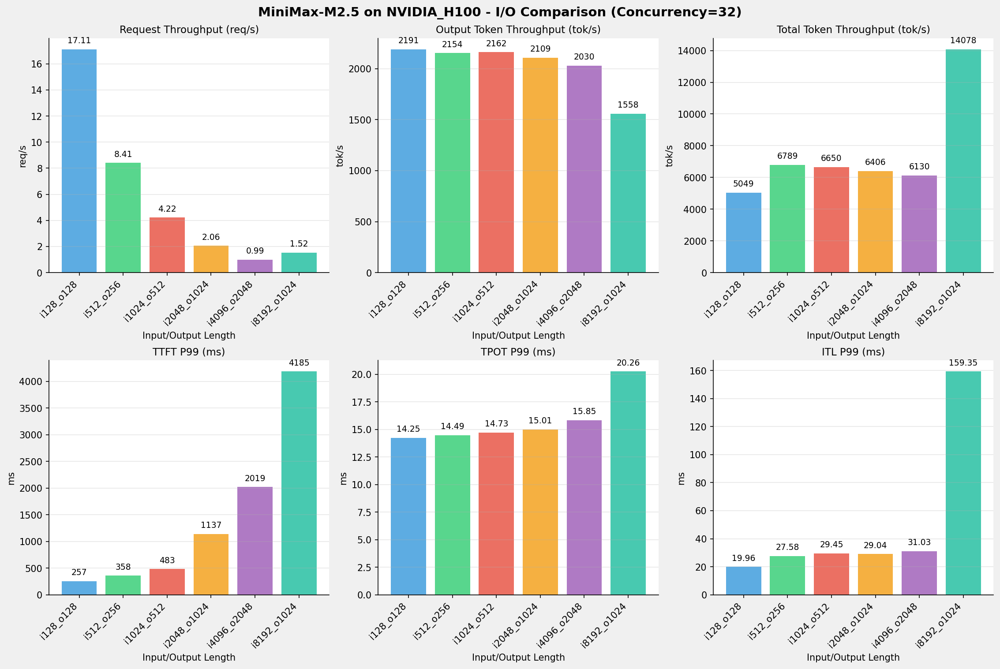

---

### 并发数 = 64

| 指标 | i128_o128 | i512_o256 | i1024_o512 | i2048_o1024 | i4096_o2048 | i8192_o1024 |
| --- | --- | --- | --- | --- | --- | --- |
| 请求吞吐量 (req/s) | 27.90 | 13.68 | 6.70 | 3.18 | 1.48 | 2.05 |
| 输出Token吞吐量 (tok/s) | 3571.65 | 3502.52 | 3430.95 | 3257.09 | 3026.85 | 2104.06 |
| 总Token吞吐量 (tok/s) | 8231.54 | 11041.15 | 10554.20 | 9895.33 | 9138.18 | 19016.63 |
| TTFT P99 (ms) | 354.30 | 531.95 | 779.16 | 2322.59 | 4507.91 | 9208.08 |
| TPOT P99 (ms) | 17.66 | 17.74 | 18.78 | 19.34 | 20.95 | 29.92 |
| ITL P99 (ms) | 23.73 | 57.55 | 71.82 | 146.03 | 151.06 | 183.86 |

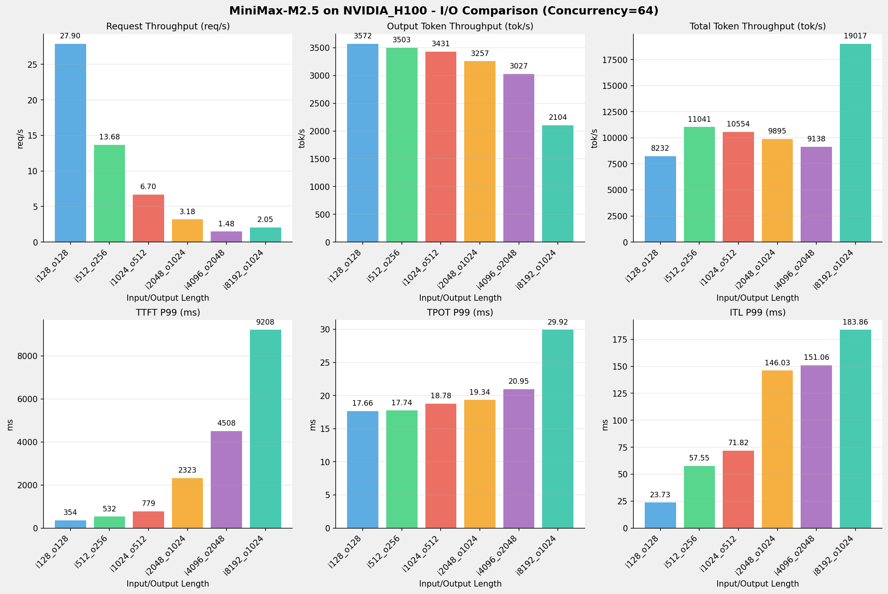

---

### 并发数 = 128

| 指标 | i128_o128 | i512_o256 | i1024_o512 | i2048_o1024 | i4096_o2048 | i8192_o1024 |
| --- | --- | --- | --- | --- | --- | --- |
| 请求吞吐量 (req/s) | 28.81 | 13.68 | 6.78 | 3.18 | 1.48 | 2.06 |
| 输出Token吞吐量 (tok/s) | 3687.40 | 3502.84 | 3469.97 | 3260.17 | 3025.82 | 2106.36 |
| 总Token吞吐量 (tok/s) | 8498.30 | 11042.17 | 10674.24 | 9904.68 | 9135.07 | 19037.48 |
| TTFT P99 (ms) | 2585.21 | 5255.30 | 10222.45 | 21939.31 | 46883.70 | 39923.84 |
| TPOT P99 (ms) | 16.86 | 17.79 | 18.59 | 19.38 | 21.04 | 29.85 |
| ITL P99 (ms) | 21.18 | 60.71 | 56.76 | 145.04 | 151.92 | 317.44 |

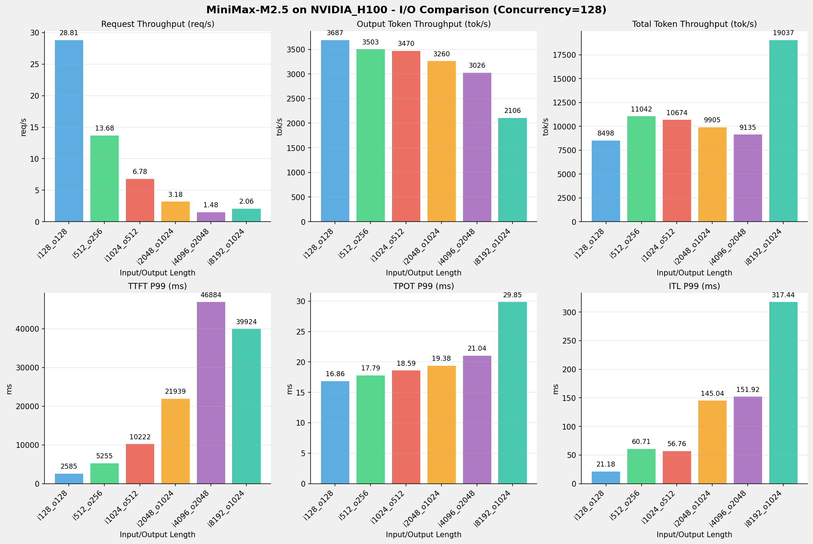

---

## 📝 详细性能数据

### input: 128, output: 128

#### 服务基准结果

| 指标 | 1 并发 | 4 并发 | 8 并发 | 16 并发 | 32 并发 | 64 并发 | 128 并发 |
| ----------- | ----------- | ----------- | ----------- | ----------- | ----------- | ----------- | ----------- |
| 成功请求数 | 1000 | 1000 | 1000 | 1000 | 1000 | 1000 | 1000 |
| 失败请求数 | 0 | 0 | 0 | 0 | 0 | 0 | 0 |
| 测试持续时间 (s) | 968.95 | 299.67 | 166.16 | 99.14 | 58.43 | 35.84 | 34.71 |
| 总输入 tokens | 167000 | 167000 | 167000 | 167000 | 167000 | 167000 | 167000 |
| 总生成 tokens | 128000 | 128000 | 128000 | 128000 | 128000 | 128000 | 128000 |
| **请求吞吐量 (req/s)** | 1.03 | 3.34 | 6.02 | 10.09 | 17.11 | 27.90 | 28.81 |
| **输出 token 吞吐量 (tok/s)** | 132.10 | 427.14 | 770.36 | 1291.07 | 2190.57 | 3571.65 | 3687.40 |
| 峰值输出 token 吞吐量 (tok/s) | 135.00 | 460.00 | 830.00 | 1408.00 | 2459.00 | 4154.00 | 4160.00 |
| 峰值并发请求数 | 3.00 | 8.00 | 16.00 | 32.00 | 64.00 | 128.00 | 192.00 |
| **总 token 吞吐量 (tok/s)** | 304.45 | 984.42 | 1775.45 | 2975.50 | 5048.59 | 8231.54 | 8498.30 |

#### TTFT

| 指标 | 1 并发 | 4 并发 | 8 并发 | 16 并发 | 32 并发 | 64 并发 | 128 并发 |
|----------- | ----------- | ----------- | ----------- | ----------- | ----------- | ----------- | -----------|
| 平均 TTFT (ms) | 26.79 | 71.90 | 79.41 | 74.88 | 132.11 | 178.35 | 2200.11 |
| 中位 TTFT (ms) | 26.80 | 87.54 | 84.88 | 88.43 | 144.16 | 190.92 | 2326.16 |
| P95 TTFT (ms) | 28.01 | 102.36 | 136.39 | 111.18 | 176.25 | 302.12 | 2581.26 |
| P99 TTFT (ms) | 29.15 | 105.78 | 153.33 | 116.92 | 256.75 | 354.30 | 2585.21 |

#### TPOT

| 指标 | 1 并发 | 4 并发 | 8 并发 | 16 并发 | 32 并发 | 64 并发 | 128 并发 |
|----------- | ----------- | ----------- | ----------- | ----------- | ----------- | ----------- | -----------|
| 平均 TPOT (ms) | 7.42 | 8.87 | 9.84 | 11.81 | 13.44 | 16.27 | 15.99 |
| 中位 TPOT (ms) | 7.42 | 8.78 | 9.76 | 11.80 | 13.38 | 16.24 | 16.05 |
| P95 TPOT (ms) | 7.42 | 9.21 | 10.15 | 12.27 | 14.16 | 17.31 | 16.55 |
| P99 TPOT (ms) | 7.43 | 9.31 | 10.22 | 12.53 | 14.25 | 17.66 | 16.86 |

#### ITL

| 指标 | 1 并发 | 4 并发 | 8 并发 | 16 并发 | 32 并发 | 64 并发 | 128 并发 |
|----------- | ----------- | ----------- | ----------- | ----------- | ----------- | ----------- | -----------|
| 平均 ITL (ms) | 7.36 | 8.80 | 9.76 | 11.72 | 13.33 | 16.14 | 15.86 |
| 中位 ITL (ms) | 7.41 | 8.78 | 9.77 | 11.42 | 13.42 | 15.96 | 15.92 |
| P95 ITL (ms) | 7.52 | 9.08 | 10.11 | 12.82 | 14.05 | 17.16 | 16.84 |
| P99 ITL (ms) | 7.81 | 9.81 | 10.83 | 19.61 | 19.96 | 23.73 | 21.18 |

---

### input: 512, output: 256

#### 服务基准结果

| 指标 | 1 并发 | 4 并发 | 8 并发 | 16 并发 | 32 并发 | 64 并发 | 128 并发 |
| ----------- | ----------- | ----------- | ----------- | ----------- | ----------- | ----------- | ----------- |
| 成功请求数 | 1000 | 1000 | 1000 | 1000 | 1000 | 1000 | 1000 |
| 失败请求数 | 0 | 0 | 0 | 0 | 0 | 0 | 0 |
| 测试持续时间 (s) | 1980.70 | 599.94 | 327.03 | 193.56 | 118.87 | 73.09 | 73.08 |
| 总输入 tokens | 551000 | 551000 | 551000 | 551000 | 551000 | 551000 | 551000 |
| 总生成 tokens | 256000 | 256000 | 256000 | 256000 | 256000 | 256000 | 256000 |
| **请求吞吐量 (req/s)** | 0.50 | 1.67 | 3.06 | 5.17 | 8.41 | 13.68 | 13.68 |
| **输出 token 吞吐量 (tok/s)** | 129.25 | 426.71 | 782.80 | 1322.61 | 2153.58 | 3502.52 | 3502.84 |
| 峰值输出 token 吞吐量 (tok/s) | 136.00 | 463.00 | 838.00 | 1453.00 | 2432.00 | 4066.00 | 4045.00 |
| 峰值并发请求数 | 2.00 | 8.00 | 16.00 | 32.00 | 64.00 | 128.00 | 192.00 |
| **总 token 吞吐量 (tok/s)** | 407.43 | 1345.13 | 2467.65 | 4169.31 | 6788.82 | 11041.15 | 11042.17 |

#### TTFT

| 指标 | 1 并发 | 4 并发 | 8 并发 | 16 并发 | 32 并发 | 64 并发 | 128 并发 |
|----------- | ----------- | ----------- | ----------- | ----------- | ----------- | ----------- | -----------|
| 平均 TTFT (ms) | 83.60 | 113.66 | 125.34 | 164.12 | 231.55 | 259.04 | 4575.95 |
| 中位 TTFT (ms) | 82.89 | 125.99 | 137.59 | 172.67 | 239.01 | 256.14 | 4836.70 |
| P95 TTFT (ms) | 97.10 | 158.29 | 154.04 | 194.98 | 329.67 | 457.44 | 4979.31 |
| P99 TTFT (ms) | 101.94 | 170.36 | 165.00 | 199.16 | 357.62 | 531.95 | 5255.30 |

#### TPOT

| 指标 | 1 并发 | 4 并发 | 8 并发 | 16 并发 | 32 并发 | 64 并发 | 128 并发 |
|----------- | ----------- | ----------- | ----------- | ----------- | ----------- | ----------- | -----------|
| 平均 TPOT (ms) | 7.44 | 8.96 | 9.77 | 11.42 | 13.77 | 16.97 | 17.04 |
| 中位 TPOT (ms) | 7.44 | 8.99 | 9.74 | 11.44 | 13.76 | 17.07 | 17.12 |
| P95 TPOT (ms) | 7.45 | 9.25 | 9.95 | 11.76 | 14.33 | 17.45 | 17.50 |
| P99 TPOT (ms) | 7.45 | 9.29 | 9.98 | 11.85 | 14.49 | 17.74 | 17.79 |

#### ITL

| 指标 | 1 并发 | 4 并发 | 8 并发 | 16 并发 | 32 并发 | 64 并发 | 128 并发 |
|----------- | ----------- | ----------- | ----------- | ----------- | ----------- | ----------- | -----------|
| 平均 ITL (ms) | 7.43 | 8.95 | 9.76 | 11.41 | 13.75 | 16.97 | 17.01 |
| 中位 ITL (ms) | 7.43 | 8.82 | 9.74 | 11.32 | 13.39 | 16.14 | 16.17 |
| P95 ITL (ms) | 7.55 | 9.10 | 10.09 | 11.79 | 13.92 | 16.92 | 16.94 |
| P99 ITL (ms) | 7.97 | 9.95 | 10.91 | 13.06 | 27.58 | 57.55 | 60.71 |

---

### input: 1024, output: 512

#### 服务基准结果

| 指标 | 1 并发 | 4 并发 | 8 并发 | 16 并发 | 32 并发 | 64 并发 | 128 并发 |
| ----------- | ----------- | ----------- | ----------- | ----------- | ----------- | ----------- | ----------- |
| 成功请求数 | 1000 | 1000 | 1000 | 1000 | 1000 | 1000 | 1000 |
| 失败请求数 | 0 | 0 | 0 | 0 | 0 | 0 | 0 |
| 测试持续时间 (s) | 3897.89 | 1164.06 | 646.34 | 382.20 | 236.83 | 149.23 | 147.55 |
| 总输入 tokens | 1063000 | 1063000 | 1063000 | 1063000 | 1063000 | 1063000 | 1063000 |
| 总生成 tokens | 512000 | 512000 | 512000 | 512000 | 512000 | 512000 | 512000 |
| **请求吞吐量 (req/s)** | 0.26 | 0.86 | 1.55 | 2.62 | 4.22 | 6.70 | 6.78 |
| **输出 token 吞吐量 (tok/s)** | 131.35 | 439.84 | 792.15 | 1339.60 | 2161.89 | 3430.95 | 3469.97 |
| 峰值输出 token 吞吐量 (tok/s) | 136.00 | 460.00 | 839.00 | 1440.00 | 2411.00 | 3973.00 | 4009.00 |
| 峰值并发请求数 | 2.00 | 8.00 | 16.00 | 32.00 | 64.00 | 128.00 | 192.00 |
| **总 token 吞吐量 (tok/s)** | 404.06 | 1353.02 | 2436.78 | 4120.83 | 6650.35 | 10554.20 | 10674.24 |

#### TTFT

| 指标 | 1 并发 | 4 并发 | 8 并发 | 16 并发 | 32 并发 | 64 并发 | 128 并发 |
|----------- | ----------- | ----------- | ----------- | ----------- | ----------- | ----------- | -----------|
| 平均 TTFT (ms) | 87.20 | 137.89 | 151.91 | 214.21 | 246.37 | 391.26 | 8995.70 |
| 中位 TTFT (ms) | 85.84 | 147.19 | 160.48 | 215.61 | 254.14 | 416.86 | 9408.36 |
| P95 TTFT (ms) | 99.91 | 170.16 | 191.30 | 318.58 | 405.22 | 661.32 | 9996.15 |
| P99 TTFT (ms) | 105.19 | 177.82 | 208.22 | 337.29 | 483.29 | 779.16 | 10222.45 |

#### TPOT

| 指标 | 1 并发 | 4 并发 | 8 并发 | 16 并发 | 32 并发 | 64 并发 | 128 并发 |
|----------- | ----------- | ----------- | ----------- | ----------- | ----------- | ----------- | -----------|
| 平均 TPOT (ms) | 7.46 | 8.84 | 9.82 | 11.47 | 14.11 | 17.56 | 17.58 |
| 中位 TPOT (ms) | 7.46 | 8.83 | 9.78 | 11.44 | 14.10 | 17.60 | 17.41 |
| P95 TPOT (ms) | 7.47 | 8.96 | 10.03 | 11.80 | 14.58 | 18.56 | 18.37 |
| P99 TPOT (ms) | 7.47 | 8.99 | 10.11 | 11.90 | 14.73 | 18.78 | 18.59 |

#### ITL

| 指标 | 1 并发 | 4 并发 | 8 并发 | 16 并发 | 32 并发 | 64 并发 | 128 并发 |
|----------- | ----------- | ----------- | ----------- | ----------- | ----------- | ----------- | -----------|
| 平均 ITL (ms) | 8.14 | 9.55 | 10.63 | 12.49 | 15.40 | 19.13 | 19.14 |
| 中位 ITL (ms) | 7.46 | 8.84 | 9.78 | 11.38 | 13.63 | 16.63 | 16.63 |
| P95 ITL (ms) | 14.92 | 17.50 | 19.32 | 22.42 | 27.21 | 33.43 | 33.36 |
| P99 ITL (ms) | 15.01 | 17.86 | 19.82 | 23.16 | 29.45 | 71.82 | 56.76 |

---

### input: 2048, output: 1024

#### 服务基准结果

| 指标 | 1 并发 | 4 并发 | 8 并发 | 16 并发 | 32 并发 | 64 并发 | 128 并发 |
| ----------- | ----------- | ----------- | ----------- | ----------- | ----------- | ----------- | ----------- |
| 成功请求数 | 1000 | 1000 | 1000 | 1000 | 1000 | 1000 | 1000 |
| 失败请求数 | 0 | 0 | 0 | 0 | 0 | 0 | 0 |
| 测试持续时间 (s) | 7748.68 | 2305.24 | 1285.87 | 764.88 | 485.65 | 314.39 | 314.09 |
| 总输入 tokens | 2087000 | 2087000 | 2087000 | 2087000 | 2087000 | 2087000 | 2087000 |
| 总生成 tokens | 1024000 | 1024000 | 1024000 | 1024000 | 1024000 | 1024000 | 1024000 |
| **请求吞吐量 (req/s)** | 0.13 | 0.43 | 0.78 | 1.31 | 2.06 | 3.18 | 3.18 |
| **输出 token 吞吐量 (tok/s)** | 132.15 | 444.20 | 796.35 | 1338.77 | 2108.53 | 3257.09 | 3260.17 |
| 峰值输出 token 吞吐量 (tok/s) | 135.00 | 456.00 | 824.00 | 1428.00 | 2336.00 | 3776.00 | 3776.00 |
| 峰值并发请求数 | 2.00 | 8.00 | 16.00 | 32.00 | 64.00 | 111.00 | 158.00 |
| **总 token 吞吐量 (tok/s)** | 401.49 | 1349.53 | 2419.37 | 4067.31 | 6405.90 | 9895.33 | 9904.68 |

#### TTFT

| 指标 | 1 并发 | 4 并发 | 8 并发 | 16 并发 | 32 并发 | 64 并发 | 128 并发 |
|----------- | ----------- | ----------- | ----------- | ----------- | ----------- | ----------- | -----------|
| 平均 TTFT (ms) | 92.99 | 170.29 | 244.70 | 361.06 | 554.30 | 660.47 | 18998.53 |
| 中位 TTFT (ms) | 91.64 | 201.51 | 254.07 | 351.40 | 594.54 | 593.05 | 20131.73 |
| P95 TTFT (ms) | 106.33 | 217.95 | 350.59 | 566.81 | 734.33 | 1025.05 | 20465.99 |
| P99 TTFT (ms) | 111.86 | 225.74 | 361.65 | 579.97 | 1137.22 | 2322.59 | 21939.31 |

#### TPOT

| 指标 | 1 并发 | 4 并发 | 8 并发 | 16 并发 | 32 并发 | 64 并发 | 128 并发 |
|----------- | ----------- | ----------- | ----------- | ----------- | ----------- | ----------- | -----------|
| 平均 TPOT (ms) | 7.48 | 8.85 | 9.82 | 11.53 | 14.41 | 18.66 | 18.94 |
| 中位 TPOT (ms) | 7.48 | 8.86 | 9.81 | 11.56 | 14.43 | 18.78 | 19.09 |
| P95 TPOT (ms) | 7.49 | 9.02 | 10.06 | 11.90 | 14.87 | 19.16 | 19.35 |
| P99 TPOT (ms) | 7.49 | 9.05 | 10.13 | 12.00 | 15.01 | 19.34 | 19.38 |

#### ITL

| 指标 | 1 并发 | 4 并发 | 8 并发 | 16 并发 | 32 并发 | 64 并发 | 128 并发 |
|----------- | ----------- | ----------- | ----------- | ----------- | ----------- | ----------- | -----------|
| 平均 ITL (ms) | 9.26 | 10.87 | 12.22 | 14.35 | 17.70 | 23.20 | 23.47 |
| 中位 ITL (ms) | 7.49 | 8.89 | 9.88 | 11.54 | 14.07 | 17.41 | 17.44 |
| P95 ITL (ms) | 15.03 | 17.79 | 19.61 | 22.85 | 28.06 | 34.97 | 35.02 |
| P99 ITL (ms) | 15.14 | 18.00 | 20.01 | 23.49 | 29.04 | 146.03 | 145.04 |

---

### input: 4096, output: 2048

#### 服务基准结果

| 指标 | 1 并发 | 4 并发 | 8 并发 | 16 并发 | 32 并发 | 64 并发 | 128 并发 |
| ----------- | ----------- | ----------- | ----------- | ----------- | ----------- | ----------- | ----------- |
| 成功请求数 | 1000 | 1000 | 1000 | 1000 | 1000 | 1000 | 1000 |
| 失败请求数 | 0 | 0 | 0 | 0 | 0 | 0 | 0 |
| 测试持续时间 (s) | 15613.65 | 4637.06 | 2616.67 | 1571.39 | 1008.67 | 676.61 | 676.84 |
| 总输入 tokens | 4135000 | 4135000 | 4135000 | 4135000 | 4135000 | 4135000 | 4135000 |
| 总生成 tokens | 2048000 | 2048000 | 2048000 | 2048000 | 2048000 | 2048000 | 2048000 |
| **请求吞吐量 (req/s)** | 0.06 | 0.22 | 0.38 | 0.64 | 0.99 | 1.48 | 1.48 |
| **输出 token 吞吐量 (tok/s)** | 131.17 | 441.66 | 782.67 | 1303.31 | 2030.40 | 3026.85 | 3025.82 |
| 峰值输出 token 吞吐量 (tok/s) | 134.00 | 454.00 | 808.00 | 1376.00 | 2208.00 | 3520.00 | 3456.00 |
| 峰值并发请求数 | 2.00 | 8.00 | 16.00 | 32.00 | 51.00 | 81.00 | 143.00 |
| **总 token 吞吐量 (tok/s)** | 396.00 | 1333.39 | 2362.93 | 3934.74 | 6129.87 | 9138.18 | 9135.07 |

#### TTFT

| 指标 | 1 并发 | 4 并发 | 8 并发 | 16 并发 | 32 并发 | 64 并发 | 128 并发 |
|----------- | ----------- | ----------- | ----------- | ----------- | ----------- | ----------- | -----------|
| 平均 TTFT (ms) | 114.66 | 261.18 | 429.94 | 535.05 | 579.71 | 724.48 | 40686.02 |
| 中位 TTFT (ms) | 114.06 | 277.63 | 473.23 | 585.04 | 600.21 | 609.50 | 43099.58 |
| P95 TTFT (ms) | 121.61 | 337.67 | 619.57 | 744.68 | 758.49 | 1550.34 | 43838.20 |
| P99 TTFT (ms) | 126.64 | 347.71 | 625.36 | 887.67 | 2019.10 | 4507.91 | 46883.70 |

#### TPOT

| 指标 | 1 并发 | 4 并发 | 8 并发 | 16 并发 | 32 并发 | 64 并发 | 128 并发 |
|----------- | ----------- | ----------- | ----------- | ----------- | ----------- | ----------- | -----------|
| 平均 TPOT (ms) | 7.57 | 8.93 | 10.02 | 11.94 | 15.25 | 20.42 | 20.53 |
| 中位 TPOT (ms) | 7.57 | 8.95 | 10.03 | 11.96 | 15.27 | 20.54 | 20.68 |
| P95 TPOT (ms) | 7.58 | 9.12 | 10.29 | 12.32 | 15.65 | 20.81 | 20.97 |
| P99 TPOT (ms) | 7.59 | 9.15 | 10.40 | 12.43 | 15.85 | 20.95 | 21.04 |

#### ITL

| 指标 | 1 并发 | 4 并发 | 8 并发 | 16 并发 | 32 并发 | 64 并发 | 128 并发 |
|----------- | ----------- | ----------- | ----------- | ----------- | ----------- | ----------- | -----------|
| 平均 ITL (ms) | 10.17 | 12.00 | 13.60 | 16.10 | 20.67 | 27.77 | 27.69 |
| 中位 ITL (ms) | 7.59 | 9.05 | 10.14 | 11.97 | 14.84 | 19.00 | 19.03 |
| P95 ITL (ms) | 15.21 | 18.06 | 20.16 | 23.80 | 29.51 | 38.64 | 38.65 |
| P99 ITL (ms) | 15.39 | 18.28 | 20.56 | 24.37 | 31.03 | 151.06 | 151.92 |

---

### input: 8192, output: 1024

#### 服务基准结果

| 指标 | 1 并发 | 4 并发 | 8 并发 | 16 并发 | 32 并发 | 64 并发 | 128 并发 |
| ----------- | ----------- | ----------- | ----------- | ----------- | ----------- | ----------- | ----------- |
| 成功请求数 | 1000 | 1000 | 1000 | 1000 | 1000 | 1000 | 1000 |
| 失败请求数 | 0 | 0 | 0 | 0 | 0 | 0 | 0 |
| 测试持续时间 (s) | 8036.89 | 2493.04 | 1472.72 | 945.08 | 657.40 | 486.68 | 486.15 |
| 总输入 tokens | 8231000 | 8231000 | 8231000 | 8231000 | 8231000 | 8231000 | 8231000 |
| 总生成 tokens | 1024000 | 1024000 | 1024000 | 1024000 | 1024000 | 1024000 | 1024000 |
| **请求吞吐量 (req/s)** | 0.12 | 0.40 | 0.68 | 1.06 | 1.52 | 2.05 | 2.06 |
| **输出 token 吞吐量 (tok/s)** | 127.41 | 410.74 | 695.31 | 1083.50 | 1557.65 | 2104.06 | 2106.36 |
| 峰值输出 token 吞吐量 (tok/s) | 133.00 | 440.00 | 777.00 | 1294.00 | 2016.00 | 3057.00 | 3049.00 |
| 峰值并发请求数 | 2.00 | 8.00 | 16.00 | 28.00 | 43.00 | 74.00 | 135.00 |
| **总 token 吞吐量 (tok/s)** | 1151.56 | 3712.34 | 6284.28 | 9792.79 | 14078.15 | 19016.63 | 19037.48 |

#### TTFT

| 指标 | 1 并发 | 4 并发 | 8 并发 | 16 并发 | 32 并发 | 64 并发 | 128 并发 |
|----------- | ----------- | ----------- | ----------- | ----------- | ----------- | ----------- | -----------|
| 平均 TTFT (ms) | 207.63 | 500.30 | 771.22 | 811.15 | 932.96 | 1148.19 | 29955.02 |
| 中位 TTFT (ms) | 208.15 | 512.44 | 798.01 | 922.18 | 944.24 | 804.66 | 31296.38 |
| P95 TTFT (ms) | 215.72 | 651.75 | 1082.72 | 1095.33 | 1107.73 | 3057.72 | 33523.35 |
| P99 TTFT (ms) | 219.81 | 656.13 | 1095.11 | 1314.68 | 4184.75 | 9208.08 | 39923.84 |

#### TPOT

| 指标 | 1 并发 | 4 并发 | 8 并发 | 16 并发 | 32 并发 | 64 并发 | 128 并发 |
|----------- | ----------- | ----------- | ----------- | ----------- | ----------- | ----------- | -----------|
| 平均 TPOT (ms) | 7.65 | 9.26 | 10.76 | 13.90 | 19.40 | 28.90 | 29.18 |
| 中位 TPOT (ms) | 7.65 | 9.21 | 10.72 | 13.89 | 19.48 | 29.30 | 29.65 |
| P95 TPOT (ms) | 7.67 | 9.62 | 11.32 | 14.52 | 19.99 | 29.73 | 29.76 |
| P99 TPOT (ms) | 7.67 | 9.65 | 11.50 | 14.71 | 20.26 | 29.92 | 29.85 |

#### ITL

| 指标 | 1 并发 | 4 并发 | 8 并发 | 16 并发 | 32 并发 | 64 并发 | 128 并发 |
|----------- | ----------- | ----------- | ----------- | ----------- | ----------- | ----------- | -----------|
| 平均 ITL (ms) | 9.67 | 11.75 | 13.60 | 17.68 | 24.93 | 36.26 | 36.96 |
| 中位 ITL (ms) | 7.67 | 9.22 | 10.49 | 12.66 | 16.18 | 21.50 | 21.49 |
| P95 ITL (ms) | 15.38 | 18.42 | 20.85 | 25.19 | 32.38 | 156.98 | 158.32 |
| P99 ITL (ms) | 15.53 | 18.64 | 21.33 | 152.01 | 159.35 | 183.86 | 317.44 |

---

*报告生成时间: 2026-05-25*

