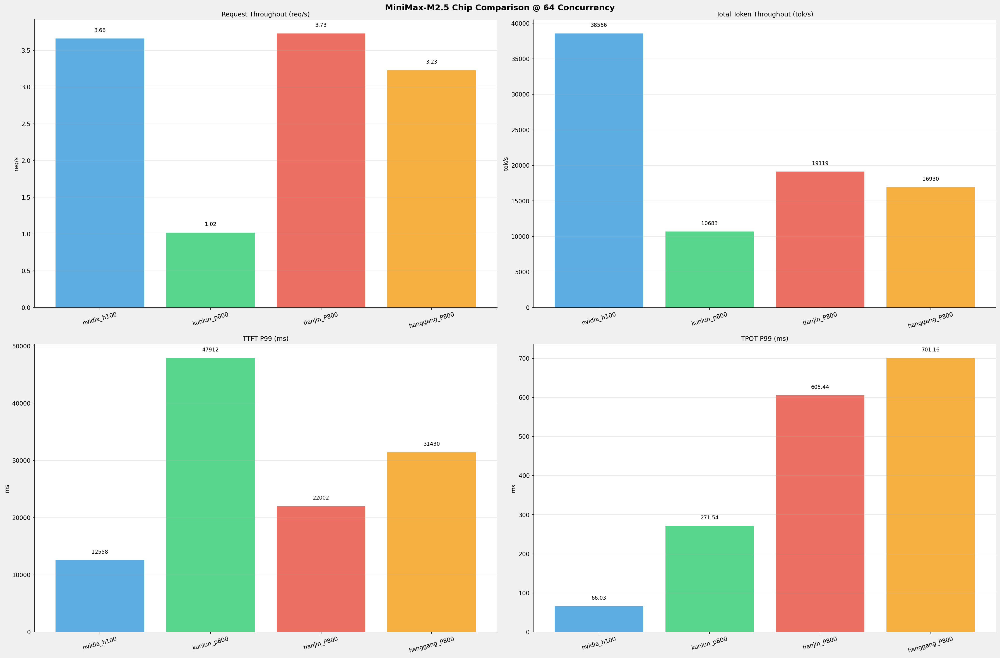

# MiniMax-M2.5模型在不同平台下的benchmark和精度比对报告

<div align="center">
**测试日期：** 2026-07-13

</div>

---

## 本测试报告中不同平台的部署框架
- **NVIDIA_H100: vLLM**
- **kunlun_p800: vLLM**
- **tianjin_P800: SGLang**
- **hanggang_P800: SGLang**


## Benchmark测试
在固定请求数，输入上下文和输出上下文长度下，使用bench serve工具对并发数逐级增加场景的性能比对。

**主要采集指标**：

| 指标                  | 单位         | 含义                                 |
|---------------------|------------|------------------------------------|
| TTFT                | ms         | Time To First Token，首 token 延迟     |
| TPOT                | ms/token   | Time Per Output Token，每 token 生成时间 |
| Throughput          | tokens/s   | 系统总吞吐                              |
| QPS                 | requests/s | 请求吞吐                               |
| P50/P95/P99 Latency | ms         | 延迟分位数                              |
    

---

### 🤖 芯片和模型配置信息

| 参数名称                        | **nvidia_h100** | **kunlun_p800**                | **tianjin_P800**  | **hanggang_P800** |
|-----------------------------|-----------------|--------------------------------|-------------------|-------------------|
| **max_position_embeddings** | 196608          | 196608                         | 196608            | 196608            |
| **model_name**              | MiniMax-M2.5    | MiniMax-M2.5-W8A8-INT8-Dynamic | MiniMax-M2.5-int8 | MiniMax-M2.5-int8 |
| **model_size**              | 215G            | 215G                           | 215G              | 215G              |
| **python_version**          | 3.12.3          | 3.10.15                        | 3.10.19           | 3.10.19           |
| **quantization_config**     | FP8             | w8a8_int8                      | w8a8_int8         | w8a8_int8         |
| **temperature**             | 1.0             | 1.0                            | 1.0               | 1.0               |
| **top_k**                   | 40              | 40                             | 40                | 40                |
| **top_p**                   | 0.95            | 0.95                           | 0.95              | 0.95              |
| **transformers_version**    | 4.46.1          | 4.46.1                         | 4.46.1            | 4.46.1            |
| **vllm_version**            | 0.20.0          | 0.11.0                         | N/A               | N/A               |
| **sglang_version**          | N/A             | N/A                            | 0.5.10+08768c8f9  | 0.5.10+08768c8f9  |

---

### ⚙️ 模型服务启动配置信息

| 参数名称                       | **nvidia_h100** | **kunlun_p800** | **tianjin_P800** | **hanggang_P800** |
|----------------------------|-----------------|-----------------|------------------|-------------------|
| **Attention Backend**      | N/A             | N/A             | kunlun           | kunlun            |
| **Context Length**         | 196608          | 196608          | 196608           | 196608            |
| **DP Size**                | 1               | 1               | 1                | 1                 |
| **PP Size**                | 1               | 1               | 1                | 1                 |
| **TP Size**                | 8               | 8               | 8                | 8                 |
| **EP Size**                | N/A             | N/A             | 8                | 8                 |
| **Block Size**             | default         | 128             | N/A              | N/A               |
| **Dtype**                  | default         | auto            | bfloat16         | bfloat16          |
| **Max Running Requests**   | 64              | 64              | 64               | 64                |
| **Gpu Memory Utilization** | 0.85            | 0.95            | 0.85             | 0.85              |
| **Chunked Prefill Size**   | N/A             | N/A             | 8192             | 8192              |
| **Max Num Batched Tokens** | 8192            | 8192            | N/A              | N/A               |
| **Cuda Graph Max Bs**      | N/A             | N/A             | 128              | 128               |
| **Disable Radix Cache**    | N/A             | N/A             | True             | True              |
| **Disable Radix Cache**    | N/A             | N/A             | True             | True              |
| **Reasoning Parser**       | minimax_m2      | minimax_m2      | minimax          | minimax           |
| **Tool Call Parser**       | minimax_m2      | minimax_m2      | minimax_m2       | minimax_m2        |

> tianjin_P800和hanggang_P800环境的启动部署详细命令见《附录一》

---

---

### 测试场景一： 短上下文

> benchmark测试命令见《附录二》

#### 📊 测试概览

| 项目            | 配置                                                    | 备注  |
|---------------|-------------------------------------------------------|-----|
| **数据集**       | random                                                |     |
| **并发数**       | 1, 64                                                 |     |
| **总请求数**      | 320                                                   |     |
| **请求输入上下文长度** | 10240（10k）                                            |     |
| **请求输出上下文长度** | 256（0.25k）                                            |     |
| **被测芯片**      | nvidia_h100, kunlun_p800, tianjin_P800, hanggang_P800 |     |
| **被测模型**      | MiniMax-M2.5                                          |     |

---

#### 📊 芯片性能对比柱状图


**1并发**


**64并发**



---

#### 📈 各指标随并发级别性能对比详情


##### 请求吞吐量（Request throughput (req/s)）

| 并发数 | nvidia_h100(基准) | kunlun_p800 | 相对基准 | tianjin_P800 | 相对基准 | hanggang_P800 | 相对基准 |
|-----|----------- | ----------- | ----------- | ----------- | ----------- | ----------- | -----------|
| 1   | 0.45 | 0.15 | -66.7% | 0.64 | +42.2% | 0.58 | +28.9% |
| 64   | 3.66 | 1.02 | -72.1% | 3.73 | +1.9% | 3.23 | -11.7% |


##### 输出token吞吐量（Output token throughput (tok/s)）

| 并发数 | nvidia_h100(基准) | kunlun_p800 | 相对基准 | tianjin_P800 | 相对基准 | hanggang_P800 | 相对基准 |
|-----|----------- | ----------- | ----------- | ----------- | ----------- | ----------- | -----------|
| 1   | 115.31 | 37.20 | -67.7% | 83.01 | -28.0% | 74.83 | -35.1% |
| 64   | 937.16 | 253.92 | -72.9% | 485.48 | -48.2% | 416.15 | -55.6% |


##### 总token吞吐量（Total token throughput (tok/s)）

| 并发数 | nvidia_h100(基准) | kunlun_p800 | 相对基准 | tianjin_P800 | 相对基准 | hanggang_P800 | 相对基准 |
|-----|----------- | ----------- | ----------- | ----------- | ----------- | ----------- | -----------|
| 1   | 4745.14 | 1585.87 | -66.6% | 3269.11 | -31.1% | 3044.41 | -35.8% |
| 64   | 38566.45 | 10682.97 | -72.3% | 19118.70 | -50.4% | 16929.83 | -56.1% |


##### 首token延迟（P99 TTFT (ms)）

| 并发数 | nvidia_h100(基准) | kunlun_p800 | 相对基准 | tianjin_P800 | 相对基准 | hanggang_P800 | 相对基准 |
|-----|----------- | ----------- | ----------- | ----------- | ----------- | ----------- | -----------|
| 1   | 286.01 | 921.76 | +222.3% | 1972.91 | +589.8% | 2188.87 | +665.3% |
| 64   | 12557.76 | 47912.19 | +281.5% | 22001.51 | +75.2% | 31429.92 | +150.3% |


##### 每token生成时间（P99 TPOT (ms)）

| 并发数 | nvidia_h100(基准) | kunlun_p800 | 相对基准 | tianjin_P800 | 相对基准 | hanggang_P800 | 相对基准 |
|-----|----------- | ----------- | ----------- | ----------- | ----------- | ----------- | -----------|
| 1   | 7.68 | 23.38 | +204.4% | 75.54 | +883.6% | 114.31 | +1388.4% |
| 64   | 66.03 | 271.54 | +311.2% | 605.44 | +816.9% | 701.16 | +961.9% |


##### token间延迟（P99 ITL (ms)）

| 并发数 | nvidia_h100(基准) | kunlun_p800 | 相对基准 | tianjin_P800 | 相对基准 | hanggang_P800 | 相对基准 |
|-----|----------- | ----------- | ----------- | ----------- | ----------- | ----------- | -----------|
| 1   | 8.57 | 24.07 | +180.9% | 107.20 | +1150.9% | 31.97 | +273.0% |
| 64   | 170.95 | 635.84 | +271.9% | 532.30 | +211.4% | 802.92 | +369.7% |


---

---

### 测试场景二： 超长上下文

#### 📊 测试概览
| 项目            | 配置                            | 备注  |
|---------------|-------------------------------|-----|
| **数据集**       | random                        |     |
| **并发数**       | 1, 10    |     |
| **总请求数**      | 100                           |     |
| **请求输入上下文长度** | 194560（190k）                    |     |
| **请求输出上下文长度** | 1024（1k）                    |     |
| **被测芯片**      | nvidia_h100, kunlun_p800, tianjin_P800, hanggang_P800 |     |
| **被测模型**      | MiniMax-M2.5 |     |

---

#### 📊 芯片性能对比柱状图


**1并发**


**10并发**


---

#### 📈 各指标随并发级别性能对比详情


##### 请求吞吐量（Request throughput (req/s)）

| 并发数 | nvidia_h100(基准) | kunlun_p800 | 相对基准 | tianjin_P800 | 相对基准 | hanggang_P800 | 相对基准 |
|-----|----------- | ----------- | ----------- | ----------- | ----------- | ----------- | -----------|
| 1   | 0.05 | 0.02 | -60.0% | 0.07 | +40.0% | 0.07 | +40.0% |
| 10   | 0.07 | 0.02 | -71.4% | 0.10 | +42.9% | 0.10 | +42.9% |


##### 输出token吞吐量（Output token throughput (tok/s)）

| 并发数 | nvidia_h100(基准) | kunlun_p800 | 相对基准 | tianjin_P800 | 相对基准 | hanggang_P800 | 相对基准 |
|-----|----------- | ----------- | ----------- | ----------- | ----------- | ----------- | -----------|
| 1   | 46.70 | 2.92 | -93.7% | 35.49 | -24.0% | 33.72 | -27.8% |
| 10   | 75.37 | 3.70 | -95.1% | 51.02 | -32.3% | 51.09 | -32.2% |


##### 总token吞吐量（Total token throughput (tok/s)）

| 并发数 | nvidia_h100(基准) | kunlun_p800 | 相对基准 | tianjin_P800 | 相对基准 | hanggang_P800 | 相对基准 |
|-----|----------- | ----------- | ----------- | ----------- | ----------- | ----------- | -----------|
| 1   | 8921.40 | 3571.06 | -60.0% | 7023.45 | -21.3% | 6451.81 | -27.7% |
| 10   | 14398.41 | 4699.60 | -67.4% | 10098.73 | -29.9% | 9775.15 | -32.1% |


##### 首token延迟（P99 TTFT (ms)）

| 并发数 | nvidia_h100(基准) | kunlun_p800 | 相对基准 | tianjin_P800 | 相对基准 | hanggang_P800 | 相对基准 |
|-----|----------- | ----------- | ----------- | ----------- | ----------- | ----------- | -----------|
| 1   | 10539.10 | 40968.87 | +288.7% | 22758.65 | +115.9% | 25424.84 | +141.2% |
| 10   | 108342.29 | 337270.92 | +211.3% | 127473.40 | +17.7% | 123944.29 | +14.4% |


##### 每token生成时间（P99 TPOT (ms)）

| 并发数 | nvidia_h100(基准) | kunlun_p800 | 相对基准 | tianjin_P800 | 相对基准 | hanggang_P800 | 相对基准 |
|-----|----------- | ----------- | ----------- | ----------- | ----------- | ----------- | -----------|
| 1   | 11.39 | 89.90 | +689.3% | 2198.53 | +19202.3% | 387.43 | +3301.5% |
| 10   | 69.61 | 1792.32 | +2474.8% | 2293.63 | +3195.0% | 1239.19 | +1680.2% |


##### token间延迟（P99 ITL (ms)）

| 并发数 | nvidia_h100(基准) | kunlun_p800 | 相对基准 | tianjin_P800 | 相对基准 | hanggang_P800 | 相对基准 |
|-----|----------- | ----------- | ----------- | ----------- | ----------- | ----------- | -----------|
| 1   | 22.97 | 93.69 | +307.9% | 44.22 | +92.5% | 49.10 | +113.8% |
| 10   | 639.97 | 2848.90 | +345.2% | 5670.42 | +786.0% | 5572.12 | +770.7% |


---

---

## 精度测试

> 天津和杭钢P800环境精度测试脚本见《附录三》

### MiniMax-M2.5模型

| Task                        | nvidia_h100(FP8) | kunlun_p800(W8A8-INT8-Dynamic) | 百分比      | tianjin_p800(W8A8-INT8) | 差值      | 百分比      |
|-----------------------------|------------------|--------------------------------|----------|-------------------------|---------|----------|
| IFBench (Strict)            | 0.6067           | 0.6233                         | + 2.75%  | 0.6967                  | 0.0900  | + 14.84% |
| IFBench (Loose)             | 0.6433           | 0.6600                         | + 2.59%  | 0.7400                  | 0.0967  | + 15.03% |
| lm-eval:gsm_plus (Flexible) | 0.6863           | 0.7398                         | + 7.80%  | 0.7328                  | 0.0465  | + 6.78%  |
| lm-eval:gsm_plus (Strict)   | 0.7307           | 0.7251                         | - 0.77%  | 0.7010                  | -0.0297 | - 4.06%  |
| lm-eval:mmlu_pro            | 0.7378           | 0.6622                         | - 10.25% | 0.6366                  | -0.1012 | - 13.72% |
| lm-eval:ruler               | 0.5461           | N/A                            | N/A      | 0.8926                  | 0.3465  | + 63.44% |


---

---


## 附录一：天津P800和杭钢P800环境的模型部署启动命令

```shell
#!/bin/bash
MODEL_DIR=${model_dir:-/work/models/ssd4/models/MiniMax-M2.5-int8}
DRAFT_MODEL_DIR=${draft_model_dir:-/work/models/ssd4/models/MiniMax-M2.5-Spec}

export LD_LIBRARY_PATH=${CONDA_PREFIX}/lib/python3.10/site-packages/xtorch_ops:${CONDA_PREFIX}/lib/python3.10/site-packages/nvidia/cuda_nvrtc/lib:${CONDA_PREFIX}/lib/python3.10/site-packages/torch_xmlir/:/usr/local/cuda-11.7/:$LD_LIBRARY_PATH
export LD_LIBRARY_PATH=/usr/local/lib/:$LD_LIBRARY_PATH

export SGLANG_ENABLE_SPEC_V2=1
export SGLANG_ENABLE_OVERLAP_PLAN_STREAM=1
export BKCL_TREE_THRESHOLD=1048576
export CUDA_DEVICE_ORDER="OAM_ID"
export BKCL_INFERENCE=1
export XSGL_INTERTYPE_BFP16=1
export ENABLE_FAST_BFP16_ATTN=1
export USE_FAST_BFP16_MOE=1
export XSGL_FUSE_SPLIT_NORM_ROPE_NEOX=1
export USE_ALL_TO_ALL=1
export MIN_BATCH=32768
export XPUAPI_SDNN_BF16_ROUND_MODE=3
export XINFER_QUANT_SDNN=1
export XPU_FLASH_ATTENTION_DECODER_USE_BALANCE=1
export XMLIR_ENABLE_FAST_FC=true
export XMLIR_FORCE_USE_XPU_GRAPH=1

nohup python -m sglang.launch_server \
  --host 0.0.0.0 \
  --model-path "$MODEL_DIR" \
  --tp-size 8 \
  --ep-size 8 \
  --kv-cache-dtype float16 \
  --trust-remote-code \
  --context-length 196608 \
  --attention-backend kunlun \
  --chunked-prefill-size 8192 \
  --page-size 64 \
  --mem-fraction-static 0.85 \
  --tool-call-parser minimax-m2 \
  --reasoning-parser minimax \
  --disable-overlap-schedule \
  --disable-radix-cache \
  --disable-custom-all-reduce \
  --max-running-requests 64 \
  --dtype bfloat16 \
  --cuda-graph-max-bs 128 \
  --speculative-algorithm EAGLE3 \
  --speculative-draft-model-path "$DRAFT_MODEL_DIR" \
  --speculative-num-steps 3 \
  --speculative-eagle-topk 1 \
  --watchdog-timeout 3000000 >log_$(date +"%Y%m%d").log 2>&1 &
```

---

## 附录二：benchmark测试执行命令

```shell
python3 -m sglang.bench_serving
  --backend sglang-oai-chat
  --base-url ${BASE_URL}
  --dataset-name random-ids
  --random-range-ratio 0.0
  --served-model-name ${MODEL}
  --random-input-len 10240
  --random-output-len 256
  --max-concurrency 1
  --num-prompt 320
  --model ${MODEL_PATH}


```

---

## 附录三：精度测试脚本

### IFBench精度测试脚本

```shell
#!/bin/bash
ROOT_PATH=$(cd `dirname $0`; pwd)

echo $ROOT_PATH
cd ${ROOT_PATH}

CurDate=`date +'%Y%m%d'`

export NLTK_DATA=${ROOT_PATH}/nltk_data

API_BASE="${1:-http://127.0.0.1:30000/v1}"
API_KEY="${2:-abc123}"
MODEL="${3:-MiniMax-M2.5-int8}"

cat > .env << EOF
api_base=$API_BASE
api_key=$API_KEY
model=$MODEL
temperature=1.0
top_p=0.95
top_k=40
max_tokens=16384
seed=42
input_file=data/IFBench_test.jsonl
output_file=data/${MODEL}-responses.jsonl
workers=8
EOF

# 2. 生成模型响应
uv run python3 generate_responses.py

# 快速测试
#uv run python generate_responses.py --limit 5

# 3. Thinking 模型后处理（重要！）
uv run python3 postprocess_thinking.py data/${MODEL}-responses.jsonl -o data/${MODEL}-clean.jsonl

# 4. 运行评估
uv run python3 -m run_eval \
	--input_data=data/IFBench_test.jsonl \
	--input_response_data=data/${MODEL}-clean.jsonl \
	--output_dir=eval


```

### lm-eval精度测试脚本

```shell
#!/bin/bash
ROOT_PATH=$(cd `dirname $0`; pwd)

echo $ROOT_PATH
cd ${ROOT_PATH}

CurDate=$(date +'%Y%m%d%H%M%S')
export HF_ENDPOINT=https://hf-mirror.com

ADDR=${ADDR:-127.0.0.1}
PORT=${PORT:-30000}
API_KEY=${API_KEY:-abc123}
LLM_ADDR="http://$ADDR:$PORT"


MODEL_NAME="/work/models/ssd4/models/MiniMax-M2.5-int8"
LOCAL_MODEL_PATH="/data1/dingjs/work/models/ssd4/models/MiniMax-M2.5-int8"

# model_args 构造
MODEL_ARGS_BASE_1="{\"model\":\"$MODEL_NAME\",\"base_url\":\"$LLM_ADDR/v1/completions\",\"max_length\":131072,\"tokenizer\":\"$LOCAL_MODEL_PATH\",\"trust_remote_code\":true,\"num_concurrent\":10,\"max_retries\":3,\"timeout\":12000,\"tokenized_requests\":false,\"headers\":{\"Authorization\":\"Bearer $API_KEY\"}}"
MODEL_ARGS_BASE_2="{\"model\":\"$MODEL_NAME\",\"base_url\":\"$LLM_ADDR/v1/completions\",\"max_length\":192512,\"tokenizer\":\"$LOCAL_MODEL_PATH\",\"trust_remote_code\":true,\"num_concurrent\":10,\"max_retries\":3,\"timeout\":12000,\"tokenized_requests\":false,\"headers\":{\"Authorization\":\"Bearer $API_KEY\"}}"

# 运行单个任务的函数
run_task_1() {
	local task_name=$1
	local max_tokens=$2
	local temperature=$3
	local unsafe_code=$4
	
	local do_sample="false"
	[ "$temperature" = "1.0" ] && do_sample="true"

	GEN_KWARGS="{\"max_gen_toks\":$max_tokens,\"do_sample\":$do_sample,\"temperature\":$temperature,\"top_p\":0.95,\"top_k\":40}"

	local unsafe_flag=""
	[ "$unsafe_code" = "true" ] && unsafe_flag="--confirm_run_unsafe_code" && export HF_ALLOW_CODE_EVAL=1
	
	lm_eval \
		--model local-completions \
		--tasks $task_name \
		--output_path ./output/${task_name}/mm25_${CurDate} \
		--model_args "$MODEL_ARGS_BASE_1" \
		--batch_size auto \
		--gen_kwargs "$GEN_KWARGS" \
		$unsafe_flag
}


run_task_2() {
	local task_name=$1
	local max_tokens=$2
	local temperature=$3
	local unsafe_code=$4
	
	local do_sample="false"
	[ "$temperature" = "1.0" ] && do_sample="true"

	GEN_KWARGS="{\"max_gen_toks\":$max_tokens,\"do_sample\":$do_sample,\"temperature\":$temperature,\"top_p\":0.95,\"top_k\":40}"

	local unsafe_flag=""
	[ "$unsafe_code" = "true" ] && unsafe_flag="--confirm_run_unsafe_code" && export HF_ALLOW_CODE_EVAL=1
	
	lm_eval \
		--model local-completions \
		--tasks $task_name \
		--output_path ./output/${task_name}/mm25_${CurDate} \
		--model_args "$MODEL_ARGS_BASE_2" \
		--batch_size auto \
		--limit 32 \
		--gen_kwargs "$GEN_KWARGS" \ 
		$unsafe_flag
}

run_task_1 mmlu_pro 8192 0.0 false

sleep 120
run_task_1 gsm_plus 8192 0.0 false

sleep 120
run_task_2 ruler 8192 0.0 false

```

---

---

<div align="center">
*报告生成时间: 2026-07-13*
</div>
