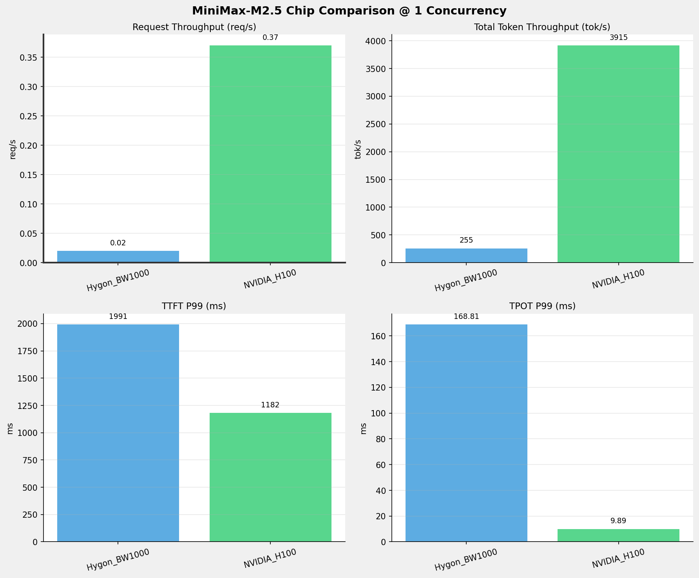
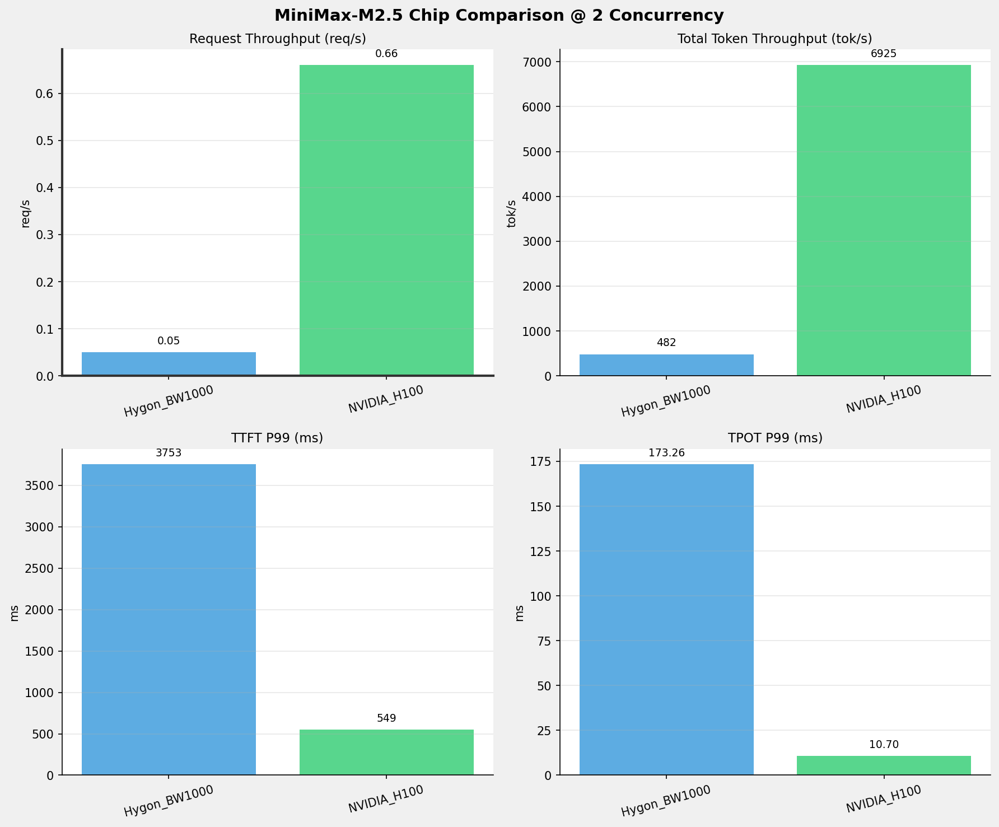
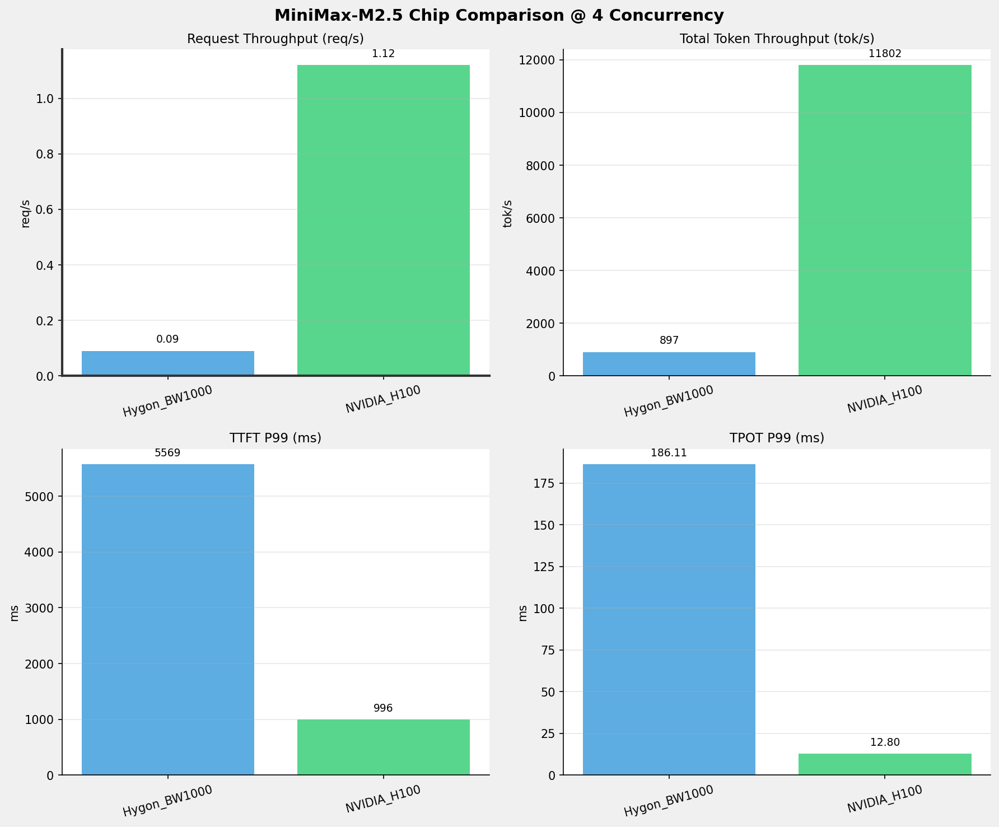
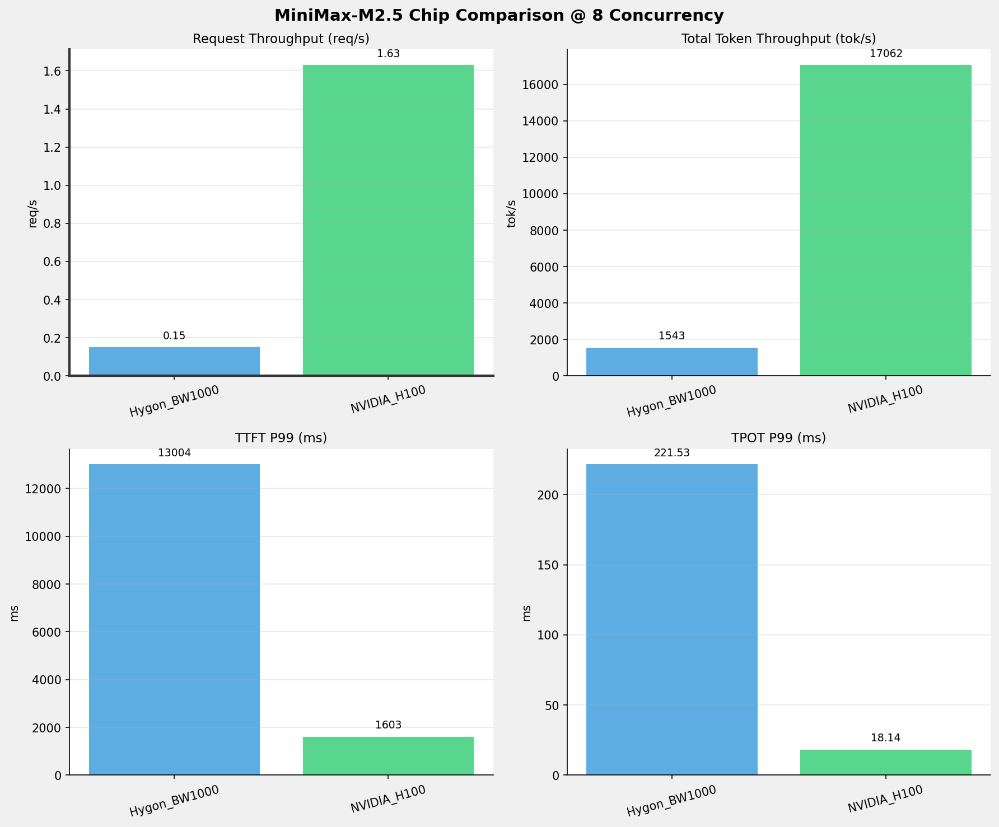
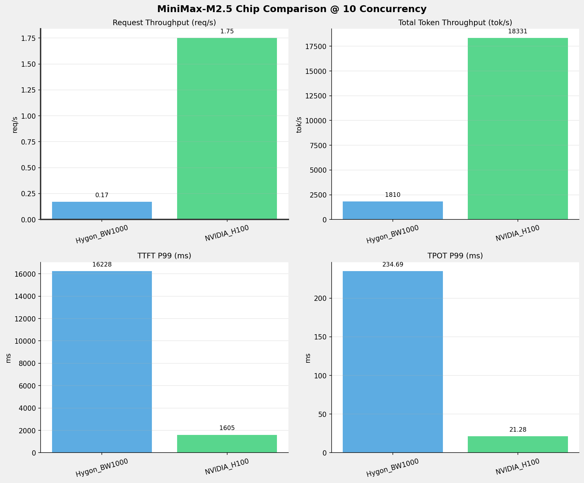
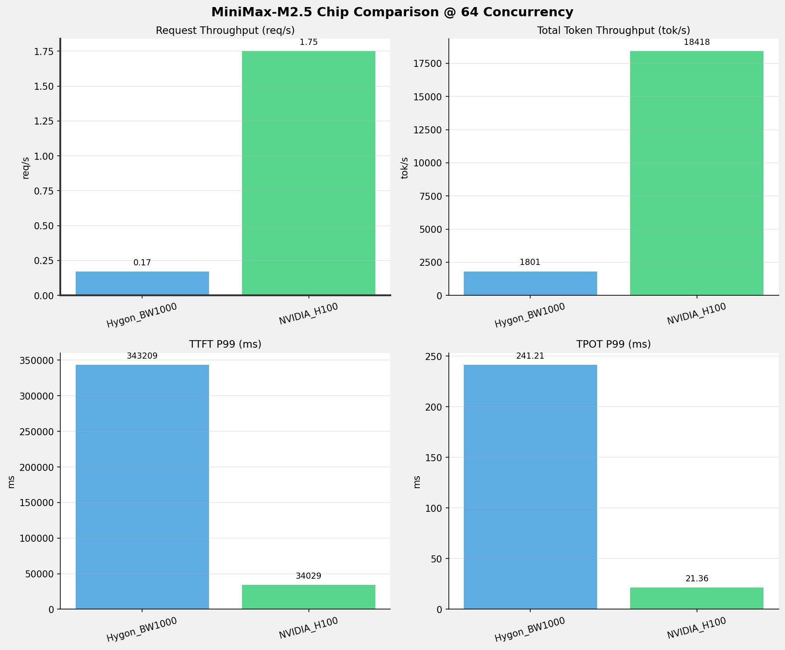
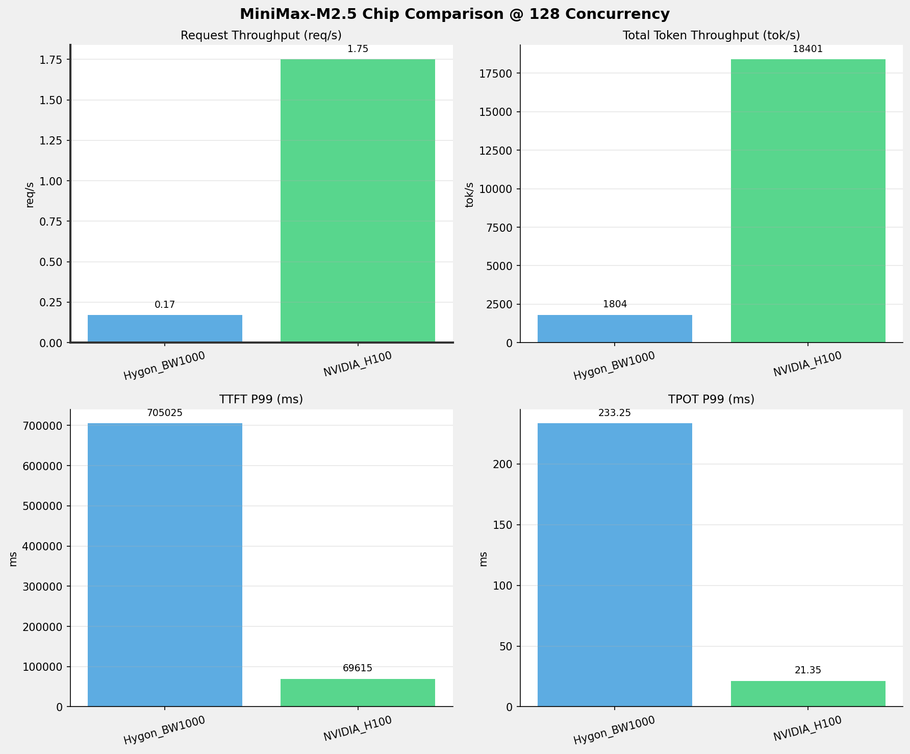
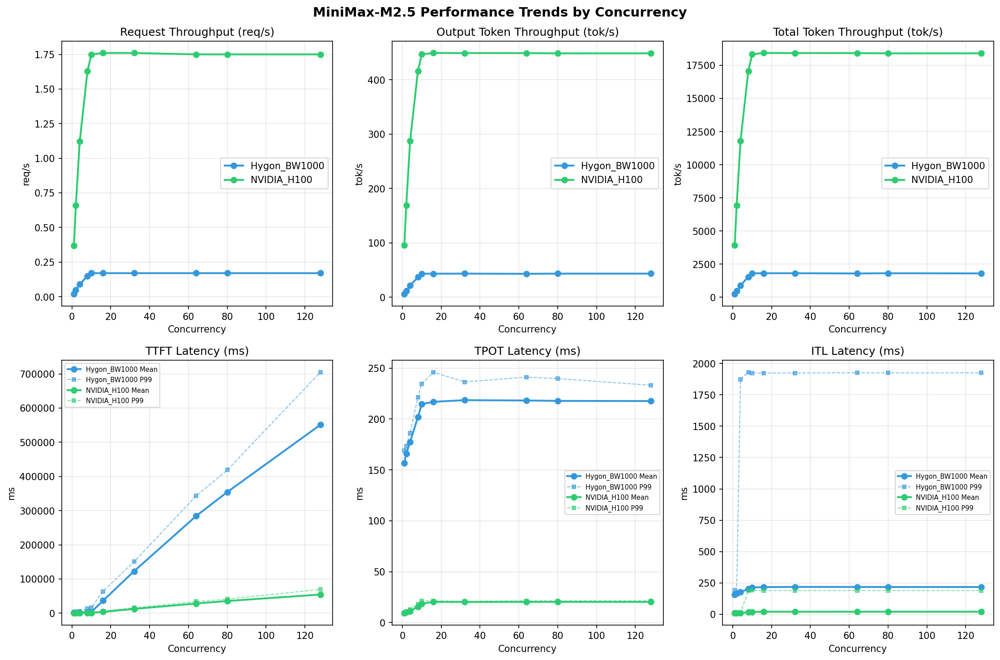

# MiniMax-M2.5模型在不同芯片下的benchmark基准测试报告

**测试日期：** 2026-04-01

---

## 测试场景
在固定请求数，输入上下文和输出上下文长度下，使用vllm bench serve工具对并发数逐级增加场景的性能基准验证。并对比同一模型在不同芯片环境上的性能指标。

**主要采集指标**：

| 指标                  | 单位         | 含义                                 |
|---------------------|------------|------------------------------------|
| TTFT                | ms         | Time To First Token，首 token 延迟     |
| TPOT                | ms/token   | Time Per Output Token，每 token 生成时间 |
| Throughput          | tokens/s   | 系统总吞吐                              |
| QPS                 | requests/s | 请求吞吐                               |
| P50/P95/P99 Latency | ms         | 延迟分位数                              |
    
## 📊 测试概览

| 项目            | 配置                                     | 备注  |
|---------------|----------------------------------------|-----|
| **数据集**       | random                                 |     |
| **并发数**       | 1, 2, 4, 8, 10, 16, 32, 64, 80, 128    |     |
| **总请求数**      | 3200                                    |     |
| **请求输入上下文长度** | 10240（10k）                             |     |
| **请求输出上下文长度** | 256（0.25k）                             |     |
| **模型**        | MiniMax-M2.5                           |     |
| **被测芯片**      | Hygon_BW1000, NVIDIA_H100 |     |

---

## 🤖 芯片和模型配置信息

| 芯片名称             | 模型路径                                           | vLLM版本 | Python版本 | 备注 |
|------------------|------------------------------------------------|----------|----------|------|
| **Hygon_BW1000** | /data/models/MiniMax-M2.5-bf16 | 0.11.0+das.opt1.rc2.dtk2604.20260128.g0bf89b0c | 3.10.12 | 海光BW1000芯片 |
| **NVIDIA_H100** | /userdata/llms/MiniMax/MiniMax-M2.5 | 0.15.1 | 3.12.3 | 英伟达H100芯片 |

---

## 🤖 vLLM启动配置信息

| 参数名称                   | **Hygon_BW1000** | **NVIDIA_H100** |
|------------------------|------------------|------------------|
| max-model-len | 196608 | 196608 |
| max-num-seqs | 10 | 10 |
| max-num-batched-tokens | 8192 | 8192 |
| gpu-memory-utilization | 0.95 | 0.85 |
| dp | 1 | 1 |
| tp | 8 | 8 |
| pp | 1 | 1 |
| enable-export-parallel | True | True |
| tool-call-parser | minimax_m2 | minimax_m2 |
| reasoning-parser | minimax_m2 (不生效) | minimax_m2 |

- **Hygon_BW1000**: 海光芯片专家并行配置
- **NVIDIA_H100**: 英伟达H100标准配置

---

## 📈 各并发级别性能对比

### 1 并发

#### 服务基准结果

| 指标                       | Hygon_BW1000 | NVIDIA_H100   |
|--------------------------|--------------|---------------|
| 成功请求数                    | 320          | 320           |
| 失败请求数                    | 0            | 0             |
| 测试持续时间 (s)               | 13148.00     | 857.88        |
| 总输入 tokens               | 3276748      | 3276800       |
| 总生成 tokens               | 80226        | 81920         |
| **请求吞吐量 (req/s)**        | 0.02         | **0.37** ⭐    |
| **输出 token 吞吐量 (tok/s)** | 6.10         | **95.49** ⭐   |
| 峰值输出 token 吞吐量 (tok/s)   | 8.00         | **110.00** ⭐  |
| 峰值并发请求数                  | 2.00         | 2.00          |
| **总 token 吞吐量 (tok/s)**  | 255.32       | **3915.14** ⭐ |

#### 首Token延迟 (TTFT)

| 指标 | Hygon_BW1000 | NVIDIA_H100 |
|------|----------- | -----------|
| 平均 TTFT (ms) | 1958.35 | **321.42** ⭐ |
| 中位 TTFT (ms) | 1964.30 | **306.62** ⭐ |
| P95 TTFT (ms) | 1977.98 | **313.59** ⭐ |
| P99 TTFT (ms) | 1990.88 | **1181.54** ⭐ |

#### 每Token生成时间 (TPOT)

| 指标 | Hygon_BW1000 | NVIDIA_H100 |
|------|----------- | -----------|
| 平均 TPOT (ms) | 156.69 | **9.25** ⭐ |
| 中位 TPOT (ms) | 156.16 | **9.23** ⭐ |
| P95 TPOT (ms) | 163.40 | **9.23** ⭐ |
| P99 TPOT (ms) | 168.81 | **9.89** ⭐ |

#### Token间延迟 (ITL)

| 指标 | Hygon_BW1000 | NVIDIA_H100 |
|------|----------- | -----------|
| 平均 ITL (ms) | 156.23 | **9.23** ⭐ |
| 中位 ITL (ms) | 155.76 | **9.22** ⭐ |
| P95 ITL (ms) | 162.28 | **9.41** ⭐ |
| P99 ITL (ms) | 191.32 | **9.90** ⭐ |

---

### 2 并发

#### 服务基准结果

| 指标 | Hygon_BW1000 | NVIDIA_H100 |
|------|----------- | -----------|
| 成功请求数 | 320 | 320 |
| 失败请求数 |  | 0 |
| 测试持续时间 (s) | 6965.73 | 485.01 |
| 总输入 tokens | 3276748 | 3276800 |
| 总生成 tokens | 80297 | 81920 |
| **请求吞吐量 (req/s)** | 0.05 | **0.66** ⭐ |
| **输出 token 吞吐量 (tok/s)** | 11.53 | **168.90** ⭐ |
| 峰值输出 token 吞吐量 (tok/s) | 15.00 | **207.00** ⭐ |
| 峰值并发请求数 | 4.00 | 4.00 |
| **总 token 吞吐量 (tok/s)** | 481.94 | **6925.05** ⭐ |

#### 首Token延迟 (TTFT)

| 指标 | Hygon_BW1000 | NVIDIA_H100 |
|------|----------- | -----------|
| 平均 TTFT (ms) | 2052.00 | **427.60** ⭐ |
| 中位 TTFT (ms) | 2024.87 | **418.60** ⭐ |
| P95 TTFT (ms) | 2038.41 | **545.11** ⭐ |
| P99 TTFT (ms) | 3752.70 | **549.04** ⭐ |

#### 每Token生成时间 (TPOT)

| 指标 | Hygon_BW1000 | NVIDIA_H100 |
|------|----------- | -----------|
| 平均 TPOT (ms) | 165.84 | **10.21** ⭐ |
| 中位 TPOT (ms) | 166.01 | **10.22** ⭐ |
| P95 TPOT (ms) | 168.30 | **10.69** ⭐ |
| P99 TPOT (ms) | 173.26 | **10.70** ⭐ |

#### Token间延迟 (ITL)

| 指标 | Hygon_BW1000 | NVIDIA_H100 |
|------|----------- | -----------|
| 平均 ITL (ms) | 165.31 | **10.18** ⭐ |
| 中位 ITL (ms) | 158.87 | **9.75** ⭐ |
| P95 ITL (ms) | 164.70 | **9.91** ⭐ |
| P99 ITL (ms) | 168.68 | **10.48** ⭐ |

---

### 4 并发

#### 服务基准结果

| 指标 | Hygon_BW1000 | NVIDIA_H100 |
|------|----------- | -----------|
| 成功请求数 | 320 | 320 |
| 失败请求数 |  | 0 |
| 测试持续时间 (s) | 3741.16 | 284.59 |
| 总输入 tokens | 3276748 | 3276800 |
| 总生成 tokens | 80266 | 81920 |
| **请求吞吐量 (req/s)** | 0.09 | **1.12** ⭐ |
| **输出 token 吞吐量 (tok/s)** | 21.45 | **287.86** ⭐ |
| 峰值输出 token 吞吐量 (tok/s) | 29.00 | **401.00** ⭐ |
| 峰值并发请求数 | 7.00 | 8.00 |
| **总 token 吞吐量 (tok/s)** | 897.32 | **11802.07** ⭐ |

#### 首Token延迟 (TTFT)

| 指标 | Hygon_BW1000 | NVIDIA_H100 |
|------|----------- | -----------|
| 平均 TTFT (ms) | 2185.58 | **694.79** ⭐ |
| 中位 TTFT (ms) | 2038.85 | **666.62** ⭐ |
| P95 TTFT (ms) | 3821.77 | **992.60** ⭐ |
| P99 TTFT (ms) | 5568.67 | **995.93** ⭐ |

#### 每Token生成时间 (TPOT)

| 指标 | Hygon_BW1000 | NVIDIA_H100 |
|------|----------- | -----------|
| 平均 TPOT (ms) | 177.49 | **11.22** ⭐ |
| 中位 TPOT (ms) | 177.87 | **11.32** ⭐ |
| P95 TPOT (ms) | 183.40 | **12.78** ⭐ |
| P99 TPOT (ms) | 186.11 | **12.80** ⭐ |

#### Token间延迟 (ITL)

| 指标 | Hygon_BW1000 | NVIDIA_H100 |
|------|----------- | -----------|
| 平均 ITL (ms) | 176.98 | **11.19** ⭐ |
| 中位 ITL (ms) | 157.22 | **10.08** ⭐ |
| P95 ITL (ms) | 162.59 | **10.33** ⭐ |
| P99 ITL (ms) | 1872.44 | **11.28** ⭐ |

---

### 8 并发

#### 服务基准结果

| 指标 | Hygon_BW1000 | NVIDIA_H100 |
|------|----------- | -----------|
| 成功请求数 | 320 | 320 |
| 失败请求数 |  | 0 |
| 测试持续时间 (s) | 2176.31 | 196.85 |
| 总输入 tokens | 3276748 | 3276800 |
| 总生成 tokens | 80442 | 81920 |
| **请求吞吐量 (req/s)** | 0.15 | **1.63** ⭐ |
| **输出 token 吞吐量 (tok/s)** | 36.96 | **416.15** ⭐ |
| 峰值输出 token 吞吐量 (tok/s) | 59.00 | **680.00** ⭐ |
| 峰值并发请求数 | 15.00 | 16.00 |
| **总 token 吞吐量 (tok/s)** | 1542.60 | **17062.16** ⭐ |

#### 首Token延迟 (TTFT)

| 指标 | Hygon_BW1000 | NVIDIA_H100 |
|------|----------- | -----------|
| 平均 TTFT (ms) | 3297.61 | **961.02** ⭐ |
| 中位 TTFT (ms) | 2089.60 | **1023.59** ⭐ |
| P95 TTFT (ms) | 10888.09 | **1474.23** ⭐ |
| P99 TTFT (ms) | 13004.02 | **1603.43** ⭐ |

#### 每Token生成时间 (TPOT)

| 指标 | Hygon_BW1000 | NVIDIA_H100 |
|------|----------- | -----------|
| 平均 TPOT (ms) | 201.95 | **15.53** ⭐ |
| 中位 TPOT (ms) | 205.98 | **15.30** ⭐ |
| P95 TPOT (ms) | 212.79 | **18.09** ⭐ |
| P99 TPOT (ms) | 221.53 | **18.14** ⭐ |

#### Token间延迟 (ITL)

| 指标 | Hygon_BW1000 | NVIDIA_H100 |
|------|----------- | -----------|
| 平均 ITL (ms) | 201.36 | **15.48** ⭐ |
| 中位 ITL (ms) | 157.25 | **11.93** ⭐ |
| P95 ITL (ms) | 163.19 | **12.35** ⭐ |
| P99 ITL (ms) | 1931.02 | **187.51** ⭐ |

---

### 10 并发

#### 服务基准结果

| 指标 | Hygon_BW1000 | NVIDIA_H100 |
|------|----------- | -----------|
| 成功请求数 | 320 | 320 |
| 失败请求数 |  | 0 |
| 测试持续时间 (s) | 1854.59 | 183.23 |
| 总输入 tokens | 3276748 | 3276800 |
| 总生成 tokens | 80517 | 81920 |
| **请求吞吐量 (req/s)** | 0.17 | **1.75** ⭐ |
| **输出 token 吞吐量 (tok/s)** | 43.42 | **447.09** ⭐ |
| 峰值输出 token 吞吐量 (tok/s) | 73.00 | **759.00** ⭐ |
| 峰值并发请求数 | 16.00 | 18.00 |
| **总 token 吞吐量 (tok/s)** | 1810.25 | **18330.76** ⭐ |

#### 首Token延迟 (TTFT)

| 指标 | Hygon_BW1000 | NVIDIA_H100 |
|------|----------- | -----------|
| 平均 TTFT (ms) | 3593.83 | **1012.23** ⭐ |
| 中位 TTFT (ms) | 2084.97 | **1139.42** ⭐ |
| P95 TTFT (ms) | 10884.20 | **1398.62** ⭐ |
| P99 TTFT (ms) | 16227.56 | **1604.56** ⭐ |

#### 每Token生成时间 (TPOT)

| 指标 | Hygon_BW1000 | NVIDIA_H100 |
|------|----------- | -----------|
| 平均 TPOT (ms) | 214.72 | **18.48** ⭐ |
| 中位 TPOT (ms) | 219.17 | **17.95** ⭐ |
| P95 TPOT (ms) | 227.12 | **21.21** ⭐ |
| P99 TPOT (ms) | 234.69 | **21.28** ⭐ |

#### Token间延迟 (ITL)

| 指标 | Hygon_BW1000 | NVIDIA_H100 |
|------|----------- | -----------|
| 平均 ITL (ms) | 214.01 | **18.42** ⭐ |
| 中位 ITL (ms) | 157.32 | **13.38** ⭐ |
| P95 ITL (ms) | 163.94 | **14.18** ⭐ |
| P99 ITL (ms) | 1924.45 | **190.68** ⭐ |

---

### 16 并发

#### 服务基准结果

| 指标 | Hygon_BW1000 | NVIDIA_H100 |
|------|----------- | -----------|
| 成功请求数 | 320 | 320 |
| 失败请求数 |  | 0 |
| 测试持续时间 (s) | 1847.45 | 182.26 |
| 总输入 tokens | 3276748 | 3276800 |
| 总生成 tokens | 80132 | 81920 |
| **请求吞吐量 (req/s)** | 0.17 | **1.76** ⭐ |
| **输出 token 吞吐量 (tok/s)** | 43.37 | **449.46** ⭐ |
| 峰值输出 token 吞吐量 (tok/s) | 71.00 | **760.00** ⭐ |
| 峰值并发请求数 | 20.00 | 22.00 |
| **总 token 吞吐量 (tok/s)** | 1817.04 | **18427.76** ⭐ |

#### 首Token延迟 (TTFT)

| 指标 | Hygon_BW1000 | NVIDIA_H100 |
|------|----------- | -----------|
| 平均 TTFT (ms) | 36634.82 | **3864.33** ⭐ |
| 中位 TTFT (ms) | 35931.86 | **5018.01** ⭐ |
| P95 TTFT (ms) | 58125.31 | **5362.36** ⭐ |
| P99 TTFT (ms) | 63884.93 | **6358.44** ⭐ |

#### 每Token生成时间 (TPOT)

| 指标 | Hygon_BW1000 | NVIDIA_H100 |
|------|----------- | -----------|
| 平均 TPOT (ms) | 216.95 | **20.24** ⭐ |
| 中位 TPOT (ms) | 219.89 | **20.22** ⭐ |
| P95 TPOT (ms) | 228.33 | **21.28** ⭐ |
| P99 TPOT (ms) | 246.10 | **21.35** ⭐ |

#### Token间延迟 (ITL)

| 指标 | Hygon_BW1000 | NVIDIA_H100 |
|------|----------- | -----------|
| 平均 ITL (ms) | 216.16 | **20.19** ⭐ |
| 中位 ITL (ms) | 157.71 | **13.38** ⭐ |
| P95 ITL (ms) | 164.13 | **15.08** ⭐ |
| P99 ITL (ms) | 1923.89 | **189.48** ⭐ |

---

### 32 并发

#### 服务基准结果

| 指标 | Hygon_BW1000 | NVIDIA_H100 |
|------|----------- | -----------|
| 成功请求数 | 320 | 320 |
| 失败请求数 |  | 0 |
| 测试持续时间 (s) | 1847.10 | 182.30 |
| 总输入 tokens | 3276748 | 3276800 |
| 总生成 tokens | 80324 | 81920 |
| **请求吞吐量 (req/s)** | 0.17 | **1.76** ⭐ |
| **输出 token 吞吐量 (tok/s)** | 43.49 | **449.36** ⭐ |
| 峰值输出 token 吞吐量 (tok/s) | 71.00 | **760.00** ⭐ |
| 峰值并发请求数 | 36.00 | 38.00 |
| **总 token 吞吐量 (tok/s)** | 1817.48 | **18423.63** ⭐ |

#### 首Token延迟 (TTFT)

| 指标 | Hygon_BW1000 | NVIDIA_H100 |
|------|----------- | -----------|
| 平均 TTFT (ms) | 122875.63 | **12498.42** ⭐ |
| 中位 TTFT (ms) | 124891.14 | **12483.01** ⭐ |
| P95 TTFT (ms) | 147416.43 | **15827.75** ⭐ |
| P99 TTFT (ms) | 150615.03 | **15877.21** ⭐ |

#### 每Token生成时间 (TPOT)

| 指标 | Hygon_BW1000 | NVIDIA_H100 |
|------|----------- | -----------|
| 平均 TPOT (ms) | 218.56 | **20.18** ⭐ |
| 中位 TPOT (ms) | 220.42 | **20.21** ⭐ |
| P95 TPOT (ms) | 227.78 | **20.81** ⭐ |
| P99 TPOT (ms) | 236.50 | **20.85** ⭐ |

#### Token间延迟 (ITL)

| 指标 | Hygon_BW1000 | NVIDIA_H100 |
|------|----------- | -----------|
| 平均 ITL (ms) | 217.96 | **20.12** ⭐ |
| 中位 ITL (ms) | 157.77 | **13.40** ⭐ |
| P95 ITL (ms) | 165.32 | **14.81** ⭐ |
| P99 ITL (ms) | 1924.43 | **189.42** ⭐ |

---

### 64 并发

#### 服务基准结果

| 指标 | Hygon_BW1000 | NVIDIA_H100 |
|------|----------- | -----------|
| 成功请求数 | 320 | 320 |
| 失败请求数 |  | 0 |
| 测试持续时间 (s) | 1864.45 | 182.36 |
| 总输入 tokens | 3276748 | 3276800 |
| 总生成 tokens | 80461 | 81920 |
| **请求吞吐量 (req/s)** | 0.17 | **1.75** ⭐ |
| **输出 token 吞吐量 (tok/s)** | 43.16 | **449.23** ⭐ |
| 峰值输出 token 吞吐量 (tok/s) | 71.00 | **760.00** ⭐ |
| 峰值并发请求数 | 68.00 | 70.00 |
| **总 token 吞吐量 (tok/s)** | 1800.65 | **18418.46** ⭐ |

#### 首Token延迟 (TTFT)

| 指标 | Hygon_BW1000 | NVIDIA_H100 |
|------|----------- | -----------|
| 平均 TTFT (ms) | 284382.45 | **28345.01** ⭐ |
| 中位 TTFT (ms) | 308175.63 | **29997.18** ⭐ |
| P95 TTFT (ms) | 336951.30 | **33326.91** ⭐ |
| P99 TTFT (ms) | 343209.29 | **34028.75** ⭐ |

#### 每Token生成时间 (TPOT)

| 指标 | Hygon_BW1000 | NVIDIA_H100 |
|------|----------- | -----------|
| 平均 TPOT (ms) | 218.23 | **20.25** ⭐ |
| 中位 TPOT (ms) | 219.77 | **20.21** ⭐ |
| P95 TPOT (ms) | 231.26 | **21.30** ⭐ |
| P99 TPOT (ms) | 241.21 | **21.36** ⭐ |

#### Token间延迟 (ITL)

| 指标 | Hygon_BW1000 | NVIDIA_H100 |
|------|----------- | -----------|
| 平均 ITL (ms) | 217.55 | **20.19** ⭐ |
| 中位 ITL (ms) | 157.89 | **13.38** ⭐ |
| P95 ITL (ms) | 168.53 | **15.08** ⭐ |
| P99 ITL (ms) | 1925.72 | **189.46** ⭐ |

---

### 80 并发

#### 服务基准结果

| 指标 | Hygon_BW1000 | NVIDIA_H100 |
|------|----------- | -----------|
| 成功请求数 | 320 | 320 |
| 失败请求数 |  | 0 |
| 测试持续时间 (s) | 1847.88 | 182.55 |
| 总输入 tokens | 3276748 | 3276800 |
| 总生成 tokens | 80365 | 81920 |
| **请求吞吐量 (req/s)** | 0.17 | **1.75** ⭐ |
| **输出 token 吞吐量 (tok/s)** | 43.49 | **448.76** ⭐ |
| 峰值输出 token 吞吐量 (tok/s) | 71.00 | **760.00** ⭐ |
| 峰值并发请求数 | 84.00 | 86.00 |
| **总 token 吞吐量 (tok/s)** | 1816.74 | **18399.06** ⭐ |

#### 首Token延迟 (TTFT)

| 指标 | Hygon_BW1000 | NVIDIA_H100 |
|------|----------- | -----------|
| 平均 TTFT (ms) | 354268.91 | **35639.41** ⭐ |
| 中位 TTFT (ms) | 402242.69 | **40443.15** ⭐ |
| P95 TTFT (ms) | 409210.34 | **40507.57** ⭐ |
| P99 TTFT (ms) | 418658.91 | **41499.32** ⭐ |

#### 每Token生成时间 (TPOT)

| 指标 | Hygon_BW1000 | NVIDIA_H100 |
|------|----------- | -----------|
| 平均 TPOT (ms) | 217.84 | **20.27** ⭐ |
| 中位 TPOT (ms) | 220.16 | **20.23** ⭐ |
| P95 TPOT (ms) | 227.98 | **21.31** ⭐ |
| P99 TPOT (ms) | 239.73 | **21.36** ⭐ |

#### Token间延迟 (ITL)

| 指标 | Hygon_BW1000 | NVIDIA_H100 |
|------|----------- | -----------|
| 平均 ITL (ms) | 217.14 | **20.21** ⭐ |
| 中位 ITL (ms) | 157.45 | **13.40** ⭐ |
| P95 ITL (ms) | 164.60 | **15.23** ⭐ |
| P99 ITL (ms) | 1924.81 | **189.49** ⭐ |

---

### 128 并发

#### 服务基准结果

| 指标 | Hygon_BW1000 | NVIDIA_H100 |
|------|----------- | -----------|
| 成功请求数 | 320 | 320 |
| 失败请求数 |  | 0 |
| 测试持续时间 (s) | 1861.45 | 182.53 |
| 总输入 tokens | 3276748 | 3276800 |
| 总生成 tokens | 80952 | 81920 |
| **请求吞吐量 (req/s)** | 0.17 | **1.75** ⭐ |
| **输出 token 吞吐量 (tok/s)** | 43.49 | **448.81** ⭐ |
| 峰值输出 token 吞吐量 (tok/s) | 71.00 | **760.00** ⭐ |
| 峰值并发请求数 | 132.00 | 134.00 |
| **总 token 吞吐量 (tok/s)** | 1803.81 | **18401.38** ⭐ |

#### 首Token延迟 (TTFT)

| 指标 | Hygon_BW1000 | NVIDIA_H100 |
|------|----------- | -----------|
| 平均 TTFT (ms) | 551191.53 | **54641.25** ⭐ |
| 中位 TTFT (ms) | 677657.74 | **66656.46** ⭐ |
| P95 TTFT (ms) | 697287.77 | **68581.20** ⭐ |
| P99 TTFT (ms) | 705024.57 | **69614.62** ⭐ |

#### 每Token生成时间 (TPOT)

| 指标 | Hygon_BW1000 | NVIDIA_H100 |
|------|----------- | -----------|
| 平均 TPOT (ms) | 217.69 | **20.25** ⭐ |
| 中位 TPOT (ms) | 220.15 | **20.22** ⭐ |
| P95 TPOT (ms) | 227.58 | **21.29** ⭐ |
| P99 TPOT (ms) | 233.25 | **21.35** ⭐ |

#### Token间延迟 (ITL)

| 指标 | Hygon_BW1000 | NVIDIA_H100 |
|------|----------- | -----------|
| 平均 ITL (ms) | 216.99 | **20.20** ⭐ |
| 中位 ITL (ms) | 157.95 | **13.39** ⭐ |
| P95 ITL (ms) | 164.61 | **15.04** ⭐ |
| P99 ITL (ms) | 1925.47 | **189.51** ⭐ |

---

## 📊 芯片性能柱状图

---

## 📈 性能趋势对比图 (所有芯片)

---

## 📝 分析总结

### 1. 吞吐量性能对比

**请求吞吐量 (QPS)**: 在低并发(1-4)场景下，NVIDIA_H100 表现最佳，平均 0.72 req/s；
在中并发(8-32)场景下，NVIDIA_H100 表现最佳，平均 1.72 req/s；
在高并发(64-128)场景下，NVIDIA_H100 表现最佳，平均 1.75 req/s。

**Token吞吐量**: NVIDIA_H100 在128并发时达到最高吞吐量 18428 tok/s。

### 2. 首Token延迟 (TTFT) 对比

**低并发(1-4)**: NVIDIA_H100 TTFT最优，平均 909ms

**高并发(64-128)**: NVIDIA_H100 TTFT最优，平均 48381ms

### 3. Token生成时间 (TPOT) 对比

**最优表现**: NVIDIA_H100 在各并发下TPOT表现最佳，128并发时仅为 9.89ms

⚠️ **注意**: 海光芯片TPOT延迟明显高于NVIDIA，约为 10.9 倍

### 4. 综合评估

**综合性能**: NVIDIA_H100 在所有测试场景中综合表现最优

### 请求吞吐量 (Request Throughput) - 各并发最优

| Concurrency | Best Chip | Performance |
|-------------|-----------|-------------|
| 1 | NVIDIA_H100 | 0.37 req/s |
| 2 | NVIDIA_H100 | 0.66 req/s |
| 4 | NVIDIA_H100 | 1.12 req/s |
| 8 | NVIDIA_H100 | 1.63 req/s |
| 10 | NVIDIA_H100 | 1.75 req/s |
| 16 | NVIDIA_H100 | 1.76 req/s |
| 32 | NVIDIA_H100 | 1.76 req/s |
| 64 | NVIDIA_H100 | 1.75 req/s |
| 80 | NVIDIA_H100 | 1.75 req/s |
| 128 | NVIDIA_H100 | 1.75 req/s |

### Token总吞吐量 (Total Token Throughput) - 各并发最优

| Concurrency | Best Chip | Performance |
|-------------|-----------|-------------|
| 1 | NVIDIA_H100 | 3915 tok/s |
| 2 | NVIDIA_H100 | 6925 tok/s |
| 4 | NVIDIA_H100 | 11802 tok/s |
| 8 | NVIDIA_H100 | 17062 tok/s |
| 10 | NVIDIA_H100 | 18331 tok/s |
| 16 | NVIDIA_H100 | 18428 tok/s |
| 32 | NVIDIA_H100 | 18424 tok/s |
| 64 | NVIDIA_H100 | 18418 tok/s |
| 80 | NVIDIA_H100 | 18399 tok/s |
| 128 | NVIDIA_H100 | 18401 tok/s |

### TTFT P99 - 各并发最优

| Concurrency | Best Chip | Latency |
|-------------|-----------|---------|
| 1 | NVIDIA_H100 | 1181.54 ms |
| 2 | NVIDIA_H100 | 549.04 ms |
| 4 | NVIDIA_H100 | 995.93 ms |
| 8 | NVIDIA_H100 | 1603.43 ms |
| 10 | NVIDIA_H100 | 1604.56 ms |
| 16 | NVIDIA_H100 | 6358.44 ms |
| 32 | NVIDIA_H100 | 15877.21 ms |
| 64 | NVIDIA_H100 | 34028.75 ms |
| 80 | NVIDIA_H100 | 41499.32 ms |
| 128 | NVIDIA_H100 | 69614.62 ms |

### TPOT P99 - 各并发最优

| Concurrency | Best Chip | Latency |
|-------------|-----------|---------|
| 1 | NVIDIA_H100 | 9.89 ms |
| 2 | NVIDIA_H100 | 10.70 ms |
| 4 | NVIDIA_H100 | 12.80 ms |
| 8 | NVIDIA_H100 | 18.14 ms |
| 10 | NVIDIA_H100 | 21.28 ms |
| 16 | NVIDIA_H100 | 21.35 ms |
| 32 | NVIDIA_H100 | 20.85 ms |
| 64 | NVIDIA_H100 | 21.36 ms |
| 80 | NVIDIA_H100 | 21.36 ms |
| 128 | NVIDIA_H100 | 21.35 ms |

---

*报告生成时间: 2026-04-01*

