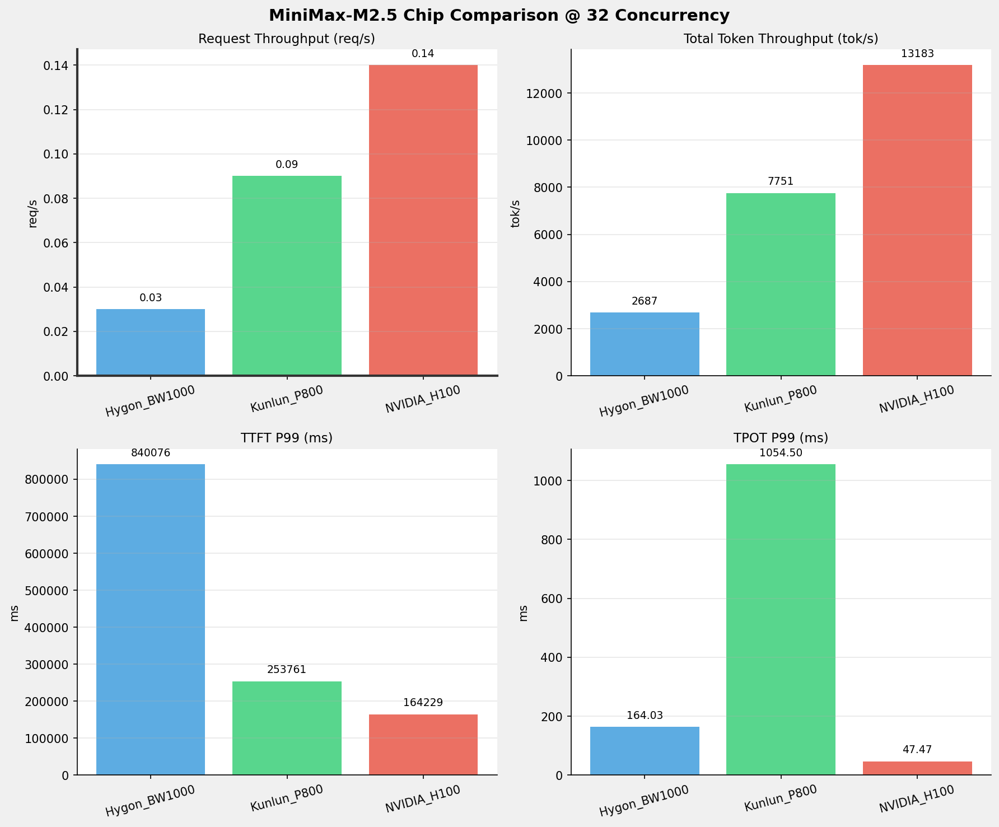
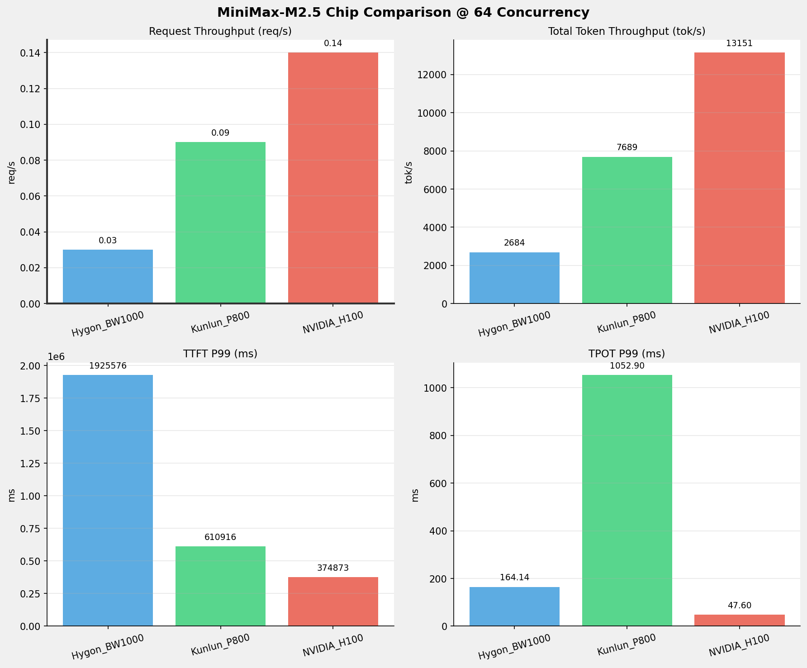
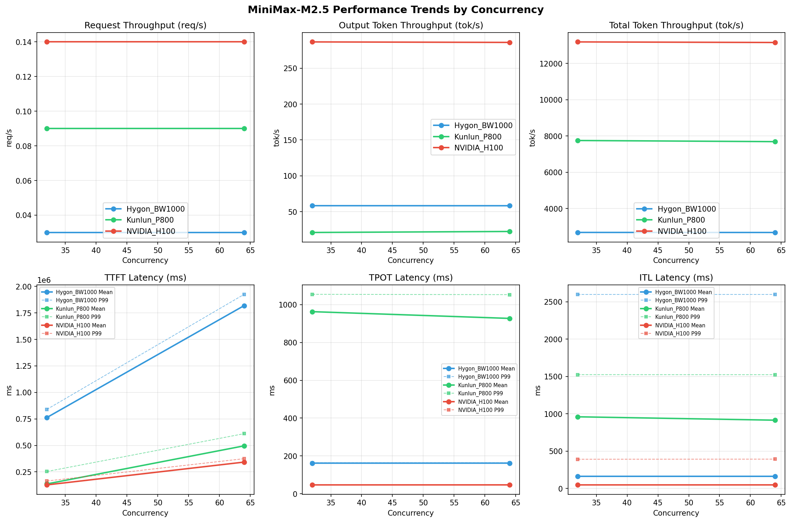

# MiniMax-M2.5模型在不同芯片下的benchmark基准测试报告

**测试日期：** 2026-04-09

---

## 测试场景
在固定请求数，输入上下文和输出上下文长度下，使用vllm bench serve工具对并发数逐级增加场景的性能基准验证。并对比同一模型在不同芯片环境上的性能指标。

**主要采集指标**：

| 指标                  | 单位         | 含义                                 |
|---------------------|------------|------------------------------------|
| TTFT                | ms         | Time To First Token，首 token 延迟     |
| TPOT                | ms/token   | Time Per Output Token，每 token 生成时间 |
| Throughput          | tokens/s   | 系统总吞吐                              |
| QPS                 | requests/s | 请求吞吐                               |
| P50/P95/P99 Latency | ms         | 延迟分位数                              |
    
## 📊 测试概览

| 项目            | 配置                                     | 备注  |
|---------------|----------------------------------------|-----|
| **数据集**       | random                                 |     |
| **并发数**       | 32, 64    |     |
| **总请求数**      | 2000                                    |     |
| **请求输入上下文长度** | 90000（87k）                             |     |
| **请求输出上下文长度** | 2000（1k）                             |     |
| **模型**        | MiniMax-M2.5                           |     |
| **被测芯片**      | Hygon_BW1000, Kunlun_P800, NVIDIA_H100 |     |

---

## 🤖 芯片和模型配置信息

| 芯片名称             | 模型路径                                           | vLLM版本 | Python版本 | 备注 |
|------------------|------------------------------------------------|----------|----------|------|
| **Hygon_BW1000** | MiniMax-M2.5-W8A8 | 0.11.0+das.opt1.rc2.dtk2604.20260128.g0bf89b0c | 3.10.12 | 海光BW1000芯片 |
| **Kunlun_P800** | MiniMax-M2.5-W8A8-INT8-Dynamic | 0.11.0 | 3.10.15 | 昆仑芯P800芯片 |
| **NVIDIA_H100** | MiniMax-M2.5 | 0.15.1 | 3.12.3 | 英伟达H100芯片 |

---

## 🤖 vLLM启动配置信息

| 参数名称                   | **Hygon_BW1000** | **Kunlun_P800** | **NVIDIA_H100** |
|------------------------|------------------|------------------|------------------|
| max-model-len | 196608 | 196608 | 196608 |
| max-num-seqs | 10 | 10 | 10 |
| max-num-batched-tokens | 8192 | 8192 | 8192 |
| gpu-memory-utilization | 0.95 | 0.95 | 0.85 |
| dp | 1 | 1 | 1 |
| tp | 8 | 8 | 8 |
| pp | 1 | 1 | 1 |
| enable-export-parallel | True | False | True |
| tool-call-parser | minimax_m2 | minimax_m2 | minimax_m2 |
| reasoning-parser | minimax_m2 (不生效) | minimax_m2 (不生效) | minimax_m2 |

- **Hygon_BW1000**: 海光芯片专家并行配置
- **Kunlun_P800**: 昆仑芯不启用专家并行避免通信问题
- **NVIDIA_H100**: 英伟达H100标准配置

---

## 📈 各并发级别性能对比

### 32 并发

#### 服务基准结果

| 指标 | Hygon_BW1000 | Kunlun_P800 | NVIDIA_H100 |
|------|----------- | ----------- | -----------|
| 成功请求数 | 1000 | 1000 | 1000 |
| 失败请求数 | 0 |  | 0 |
| 测试持续时间 (s) | 34237.41 | 11642.33 | 6978.61 |
| 总输入 tokens | 90000000 | 90000000 | 90000000 |
| 总生成 tokens | 2000000 | 245458 | 2000000 |
| **请求吞吐量 (req/s)** | 0.03 | 0.09 | **0.14** ⭐ |
| **输出 token 吞吐量 (tok/s)** | 58.42 | 21.08 | **286.59** ⭐ |
| 峰值输出 token 吞吐量 (tok/s) | 270.00 | 345.00 | **546.00** ⭐ |
| 峰值并发请求数 | 33.00 | 34.00 | 33.00 |
| **总 token 吞吐量 (tok/s)** | 2687.12 | 7751.49 | **13183.13** ⭐ |

#### 首Token延迟 (TTFT)

| 指标 | Hygon_BW1000 | Kunlun_P800 | NVIDIA_H100 |
|------|----------- | ----------- | -----------|
| 平均 TTFT (ms) | 763172.93 | 136676.31 | **127502.93** ⭐ |
| 中位 TTFT (ms) | 758207.30 | 132208.13 | **115177.94** ⭐ |
| P95 TTFT (ms) | 838778.34 | 174965.55 | **163893.99** ⭐ |
| P99 TTFT (ms) | 840076.37 | 253761.11 | **164229.17** ⭐ |

#### 每Token生成时间 (TPOT)

| 指标 | Hygon_BW1000 | Kunlun_P800 | NVIDIA_H100 |
|------|----------- | ----------- | -----------|
| 平均 TPOT (ms) | 161.97 | 962.85 | **46.90** ⭐ |
| 中位 TPOT (ms) | 162.90 | 991.56 | **47.09** ⭐ |
| P95 TPOT (ms) | 163.67 | 1050.24 | **47.34** ⭐ |
| P99 TPOT (ms) | 164.03 | 1054.50 | **47.47** ⭐ |

#### Token间延迟 (ITL)

| 指标 | Hygon_BW1000 | Kunlun_P800 | NVIDIA_H100 |
|------|----------- | ----------- | -----------|
| 平均 ITL (ms) | 161.96 | 959.55 | **47.07** ⭐ |
| 中位 ITL (ms) | 41.24 | 998.70 | **26.17** ⭐ |
| P95 ITL (ms) | **56.02** ⭐ | 1479.19 | 280.24 |
| P99 ITL (ms) | 2600.66 | 1524.63 | **390.82** ⭐ |

---

### 64 并发

#### 服务基准结果

| 指标 | Hygon_BW1000 | Kunlun_P800 | NVIDIA_H100 |
|------|----------- | ----------- | -----------|
| 成功请求数 | 1000 | 1000 | 1000 |
| 失败请求数 | 0 |  | 0 |
| 测试持续时间 (s) | 34277.62 | 11739.56 | 6995.72 |
| 总输入 tokens | 90000000 | 90000000 | 90000000 |
| 总生成 tokens | 2000000 | 263983 | 2000000 |
| **请求吞吐量 (req/s)** | 0.03 | 0.09 | **0.14** ⭐ |
| **输出 token 吞吐量 (tok/s)** | 58.35 | 22.49 | **285.89** ⭐ |
| 峰值输出 token 吞吐量 (tok/s) | 260.00 | 345.00 | **546.00** ⭐ |
| 峰值并发请求数 | 65.00 | 67.00 | 65.00 |
| **总 token 吞吐量 (tok/s)** | 2683.97 | 7688.87 | **13150.90** ⭐ |

#### 首Token延迟 (TTFT)

| 指标 | Hygon_BW1000 | Kunlun_P800 | NVIDIA_H100 |
|------|----------- | ----------- | -----------|
| 平均 TTFT (ms) | 1819207.46 | 496041.50 | **342817.22** ⭐ |
| 中位 TTFT (ms) | 1843948.68 | 501925.88 | **371479.06** ⭐ |
| P95 TTFT (ms) | 1923340.65 | 540083.81 | **374531.76** ⭐ |
| P99 TTFT (ms) | 1925575.70 | 610915.79 | **374873.23** ⭐ |

#### 每Token生成时间 (TPOT)

| 指标 | Hygon_BW1000 | Kunlun_P800 | NVIDIA_H100 |
|------|----------- | ----------- | -----------|
| 平均 TPOT (ms) | 162.03 | 927.19 | **47.01** ⭐ |
| 中位 TPOT (ms) | 162.94 | 944.56 | **47.20** ⭐ |
| P95 TPOT (ms) | 163.72 | 1048.60 | **47.49** ⭐ |
| P99 TPOT (ms) | 164.14 | 1052.90 | **47.60** ⭐ |

#### Token间延迟 (ITL)

| 指标 | Hygon_BW1000 | Kunlun_P800 | NVIDIA_H100 |
|------|----------- | ----------- | -----------|
| 平均 ITL (ms) | 162.02 | 914.26 | **47.18** ⭐ |
| 中位 ITL (ms) | 41.29 | 969.10 | **26.21** ⭐ |
| P95 ITL (ms) | **55.61** ⭐ | 1476.89 | 279.97 |
| P99 ITL (ms) | 2600.66 | 1524.21 | **392.29** ⭐ |

---

## 📊 芯片性能柱状图

---

## 📈 性能趋势对比图 (所有芯片)

---

## 📝 分析总结

### 1. 吞吐量性能对比

**请求吞吐量 (QPS)**: 在低并发(1-4)场景下，Hygon_BW1000 表现最佳，平均 0.00 req/s；
在中并发(8-32)场景下，NVIDIA_H100 表现最佳，平均 0.14 req/s；
在高并发(64-128)场景下，NVIDIA_H100 表现最佳，平均 0.14 req/s。

**Token吞吐量**: NVIDIA_H100 在128并发时达到最高吞吐量 13183 tok/s。

### 2. 首Token延迟 (TTFT) 对比

**低并发(1-4)**: Hygon_BW1000 TTFT最优，平均 infms

**高并发(64-128)**: NVIDIA_H100 TTFT最优，平均 374873ms

### 3. Token生成时间 (TPOT) 对比

**最优表现**: NVIDIA_H100 在各并发下TPOT表现最佳，128并发时仅为 47.47ms

### 4. 综合评估

**综合性能**: NVIDIA_H100 在所有测试场景中综合表现最优

### 请求吞吐量 (Request Throughput) - 各并发最优

| Concurrency | Best Chip | Performance |
|-------------|-----------|-------------|
| 32 | NVIDIA_H100 | 0.14 req/s |
| 64 | NVIDIA_H100 | 0.14 req/s |

### Token总吞吐量 (Total Token Throughput) - 各并发最优

| Concurrency | Best Chip | Performance |
|-------------|-----------|-------------|
| 32 | NVIDIA_H100 | 13183 tok/s |
| 64 | NVIDIA_H100 | 13151 tok/s |

### TTFT P99 - 各并发最优

| Concurrency | Best Chip | Latency |
|-------------|-----------|---------|
| 32 | NVIDIA_H100 | 164229.17 ms |
| 64 | NVIDIA_H100 | 374873.23 ms |

### TPOT P99 - 各并发最优

| Concurrency | Best Chip | Latency |
|-------------|-----------|---------|
| 32 | NVIDIA_H100 | 47.47 ms |
| 64 | NVIDIA_H100 | 47.60 ms |

---

*报告生成时间: 2026-04-09*

