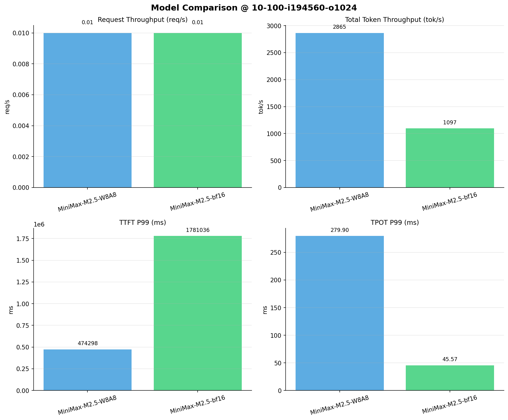

# 多模型性能对比报告

**测试日期：** 2026-04-09

**芯片平台：** hygon_bw1000

**测试套件：** test_03

**Run ID：** 01, 01

**并发级别：** 10并发

**测试配置：** 10-100-i194560-o1024

---

## 🤖 芯片和模型配置信息

| 芯片名称                        | **MiniMax-M2.5-W8A8** | **MiniMax-M2.5-bf16** |
|-----------------------------|-------------------------------|-------------------------------|
| **model_name** | MiniMax-M2.5-W8A8 | MiniMax-M2.5-bf16 |
| **quantization_config** | int-8 | bf16 |
| **model_size** | 215G | 427G |
| **max_position_embeddings** | 196608 | 196608 |
| **temperature** | N/A | N/A |
| **top_k** | N/A | N/A |
| **top_p** | N/A | N/A |
| **transformers_version** | 4.57.6 | 4.46.1 |
| **vllm_version** | 0.15.1+das.opt1.alpha.dtk2604 | 0.11.0+das.opt1.rc2.dtk2604.20260128.g0bf89b0c |
| **python_version** | 3.10.12 | 3.10.12 |

---

## 🤖 vLLM启动配置信息

| 参数名称                    | **MiniMax-M2.5-W8A8** | **MiniMax-M2.5-bf16** |
|-------------------------|-------------------|-------------------|
| model_name | MiniMax-M2.5-W8A8 | MiniMax-M2.5-bf16 |
| max-model-len | 196608 | 196608 |
| max-num-seqs | 64 | 64 |
| max-num-batched-tokens | default | default |
| gpu-memory-utilization | 0.9 | 0.98 |
| dtype | bfloat16 | bfloat16 |
| block_size | default | default |
| dp | 1 | 1 |
| tp | 8 | 8 |
| pp | 1 | 1 |
| enable-export-parallel | True | True |
| enable-auto-tool-choice | True | True |
| tool-call-parser | minimax_m2 | minimax_m2 |
| reasoning-parser | minimax_m2 (不生效) | minimax_m2 (不生效) |

---

## 📊 模型列表

| 模型名称 | Run ID | 状态 |
|----------|--------|------|
| MiniMax-M2.5-W8A8 | 01 | [OK] |
| MiniMax-M2.5-bf16 | 01 | [OK] |

---

## 📈 服务基准结果对比

| 指标 | MiniMax-M2.5-W8A8 | MiniMax-M2.5-bf16 |
|------|----------- | -----------|
| 成功请求数 | 100 | 100 |
| 失败请求数 | 0 | 0 |
| 测试持续时间 (s) | 6826.46 | 17832.87 |
| 总输入 tokens | 19456000 | 19456000 |
| 总生成 tokens | 102400 | 102400 |
| **请求吞吐量 (req/s)** | **0.01** ⭐ | **0.01** ⭐ |
| **输出 token 吞吐量 (tok/s)** | **15.00** ⭐ | 5.74 |
| 峰值输出 token 吞吐量 (tok/s) | **145.00** ⭐ | 39.00 |
| 峰值并发请求数 | 12.00 | 11.00 |
| **总 token 吞吐量 (tok/s)** | **2865.09** ⭐ | 1096.76 |

---

## ⏱️ 首 Token 延迟 (TTFT) 对比

| 指标 | MiniMax-M2.5-W8A8 | MiniMax-M2.5-bf16 |
|------|----------- | -----------|
| 平均 TTFT (ms) | **399184.25** ⭐ | 1675058.97 |
| 中位 TTFT (ms) | **414031.08** ⭐ | 1774448.89 |
| P95 TTFT (ms) | **441820.31** ⭐ | 1780264.33 |
| P99 TTFT (ms) | **474297.92** ⭐ | 1781035.71 |

---

## ⚡ 每 Token 生成时间 (TPOT) 对比

| 指标 | MiniMax-M2.5-W8A8 | MiniMax-M2.5-bf16 |
|------|----------- | -----------|
| 平均 TPOT (ms) | 266.45 | **40.36** ⭐ |
| 中位 TPOT (ms) | 276.40 | **40.01** ⭐ |
| P95 TPOT (ms) | 279.80 | **40.51** ⭐ |
| P99 TPOT (ms) | 279.90 | **45.57** ⭐ |

---

## 🔄 Token 间延迟 (ITL) 对比

| 指标 | MiniMax-M2.5-W8A8 | MiniMax-M2.5-bf16 |
|------|----------- | -----------|
| 平均 ITL (ms) | 266.45 | **40.48** ⭐ |
| 中位 ITL (ms) | 38.64 | **29.39** ⭐ |
| P95 ITL (ms) | 2679.16 | **31.93** ⭐ |
| P99 ITL (ms) | 4012.34 | **55.14** ⭐ |

---

## 📊 模型性能对比

---

## 📝 分析小结

- **请求吞吐量**: MiniMax-M2.5-W8A8 最高，达 0.01 req/s
- **总token吞吐量**: MiniMax-M2.5-W8A8 最高，达 2865 tok/s
- **TTFT P99**: MiniMax-M2.5-W8A8 最优，为 474297.92ms
- **TPOT P99**: MiniMax-M2.5-bf16 最优，为 45.57ms

---

*报告生成时间: 2026-04-09*

