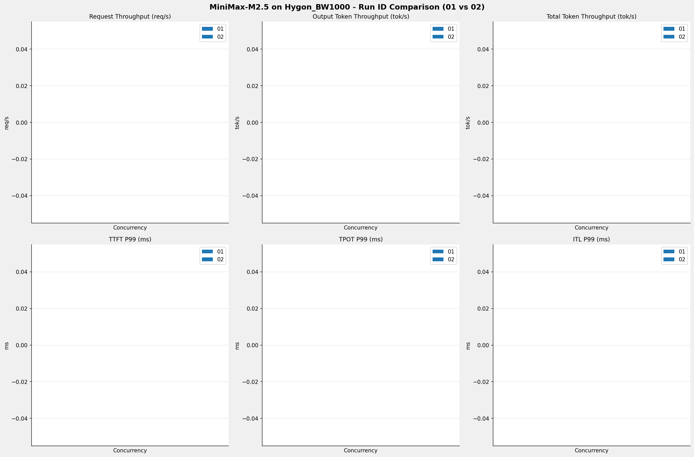

# MiniMax-M2.5模型在Hygon_BW1000上的RUN-ID对比报告

**测试日期：** 2026-04-09

**对比RUN-ID：** 01 vs 02

---

## 测试场景
对比同一芯片、同一测试套件下,同一模型优化前后测试结果比对，分析性能差异。

**测试模型**  
第一轮测试（RUN-01）: MiniMax-M2.5  
第二轮测试（RUN-02）: MiniMax-M2.5

## 🤖 芯片和模型配置信息

| 参数名称                    | Hygon_BW1000 |
|------------------------|-------------|
| **model_name** | MiniMax-M2.5-bf16 |
| **quantization_config** | bf16 |
| **model_size** | 427G |
| **max_position_embeddings** | 196608 |
| **temperature** | N/A |
| **top_k** | N/A |
| **top_p** | N/A |
| **transformers_version** | 4.46.1 |
| **vllm_version** | 0.11.0+das.opt1.rc2.dtk2604.20260128.g0bf89b0c |
| **python_version** | 3.10.12 |

---

## 🤖 vLLM启动配置信息

| 参数名称                    | Hygon_BW1000 |
|------------------------|-------------|
| max-model-len | 196608 | 196608 |
| max-num-seqs | 64 | 64 |
| max-num-batched-tokens | 8192 | N/A |
| gpu-memory-utilization | 0.95 | 0.9 |
| dp | 1 | 1 |
| tp | 8 | 8 |
| pp | 1 | 1 |
| enable-export-parallel | False | N/A |
| tool-call-parser | minimax_m2 | minimax_m2 |
| reasoning-parser | minimax_m2 | N/A |
| -cc | N/A | {"pass_config": {"fuse_act_quant": false}} |

---

## 📊 测试概览

| 项目            | 配置                                    | 备注  |
|---------------|---------------------------------------|-----|
| **数据集**       | random                                |     |
| **并发数**       | [1, 2, 4, 8, 10] |     |
| **总请求数**      | [100]                                 |     |
| **请求输入上下文长度** | [194560]                               |     |
| **请求输出上下文长度** | [1024]                               |     |
| **模型**        | MiniMax-M2.5                          |     |
| **被测芯片**      | Hygon_BW1000                          |     |

**主要采集指标**：

| 指标                  | 单位         | 含义                                 |
|---------------------|------------|------------------------------------|
| TTFT                | ms         | Time To First Token，首 token 延迟     |
| TPOT                | ms/token   | Time Per Output Token，每 token 生成时间 |
| Throughput          | tokens/s   | 系统总吞吐                              |
| QPS                 | requests/s | 请求吞吐                               |
| P50/P95/P99 Latency | ms         | 延迟分位数                              |

---

## 各并发级别详细对比

---

## 📊 RUN-ID对比柱状图

---

## 📝 分析总结

### 吞吐量对比

**请求吞吐量**: RUN-02 相比 RUN-01 平均变化 **0.0%**

**输出Token吞吐量**: RUN-02 相比 RUN-01 平均变化 **0.0%**

### 延迟对比

**TTFT P99**: RUN-02 相比 RUN-01 平均改善 **0.0%** (延迟降低)
**TPOT P99**: RUN-02 相比 RUN-01 平均改善 **0.0%** (延迟降低)
**ITL P99**: RUN-02 相比 RUN-01 平均改善 **0.0%** (延迟降低)

---

*报告生成时间: 2026-04-09*

