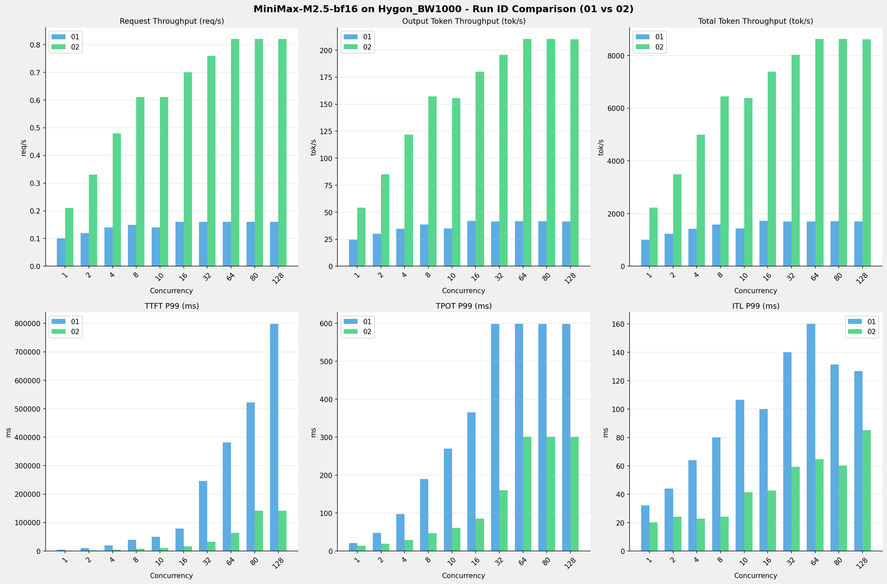
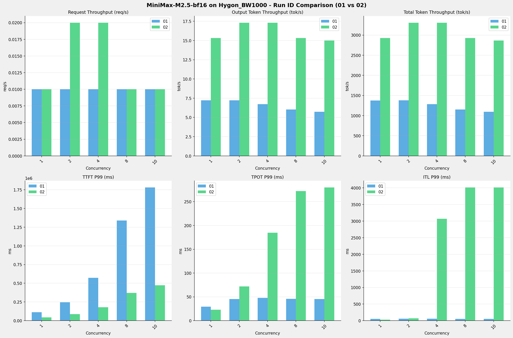
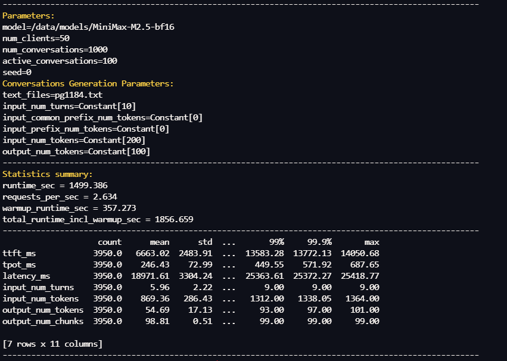
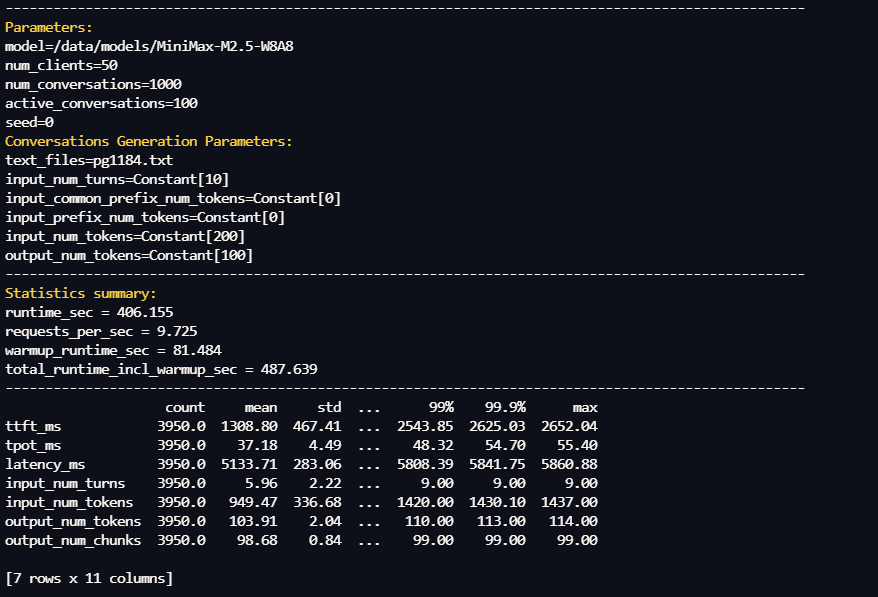
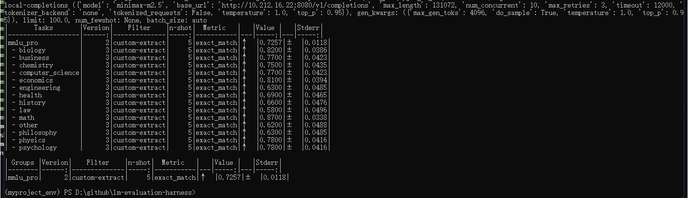
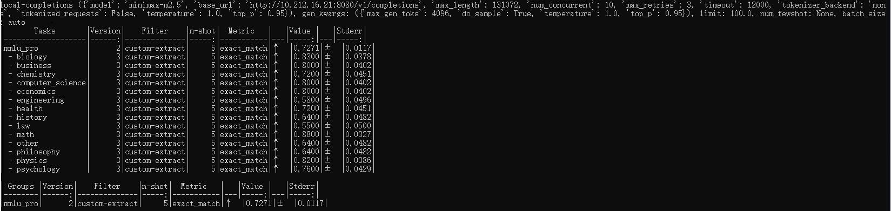
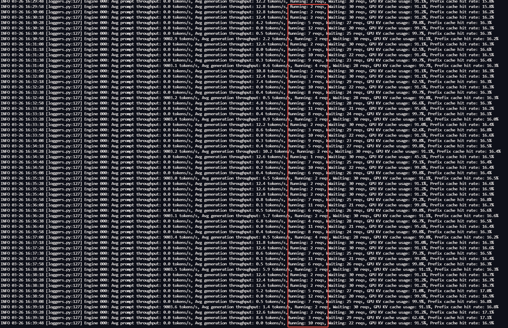
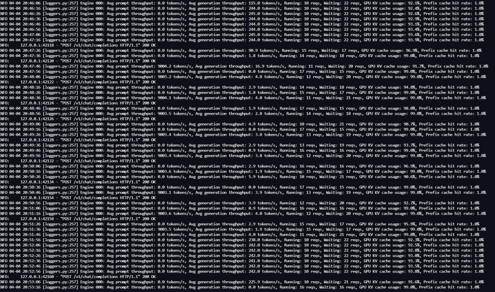
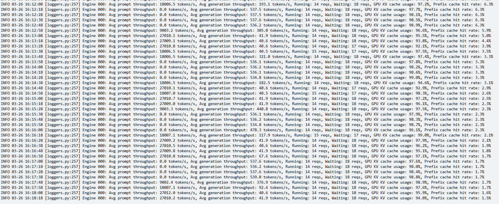

# MiniMax-M2.5模型在单节点Hygon_BW1000上测试报告

**测试日期：** 2026-03-26 ~ 2026-04-08  
**测试芯片：** Hygon_BW1000  
**节点数：** 单机8卡

---

## **本次测试模型**  
第一轮测试（RUN-01）: MiniMax-M2.5-bf16  
第二轮测试（RUN-02）: MiniMax-M2.5-W8A8

## 1. 测试背景
公司需要在多个候选开源大模型中选型，部署基于vLLM的推理服务。针对国产芯片验证对各项模型服务指标的满足情况。

## 2. 测试目标
评估海光Hygon_BW1000芯片在单机环境下运行大模型推理的能力，为后续集群采购和生产部署提供决策依据。
1. **硬件摸底**：确认芯片型号实际规格（算力、显存、带宽）与标称值的一致性
2. **功能验证**：各模型在当前芯片环境上的推理正确性和算子兼容性
3. **性能基准**：吞吐量、延迟、显存效率等关键指标
4. **单机极限**：8 卡 Tensor Parallel 的性能上限和资源利用率
5. **稳定性验证**：长时间运行下的可靠性
6. **K8S 容器化验证**：单、多节点 K8S 环境下DCU 调度、资源管理和服务编排能力

---

## 3. 测试环境

### 3.1 硬件规格

| 组件 \ 规格            | 海光                                  | 状态     |
|--------------------|-------------------------------------|--------|
| **节点数量**           | 1 台                                 | 确认     |
| **芯片型号**           | BW1000                              | 确认     |
| **芯片数量**           | 8 张                                 | 确认     |
| **单卡算力 FP16/BF16** | 待确认                                 | ⚠️ 待确认 |
| **单卡算力 FP32**      | 待确认                                 | ⚠️ 待确认 |
| **单卡算力 FP64**      | 待确认                                 | ⚠️ 待确认 |
| **单卡显存**           | 65520 MiB (约64 GB)                  | 确认     |
| **显存类型**           | 待确认                                 | ⚠️ 待确认 |
| **显存带宽**           | 待确认                                 | ⚠️ 待确认 |
| **单卡功耗**           | 200 W                               | 确认     |
| **卡间互联**           | HSW                                 | 确认     |
| **CPU**            | Hygon C86 (128核)                    | 确认     |
| **系统内存**           | 503GiB                              | 确认     |
| **本地存储**           | 437G系统盘 + 1.7TiB (G73M1T9R-C-GD308) | 确认     |

### 3.2 软件栈

| 组件\版本             | 海光                              | 说明                |
|-------------------|---------------------------------|-------------------|
| **操作系统**          | Ubuntu 22.04.5 LTS              | 芯片所在物理机系统         |
| **显卡驱动**          | 6.3.22-V1.2.0                   | 驱动信息              |
| **Toolkit**       | DTK-26.04-beta-0130-ubuntu20.04 | DCU Toolkit       |
| **Docker**        | 28.0.4                          | 容器运行时             |
| **containerd**    | 2.1.1                           | K8S 容器运行时（CRI）    |
| **Kubernetes**    | 1.33                            | 单节点 All-in-One 部署 |
| **Device Plugin** | v2.4.0                          | K8S DCU 资源管理      |
| **多卡通信库**         | DTK内置RCCL                       | 多卡通信库             |

### 3.3 芯片和模型配置信息

| 模型基础信息                      | **MiniMax-M2.5-bf16**                          | **MiniMax-M2.5-W8A8**         |
|-----------------------------|------------------------------------------------|-------------------------------|
| **model_name**              | MiniMax-M2.5-bf16                              | MiniMax-M2.5-W8A8             |
| **quantization_config**     | bf16                                           | int-8                         |
| **model_size**              | 427G                                           | 215G                          |
| **max_position_embeddings** | 196608                                         | 196608                        |
| **temperature**             | N/A                                            | N/A                           |
| **top_k**                   | N/A                                            | N/A                           |
| **top_p**                   | N/A                                            | N/A                           |
| **transformers_version**    | 4.46.1                                         | 4.57.6                        |
| **vllm_version**            | 0.11.0+das.opt1.rc2.dtk2604.20260128.g0bf89b0c | 0.15.1+das.opt1.alpha.dtk2604 |
| **python_version**          | 3.10.12                                        | 3.10.12                       |

### 3.4 vLLM启动配置信息

| 参数名称                    | **MiniMax-M2.5-bf16** | **MiniMax-M2.5-W8A8** |
|-------------------------|-----------------------|-----------------------|
| model_name              | MiniMax-M2.5-bf16     | MiniMax-M2.5-W8A8     |
| max-model-len           | 196608                | 196608                |
| max-num-seqs            | 64                    | 64                    |
| max-num-batched-tokens  | default               | default               |
| gpu-memory-utilization  | 0.98                  | 0.9                   |
| dtype                   | bfloat16              | bfloat16              |
| block_size              | default               | default               |
| dp                      | 1                     | 1                     |
| tp                      | 8                     | 8                     |
| pp                      | 1                     | 1                     |
| enable-export-parallel  | True                  | True                  |
| enable-auto-tool-choice | True                  | True                  |
| tool-call-parser        | minimax_m2            | minimax_m2            |
| reasoning-parser        | minimax_m2 (不生效)      | minimax_m2 (不生效)      |

---

 

## 4. 测试结果综述

### 4.1 MiniMax-M2.5-bf16和MiniMax-M2.5-W8A8各场景测试结果整体汇总及性能比对
| 序号  | 测试场景           | 请求参数                                                                   | 请求并发数                                   | 数据集                 | 测试结果比对                                                     |
|-----|----------------|------------------------------------------------------------------------|-----------------------------------------|---------------------|------------------------------------------------------------|
| 场景一 | vllm bench基准测试 | 输入上下文 10k   输出上下文 0.25k                                            | [ 1, 2, 4, 8, 10, 16, 32, 64, 80, 128 ] | random              | W8A8模型相比bf16模型总吞吐量提升约**312%**； 首token延迟平均改善 **79.9%**  |
| 场景二 | 超长上下文请求测试      | 输入上下文 190k   输出上下文 1k                                              | [ 1, 2, 4, 8, 10 ]                      | random              | W8A8模型相比bf16模型总吞吐量提升约**144%**； 首token延迟平均改善 **68.0%**  |
| 场景三 | 多轮对话           | 总对话轮数：1000 活跃对话数：100 对话轮次：10 输入token: 200 输出token: 100 | 50                                      | pg1184.txt (seed=0) | W8A8模型相比bf16模型请求吞吐量提升约**269%**； 首token延迟平均改善 **80.0%** |
| 场景四 | 模型精度测试         | temperature：1.0, top_p: 0.95, limit: 100                               | 10                                      | mmlu_pro            | 优化前后测试精度均在**0.72**分左右，差别很小                                 | 

### 4.2 海光BW1000 + MiniMax-M2.5-bf16和英伟达H100 + MiniMax-M2.5各场景测试结果整体汇总及性能比对
| 序号  | 测试场景           | 请求参数                                                                  | 请求并发数                                   | 数据集      | 测试结果比对                                                                                                                |
|-----|----------------|-----------------------------------------------------------------------|-----------------------------------------|----------|-----------------------------------------------------------------------------------------------------------------------|
| 场景一 | vllm bench基准测试 | 输入上下文 10k   输出上下文 0.25k                                           | [ 1, 2, 4, 8, 10, 16, 32, 64, 80, 128 ] | random   | 在各并发级别，整体性能英伟达H100约是海光BW1000的**10~15**倍                                                                               |
| 场景二 | 超长上下文请求测试      | 输入上下文 190k   输出上下文 1k                                             | [ 1, 2, 4, 8, 10 ]                      | random   | 总吞吐量性能英伟达约是海光的**3.6**倍； 首token性能英伟达约是海光的**5.8**倍                                                                  |
| 场景三 | 长上下文高并发稳定性     | 输入上下文 90k   输出上下文 2k                                              | [ 32 ]                                  | random   | 在本测试参数下，英伟达H100最大可同时稳定处理14个请求，缓存命中率稳定且正常； 海光bf16模型同时处理请求数在1~12个之间波动，缓存命中率异常; 优化后模型W8A8同时处理请求数在10~18波动，缓存命中率正常 |
| 场景四 | 多轮对话测试         | 总对话轮数：1000 活跃对话数：10 对话轮次：10 输入token: 200 输出token: 100 | 10                                      | mmlu_pro | 海光BW1000请求吞吐量约为英伟达H100的**7.7%**，首token延迟约是英伟达的**5.7**倍                                                                | 

---

---

## 测试场景一： vLLM benchmark serve基准性能测试

### 测试工具

**vllm开源仓库自带的benchmark测试框架：主执行程序vllm bench serve**

### 📊 测试概览

| 请求参数          | 配置                                    | 备注  |
|---------------|---------------------------------------|-----|
| **数据集**       | random                                |     |
| **并发数**       | [1, 2, 4, 8, 10, 16, 32, 64, 80, 128] |     |
| **总请求数**      | [320]                                 |     |
| **请求输入上下文长度** | [10240]                               |     |
| **请求输出上下文长度** | [256]                                 |     |
| **被测芯片**      | Hygon_BW1000                          |     |

**主要采集指标**：

| 指标                  | 单位         | 含义                                 |
|---------------------|------------|------------------------------------|
| TTFT                | ms         | Time To First Token，首 token 延迟     |
| TPOT                | ms/token   | Time Per Output Token，每 token 生成时间 |
| Throughput          | tokens/s   | 系统总吞吐                              |
| QPS                 | requests/s | 请求吞吐                               |
| P50/P95/P99 Latency | ms         | 延迟分位数                              |

### 各并发级别详细对比
**注：以下比对结果表格中的百分比以第一轮测试(即RUN-01的测试模型MiniMax-M2.5-bf16)为基准**

#### 1. 总 token 吞吐量 (tok/s)比对

| 并发数 | RUN-01  | RUN-02  | 差异       | 百分比     |
|-----|---------|---------|----------|---------|
| 1   | 1010.87 | 2225.40 | +1214.53 | +120.1% |
| 2   | 1235.32 | 3487.19 | +2251.87 | +182.3% |
| 4   | 1419.97 | 4995.56 | +3575.59 | +251.8% |
| 8   | 1581.48 | 6444.25 | +4862.77 | +307.5% |
| 10  | 1430.96 | 6382.12 | +4951.16 | +346.0% |
| 16  | 1718.41 | 7387.79 | +5669.38 | +329.9% |
| 32  | 1702.37 | 8023.25 | +6320.88 | +371.3% |
| 64  | 1702.94 | 8620.30 | +6917.36 | +406.2% |
| 80  | 1703.16 | 8623.30 | +6920.14 | +406.3% |
| 128 | 1702.74 | 8618.28 | +6915.54 | +406.1% |

#### 2. 请求吞吐量 (req/s)比对

| 并发数 | RUN-01 | RUN-02 | 差异    | 百分比     |
|-----|--------|--------|-------|---------|
| 1   | 0.10   | 0.21   | +0.11 | +110.0% |
| 2   | 0.12   | 0.33   | +0.21 | +175.0% |
| 4   | 0.14   | 0.48   | +0.34 | +242.9% |
| 8   | 0.15   | 0.61   | +0.46 | +306.7% |
| 10  | 0.14   | 0.61   | +0.47 | +335.7% |
| 16  | 0.16   | 0.70   | +0.54 | +337.5% |
| 32  | 0.16   | 0.76   | +0.60 | +375.0% |
| 64  | 0.16   | 0.82   | +0.66 | +412.5% |
| 80  | 0.16   | 0.82   | +0.66 | +412.5% |
| 128 | 0.16   | 0.82   | +0.66 | +412.5% |

#### 3. 首Token延迟 (TTFT)平均值比对

| 并发数 | RUN-01    | RUN-02    | 差异         | 百分比    |
|-----|-----------|-----------|------------|--------|
| 1   | 5026.61   | 1112.21   | -3914.40   | -77.9% |
| 2   | 7501.77   | 1623.93   | -5877.84   | -78.4% |
| 4   | 16214.96  | 3351.54   | -12863.42  | -79.3% |
| 8   | 34975.19  | 7190.37   | -27784.82  | -79.4% |
| 10  | 44636.12  | 9132.16   | -35503.96  | -79.5% |
| 16  | 73920.95  | 15052.83  | -58868.12  | -79.6% |
| 32  | 154015.23 | 30731.82  | -123283.41 | -80.0% |
| 64  | 327678.89 | 62196.04  | -265482.85 | -81.0% |
| 80  | 407916.98 | 77178.96  | -330738.02 | -81.1% |
| 128 | 618139.35 | 124081.37 | -494057.98 | -79.9% |

#### 4. 每Token生成时间 (TPOT)平均值比对

| 并发数 | RUN-01 | RUN-02 | 差异      | 百分比    |
|-----|--------|--------|---------|--------|
| 1   | 21.00  | 14.13  | -6.87   | -32.7% |
| 2   | 37.22  | 17.24  | -19.98  | -53.7% |
| 4   | 52.36  | 19.81  | -32.55  | -62.2% |
| 8   | 71.05  | 22.89  | -48.16  | -67.8% |
| 10  | 112.59 | 28.67  | -83.92  | -74.5% |
| 16  | 93.35  | 30.10  | -63.25  | -67.8% |
| 32  | 152.59 | 43.62  | -108.97 | -71.4% |
| 64  | 152.48 | 61.63  | -90.85  | -59.6% |
| 80  | 152.41 | 64.04  | -88.37  | -58.0% |
| 128 | 151.12 | 64.17  | -86.95  | -57.5% |

## 📊 RUN-01和RUN-02 基准性能对比柱状图

### 📝 benchmark基准测试分析总结

### 吞吐量对比

**请求吞吐量**: MiniMax-M2.5-W8A8模型 相比 MiniMax-M2.5-bf16模型 平均提升 **312.0%**
**输出Token吞吐量**: MiniMax-M2.5-W8A8模型 相比 MiniMax-M2.5-bf16模型 平均提升 **312.8%**

### 延迟对比

**TTFT P99**: MiniMax-M2.5-W8A8模型 相比 MiniMax-M2.5-bf16模型 平均改善 **79.9%** (延迟降低)  
**TPOT P99**: MiniMax-M2.5-W8A8模型 相比 MiniMax-M2.5-bf16模型 平均改善 **61.4%** (延迟降低)  
**ITL P99**: MiniMax-M2.5-W8A8模型 相比 MiniMax-M2.5-bf16模型 平均改善 **54.0%** (延迟降低)

---

 

## 测试场景二： 超长上下文请求性能测试

### 📊 测试概览

| 项目            | 配置                | 备注  |
|---------------|-------------------|-----|
| **数据集**       | random            |     |
| **并发数**       | [1, 2, 4, 8, 10]  |     |
| **总请求数**      | [100]             |     |
| **请求输入上下文长度** | [194560]          |     |
| **请求输出上下文长度** | [1024]            |     |
| **被测芯片**      | Hygon_BW1000      |     |

### 各并发级别详细对比
**注：以下比对结果表格中的百分比以第一轮测试(即RUN-01的测试模型MiniMax-M2.5-bf16)为基准**

#### 1. 总 token 吞吐量 (tok/s)比对

| 并发数 | RUN-01  | RUN-02  | 差异       | 百分比     |
|-----|---------|---------|----------|---------|
| 1   | 1376.58 | 2924.75 | +1548.17 | +112.5% |
| 2   | 1380.45 | 3308.40 | +1927.95 | +139.7% |
| 4   | 1285.46 | 3306.71 | +2021.25 | +157.2% |
| 8   | 1153.79 | 2927.85 | +1774.06 | +153.8% |
| 10  | 1096.76 | 2865.09 | +1768.33 | +161.2% |

#### 2. 首Token延迟 (TTFT)平均值比对

| 并发数 | RUN-01    | RUN-02    | 差异         | 百分比    |
|-----|-----------|-----------|------------|--------|
| 1   | 111977.70 | 43487.80 | -68489.90 | -61.2% |
| 2   | 240896.75 | 66239.08 | -174657.67 | -72.5% |
| 4   | 554725.24 | 110901.13 | -443824.11 | -80.0% |
| 8   | 1274250.30 | 260175.41 | -1014074.89 | -79.6% |
| 10  | 1675058.97 | 399184.25 | -1275874.72 | -76.2% |

#### 3. 每Token生成时间 (TPOT)平均值比对

| 并发数 | RUN-01 | RUN-02 | 差异      | 百分比    |
|-----|--------|--------|---------|--------|
| 1   | 29.42 | 22.86 | -6.56 | -22.3% |
| 2   | 40.32 | 50.82 | +10.50 | +26.0% |
| 4   | 44.79 | 122.83 | +78.04 | +174.2% |
| 8   | 40.41 | 263.40 | +222.99 | +551.8% |
| 10  | 40.36 | 266.45 | +226.09 | +560.2% |

### 📊 RUN-01和RUN-02 超长上下文请求性能对比柱状图

### 📝 超长上下文请求测试分析总结

### 吞吐量对比

**请求吞吐量**: MiniMax-M2.5-W8A8模型 相比 MiniMax-M2.5-bf16模型 平均提升 **40.0%**  
**输出Token吞吐量**: MiniMax-M2.5-W8A8模型 相比 MiniMax-M2.5-bf16模型 平均提升 **144.8%**

### 延迟对比

**TTFT P99**: MiniMax-M2.5-W8A8模型 相比 MiniMax-M2.5-bf16模型 平均改善 **68.0%** (延迟降低)  
**TPOT P99**: MiniMax-M2.5-W8A8模型 相比 MiniMax-M2.5-bf16模型 平均增加 **266.1%** (延迟增加)  
**ITL P99**: MiniMax-M2.5-W8A8模型 相比 MiniMax-M2.5-bf16模型 平均增加 **4038.2%** (延迟增加)

---

 

## 测试场景三： vllm bench 多轮对话测试

**使用MiniMax-M2.5-bf16和MiniMax-M2.5-W8A8分别进行一轮测试，使用相同的测试参数，详情如下：**

### 测试工具
vllm开源仓库自带的 multi_turn测试框架：主执行程序benchmark_serving_multi_turn.py

### 测试参数
注：vllm启动参数同上述测试场景一

| 参数名                             | 参数值                            |
|---------------------------------|--------------------------------|
| 并发客户端 (num_clients)             | 50                             |
| 总对话轮数(num_conversations)        | 1000                           |
| 活跃对话数 (active_conversations)    | 100                            |
| 输入轮数 (input_num_turns)          | 10                             |
| 输入 Token 长度 (input_num_tokens)  | 200                            |
| 输出 Token 长度 (output_num_tokens) | 100                            |
| 语料来源                            | vllm 推荐的语料 pg1184.txt (seed=0) |

### 测试结果

- MiniMax-M2.5-bf16模型测试结果

- MiniMax-M2.5-W8A8模型测试结果

### 结果分析
**TTFT（首token延迟）** MiniMax-M2.5-W8A8模型 相比 MiniMax-M2.5-bf16模型 平均值改善了约 **80%**  
**请求吞吐量（requests_per_sec）** MiniMax-M2.5-W8A8模型 相比 MiniMax-M2.5-bf16模型 提升约 **269%**  

---

 

## 测试场景四： 模型精度测试

### 测试工具

**lm-evaluation-harness开源测试框架**

### 测试参数
注：
- vllm启动参数同上述测试场景一
- 由于完整的测试任务耗时太久，本次测试限定取测试数据集里的每个分类100个请求

| 参数名                  | 参数值      |
|----------------------|----------|
| 数据集（task）            | mmlu_pro |
| 最大长度(max_length)     | 131072   |
| 并发数 (num_concurrent) | 10       |
| tokenizer_backend    | none     |
| tokenized_requests   | False    |
| temperature          | 1.0      |
| top_p                | 0.95     |
| batch_size           | auto     |
| max_gen_toks         | 4096     |
| seed                 | 123      |

### 测试结果

- MiniMax-M2.5-bf16模型测试结果

- MiniMax-M2.5-W8A8模型测试结果

### 结果分析
仅针对mmlu_pro这个文本数据集的测试结果看，MiniMax-M2.5-W8A8模型 相比 MiniMax-M2.5-bf16模型的精度测试结果基本没有差异。 

**不过需要其他更多复杂数据集的测试来进一步验证量化后的模型精度**

---

---

 

## 使用MiniMax-M2.5-bf16模型在部分测试场景下海光BW1000 vs 英伟达H100

---
### 对比场景一、benchmark基准测试结果（单并发）
- **海光：MiniMax-M2.5-bf16**
- **英伟达：MiniMax-M2.5**

#### 🤖 vLLM启动配置信息

| 参数名称                   | **Hygon_BW1000** | **NVIDIA_H100** |
|------------------------|------------------|-----------------|
| max-model-len          | 196608           | 196608          |
| max-num-seqs           | 10               | 10              |
| max-num-batched-tokens | 8192             | 8192            |
| gpu-memory-utilization | 0.95             | 0.85            |
| dp                     | 1                | 1               |
| tp                     | 8                | 8               |
| pp                     | 1                | 1               |
| enable-export-parallel | True             | True            |
| tool-call-parser       | minimax_m2       | minimax_m2      |
| reasoning-parser       | minimax_m2 (不生效) | minimax_m2      |

#### 📊 测试概览

| 项目            | 配置                        | 备注  |
|---------------|---------------------------|-----|
| **数据集**       | random                    |     |
| **并发数**       | 1                         |     |
| **总请求数**      | 320                       |     |
| **请求输入上下文长度** | 10240（10k）                |     |
| **请求输出上下文长度** | 256（0.25k）                |     |
| **模型**        | MiniMax-M2.5              |     |
| **被测芯片**      | Hygon_BW1000, NVIDIA_H100 |     |

#### 1 并发

#### 服务基准结果

| 指标                       | Hygon_BW1000 | NVIDIA_H100   |
|--------------------------|--------------|---------------|
| 成功请求数                    | 320          | 320           |
| 失败请求数                    | 0            | 0             |
| 测试持续时间 (s)               | 13148.00     | 857.88        |
| 总输入 tokens               | 3276748      | 3276800       |
| 总生成 tokens               | 80226        | 81920         |
| **请求吞吐量 (req/s)**        | 0.02         | **0.37** ⭐    |
| **输出 token 吞吐量 (tok/s)** | 6.10         | **95.49** ⭐   |
| 峰值输出 token 吞吐量 (tok/s)   | 8.00         | **110.00** ⭐  |
| 峰值并发请求数                  | 2.00         | 2.00          |
| **总 token 吞吐量 (tok/s)**  | 255.32       | **3915.14** ⭐ |

#### 首Token延迟 (TTFT)

| 指标            | Hygon_BW1000 | NVIDIA_H100  |
|---------------|--------------|--------------|
| 平均 TTFT (ms)  | 1958.35      | **321.42** ⭐ |
| 中位 TTFT (ms)  | 1964.30      | **306.62** ⭐ |
| P95 TTFT (ms) | 1977.98      | **313.59** ⭐ |
| P99 TTFT (ms) | 1990.88      | 1181.54      |

#### 每Token生成时间 (TPOT)

| 指标            | Hygon_BW1000 | NVIDIA_H100 |
|---------------|--------------|-------------|
| 平均 TPOT (ms)  | 156.69       | **9.25** ⭐  |
| 中位 TPOT (ms)  | 156.16       | **9.23** ⭐  |
| P95 TPOT (ms) | 163.40       | **9.23** ⭐  |
| P99 TPOT (ms) | 168.81       | **9.89** ⭐  |

#### Token间延迟 (ITL)

| 指标           | Hygon_BW1000 | NVIDIA_H100 |
|--------------|--------------|-------------|
| 平均 ITL (ms)  | 156.23       | **9.23** ⭐  |
| 中位 ITL (ms)  | 155.76       | **9.22** ⭐  |
| P95 ITL (ms) | 162.28       | **9.41** ⭐  |
| P99 ITL (ms) | 191.32       | **9.90** ⭐  |

#### 结果分析

单并发基准测试，海光BW1000芯片的总token吞吐量不到英伟达H100的十分之一，首Token延迟时间是英伟达H100芯片的约**6**倍。

---

 

### 对比场景二、超长上下文请求性能比对（单并发）

- **海光：MiniMax-M2.5-bf16**
- **英伟达：MiniMax-M2.5**

vllm启动配置同上述基准测试场景

#### 📊 测试概览

| 项目            | 配置                        | 备注  |
|---------------|---------------------------|-----|
| **数据集**       | random                    |     |
| **并发数**       | 1                         |     |
| **总请求数**      | 100                       |     |
| **请求输入上下文长度** | 194560（190k）              |     |
| **请求输出上下文长度** | 1024（1k）                  |     |
| **模型**        | MiniMax-M2.5              |     |
| **被测芯片**      | Hygon_BW1000, NVIDIA_H100 |     |

#### 服务基准结果

| 指标                       | Hygon_BW1000 | NVIDIA_H100   |
|--------------------------|--------------|---------------|
| 成功请求数                    | 100          | 100           |
| 失败请求数                    | 0            | 0             |
| 测试持续时间 (s)               | 8655.55      | 2400.85       |
| 总输入 tokens               | 19456000     | 19456000      |
| 总生成 tokens               | 14970        | 102400        |
| **请求吞吐量 (req/s)**        | 0.01         | **0.04** ⭐    |
| **输出 token 吞吐量 (tok/s)** | 1.73         | **42.65** ⭐   |
| 峰值输出 token 吞吐量 (tok/s)   | 8.00         | **79.00** ⭐   |
| 峰值并发请求数                  | 2.00         | 2.00          |
| **总 token 吞吐量 (tok/s)**  | 2249.54      | **8146.44** ⭐ |

#### 首Token延迟 (TTFT)

| 指标            | Hygon_BW1000 | NVIDIA_H100    |
|---------------|--------------|----------------|
| 平均 TTFT (ms)  | 63442.80     | **10837.53** ⭐ |
| 中位 TTFT (ms)  | 64113.52     | **10939.07** ⭐ |
| P95 TTFT (ms) | 64263.01     | **10981.68** ⭐ |
| P99 TTFT (ms) | 64339.96     | **10999.63** ⭐ |

#### 每Token生成时间 (TPOT)

| 指标            | Hygon_BW1000 | NVIDIA_H100 |
|---------------|--------------|-------------|
| 平均 TPOT (ms)  | 155.46       | **12.87** ⭐ |
| 中位 TPOT (ms)  | 155.38       | **12.87** ⭐ |
| P95 TPOT (ms) | 157.34       | **12.93** ⭐ |
| P99 TPOT (ms) | 157.59       | **13.03** ⭐ |

#### Token间延迟 (ITL)

| 指标           | Hygon_BW1000 | NVIDIA_H100 |
|--------------|--------------|-------------|
| 平均 ITL (ms)  | 155.43       | **12.93** ⭐ |
| 中位 ITL (ms)  | 155.08       | **12.87** ⭐ |
| P95 ITL (ms) | 161.33       | **13.04** ⭐ |
| P99 ITL (ms) | 171.35       | **13.89** ⭐ |

#### 结果分析

单并发超长上下文测试，海光BW1000芯片的总token吞吐量约是英伟达H100的**27.6%**，首Token延迟时间是英伟达H100芯片的**5.8**倍。

---

 

### 对比场景三、长上下文高并发验证

- **海光：MiniMax-M2.5-bf16**, **MiniMax-M2.5-W8A8**
- **英伟达：MiniMax-M2.5**

**测试目标**：使用线上真实的请求数据，在多并发的情况下，验证各芯片单节点同时能处理的最大请求数和稳定性

#### 🤖 vLLM启动配置信息

| 参数名称                   | **Hygon_BW1000 bf16** | **Kunlun_P800 W8A8** | **NVIDIA_H100** |
|------------------------|---------------------------|--------------------------|-----------------|
| max-model-len          | 196608                    | 196608                   | 196608          |
| max-num-seqs           | 64                        | 64                       | 64              |
| max-num-batched-tokens | 8192                      | default                  | 8192            |
| gpu-memory-utilization | 0.95                      | 0.9                      | 0.85            |
| dp                     | 1                         | 1                        | 1               |
| tp                     | 8                         | 8                        | 8               |
| pp                     | 1                         | 1                        | 1               |
| tool-call-parser       | minimax_m2                | minimax_m2               | minimax_m2      |
| reasoning-parser       | minimax_m2 (不生效)          | minimax_m2 (不生效)         | minimax_m2      |

#### 📊 测试概览
| 项目            | 配置                        | 备注  |
|---------------|---------------------------|-----|
| **数据集**       | random                    |     |
| **并发数**       | 32                        |     |
| **总请求数**      | 1000                      |     |
| **请求输入上下文长度** | 90000（约90k）               |     |
| **请求输出上下文长度** | 2000（约2k）                 |     |
| **被测芯片**      | Hygon_BW1000, NVIDIA_H100 |     |

#### 监控结果

- **海光 Minimax-M2.5-bf16**: 测试平稳运行时，最大可处理请求12个，不过在1~12之间波动频繁，且缓存命中率较高（16%左右，正常应该在0~3%之间） 

- **海光 Minimax-M2.5-W8A8**: 测试平稳运行时，最大可处理请求18个，在10~18之间波动，缓存命中率正常（在0~3%之间） 

- **英伟达H100**: 最大可同时处理请求数14个，且非常稳定，缓存命中率波动正常，基本稳定维持在1%~3%之间。 

---

 

### 对比场景四、多轮对话性能比对

- **海光：MiniMax-M2.5-bf16**
- **英伟达：MiniMax-M2.5**

#### 📊 测试概览
- 并发客户端 (num_clients): 10
- 总对话轮数 (num_conversations): 1000
- 活跃对话数 (active_conversations): 10
- 输入轮数 (input_num_turns): 10 (常量)
- 输入 Token 长度 (input_num_tokens): 200 (常量)
- 输出 Token 长度 (output_num_tokens): 100 (常量)
- 语料来源: vllm 推荐的语料 pg1184.txt (seed=0)

#### 横向对比

为方便评估国产化替代方案，以下将 英伟达（NVIDIA） H100 作为行业基准（100%），对海光芯片进行横向对比。

#### 核心业务指标横向对比表

| 芯片平台     | 算力产能 (吞吐量)   (对比英伟达) | 用户体感：首字响应   (对比英伟达) | 用户体感：生成速度   (生成 1 个词元耗时) |
|:---------|:--------------------------|:-------------------------|:------------------------------|
| 🇺🇸 英伟达 | 100% (7.96 请求/秒)          | 极快 (~130 ms)             | 极丝滑 (11.35 ms, 约 88字/秒)       |
| 🇨🇳 海光  | 7.7% (0.62 请求/秒)          | 迟缓，慢 5.7倍 (~744 ms)      | 卡顿 (150.87 ms, 约 6.6字/秒)      |

#### 测试数据
**1. 英伟达 (NVIDIA)**
- 总耗时: 627.925 秒 | RPS: 7.963

| 指标                | count | mean    | std    | 99%     | 99.9%   | max     |
|:------------------|:------|:--------|:-------|:--------|:--------|:--------|
| ttft_ms           | 5000  | 129.78  | 28.32  | 199.69  | 228.47  | 297.14  |
| tpot_ms           | 5000  | 11.35   | 0.34   | 12.36   | 12.67   | 13.02   |
| latency_ms        | 5000  | 1252.02 | 39.47  | 1337.41 | 1393.79 | 1410.12 |
| input_num_turns   | 5000  | 5.00    | 2.83   | 9.00    | 9.00    | 9.00    |
| input_num_tokens  | 5000  | 795.66  | 422.22 | 1395.00 | 1395.00 | 1395.00 |
| output_num_tokens | 5000  | 99.84   | 0.54   | 100.00  | 100.00  | 100.00  |
| output_num_chunks | 5000  | 98.88   | 0.61   | 99.00   | 99.00   | 99.00   |

**2. 海光 (Hygon)**
- 总耗时: 8128.131 秒 | RPS: 0.615

| 指标                | count | mean     | std    | 99%      | 99.9%    | max      |
|:------------------|:------|:---------|:-------|:---------|:---------|:---------|
| ttft_ms           | 5000  | 744.74   | 210.26 | 1087.50  | 1211.05  | 1385.32  |
| tpot_ms           | 5000  | 150.87   | 3.73   | 159.02   | 161.85   | 163.93   |
| latency_ms        | 5000  | 16228.04 | 171.00 | 16589.66 | 16737.82 | 16776.41 |
| input_num_turns   | 5000  | 5.00     | 2.83   | 9.00     | 9.00     | 9.00     |
| input_num_tokens  | 5000  | 803.30   | 427.66 | 1418.00  | 1428.00  | 1439.00  |
| output_num_tokens | 5000  | 103.67   | 2.23   | 111.00   | 119.00   | 122.00   |
| output_num_chunks | 5000  | 98.89    | 0.32   | 99.00    | 99.00    | 99.00    |

---

---

*报告生成时间: 2026-04-09*

