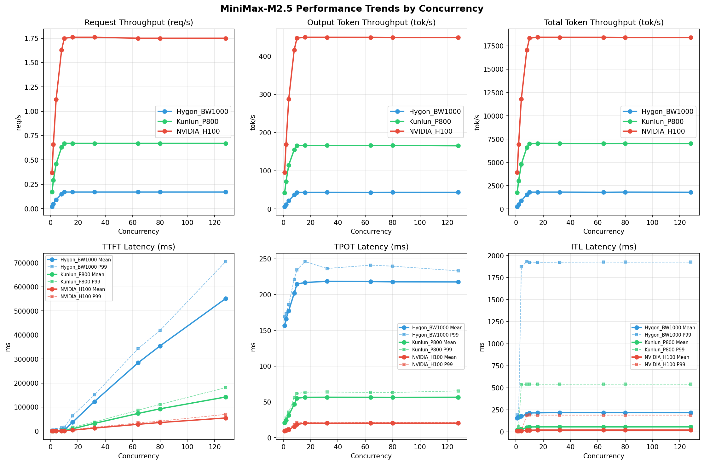
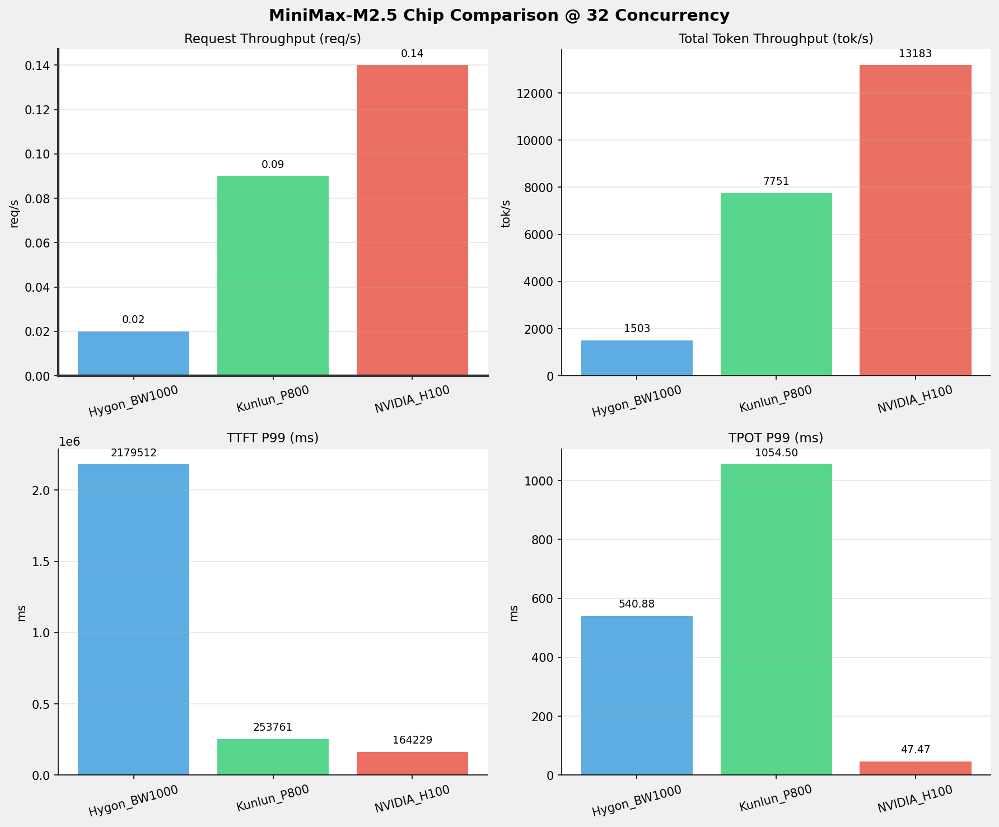
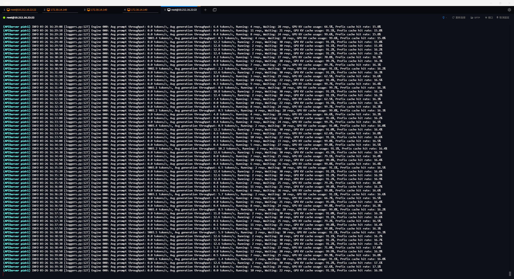
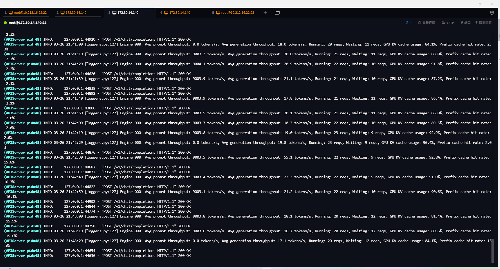
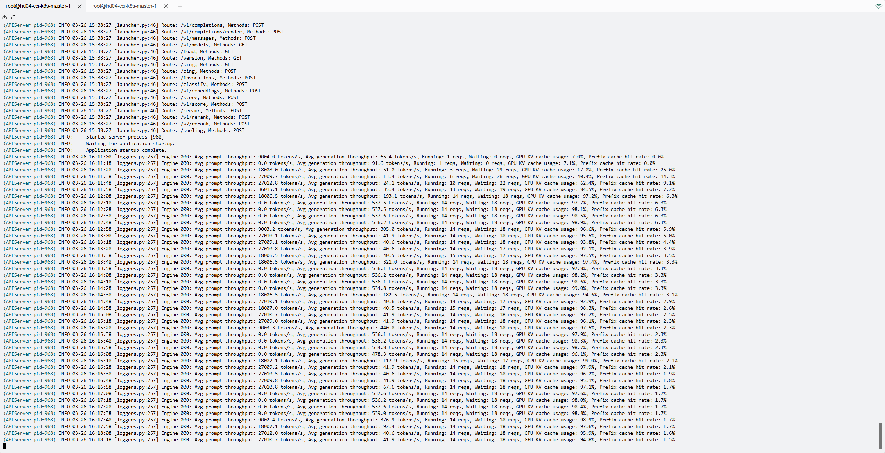

# 海光BW1000、昆仑芯P800、英伟达H100 - 单节点MiniMax-M2.5模型整体测试比对报告

**测试日期：** 2026-03-24 ~ 2026-03-26

---

## 1. 测试背景
公司需要在多个候选开源大模型中选型，部署基于vLLM的推理服务。并需要在满足各项模型服务指标的情况下，选定芯片集采厂商。

## 2. 测试目标
评估英伟达，海光，昆仑芯在单机环境下运行大模型推理的能力，为后续集群采购和生产部署提供决策依据。
1. **硬件摸底**：确认各芯片型号实际规格（算力、显存、带宽）与标称值的一致性
2. **功能验证**：各模型在各芯片环境上的推理正确性和算子兼容性
3. **性能基准**：吞吐量、延迟、显存效率等关键指标
4. **单机极限**：8 卡 Tensor Parallel 的性能上限和资源利用率
5. **稳定性验证**：长时间运行下的可靠性
6. **K8S 容器化验证**：单节点 K8S 环境下GPU/DCU/XPU 调度、资源管理和服务编排能力

## 3. 测试环境

### 3.1 硬件规格

| 组件 \ 规格            | 海光                                  | 昆仑芯                                          | 英伟达                                        | 状态     |
|--------------------|-------------------------------------|----------------------------------------------|--------------------------------------------|--------|
| **节点数量**           | 1 台                                 | 1 台                                          | 1 台                                        | 确认     |
| **芯片型号**           | BW1000                              | P800 OAM                                     | H100                                       | 确认     |
| **芯片数量**           | 8 张                                 | 8 张                                          | 8 张                                        | 确认     |
| **单卡算力 FP16/BF16** | 待确认                                 | 待确认                                          | 1979 TFLOPS （官方理论值）                        | ⚠️ 待确认 |
| **单卡算力 FP32**      | 待确认                                 | 待确认                                          | 67 TFLOPS （官方理论值）                          | ⚠️ 待确认 |
| **单卡算力 FP64**      | 待确认                                 | 待确认                                          | 34 TFLOPS （官方理论值）                          | ⚠️ 待确认 |
| **单卡显存**           | 65520 MiB (约64 GB)                  | 98304 MiB（约96 GB）                            | 80GB                                       | 确认     |
| **显存类型**           | 待确认                                 | 待确认                                          | HBM3                                       | ⚠️ 待确认 |
| **显存带宽**           | 待确认                                 | 待确认                                          | 3.35 TB/s                                  | ⚠️ 待确认 |
| **单卡功耗**           | 200 W                               | 400 W（Enforced Power Limit）                  | 700 W                                      | 确认     |
| **卡间互联**           | HSW                                 | XPULink (XL) + PCIe Gen4 x16（跨 NUMA 显示 SYS）  | NVLink 4.0                                 | 确认     |
| **CPU**            | Hygon C86 (128核)                    | Intel Xeon Platinum 8563C (208核)             | Intel(R) Xeon(R) Platinum 8468 (192核)      | 确认     |
| **系统内存**           | 503GiB                              | 2.0 TiB                                      | 2.0 TiB                                    | 确认     |
| **本地存储**           | 437G系统盘 + 1.7TiB (G73M1T9R-C-GD308) | 446.6G + NVMe 4 x 3.5T (Intel SSDPF2KX038T1) | 894GB 系统盘 + 7TB*4 缓存盘 + 7TB 容器盘 + 25TB 扩展盘 | 确认     |

### 3.2 软件栈

| 组件\版本             | 海光                              | 昆仑芯                                      | 英伟达                   | 说明                   |
|-------------------|---------------------------------|------------------------------------------|-----------------------|----------------------|
| **操作系统**          | Ubuntu 22.04.5 LTS              | Ubuntu 22.04.5 LTS                       | Ubuntu 22.04.5 LTS    | 芯片所在物理机系统            |
| **显卡驱动**          | 6.3.22-V1.2.0                   | Kunlun / XPU Driver 5.0.21.26            | 570.133.20/580.126.09 | 驱动信息                 |
| **Toolkit**       | DTK-26.04-beta-0130-ubuntu20.04 | XPU Container Runtime Hook version 1.0.5 | 1.17.9                | DCU/XPU/GPU Toolkit  |
| **Docker**        | 28.0.4                          | 28.4.0                                   | /                     | 容器运行时                |
| **containerd**    | 2.1.1                           | 1.7.28                                   | 2.2.0                 | K8S 容器运行时（CRI）       |
| **Kubernetes**    | 1.33                            | v1.28.2                                  | 1.34                  | 单节点 All-in-One 部署    |
| **Device Plugin** | v2.4.0                          | xpu-device-plugin v5.0.0-alpha.2         | 0.14.5                | K8S DCU/XPU/GPU 资源管理 |
| **多卡通信库**         | DTK内置RCCL                       | 无单独查询版本                                  | NCCL                  | 多卡通信库                |

### 3.3 推理框架
**测试模型：** **Minimax-M2.5**  
**节点数：** **1**

| 组件         | 海光                                                      | 昆仑芯     | 英伟达    | 说明                         |
|------------|---------------------------------------------------------|---------|--------|----------------------------|
| **vLLM**   | 0.11.0+das.opt1.rc2.dtk2604.20260128.g0bf89b0c          | 0.11.0  | 0.15.1 | 海光为定制vLLM                  |
| **模型精度**   | BF16                                                    | INT8    | FP16   | 昆仑芯只提供了INT8量化精度的，暂没有其他精度模型 |
| **Python** | 3.10.12                                                 | 3.10.15 | 3.12.3 | -                          |

## 4. 测试结果综述

### 4.1 各场景测试的整体情况及性能比对
| 序号  | 测试场景           | 请求参数                                                                  | 请求并发数                                   | 数据集                 | 性能/精度排序              | 备注                                                                                                    |
|-----|----------------|-----------------------------------------------------------------------|-----------------------------------------|---------------------|----------------------|-------------------------------------------------------------------------------------------------------|
| 场景一 | vllm bench基准测试 | 输入上下文 10k   输出上下文 0.25k                                           | [ 1, 2, 4, 8, 10, 16, 32, 64, 80, 128 ] | random              | H100 > P800 > BW1000 | **在各并发下，整体性能英伟达约是昆仑芯的2~2.6倍，是海光的10~15倍**                                                              |
| 场景二 | 单、多并发超长上下文请求   | 输入上下文 190k   输出上下文 1k                                             | [ 1, 2, 4, 8, 10 ]                      | random              | H100 > P800 > BW1000 | **总吞吐量性能英伟达约是昆仑芯2.9倍，海光的3.6倍； 首token性能英伟达约是昆仑芯的3.4倍，是海光的5.8倍**                                    |
| 场景三 | 多并发极限验证        | 输入上下文 90k   输出上下文 2k                                              | [ 32, 64 ]                              | random              | H100 > P800 > BW1000 | **- 在本测试参数下，英伟达最大可同时稳定处理14个请求，缓存命中率稳定且正常； - 昆仑芯在18~23之间波动，缓存命中率波动较大； - 海光在1~12个之间波动，缓存命中率异常** |
| 场景四 | 多轮对话           | 总对话轮数：1000 活跃对话数：10 对话轮次：10 输入token: 200 输出token: 100 | 10                                      | pg1184.txt (seed=0) | H100 > P800 > BW1000 | **英伟达的整体吞吐量约为8，是昆仑芯性能的2.8倍，是海光的13倍**                                                                  |
| 场景五 | 模型精度测试         | num_fewshot：5 batch_size: 1                                       | 延迟分位数                                   | mmlu_pro            | H100 > P800          | **昆仑芯的总体精度评分比英伟达低2.5个百分点左右; 海光没跑出来结果**                                                            | 
| 场景六 | 模型推理功能         |                                                                       |                                         |                     |                      | **模型基础能力验证，3种芯片的基础支持能力基本都可通过**                                                                        |

### 4.2 测试问题汇总

#### 4.2.1 性能问题
从测试的各场景来看，海光的环境性能太慢，模型精度测试使用基础的文本数据集都未能跑出来。

#### 4.2.2 长上下文高并发稳定性问题
在场景三中，海光环境的测试发现模型同时处理的请求数波动比较大（在1~12之间频繁波动），且使用随机种子数据的情况下缓存命中率异常（16%左右，正常应该在0~3%之间） 
而昆仑芯环境处理请求数波动算是稳定，不过缓存命中率波动比较大（在2%~16%左右之间波动）

### 4.3 模型部署问题汇总

#### 4.3.1 思考模式问题
对于思考模式的启动参数，海光和昆仑芯环境部署按照--reasoning-parser minimax_m2启动后，响应内容依然是直接写入到content里，而不是写入到think标签里。

**可能原因**： 
猜测可能跟vLLM的版本较低有关。

**解决方案：** 
- 昆仑芯：建议参数变更为 --reasoning-parser_appened_think minimax_m2  
验证结果：变更后，think标签出现了，不过按照_appened_think的这个设计，think标签的内容会被合并到content里, 由此带来另一个问题是tool_call工具调用功能失败。
- 海光：后续修复，修复后重新传镜像  
验证结果：还未提供最新镜像

#### 4.3.2 专家并行模式问题
对于昆仑芯的vLLM模型部署，在TP=8的情况下，若同时启动专家并行模式，这种情况下是双重高强度通信叠加，在 BKCL / XCCL 上，非常容易出现以下问题：
- buffer size 计算错误
- rank 不一致
- 通信 hang / 越界 （实际测试确实遇到了该问题） 
    
**解决方案** 
昆仑芯的模型部署暂不启用专家并行

### 4.4 GPU、DCU、XPU监控问题说明
由于测试发现海光芯片的监控指令兼容hy-smi和rocm-smi，开始的监控脚本使用的是rocm-smi，很遗憾的是测试开始后并没有真正抓取到DCU的使用情况；
昆仑芯的监控指令xpu-smi指令未打进所提供的镜像里，本次测试暂没有对昆仑芯进行XPU使用监控。
英伟达的GPU使用情况监控记录完整的获取到了，不过由于仅获取这一款芯片的监控情况，本测试报告里暂不体现不同芯片间的GPU/DCU/XPU的监控信息比对。

---

---
以下是每个测试场景的详细结果报告
---

---

## 测试场景一：vllm bench基准测试
**测试目标**：在相同请求数、输入上下文长度、输出上下文长度参数下，使用vllm bench serve工具对并发数逐级增加场景的性能基准验证，并对不同芯片的性能指标进行比对。

**主要采集指标**：

| 指标                  | 单位         | 含义                                 |
|---------------------|------------|------------------------------------|
| TTFT                | ms         | Time To First Token，首 token 延迟     |
| TPOT                | ms/token   | Time Per Output Token，每 token 生成时间 |
| Throughput          | tokens/s   | 系统总吞吐                              |
| QPS                 | requests/s | 请求吞吐                               |
| P50/P95/P99 Latency | ms         | 延迟分位数                              |

### 📊 测试概览

| 项目            | 配置                                     | 备注  |
|---------------|----------------------------------------|-----|
| **数据集**       | random                                 |     |
| **并发数**       | 1, 2, 4, 8, 10, 16, 32, 64, 80, 128    |     |
| **总请求数**      | 320                                    |     |
| **请求输入上下文长度** | 10240（10k）                             |     |
| **请求输出上下文长度** | 256（0.25k）                             |     |
| **模型**        | MiniMax-M2.5                           |     |
| **被测芯片**      | Hygon_BW1000, Kunlun_P800, NVIDIA_H100 |     |

---

### 🤖 vLLM启动配置信息

| 参数名称                   | **Hygon_BW1000** | **Kunlun_P800** | **NVIDIA_H100** |
|------------------------|------------------|------------------|------------------|
| max-model-len | 196608 | 196608 | 196608 |
| max-num-seqs | 10 | 10 | 10 |
| max-num-batched-tokens | 8192 | 8192 | 8192 |
| gpu-memory-utilization | 0.95 | 0.95 | 0.85 |
| dp | 1 | 1 | 1 |
| tp | 8 | 8 | 8 |
| pp | 1 | 1 | 1 |
| enable-export-parallel | True | False | True |
| tool-call-parser | minimax_m2 | minimax_m2 | minimax_m2 |
| reasoning-parser | minimax_m2 (不生效) | minimax_m2 (不生效) | minimax_m2 |

---

### 📈 不同芯片各并发级别性能对比

#### 1 并发

#### 服务基准结果

| 指标                       | Hygon_BW1000 | Kunlun_P800 | NVIDIA_H100   |
|--------------------------|--------------|-------------|---------------|
| 成功请求数                    | 320          | 320         | 320           |
| 失败请求数                    | 0            | 0           | 0             |
| 测试持续时间 (s)               | 13148.00     | 1892.60     | 857.88        |
| 总输入 tokens               | 3276748      | 3276748     | 3276800       |
| 总生成 tokens               | 80226        | 79410       | 81920         |
| **请求吞吐量 (req/s)**        | 0.02         | 0.17        | **0.37** ⭐    |
| **输出 token 吞吐量 (tok/s)** | 6.10         | 41.96       | **95.49** ⭐   |
| 峰值输出 token 吞吐量 (tok/s)   | 8.00         | 50.00       | **110.00** ⭐  |
| 峰值并发请求数                  | 2.00         | 2.00        | 2.00          |
| **总 token 吞吐量 (tok/s)**  | 255.32       | 1773.30     | **3915.14** ⭐ |

#### 首Token延迟 (TTFT)

| 指标 | Hygon_BW1000 | Kunlun_P800 | NVIDIA_H100 |
|------|----------- | ----------- | -----------|
| 平均 TTFT (ms) | 1958.35 | 817.94 | **321.42** ⭐ |
| 中位 TTFT (ms) | 1964.30 | 824.23 | **306.62** ⭐ |
| P95 TTFT (ms) | 1977.98 | 835.94 | **313.59** ⭐ |
| P99 TTFT (ms) | 1990.88 | **842.86** ⭐ | 1181.54 |

#### 每Token生成时间 (TPOT)

| 指标 | Hygon_BW1000 | Kunlun_P800 | NVIDIA_H100 |
|------|----------- | ----------- | -----------|
| 平均 TPOT (ms) | 156.69 | 20.62 | **9.25** ⭐ |
| 中位 TPOT (ms) | 156.16 | 20.62 | **9.23** ⭐ |
| P95 TPOT (ms) | 163.40 | 20.65 | **9.23** ⭐ |
| P99 TPOT (ms) | 168.81 | 20.67 | **9.89** ⭐ |

#### Token间延迟 (ITL)

| 指标 | Hygon_BW1000 | Kunlun_P800 | NVIDIA_H100 |
|------|----------- | ----------- | -----------|
| 平均 ITL (ms) | 156.23 | 20.56 | **9.23** ⭐ |
| 中位 ITL (ms) | 155.76 | 20.60 | **9.22** ⭐ |
| P95 ITL (ms) | 162.28 | 20.77 | **9.41** ⭐ |
| P99 ITL (ms) | 191.32 | 21.22 | **9.90** ⭐ |

---

#### 2 并发

#### 服务基准结果

| 指标                       | Hygon_BW1000 | Kunlun_P800 | NVIDIA_H100   |
|--------------------------|--------------|-------------|---------------|
| 成功请求数                    | 320          | 320         | 320           |
| 失败请求数                    | 0            | 0           | 0             |
| 测试持续时间 (s)               | 6965.73      | 1106.64     | 485.01        |
| 总输入 tokens               | 3276748      | 3276748     | 3276800       |
| 总生成 tokens               | 80297        | 79281       | 81920         |
| **请求吞吐量 (req/s)**        | 0.05         | 0.29        | **0.66** ⭐    |
| **输出 token 吞吐量 (tok/s)** | 11.53        | 71.64       | **168.90** ⭐  |
| 峰值输出 token 吞吐量 (tok/s)   | 15.00        | 93.00       | **207.00** ⭐  |
| 峰值并发请求数                  | 4.00         | 4.00        | 4.00          |
| **总 token 吞吐量 (tok/s)**  | 481.94       | 3032.63     | **6925.05** ⭐ |

#### 首Token延迟 (TTFT)

| 指标 | Hygon_BW1000 | Kunlun_P800 | NVIDIA_H100 |
|------|----------- | ----------- | -----------|
| 平均 TTFT (ms) | 2052.00 | 874.08 | **427.60** ⭐ |
| 中位 TTFT (ms) | 2024.87 | 833.51 | **418.60** ⭐ |
| P95 TTFT (ms) | 2038.41 | 1182.06 | **545.11** ⭐ |
| P99 TTFT (ms) | 3752.70 | 1442.65 | **549.04** ⭐ |

#### 每Token生成时间 (TPOT)

| 指标 | Hygon_BW1000 | Kunlun_P800 | NVIDIA_H100 |
|------|----------- | ----------- | -----------|
| 平均 TPOT (ms) | 165.84 | 24.43 | **10.21** ⭐ |
| 中位 TPOT (ms) | 166.01 | 24.54 | **10.22** ⭐ |
| P95 TPOT (ms) | 168.30 | 25.69 | **10.69** ⭐ |
| P99 TPOT (ms) | 173.26 | 27.19 | **10.70** ⭐ |

#### Token间延迟 (ITL)

| 指标 | Hygon_BW1000 | Kunlun_P800 | NVIDIA_H100 |
|------|----------- | ----------- | -----------|
| 平均 ITL (ms) | 165.31 | 24.46 | **10.18** ⭐ |
| 中位 ITL (ms) | 158.87 | 21.87 | **9.75** ⭐ |
| P95 ITL (ms) | 164.70 | 22.10 | **9.91** ⭐ |
| P99 ITL (ms) | 168.68 | 55.05 | **10.48** ⭐ |

---

#### 4 并发

#### 服务基准结果

| 指标                       | Hygon_BW1000 | Kunlun_P800 | NVIDIA_H100    |
|--------------------------|--------------|-------------|----------------|
| 成功请求数                    | 320          | 320         | 320            |
| 失败请求数                    | 0            | 0           | 0              |
| 测试持续时间 (s)               | 3741.16      | 696.02      | 284.59         |
| 总输入 tokens               | 3276748      | 3276748     | 3276800        |
| 总生成 tokens               | 80266        | 79960       | 81920          |
| **请求吞吐量 (req/s)**        | 0.09         | 0.46        | **1.12** ⭐     |
| **输出 token 吞吐量 (tok/s)** | 21.45        | 114.88      | **287.86** ⭐   |
| 峰值输出 token 吞吐量 (tok/s)   | 29.00        | 173.00      | **401.00** ⭐   |
| 峰值并发请求数                  | 7.00         | 7.00        | 8.00           |
| **总 token 吞吐量 (tok/s)**  | 897.32       | 4822.70     | **11802.07** ⭐ |

#### 首Token延迟 (TTFT)

| 指标 | Hygon_BW1000 | Kunlun_P800 | NVIDIA_H100 |
|------|----------- | ----------- | -----------|
| 平均 TTFT (ms) | 2185.58 | 930.47 | **694.79** ⭐ |
| 中位 TTFT (ms) | 2038.85 | 843.28 | **666.62** ⭐ |
| P95 TTFT (ms) | 3821.77 | 1458.49 | **992.60** ⭐ |
| P99 TTFT (ms) | 5568.67 | 2064.95 | **995.93** ⭐ |

#### 每Token生成时间 (TPOT)

| 指标 | Hygon_BW1000 | Kunlun_P800 | NVIDIA_H100 |
|------|----------- | ----------- | -----------|
| 平均 TPOT (ms) | 177.49 | 31.10 | **11.22** ⭐ |
| 中位 TPOT (ms) | 177.87 | 31.38 | **11.32** ⭐ |
| P95 TPOT (ms) | 183.40 | 34.01 | **12.78** ⭐ |
| P99 TPOT (ms) | 186.11 | 35.52 | **12.80** ⭐ |

#### Token间延迟 (ITL)

| 指标 | Hygon_BW1000 | Kunlun_P800 | NVIDIA_H100 |
|------|----------- | ----------- | -----------|
| 平均 ITL (ms) | 176.98 | 31.29 | **11.19** ⭐ |
| 中位 ITL (ms) | 157.22 | 23.38 | **10.08** ⭐ |
| P95 ITL (ms) | 162.59 | 24.17 | **10.33** ⭐ |
| P99 ITL (ms) | 1872.44 | 534.67 | **11.28** ⭐ |

---

#### 8 并发

#### 服务基准结果

| 指标                       | Hygon_BW1000 | Kunlun_P800 | NVIDIA_H100    |
|--------------------------|--------------|-------------|----------------|
| 成功请求数                    | 320          | 320         | 320            |
| 失败请求数                    | 0            | 0           | 0              |
| 测试持续时间 (s)               | 2176.31      | 508.44      | 196.85         |
| 总输入 tokens               | 3276748      | 3276748     | 3276800        |
| 总生成 tokens               | 80442        | 78888       | 81920          |
| **请求吞吐量 (req/s)**        | 0.15         | 0.63        | **1.63** ⭐     |
| **输出 token 吞吐量 (tok/s)** | 36.96        | 155.16      | **416.15** ⭐   |
| 峰值输出 token 吞吐量 (tok/s)   | 59.00        | 280.00      | **680.00** ⭐   |
| 峰值并发请求数                  | 15.00        | 13.00       | 16.00          |
| **总 token 吞吐量 (tok/s)**  | 1542.60      | 6599.86     | **17062.16** ⭐ |

#### 首Token延迟 (TTFT)

| 指标 | Hygon_BW1000 | Kunlun_P800 | NVIDIA_H100 |
|------|----------- | ----------- | -----------|
| 平均 TTFT (ms) | 3297.61 | 1140.45 | **961.02** ⭐ |
| 中位 TTFT (ms) | 2089.60 | **847.01** ⭐ | 1023.59 |
| P95 TTFT (ms) | 10888.09 | 2055.50 | **1474.23** ⭐ |
| P99 TTFT (ms) | 13004.02 | 3816.59 | **1603.43** ⭐ |

#### 每Token生成时间 (TPOT)

| 指标 | Hygon_BW1000 | Kunlun_P800 | NVIDIA_H100 |
|------|----------- | ----------- | -----------|
| 平均 TPOT (ms) | 201.95 | 46.86 | **15.53** ⭐ |
| 中位 TPOT (ms) | 205.98 | 47.37 | **15.30** ⭐ |
| P95 TPOT (ms) | 212.79 | 50.43 | **18.09** ⭐ |
| P99 TPOT (ms) | 221.53 | 56.20 | **18.14** ⭐ |

#### Token间延迟 (ITL)

| 指标 | Hygon_BW1000 | Kunlun_P800 | NVIDIA_H100 |
|------|----------- | ----------- | -----------|
| 平均 ITL (ms) | 201.36 | 47.59 | **15.48** ⭐ |
| 中位 ITL (ms) | 157.25 | 29.16 | **11.93** ⭐ |
| P95 ITL (ms) | 163.19 | 60.47 | **12.35** ⭐ |
| P99 ITL (ms) | 1931.02 | 541.52 | **187.51** ⭐ |

---

#### 10 并发

#### 服务基准结果

| 指标                       | Hygon_BW1000 | Kunlun_P800 | NVIDIA_H100    |
|--------------------------|--------------|-------------|----------------|
| 成功请求数                    | 320          | 320         | 320            |
| 失败请求数                    | 0            | 0           | 0              |
| 测试持续时间 (s)               | 1854.59      | 479.27      | 183.23         |
| 总输入 tokens               | 3276748      | 3276748     | 3276800        |
| 总生成 tokens               | 80517        | 79598       | 81920          |
| **请求吞吐量 (req/s)**        | 0.17         | 0.67        | **1.75** ⭐     |
| **输出 token 吞吐量 (tok/s)** | 43.42        | 166.08      | **447.09** ⭐   |
| 峰值输出 token 吞吐量 (tok/s)   | 73.00        | 311.00      | **759.00** ⭐   |
| 峰值并发请求数                  | 16.00        | 15.00       | 18.00          |
| **总 token 吞吐量 (tok/s)**  | 1810.25      | 7003.02     | **18330.76** ⭐ |

#### 首Token延迟 (TTFT)

| 指标 | Hygon_BW1000 | Kunlun_P800 | NVIDIA_H100 |
|------|----------- | ----------- | -----------|
| 平均 TTFT (ms) | 3593.83 | 1232.27 | **1012.23** ⭐ |
| 中位 TTFT (ms) | 2084.97 | **859.67** ⭐ | 1139.42 |
| P95 TTFT (ms) | 10884.20 | 2782.24 | **1398.62** ⭐ |
| P99 TTFT (ms) | 16227.56 | 4707.14 | **1604.56** ⭐ |

#### 每Token生成时间 (TPOT)

| 指标 | Hygon_BW1000 | Kunlun_P800 | NVIDIA_H100 |
|------|----------- | ----------- | -----------|
| 平均 TPOT (ms) | 214.72 | 55.09 | **18.48** ⭐ |
| 中位 TPOT (ms) | 219.17 | 56.07 | **17.95** ⭐ |
| P95 TPOT (ms) | 227.12 | 59.03 | **21.21** ⭐ |
| P99 TPOT (ms) | 234.69 | 61.46 | **21.28** ⭐ |

#### Token间延迟 (ITL)

| 指标 | Hygon_BW1000 | Kunlun_P800 | NVIDIA_H100 |
|------|----------- | ----------- | -----------|
| 平均 ITL (ms) | 214.01 | 54.93 | **18.42** ⭐ |
| 中位 ITL (ms) | 157.32 | 32.95 | **13.38** ⭐ |
| P95 ITL (ms) | 163.94 | 188.79 | **14.18** ⭐ |
| P99 ITL (ms) | 1924.45 | 542.02 | **190.68** ⭐ |

---

#### 16 并发

#### 服务基准结果

| 指标                       | Hygon_BW1000 | Kunlun_P800 | NVIDIA_H100    |
|--------------------------|--------------|-------------|----------------|
| 成功请求数                    | 320          | 320         | 320            |
| 失败请求数                    | 0            | 0           | 0              |
| 测试持续时间 (s)               | 1847.45      | 475.87      | 182.26         |
| 总输入 tokens               | 3276748      | 3276748     | 3276800        |
| 总生成 tokens               | 80132        | 79221       | 81920          |
| **请求吞吐量 (req/s)**        | 0.17         | 0.67        | **1.76** ⭐     |
| **输出 token 吞吐量 (tok/s)** | 43.37        | 166.48      | **449.46** ⭐   |
| 峰值输出 token 吞吐量 (tok/s)   | 71.00        | 311.00      | **760.00** ⭐   |
| 峰值并发请求数                  | 20.00        | 18.00       | 22.00          |
| **总 token 吞吐量 (tok/s)**  | 1817.04      | 7052.24     | **18427.76** ⭐ |

#### 首Token延迟 (TTFT)

| 指标 | Hygon_BW1000 | Kunlun_P800 | NVIDIA_H100 |
|------|----------- | ----------- | -----------|
| 平均 TTFT (ms) | 36634.82 | 9584.38 | **3864.33** ⭐ |
| 中位 TTFT (ms) | 35931.86 | 9886.81 | **5018.01** ⭐ |
| P95 TTFT (ms) | 58125.31 | 11728.12 | **5362.36** ⭐ |
| P99 TTFT (ms) | 63884.93 | 15927.16 | **6358.44** ⭐ |

#### 每Token生成时间 (TPOT)

| 指标 | Hygon_BW1000 | Kunlun_P800 | NVIDIA_H100 |
|------|----------- | ----------- | -----------|
| 平均 TPOT (ms) | 216.95 | 56.41 | **20.24** ⭐ |
| 中位 TPOT (ms) | 219.89 | 56.34 | **20.22** ⭐ |
| P95 TPOT (ms) | 228.33 | 59.38 | **21.28** ⭐ |
| P99 TPOT (ms) | 246.10 | 63.60 | **21.35** ⭐ |

#### Token间延迟 (ITL)

| 指标 | Hygon_BW1000 | Kunlun_P800 | NVIDIA_H100 |
|------|----------- | ----------- | -----------|
| 平均 ITL (ms) | 216.16 | 56.28 | **20.19** ⭐ |
| 中位 ITL (ms) | 157.71 | 32.98 | **13.38** ⭐ |
| P95 ITL (ms) | 164.13 | 188.87 | **15.08** ⭐ |
| P99 ITL (ms) | 1923.89 | 540.05 | **189.48** ⭐ |

---

#### 32 并发

#### 服务基准结果

| 指标                       | Hygon_BW1000 | Kunlun_P800 | NVIDIA_H100    |
|--------------------------|--------------|-------------|----------------|
| 成功请求数                    | 320          | 320         | 320            |
| 失败请求数                    | 0            | 0           | 0              |
| 测试持续时间 (s)               | 1847.10      | 477.04      | 182.30         |
| 总输入 tokens               | 3276748      | 3276748     | 3276800        |
| 总生成 tokens               | 80324        | 79281       | 81920          |
| **请求吞吐量 (req/s)**        | 0.17         | 0.67        | **1.76** ⭐     |
| **输出 token 吞吐量 (tok/s)** | 43.49        | 166.19      | **449.36** ⭐   |
| 峰值输出 token 吞吐量 (tok/s)   | 71.00        | 311.00      | **760.00** ⭐   |
| 峰值并发请求数                  | 36.00        | 34.00       | 38.00          |
| **总 token 吞吐量 (tok/s)**  | 1817.48      | 7035.16     | **18423.63** ⭐ |

#### 首Token延迟 (TTFT)

| 指标 | Hygon_BW1000 | Kunlun_P800 | NVIDIA_H100 |
|------|----------- | ----------- | -----------|
| 平均 TTFT (ms) | 122875.63 | 32040.77 | **12498.42** ⭐ |
| 中位 TTFT (ms) | 124891.14 | 32900.58 | **12483.01** ⭐ |
| P95 TTFT (ms) | 147416.43 | 36489.30 | **15827.75** ⭐ |
| P99 TTFT (ms) | 150615.03 | 37797.90 | **15877.21** ⭐ |

#### 每Token生成时间 (TPOT)

| 指标 | Hygon_BW1000 | Kunlun_P800 | NVIDIA_H100 |
|------|----------- | ----------- | -----------|
| 平均 TPOT (ms) | 218.56 | 56.49 | **20.18** ⭐ |
| 中位 TPOT (ms) | 220.42 | 56.33 | **20.21** ⭐ |
| P95 TPOT (ms) | 227.78 | 60.89 | **20.81** ⭐ |
| P99 TPOT (ms) | 236.50 | 63.90 | **20.85** ⭐ |

#### Token间延迟 (ITL)

| 指标 | Hygon_BW1000 | Kunlun_P800 | NVIDIA_H100 |
|------|----------- | ----------- | -----------|
| 平均 ITL (ms) | 217.96 | 56.27 | **20.12** ⭐ |
| 中位 ITL (ms) | 157.77 | 32.96 | **13.40** ⭐ |
| P95 ITL (ms) | 165.32 | 188.78 | **14.81** ⭐ |
| P99 ITL (ms) | 1924.43 | 540.00 | **189.42** ⭐ |

---

#### 64 并发

#### 服务基准结果

| 指标                       | Hygon_BW1000 | Kunlun_P800 | NVIDIA_H100    |
|--------------------------|--------------|-------------|----------------|
| 成功请求数                    | 320          | 320         | 320            |
| 失败请求数                    | 0            | 0           | 0              |
| 测试持续时间 (s)               | 1864.45      | 477.53      | 182.36         |
| 总输入 tokens               | 3276748      | 3276748     | 3276800        |
| 总生成 tokens               | 80461        | 79358       | 81920          |
| **请求吞吐量 (req/s)**        | 0.17         | 0.67        | **1.75** ⭐     |
| **输出 token 吞吐量 (tok/s)** | 43.16        | 166.18      | **449.23** ⭐   |
| 峰值输出 token 吞吐量 (tok/s)   | 71.00        | 310.00      | **760.00** ⭐   |
| 峰值并发请求数                  | 68.00        | 67.00       | 70.00          |
| **总 token 吞吐量 (tok/s)**  | 1800.65      | 7027.99     | **18418.46** ⭐ |

#### 首Token延迟 (TTFT)

| 指标 | Hygon_BW1000 | Kunlun_P800 | NVIDIA_H100 |
|------|----------- | ----------- | -----------|
| 平均 TTFT (ms) | 284382.45 | 73483.64 | **28345.01** ⭐ |
| 中位 TTFT (ms) | 308175.63 | 80355.19 | **29997.18** ⭐ |
| P95 TTFT (ms) | 336951.30 | 83007.06 | **33326.91** ⭐ |
| P99 TTFT (ms) | 343209.29 | 86884.30 | **34028.75** ⭐ |

#### 每Token生成时间 (TPOT)

| 指标 | Hygon_BW1000 | Kunlun_P800 | NVIDIA_H100 |
|------|----------- | ----------- | -----------|
| 平均 TPOT (ms) | 218.23 | 56.43 | **20.25** ⭐ |
| 中位 TPOT (ms) | 219.77 | 56.32 | **20.21** ⭐ |
| P95 TPOT (ms) | 231.26 | 61.17 | **21.30** ⭐ |
| P99 TPOT (ms) | 241.21 | 63.21 | **21.36** ⭐ |

#### Token间延迟 (ITL)

| 指标 | Hygon_BW1000 | Kunlun_P800 | NVIDIA_H100 |
|------|----------- | ----------- | -----------|
| 平均 ITL (ms) | 217.55 | 56.24 | **20.19** ⭐ |
| 中位 ITL (ms) | 157.89 | 32.93 | **13.38** ⭐ |
| P95 ITL (ms) | 168.53 | 188.83 | **15.08** ⭐ |
| P99 ITL (ms) | 1925.72 | 540.19 | **189.46** ⭐ |

---

#### 80 并发

#### 服务基准结果

| 指标                       | Hygon_BW1000 | Kunlun_P800 | NVIDIA_H100    |
|--------------------------|--------------|-------------|----------------|
| 成功请求数                    | 320          | 320         | 320            |
| 失败请求数                    | 0            | 0           | 0              |
| 测试持续时间 (s)               | 1847.88      | 476.99      | 182.55         |
| 总输入 tokens               | 3276748      | 3276748     | 3276800        |
| 总生成 tokens               | 80365        | 79327       | 81920          |
| **请求吞吐量 (req/s)**        | 0.17         | 0.67        | **1.75** ⭐     |
| **输出 token 吞吐量 (tok/s)** | 43.49        | 166.31      | **448.76** ⭐   |
| 峰值输出 token 吞吐量 (tok/s)   | 71.00        | 311.00      | **760.00** ⭐   |
| 峰值并发请求数                  | 84.00        | 82.00       | 86.00          |
| **总 token 吞吐量 (tok/s)**  | 1816.74      | 7035.98     | **18399.06** ⭐ |

#### 首Token延迟 (TTFT)

| 指标 | Hygon_BW1000 | Kunlun_P800 | NVIDIA_H100 |
|------|----------- | ----------- | -----------|
| 平均 TTFT (ms) | 354268.91 | 92691.66 | **35639.41** ⭐ |
| 中位 TTFT (ms) | 402242.69 | 104622.58 | **40443.15** ⭐ |
| P95 TTFT (ms) | 409210.34 | 106423.96 | **40507.57** ⭐ |
| P99 TTFT (ms) | 418658.91 | 110973.71 | **41499.32** ⭐ |

#### 每Token生成时间 (TPOT)

| 指标 | Hygon_BW1000 | Kunlun_P800 | NVIDIA_H100 |
|------|----------- | ----------- | -----------|
| 平均 TPOT (ms) | 217.84 | 56.36 | **20.27** ⭐ |
| 中位 TPOT (ms) | 220.16 | 56.32 | **20.23** ⭐ |
| P95 TPOT (ms) | 227.98 | 60.21 | **21.31** ⭐ |
| P99 TPOT (ms) | 239.73 | 63.17 | **21.36** ⭐ |

#### Token间延迟 (ITL)

| 指标 | Hygon_BW1000 | Kunlun_P800 | NVIDIA_H100 |
|------|----------- | ----------- | -----------|
| 平均 ITL (ms) | 217.14 | 56.17 | **20.21** ⭐ |
| 中位 ITL (ms) | 157.45 | 32.94 | **13.40** ⭐ |
| P95 ITL (ms) | 164.60 | 188.95 | **15.23** ⭐ |
| P99 ITL (ms) | 1924.81 | 540.58 | **189.49** ⭐ |

---

#### 128 并发

#### 服务基准结果

| 指标                       | Hygon_BW1000 | Kunlun_P800 | NVIDIA_H100    |
|--------------------------|--------------|-------------|----------------|
| 成功请求数                    | 320          | 320         | 320            |
| 失败请求数                    | 0            | 0           | 0              |
| 测试持续时间 (s)               | 1861.45      | 477.43      | 182.53         |
| 总输入 tokens               | 3276748      | 3276748     | 3276800        |
| 总生成 tokens               | 80952        | 79008       | 81920          |
| **请求吞吐量 (req/s)**        | 0.17         | 0.67        | **1.75** ⭐     |
| **输出 token 吞吐量 (tok/s)** | 43.49        | 165.49      | **448.81** ⭐   |
| 峰值输出 token 吞吐量 (tok/s)   | 71.00        | 310.00      | **760.00** ⭐   |
| 峰值并发请求数                  | 132.00       | 131.00      | 134.00         |
| **总 token 吞吐量 (tok/s)**  | 1803.81      | 7028.75     | **18401.38** ⭐ |

#### 首Token延迟 (TTFT)

| 指标 | Hygon_BW1000 | Kunlun_P800 | NVIDIA_H100 |
|------|----------- | ----------- | -----------|
| 平均 TTFT (ms) | 551191.53 | 141780.60 | **54641.25** ⭐ |
| 中位 TTFT (ms) | 677657.74 | 174046.20 | **66656.46** ⭐ |
| P95 TTFT (ms) | 697287.77 | 176900.75 | **68581.20** ⭐ |
| P99 TTFT (ms) | 705024.57 | 180930.81 | **69614.62** ⭐ |

#### 每Token生成时间 (TPOT)

| 指标 | Hygon_BW1000 | Kunlun_P800 | NVIDIA_H100 |
|------|----------- | ----------- | -----------|
| 平均 TPOT (ms) | 217.69 | 56.48 | **20.25** ⭐ |
| 中位 TPOT (ms) | 220.15 | 56.36 | **20.22** ⭐ |
| P95 TPOT (ms) | 227.58 | 61.46 | **21.29** ⭐ |
| P99 TPOT (ms) | 233.25 | 65.38 | **21.35** ⭐ |

#### Token间延迟 (ITL)

| 指标 | Hygon_BW1000 | Kunlun_P800 | NVIDIA_H100 |
|------|----------- | ----------- | -----------|
| 平均 ITL (ms) | 216.99 | 56.35 | **20.20** ⭐ |
| 中位 ITL (ms) | 157.95 | 32.95 | **13.39** ⭐ |
| P95 ITL (ms) | 164.61 | 188.89 | **15.04** ⭐ |
| P99 ITL (ms) | 1925.47 | 539.85 | **189.51** ⭐ |

---

### 📈 性能趋势对比图 (所有芯片)

---

### 📝 场景一测试结果分析总结

#### 1. 吞吐量性能对比

**请求吞吐量 (QPS)**: 在低并发(1-4)场景下，NVIDIA_H100 表现最佳，平均 0.72 req/s；
在中并发(8-32)场景下，NVIDIA_H100 表现最佳，平均 1.72 req/s；
在高并发(64-128)场景下，NVIDIA_H100 表现最佳，平均 1.75 req/s。

**Token吞吐量**: NVIDIA_H100 在128并发时达到最高吞吐量 18401 tok/s。

#### 2. 首Token延迟 (TTFT) 对比

**低并发(1-4)**: NVIDIA_H100 TTFT最优，平均 909ms

**高并发(64-128)**: NVIDIA_H100 TTFT最优，平均 48381ms

⚠️ **注意**: 海光芯片在高并发下TTFT延迟显著高于其他芯片，约为NVIDIA的10倍

#### 3. Token生成时间 (TPOT) 对比

**最优表现**: NVIDIA_H100 在各并发下TPOT表现最佳，128并发时仅为 9.89ms

⚠️ **注意**: 海光芯片TPOT延迟明显高于NVIDIA，约为 10.9 倍

#### 4. 综合评估

**综合性能**: NVIDIA_H100 在所有测试场景中综合表现最优

#### 请求吞吐量 (Request Throughput) - 各并发最优

| Concurrency | Best Chip | Performance |
|-------------|-----------|-------------|
| 1 | NVIDIA_H100 | 0.37 req/s |
| 2 | NVIDIA_H100 | 0.66 req/s |
| 4 | NVIDIA_H100 | 1.12 req/s |
| 8 | NVIDIA_H100 | 1.63 req/s |
| 10 | NVIDIA_H100 | 1.75 req/s |
| 16 | NVIDIA_H100 | 1.76 req/s |
| 32 | NVIDIA_H100 | 1.76 req/s |
| 64 | NVIDIA_H100 | 1.75 req/s |
| 80 | NVIDIA_H100 | 1.75 req/s |
| 128 | NVIDIA_H100 | 1.75 req/s |

#### Token总吞吐量 (Total Token Throughput) - 各并发最优

| Concurrency | Best Chip | Performance |
|-------------|-----------|-------------|
| 1 | NVIDIA_H100 | 3915 tok/s |
| 2 | NVIDIA_H100 | 6925 tok/s |
| 4 | NVIDIA_H100 | 11802 tok/s |
| 8 | NVIDIA_H100 | 17062 tok/s |
| 10 | NVIDIA_H100 | 18331 tok/s |
| 16 | NVIDIA_H100 | 18428 tok/s |
| 32 | NVIDIA_H100 | 18424 tok/s |
| 64 | NVIDIA_H100 | 18418 tok/s |
| 80 | NVIDIA_H100 | 18399 tok/s |
| 128 | NVIDIA_H100 | 18401 tok/s |

#### TTFT P99 - 各并发最优

| Concurrency | Best Chip | Latency |
|-------------|-----------|---------|
| 1 | Kunlun_P800 | 842.86 ms |
| 2 | NVIDIA_H100 | 549.04 ms |
| 4 | NVIDIA_H100 | 995.93 ms |
| 8 | NVIDIA_H100 | 1603.43 ms |
| 10 | NVIDIA_H100 | 1604.56 ms |
| 16 | NVIDIA_H100 | 6358.44 ms |
| 32 | NVIDIA_H100 | 15877.21 ms |
| 64 | NVIDIA_H100 | 34028.75 ms |
| 80 | NVIDIA_H100 | 41499.32 ms |
| 128 | NVIDIA_H100 | 69614.62 ms |

#### TPOT P99 - 各并发最优

| Concurrency | Best Chip | Latency |
|-------------|-----------|---------|
| 1 | NVIDIA_H100 | 9.89 ms |
| 2 | NVIDIA_H100 | 10.70 ms |
| 4 | NVIDIA_H100 | 12.80 ms |
| 8 | NVIDIA_H100 | 18.14 ms |
| 10 | NVIDIA_H100 | 21.28 ms |
| 16 | NVIDIA_H100 | 21.35 ms |
| 32 | NVIDIA_H100 | 20.85 ms |
| 64 | NVIDIA_H100 | 21.36 ms |
| 80 | NVIDIA_H100 | 21.36 ms |
| 128 | NVIDIA_H100 | 21.35 ms |

---

---

## 测试场景二：单、多并发超长上下文请求测试

**测试目标**：获取单并发超长上下文请求（接近启动参数的max-len 192k）下各芯片的性能指标。

### 📊 测试概览

| 项目            | 配置                                     | 备注  |
|---------------|----------------------------------------|-----|
| **数据集**       | random                                 |     |
| **并发数**       | 1                                      |     |
| **总请求数**      | 100                                    |     |
| **请求输入上下文长度** | 194560（190k）                           |     |
| **请求输出上下文长度** | 1024（1k）                               |     |
| **模型**        | MiniMax-M2.5                           |     |
| **被测芯片**      | Hygon_BW1000, Kunlun_P800, NVIDIA_H100 |     |

---

### 🤖 vLLM启动配置信息

| 参数名称                   | **Hygon_BW1000** | **Kunlun_P800**  | **NVIDIA_H100** |
|------------------------|------------------|------------------|-----------------|
| max-model-len          | 196608           | 196608           | 196608          |
| max-num-seqs           | 10               | 10               | 10              |
| max-num-batched-tokens | 8192             | 8192             | 8192            |
| gpu-memory-utilization | 0.95             | 0.95             | 0.85            |
| dp                     | 1                | 1                | 1               |
| tp                     | 8                | 8                | 8               |
| pp                     | 1                | 1                | 1               |
| enable-export-parallel | True             | False            | True            |
| tool-call-parser       | minimax_m2       | minimax_m2       | minimax_m2      |
| reasoning-parser       | minimax_m2 (不生效) | minimax_m2 (不生效) | minimax_m2      |

---
### 📈 超长上下文请求各并发级别性能对比

### 1 并发

#### 服务基准结果

| 指标                       | Hygon_BW1000 | Kunlun_P800 | NVIDIA_H100   |
|--------------------------|--------------|-------------|---------------|
| 成功请求数                    | 100          | 100         | 100           |
| 失败请求数                    | 0            | 0           | 0             |
| 测试持续时间 (s)               | 8655.55      | 4735.72     | 2400.85       |
| 总输入 tokens               | 19456000     | 19456000    | 19456000      |
| 总生成 tokens               | 14970        | 15277       | 102400        |
| **请求吞吐量 (req/s)**        | 0.01         | 0.02        | **0.04** ⭐    |
| **输出 token 吞吐量 (tok/s)** | 1.73         | 3.23        | **42.65** ⭐   |
| 峰值输出 token 吞吐量 (tok/s)   | 8.00         | 20.00       | **79.00** ⭐   |
| 峰值并发请求数                  | 2.00         | 2.00        | 2.00          |
| **总 token 吞吐量 (tok/s)**  | 2249.54      | 4111.58     | **8146.44** ⭐ |

#### 首Token延迟 (TTFT)

| 指标            | Hygon_BW1000 | Kunlun_P800 | NVIDIA_H100    |
|---------------|--------------|-------------|----------------|
| 平均 TTFT (ms)  | 63442.80     | 39047.26    | **10837.53** ⭐ |
| 中位 TTFT (ms)  | 64113.52     | 39430.52    | **10939.07** ⭐ |
| P95 TTFT (ms) | 64263.01     | 39464.93    | **10981.68** ⭐ |
| P99 TTFT (ms) | 64339.96     | 39495.63    | **10999.63** ⭐ |

#### 每Token生成时间 (TPOT)

| 指标            | Hygon_BW1000 | Kunlun_P800 | NVIDIA_H100 |
|---------------|--------------|-------------|-------------|
| 平均 TPOT (ms)  | 155.46       | 54.79       | **12.87** ⭐ |
| 中位 TPOT (ms)  | 155.38       | 54.76       | **12.87** ⭐ |
| P95 TPOT (ms) | 157.34       | 54.81       | **12.93** ⭐ |
| P99 TPOT (ms) | 157.59       | 56.01       | **13.03** ⭐ |

#### Token间延迟 (ITL)

| 指标           | Hygon_BW1000 | Kunlun_P800 | NVIDIA_H100 |
|--------------|--------------|-------------|-------------|
| 平均 ITL (ms)  | 155.43       | 54.75       | **12.93** ⭐ |
| 中位 ITL (ms)  | 155.08       | 54.74       | **12.87** ⭐ |
| P95 ITL (ms) | 161.33       | 54.99       | **13.04** ⭐ |
| P99 ITL (ms) | 171.35       | 57.01       | **13.89** ⭐ |

#### 📊 单并发下的芯片间性能比对柱状图

### 2 并发

#### 服务基准结果

| 指标                       | Hygon_BW1000 | Kunlun_P800 | NVIDIA_H100    |
|--------------------------|--------------|-------------|----------------|
| 成功请求数                    | 100          | 100         | 100            |
| 失败请求数                    | 0            | 0           | 0              |
| 测试持续时间 (s)               | 8755.03      | 4456.34     | 1829.83        |
| 总输入 tokens               | 19456000     | 19456000    | 19456000       |
| 总生成 tokens               | 15263        | 20670       | 102400         |
| **请求吞吐量 (req/s)**        | 0.01         | 0.02        | **0.05** ⭐     |
| **输出 token 吞吐量 (tok/s)** | 1.74         | 4.64        | **55.96** ⭐    |
| 峰值输出 token 吞吐量 (tok/s)   | 8.00         | 37.00       | **134.00** ⭐   |
| 峰值并发请求数                  | 3.00         | 3.00        | 4.00           |
| **总 token 吞吐量 (tok/s)**  | 2224.01      | 4370.55     | **10688.67** ⭐ |

#### 首Token延迟 (TTFT)

| 指标            | Hygon_BW1000 | Kunlun_P800 | NVIDIA_H100    |
|---------------|--------------|-------------|----------------|
| 平均 TTFT (ms)  | 150613.30    | 44931.50    | **15942.01** ⭐ |
| 中位 TTFT (ms)  | 148787.19    | 40375.08    | **11898.47** ⭐ |
| P95 TTFT (ms) | 166905.14    | 75502.31    | **21401.99** ⭐ |
| P99 TTFT (ms) | 288709.33    | 78394.34    | **21510.81** ⭐ |

#### 每Token生成时间 (TPOT)

| 指标            | Hygon_BW1000 | Kunlun_P800 | NVIDIA_H100 |
|---------------|--------------|-------------|-------------|
| 平均 TPOT (ms)  | 155.72       | 207.16      | **20.19** ⭐ |
| 中位 TPOT (ms)  | 155.74       | 134.72      | **22.20** ⭐ |
| P95 TPOT (ms) | 157.55       | 546.28      | **25.27** ⭐ |
| P99 TPOT (ms) | 158.61       | 632.60      | **25.37** ⭐ |

#### Token间延迟 (ITL)

| 指标           | Hygon_BW1000 | Kunlun_P800 | NVIDIA_H100 |
|--------------|--------------|-------------|-------------|
| 平均 ITL (ms)  | 155.59       | 214.50      | **20.27** ⭐ |
| 中位 ITL (ms)  | 155.14       | 56.01       | **15.14** ⭐ |
| P95 ITL (ms) | 161.19       | 1622.96     | **15.37** ⭐ |
| P99 ITL (ms) | **165.40** ⭐ | 2481.47     | 324.31      |

### 4 并发

#### 服务基准结果

| 指标                       | Hygon_BW1000 | Kunlun_P800 | NVIDIA_H100    |
|--------------------------|--------------|-------------|----------------|
| 成功请求数                    | 100          | 100         | 100            |
| 失败请求数                    | 0            | 0           | 0              |
| 测试持续时间 (s)               | 9218.65      | 4054.16     | 1512.09        |
| 总输入 tokens               | 19456000     | 19456000    | 19456000       |
| 总生成 tokens               | 16504        | 14852       | 102400         |
| **请求吞吐量 (req/s)**        | 0.01         | 0.02        | **0.07** ⭐     |
| **输出 token 吞吐量 (tok/s)** | 1.79         | 3.66        | **67.72** ⭐    |
| 峰值输出 token 吞吐量 (tok/s)   | 8.00         | 73.00       | **224.00** ⭐   |
| 峰值并发请求数                  | 5.00         | 7.00        | 7.00           |
| **总 token 吞吐量 (tok/s)**  | 2112.29      | 4802.69     | **12934.69** ⭐ |

#### 首Token延迟 (TTFT)

| 指标            | Hygon_BW1000 | Kunlun_P800 | NVIDIA_H100    |
|---------------|--------------|-------------|----------------|
| 平均 TTFT (ms)  | 337958.92    | 58703.34    | **19249.51** ⭐ |
| 中位 TTFT (ms)  | 333410.25    | 47826.04    | **17145.98** ⭐ |
| P95 TTFT (ms) | 408152.45    | 117588.50   | **32208.02** ⭐ |
| P99 TTFT (ms) | 465366.18    | 120034.28   | **33469.80** ⭐ |

#### 每Token生成时间 (TPOT)

| 指标            | Hygon_BW1000 | Kunlun_P800 | NVIDIA_H100 |
|---------------|--------------|-------------|-------------|
| 平均 TPOT (ms)  | 155.34       | 690.63      | **40.26** ⭐ |
| 中位 TPOT (ms)  | 155.21       | 711.54      | **38.56** ⭐ |
| P95 TPOT (ms) | 157.16       | 1017.54     | **48.44** ⭐ |
| P99 TPOT (ms) | 157.97       | 1199.30     | **49.23** ⭐ |

#### Token间延迟 (ITL)

| 指标           | Hygon_BW1000 | Kunlun_P800 | NVIDIA_H100 |
|--------------|--------------|-------------|-------------|
| 平均 ITL (ms)  | 155.33       | 696.27      | **40.43** ⭐ |
| 中位 ITL (ms)  | 155.01       | 57.66       | **18.08** ⭐ |
| P95 ITL (ms) | **161.53** ⭐ | 2456.10     | 322.71      |
| P99 ITL (ms) | **172.37** ⭐ | 2690.67     | 587.80      |

### 8 并发

#### 服务基准结果

| 指标                       | Hygon_BW1000 | Kunlun_P800 | NVIDIA_H100    |
|--------------------------|--------------|-------------|----------------|
| 成功请求数                    | 100          | 100         | 100            |
| 失败请求数 0                  | 0            | 0           |
| 测试持续时间 (s)               | 10080.21     | 4046.25     | 1447.68        |
| 总输入 tokens               | 19456000     | 19456000    | 19456000       |
| 总生成 tokens               | 18194        | 26139       | 102400         |
| **请求吞吐量 (req/s)**        | 0.01         | 0.02        | **0.07** ⭐     |
| **输出 token 吞吐量 (tok/s)** | 1.80         | 6.46        | **70.73** ⭐    |
| 峰值输出 token 吞吐量 (tok/s)   | 8.00         | 136.00      | **258.00** ⭐   |
| 峰值并发请求数                  | 9.00         | 11.00       | 9.00           |
| **总 token 吞吐量 (tok/s)**  | 1931.92      | 4814.86     | **13510.17** ⭐ |

#### 首Token延迟 (TTFT)

| 指标            | Hygon_BW1000 | Kunlun_P800 | NVIDIA_H100    |
|---------------|--------------|-------------|----------------|
| 平均 TTFT (ms)  | 749261.20    | 91164.54    | **35343.53** ⭐ |
| 中位 TTFT (ms)  | 753725.89    | 80497.31    | **28506.97** ⭐ |
| P95 TTFT (ms) | 885387.37    | 161053.87   | **48662.62** ⭐ |
| P99 TTFT (ms) | 895508.47    | 240236.55   | **87006.65** ⭐ |

#### 每Token生成时间 (TPOT)

| 指标            | Hygon_BW1000 | Kunlun_P800 | NVIDIA_H100 |
|---------------|--------------|-------------|-------------|
| 平均 TPOT (ms)  | 155.65       | 1222.97     | **77.70** ⭐ |
| 中位 TPOT (ms)  | 155.63       | 1352.12     | **79.33** ⭐ |
| P95 TPOT (ms) | 157.26       | 1655.50     | **81.16** ⭐ |
| P99 TPOT (ms) | 158.33       | 1664.08     | **82.14** ⭐ |

#### Token间延迟 (ITL)

| 指标           | Hygon_BW1000 | Kunlun_P800 | NVIDIA_H100 |
|--------------|--------------|-------------|-------------|
| 平均 ITL (ms)  | 155.48       | 881.62      | **78.03** ⭐ |
| 中位 ITL (ms)  | 155.32       | 638.32      | **23.46** ⭐ |
| P95 ITL (ms) | **162.60** ⭐ | 2524.13     | 475.53      |
| P99 ITL (ms) | **176.01** ⭐ | 2711.55     | 653.83      |

### 10 并发

#### 服务基准结果

| 指标                       | Hygon_BW1000 | Kunlun_P800 | NVIDIA_H100    |
|--------------------------|--------------|-------------|----------------|
| 成功请求数                    | 100          | 100         | 100            |
| 失败请求数                    | 0            | 0           | 0              |
| 测试持续时间 (s)               | 10345.13     | 3958.73     | 1441.45        |
| 总输入 tokens               | 19456000     | 19456000    | 19456000       |
| 总生成 tokens               | 18251        | 16821       | 102400         |
| **请求吞吐量 (req/s)**        | 0.01         | 0.03        | **0.07** ⭐     |
| **输出 token 吞吐量 (tok/s)** | 1.76         | 4.25        | **71.04** ⭐    |
| 峰值输出 token 吞吐量 (tok/s)   | 8.00         | 127.00      | **258.00** ⭐   |
| 峰值并发请求数                  | 11.00        | 12.00       | 11.00          |
| **总 token 吞吐量 (tok/s)**  | 1882.46      | 4918.95     | **13568.55** ⭐ |

#### 首Token延迟 (TTFT)

| 指标            | Hygon_BW1000 | Kunlun_P800 | NVIDIA_H100     |
|---------------|--------------|-------------|-----------------|
| 平均 TTFT (ms)  | 968440.58    | 146180.13   | **62956.13** ⭐  |
| 中位 TTFT (ms)  | 976574.85    | 148167.77   | **68872.29** ⭐  |
| P95 TTFT (ms) | 1150451.17   | 230342.85   | **71040.37** ⭐  |
| P99 TTFT (ms) | 1217634.97   | 319223.30   | **109375.21** ⭐ |

#### 每Token生成时间 (TPOT)

| 指标            | Hygon_BW1000 | Kunlun_P800 | NVIDIA_H100 |
|---------------|--------------|-------------|-------------|
| 平均 TPOT (ms)  | 155.38       | 1563.07     | **77.39** ⭐ |
| 中位 TPOT (ms)  | 155.41       | 1626.53     | **79.19** ⭐ |
| P95 TPOT (ms) | 157.10       | 1659.06     | **80.34** ⭐ |
| P99 TPOT (ms) | 157.72       | 1661.83     | **80.42** ⭐ |

#### Token间延迟 (ITL)

| 指标           | Hygon_BW1000 | Kunlun_P800 | NVIDIA_H100 |
|--------------|--------------|-------------|-------------|
| 平均 ITL (ms)  | 155.24       | 1473.37     | **77.73** ⭐ |
| 中位 ITL (ms)  | 154.80       | 1497.41     | **23.48** ⭐ |
| P95 ITL (ms) | **160.39** ⭐ | 2628.68     | 472.33      |
| P99 ITL (ms) | **164.43** ⭐ | 2738.47     | 649.04      |

---

### 📈 超长上下文测试性能趋势对比图 (所有芯片)

**综合性能**: NVIDIA_H100 在所有测试场景中综合表现最优

#### 请求吞吐量 (Request Throughput) - 各并发最优

| Concurrency | Best Chip   | Performance |
|-------------|-------------|-------------|
| 1           | NVIDIA_H100 | 0.04 req/s  |
| 2           | NVIDIA_H100 | 0.05 req/s  |
| 4           | NVIDIA_H100 | 0.07 req/s  |
| 8           | NVIDIA_H100 | 0.07 req/s  |
| 10          | NVIDIA_H100 | 0.07 req/s  |

#### Token总吞吐量 (Total Token Throughput) - 各并发最优

| Concurrency | Best Chip   | Performance |
|-------------|-------------|-------------|
| 1           | NVIDIA_H100 | 8146 tok/s  |
| 2           | NVIDIA_H100 | 10689 tok/s |
| 4           | NVIDIA_H100 | 12935 tok/s |
| 8           | NVIDIA_H100 | 13510 tok/s |
| 10          | NVIDIA_H100 | 13569 tok/s |

#### TTFT P99 - 各并发最优

| Concurrency | Best Chip   | Latency      |
|-------------|-------------|--------------|
| 1           | NVIDIA_H100 | 10999.63 ms  |
| 2           | NVIDIA_H100 | 21510.81 ms  |
| 4           | NVIDIA_H100 | 33469.80 ms  |
| 8           | NVIDIA_H100 | 87006.65 ms  |
| 10          | NVIDIA_H100 | 109375.21 ms |

#### TPOT P99 - 各并发最优

| Concurrency | Best Chip   | Latency  |
|-------------|-------------|----------|
| 1           | NVIDIA_H100 | 13.03 ms |
| 2           | NVIDIA_H100 | 25.37 ms |
| 4           | NVIDIA_H100 | 49.23 ms |
| 8           | NVIDIA_H100 | 82.14 ms |
| 10          | NVIDIA_H100 | 80.42 ms |

---

---

## 测试场景三：多并发极限验证

**测试目标**：使用线上真实的请求数据，在多并发的情况下，验证各芯片单节点同时能处理的最大请求数。

**说明**：由于测试发现三种芯片在32并发下已经可以获取到各芯片能同时处理的请求数极限值，且海光的环境在64并发下还未完成测试，因此，本报告仅列出32并发下的对比结果。

---

### 📊 测试概览

| 项目            | 配置                                     | 备注  |
|---------------|----------------------------------------|-----|
| **数据集**       | random                                 |     |
| **并发数**       | 32, 64                                 |     |
| **总请求数**      | 1000                                   |     |
| **请求输入上下文长度** | 90000（约90k）                            |     |
| **请求输出上下文长度** | 2000（约2k）                              |     |
| **模型**        | MiniMax-M2.5                           |     |
| **被测芯片**      | Hygon_BW1000, Kunlun_P800, NVIDIA_H100 |     |

---

### 🤖 vLLM启动配置信息

| 参数名称                   | **Hygon_BW1000** | **Kunlun_P800**  | **NVIDIA_H100** |
|------------------------|------------------|------------------|-----------------|
| max-model-len          | 196608           | 196608           | 196608          |
| max-num-seqs           | 64               | 64               | 64              |
| max-num-batched-tokens | 8192             | 8192             | 8192            |
| gpu-memory-utilization | 0.95             | 0.95             | 0.85            |
| dp                     | 1                | 1                | 1               |
| tp                     | 8                | 8                | 8               |
| pp                     | 1                | 1                | 1               |
| enable-export-parallel | True             | False            | True            |
| tool-call-parser       | minimax_m2       | minimax_m2       | minimax_m2      |
| reasoning-parser       | minimax_m2 (不生效) | minimax_m2 (不生效) | minimax_m2      |

### 📈 各并发级别性能对比

### 32 并发

#### 服务基准结果

| 指标                       | Hygon_BW1000 | Kunlun_P800 | NVIDIA_H100    |
|--------------------------|--------------|-------------|----------------|
| 成功请求数                    | 1000         | 1000        | 1000           |
| 失败请求数                    | 0            | 0           | 0              |
| 测试持续时间 (s)               | 60102.65     | 11642.33    | 6978.61        |
| 总输入 tokens               | 90000000     | 90000000    | 90000000       |
| 总生成 tokens               | 323447       | 245458      | 2000000        |
| **请求吞吐量 (req/s)**        | 0.02         | 0.09        | **0.14** ⭐     |
| **输出 token 吞吐量 (tok/s)** | 5.38         | 21.08       | **286.59** ⭐   |
| 峰值输出 token 吞吐量 (tok/s)   | 15.00        | 345.00      | **546.00** ⭐   |
| 峰值并发请求数                  | 34.00        | 34.00       | 33.00          |
| **总 token 吞吐量 (tok/s)**  | 1502.82      | 7751.49     | **13183.13** ⭐ |

#### 首Token延迟 (TTFT)

| 指标            | Hygon_BW1000 | Kunlun_P800 | NVIDIA_H100     |
|---------------|--------------|-------------|-----------------|
| 平均 TTFT (ms)  | 1813110.36   | 136676.31   | **127502.93** ⭐ |
| 中位 TTFT (ms)  | 1826584.99   | 132208.13   | **115177.94** ⭐ |
| P95 TTFT (ms) | 2098647.67   | 174965.55   | **163893.99** ⭐ |
| P99 TTFT (ms) | 2179511.94   | 253761.11   | **164229.17** ⭐ |

#### 每Token生成时间 (TPOT)

| 指标            | Hygon_BW1000 | Kunlun_P800 | NVIDIA_H100 |
|---------------|--------------|-------------|-------------|
| 平均 TPOT (ms)  | 270.88       | 962.85      | **46.90** ⭐ |
| 中位 TPOT (ms)  | 275.03       | 991.56      | **47.09** ⭐ |
| P95 TPOT (ms) | 441.40       | 1050.24     | **47.34** ⭐ |
| P99 TPOT (ms) | 540.88       | 1054.50     | **47.47** ⭐ |

#### Token间延迟 (ITL)

| 指标           | Hygon_BW1000 | Kunlun_P800 | NVIDIA_H100  |
|--------------|--------------|-------------|--------------|
| 平均 ITL (ms)  | 265.46       | 959.55      | **47.07** ⭐  |
| 中位 ITL (ms)  | 159.79       | 998.70      | **26.17** ⭐  |
| P95 ITL (ms) | **167.54** ⭐ | 1479.19     | 280.24       |
| P99 ITL (ms) | 2310.17      | 1524.63     | **390.82** ⭐ |

---
### 📊 32并发性能比对柱状图

### 极限验证监控
- **海光**: 最大可处理请求12个，不过在1~12之间波动频繁，且缓存命中率较高（16%左右，正常应该在0~3%之间）

- **昆仑芯**: 最大可处理请求23个，同时处理请求数在18~23之间波动，基本稳定，缓存命中率波动较大，在2%~16%左右波动。

- **英伟达**: 最大可同时处理请求数14个，且非常稳定，缓存命中率波动正常，稳定维持在1%~3%之间。

---

---

## 测试场景四：多轮对话测试benchmark

### 测试目标

- **评估上下文一致性**‌：检验模型能否在连续多轮交互中准确记忆并引用历史对话内容，避免自相矛盾或信息丢失。
- **追踪用户意图演化**‌：识别用户目标在对话过程中的动态变化，并做出合理响应。
- **建模长程依赖关系**‌：验证模型对跨多轮、跨段落语义关联的理解能力和隐含前提的推理。
- **检验对话连贯性与自然性**‌：评估回复是否符合人类对话节奏，包括语气衔接、话题过渡与非指令性回应的合理性。
- **‌识别幻觉与错误累积**‌：检测模型在多轮中是否因错误信息传递而产生连锁性虚假陈述（如虚构事实、错误引用）。

### 测试概览
所有平台均采用了以下通用测试配置（除模型精度可能因硬件生态有所不同外）：

- 测试模型: MiniMax-M2.5
- 并发客户端 (num_clients): 10
- 总对话轮数 (num_conversations): 1000
- 活跃对话数 (active_conversations): 10
- 输入轮数 (input_num_turns): 10 (常量)
- 输入 Token 长度 (input_num_tokens): 200 (常量)
- 输出 Token 长度 (output_num_tokens): 100 (常量)
- 语料来源: vllm 推荐的语料 pg1184.txt (seed=0)

### vLLM启动参数配置
同测试场景一

### 横向对比

为方便评估国产化替代方案，以下将 英伟达（NVIDIA） H100 作为行业基准（100%），对两款国产芯片（昆仑芯、海光）进行核心业务视角的横向对比。

### 核心业务指标横向对比表

| 芯片平台                     | 算力产能 (吞吐量)   (对比英伟达) | 用户体感：首字响应   (对比英伟达)  | 用户体感：生成速度   (生成 1 个词耗时)   |
|:-------------------------|:--------------------------|:--------------------------|:-------------------------------|
| 🇺🇸 英伟达  (fp8)     | 100%  (7.96 请求/秒)    | 极快  (~130 ms)        | 极丝滑  (11.35 ms, 约 88字/秒)  |
| 🇨🇳 昆仑芯  (INT8 量化) | 35.5%  (2.83 请求/秒)   | 良好，慢 2.5倍  (~327 ms) | 流畅  (31.12 ms, 约 32字/秒)   |
| 🇨🇳 海光  (fp8)      | 7.7%  (0.62 请求/秒)    | 迟缓，慢 5.7倍  (~744 ms) | 卡顿  (150.87 ms, 约 6.6字/秒) |

---

### 各平台详细统计数据 Logs

### 1. 英伟达 (NVIDIA)

- 总耗时: 627.925 秒 | RPS: 7.963

| 指标                | count | mean    | std    | 99%     | 99.9%   | max     |
|:------------------|:------|:--------|:-------|:--------|:--------|:--------|
| ttft_ms           | 5000  | 129.78  | 28.32  | 199.69  | 228.47  | 297.14  |
| tpot_ms           | 5000  | 11.35   | 0.34   | 12.36   | 12.67   | 13.02   |
| latency_ms        | 5000  | 1252.02 | 39.47  | 1337.41 | 1393.79 | 1410.12 |
| input_num_turns   | 5000  | 5.00    | 2.83   | 9.00    | 9.00    | 9.00    |
| input_num_tokens  | 5000  | 795.66  | 422.22 | 1395.00 | 1395.00 | 1395.00 |
| output_num_tokens | 5000  | 99.84   | 0.54   | 100.00  | 100.00  | 100.00  |
| output_num_chunks | 5000  | 98.88   | 0.61   | 99.00   | 99.00   | 99.00   |

### 2. 昆仑芯 (Kunlun)
- 模型版本: `MiniMax-M2.5-W8A8-INT8-Dynamic`
- 总耗时: 1763.187 秒 | RPS: 2.826

| 指标                | count | mean    | std    | 99%     | 99.9%   | max     |
|:------------------|:------|:--------|:-------|:--------|:--------|:--------|
| ttft_ms           | 5000  | 327.32  | 87.53  | 514.05  | 790.37  | 790.52  |
| tpot_ms           | 5000  | 31.12   | 0.96   | 33.44   | 34.17   | 34.97   |
| latency_ms        | 5000  | 3529.34 | 86.70  | 3730.24 | 3852.60 | 3852.80 |
| input_num_turns   | 5000  | 4.99    | 2.83   | 9.00    | 9.00    | 9.00    |
| input_num_tokens  | 5000  | 802.24  | 427.81 | 1418.00 | 1428.00 | 1433.00 |
| output_num_tokens | 5000  | 103.92  | 2.09   | 109.00  | 118.00  | 123.00  |
| output_num_chunks | 5000  | 97.42   | 1.38   | 99.00   | 99.00   | 99.00   |

### 3. 海光 (Hygon)
- 总耗时: 8128.131 秒 | RPS: 0.615

| 指标                | count | mean     | std    | 99%      | 99.9%    | max      |
|:------------------|:------|:---------|:-------|:---------|:---------|:---------|
| ttft_ms           | 5000  | 744.74   | 210.26 | 1087.50  | 1211.05  | 1385.32  |
| tpot_ms           | 5000  | 150.87   | 3.73   | 159.02   | 161.85   | 163.93   |
| latency_ms        | 5000  | 16228.04 | 171.00 | 16589.66 | 16737.82 | 16776.41 |
| input_num_turns   | 5000  | 5.00     | 2.83   | 9.00     | 9.00     | 9.00     |
| input_num_tokens  | 5000  | 803.30   | 427.66 | 1418.00  | 1428.00  | 1439.00  |
| output_num_tokens | 5000  | 103.67   | 2.23   | 111.00   | 119.00   | 122.00   |
| output_num_chunks | 5000  | 98.89    | 0.32   | 99.00    | 99.00    | 99.00    |

---

---

## 测试场景五：模型精度测试

### 测试目标
模型精度测试目标主要是通过标准指标（如准确率、精确率、召回率、F1值、mAP、AUC）衡量模型在测试集上的输出与真实标签的一致性，评估其基本判别能力。

### vLLM启动参数配置
同测试场景一

### 测试说明
1. 由于本轮测试中海光的环境未完成精度测试，本报告只对比昆仑芯和英伟达的精度指标。
2. 不过本次测试的数据集是比较基础的文本数据集，minimax-m2 系列在 MMLU-Pro 这个数据集上拿到了 SOTA，得分 88 分。
又鉴于本次测试的模型量化精度不同，后续需要进行更低分值数据集的测试，进一步验证国产芯片在复杂数据集上的推理精度能力，尤其是量化后的模型，为后续选型提供更有力的参考依据。

### MiniMax2.5 模型双平台芯片精度测试报告（数据集：MMLU-Pro）

**汇报摘要（Executive Summary）**：
在MMLU-Pro 综合能力测试中，英伟达芯片的整体模型精度（65.13%）略高于昆仑芯片（62.62%），两者相差 2.51%。
测试覆盖了14个学科领域，虽然英伟达在所有学科均保持微弱优势，但昆仑芯片的整体表现已具备极高的可用性，作为国产替代方案在绝大多数场景下差异不明显。

#### 📈 详细数据看板（精度对比表）

*注：数据已转化为百分比（%），按差距从大到小排序，重点关注右侧的差异值。

| 测试学科 (Tasks)     | 英伟达精度 | 昆仑芯片精度 | 差异 (英伟达领先) | 业务影响评估    |
| :--------------------- | :----------: | :------------: | :-----------------: | :---------------- |
| 整体平均 (Overall)   |   65.13%   |    62.62%    |      + 2.51%      | 🟢 整体差异极小 |
| 哲学 (Philosophy)    |   59.32%   |    51.70%    |      + 7.62%      | 🟡 差距显著     |
| 计算机科学 (CS)      |   71.46%   |    66.59%    |      + 4.87%      | 🟡 差距较明显   |
| 其他综合 (Other)     |   69.48%   |    65.80%    |      + 3.68%      | 🟢 可接受       |
| 化学 (Chemistry)     |   54.68%   |    51.06%    |      + 3.62%      | 🟢 可接受       |
| 经济学 (Economics)   |   77.84%   |    74.88%    |      + 2.96%      | 🟢 可接受       |
| 商业 (Business)      |   74.40%   |    71.61%    |      + 2.79%      | 🟢 可接受       |
| 数学 (Math)          |   62.18%   |    59.66%    |      + 2.52%      | 🟢 可接受       |
| 健康/医学 (Health)   |   67.48%   |    65.04%    |      + 2.44%      | 🟢 可接受       |
| 物理 (Physics)       |   71.52%   |    69.52%    |      + 2.00%      | 🟢 极微弱差异   |
| 历史 (History)       |   58.01%   |    56.17%    |      + 1.84%      | 🟢 极微弱差异   |
| 生物 (Biology)       |   81.17%   |    79.50%    |      + 1.67%      | 🟢 极微弱差异   |
| 心理学 (Psychology)  |   74.06%   |    72.43%    |      + 1.63%      | 🟢 极微弱差异   |
| 工程学 (Engineering) |   53.04%   |    52.32%    |      + 0.72%      | 🟢 基本一致     |
| 法律 (Law)           |   46.59%   |    46.32%    |      + 0.27%      | 🟢 基本一致     |

---

---

## 测试场景六：基础推理能力验证

### 测试目标：
验证模型在各芯片环境上的基础推理和兼容性的支持能力情况，可作为快速选型的一个基础指标。

态说明：`✅` 已通过，`⏳` 未测试，`❌` 未通过，`⚠️` 部分通过

### A. 基础推理能力（8 项）

| #   | 测试点           | 测试内容                             | 英伟达 | 昆仑  | 海光  | 优先级 |
|-----|---------------|----------------------------------|-----|-----|-----|-----|
| A1  | 单轮对话          | 发送单条 prompt，验证正常生成               | ✅   | ✅   | ✅   | P0  |
| A2  | 多轮对话          | 3-5 轮对话，验证上下文保持和连贯性              | ✅   | ✅   | ✅   | P0  |
| A3  | System Prompt | 设置系统角色，验证模型遵循程度                  | ✅   | ✅   | ✅   | P0  |
| A4  | 流式输出          | stream=true，验证 SSE 逐 token 返回    | ✅   | ✅   | ✅   | P0  |
| A5  | 非流式输出         | stream=false，验证完整返回              | ✅   | ✅   | ✅   | P0  |
| A6  | Max Tokens 限制 | 设置 max_tokens=50/100/500，验证输出不超限 | ✅   | ✅   | ✅   | P0  |
| A7  | 多语言能力         | 中/英/日/韩/法 等多语言输入输出               | ✅   | ✅   | ✅   | P1  |
| A8  | 特殊 Token 处理   | 含 emoji、代码块、数学符号、HTML 标签的输入      | ✅   | ✅   | ✅   | P1  |

### B. 高级生成功能（9 项）

| #   | 测试点            | 测试内容                            | 英伟达 | 昆仑  | 海光  | 优先级 |
|-----|----------------|---------------------------------|-----|-----|-----|-----|
| B1  | 思考模式（Thinking） | 开启 thinking mode，验证返回思考链 + 最终答案 | ✅   | ⚠️  | ⚠️  | P0  |
| B2  | 非思考模式（Instant） | 关闭 thinking，拆分验证“请求可接受”与“无冗余推理” | ✅   | ✅   | ✅   | P0  |
| B3  | 思考模式切换         | 同一会话内 thinking↔non-thinking 切换  | ✅   | ✅   | ✅   | P1  |
| B4  | 工具调用-单工具       | 定义单个 function，验证模型正确调用并传参       | ✅   | ✅   | ✅   | P0  |
| B5  | 工具调用-并行调用      | 单次回复中并行调用多个工具                   | ✅   | ✅   | ✅   | P1  |
| B6  | 工具调用-多步链式      | 工具结果作为下一步输入，验证 3+ 步链式执行         | ✅   | ✅   | ✅   | P1  |
| B8  | 结构化输出          | JSON Schema 约束输出格式，验证字段完整性      | ✅   | ✅   | ✅   | P0  |
| B9  | 单图理解           | 输入一张图片 + 文本提问，验证视觉理解            | ❌   | ❌   | ❌   | P0  |

***未通过测试点说明***：Minimax-M2.5模型当前不支持图片理解

### H. API 兼容性（4 项）

| #   | 测试点                     | 测试内容                                                     | 英伟达 | 昆仑  | 海光  | 优先级 | 结果说明                                                                                        |
|-----|-------------------------|----------------------------------------------------------|-----|-----|-----|-----|---------------------------------------------------------------------------------------------|
| H1  | OpenAI Chat Completions | `/v1/chat/completions` 接口兼容，验证请求格式、返回格式完全兼容              | ✅   | ✅   | ✅   | P0  |                                                                                             |
| H2  | OpenAI Completions      | `/v1/completions` 接口兼容，验证传统 completion 格式支持              | ✅   | ✅   | ✅   | P1  |                                                                                             |
| H3  | 模型列表                    | `/v1/models` 返回可用模型，验证正确返回模型 ID 和元信息                     | ✅   | ✅   | ✅   | P1  | `/v1/models` 当前返回 `object=list`，Minimax 2.5 模型能在列表中找到，且带 `id` / `created` / `owned_by` 等元信息 |
| H4  | Usage 统计                | 返回中 usage 字段准确，验证 `prompt_tokens + completion_tokens` 计数 | ✅   | ✅   | ✅   | P0  |                                                                                             |

---

---

*报告生成时间: 2026-03-26*

