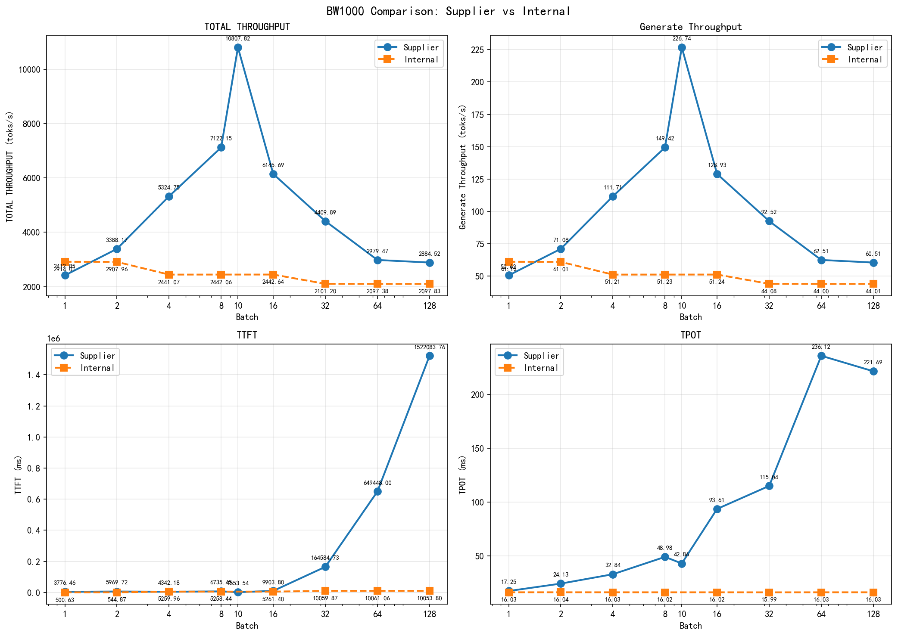

# MiniMax-M2.5模型在单节点hygon_bw1000上和供应商测试结果比对

<div align="center">
**测试日期：** 2026-04-01

</div>

---

**测试脚本**

```bash
export HIP_VISIBLE_DEVICES=0,1,2,3,4,5,6,7
export HSA_FORCE_FINE_GRAIN_PCIE=1
export NCCL_MAX_NCHANNELS=16
export NCCL_MIN_NCHANNELS=16
export NCCL_P2P_LEVEL=SYS
export NCCL_LAUNCH_MODE=GROUP
export ROCBLAS_COMPUTETYPE_FP16R=0
export LD_LIBRARY_PATH=/usr/local/lib/python3.10/dist-packages/torch/lib:$LD_LIBRARY_PATH
export VLLM_NUMA_BIND=1
export VLLM_RANK0_NUMA=3
export VLLM_RANK1_NUMA=1
export VLLM_RANK2_NUMA=1
export VLLM_RANK3_NUMA=0
export VLLM_RANK4_NUMA=7
export VLLM_RANK5_NUMA=5
export VLLM_RANK6_NUMA=5
export VLLM_RANK7_NUMA=4

echo "tp,data_type,batch,prompt_tokens,completion_tokens,TOTAL_THROUGHPUT(toks/s),generate_throughput(toks/s),TTFT(ms),TPOT(ms),ITL(ms)" > MiniMax-M2.5-w8a8.csv
pairs=( "70000 1500" )
model_path="/data/models/MiniMax-M2.5-W8A8"
tp=8
data_type="BF16"
mkdir -p ./log/
for batch in 1 2 4 8 16 32 64 128; do
    for pair in "${pairs[@]}"; do
        prompt_tokens=${pair%% *}
        completion_tokens=${pair#* }
        echo "data_type: $data_type,batch: $batch, prompt_tokens: $prompt_tokens, completion_tokens: $completion_tokens, tp: ${tp}"
        
log_path="log/vllm_${model}_batch_${batch}_prompt_tokens_${prompt_tokens}_completion_tokens_${completion_tokens}_tp_${tp}.log"
        touch $log_path
        # benchmark_throughput.py
        python -m vllm.entrypoints.cli.main bench serve \
                --backend openai-chat \
                --endpoint "/v1/chat/completions" \
                --dataset-name random \
                --random-input-len ${prompt_tokens} \
                --random-output-len ${completion_tokens} \
                --model ${model_path} \
                --base-url http://127.0.0.1:8080 \
                --num-prompts ${batch}  \
		--max-concurrency 1 \
		--temperature 0.7 \
		--seed 123 \
		--served-model-name minimax-m2.5 \
		--trust-remote-code \
                --ignore-eos \
                2>&1 | tee  $log_path
        #metric
        E2E_TIME=`grep "^Benchmark duration" $log_path | awk -F ' ' '{print $4}'`
        REQ_THROUGHPUT=`grep "^Request throughput"  $log_path| awk -F ' ' '{print $4}'`
        GEN_THROUGHPUT=`grep "^Output token"  $log_path| awk -F ' ' '{print $5}'`
        TOTAL_THROUGHPUT=`grep "^Total token" $log_path| awk -F ' ' '{print $5}'`
        TTFT=`grep "^Mean TTFT"  $log_path| awk -F ' ' '{print $4}'`
        TPOT=`grep "^Mean TPOT"  $log_path| awk -F ' ' '{print $4}'`
        ITL=`grep "^Mean ITL"  $log_path| awk -F ' ' '{print $4}'`
        P99_ITL=`grep "^P99 ITL"  $log_path| awk -F ' ' '{print $4}'`
        P99_TTFT=`grep "^P99 TTFT"  $log_path| awk -F ' ' '{print $4}'`
        P99_TPOT=`grep "^P99 TPOT"  $log_path| awk -F ' ' '{print $4}'`
        echo "$tp,$data_type,$batch,$prompt_tokens,$completion_tokens,$TOTAL_THROUGHPUT,$GEN_THROUGHPUT,$TTFT,$TPOT, $ITL" >> MiniMax-M2.5-w8a8.csv
    done
done

```

### 厂商测试性能结果

| tp  | data_type | batch | prompt_tokens (输⼊⻓ 度) | completion_tokens （输出 ⻓度） | TOTAL\THROUGHPUT(toks/s) （总吞吐量） | generate_throughput(toks/s) （⽣成吞吐量) | TTFT( ms) （⾸字延迟） | TPOT(ms) （每输出token时间） | ITL(ms ) （token间延迟） |
|-----|-----------|-------|-----------------------|---------------------------|---------------------------------|-------------------------------------|------------------|-----------------------|---------------------|
| 8   | BF16      | 1     | 70000                 | 1500                      | 2412.85                         | 50.62                               | 3776.46          | 17.25                 | 17.25               |
| 8   | BF16      | 2     | 70000                 | 1500                      | 3388.17                         | 71.08                               | 5969.72          | 24.13                 | 24.13               |
| 8   | BF16      | 4     | 70000                 | 1500                      | 5324.75                         | 111.71                              | 4342.18          | 32.84                 | 32.84               |
| 8   | BF16      | 8     | 70000                 | 1500                      | 7122.15                         | 149.42                              | 6735.45          | 48.98                 | 48.98               |
| 8   | BF16      | 10    | 70000                 | 1500                      | 10807.82                        | 226.74                              | 1553.54          | 42.86                 | 42.91               |
| 8   | BF16      | 16    | 70000                 | 1500                      | 6145.69                         | 128.93                              | 9903.80          | 93.61                 | 93.64               |
| 8   | BF16      | 32    | 70000                 | 1500                      | 4409.89                         | 92.52                               | 164584.73        | 115.04                | 115.04              |
| 8   | BF16      | 64    | 70000                 | 1500                      | 2979.47                         | 62.51                               | 649448.92        | 236.12                | 236.12              |
| 8   | BF16      | 128   | 70000                 | 1500                      | 2884.52                         | 60.51                               | 1522083.76       | 221.69                | 221.69              |

### 内部测试性能结果

| tp  | data_type | batch | prompt_tokens (输⼊⻓度) | completion_tokens （输出⻓度） | TOTAL\THROUGHPUT(toks/s) （总吞吐量） | generate_throughput(toks/s) （⽣成吞吐量) | TTFT(ms) （⾸字延迟） | TPOT(ms) （每输出token时间） | ITL(ms ) （token间延迟） |
|-----|-----------|-------|----------------------|--------------------------|---------------------------------|-------------------------------------|-----------------|-----------------------|---------------------|
| 8   | BF16      | 1     | 70000                | 1500                     | 2914.01                         | 61.13                               | 500.63          | 16.03                 | 16.02               |
| 8   | BF16      | 2     | 70000                | 1500                     | 2907.96                         | 61.01                               | 544.87          | 16.04                 | 16.08               |
| 8   | BF16      | 4     | 70000                | 1500                     | 2441.07                         | 51.21                               | 5259.96         | 16.03                 | 16.04               |
| 8   | BF16      | 8     | 70000                | 1500                     | 2442.06                         | 51.23                               | 5258.44         | 16.02                 | 16.03               |
| 8   | BF16      | 10    | 70000                | 1500                     | N/A                             | N/A                                 | N/A             | N/A                   | N/A                 |
| 8   | BF16      | 16    | 70000                | 1500                     | 2442.64                         | 51.24                               | 5261.4          | 16.02                 | 16.02               |
| 8   | BF16      | 32    | 70000                | 1500                     | 2101.2                          | 44.08                               | 10059.87        | 15.99                 | 15.99               |
| 8   | BF16      | 64    | 70000                | 1500                     | 2097.38                         | 44.00                               | 10061.06        | 16.03                 | 16.05               |
| 8   | BF16      | 128   | 70000                | 1500                     | 2097.83                         | 44.01                               | 10053.8         | 16.03                 | 16.06               |


### 对比折线图



<div align="center">
*报告生成时间: 2026-04-01*
</div>
