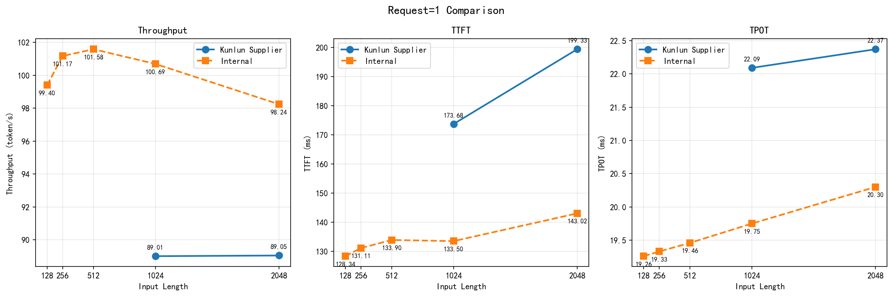
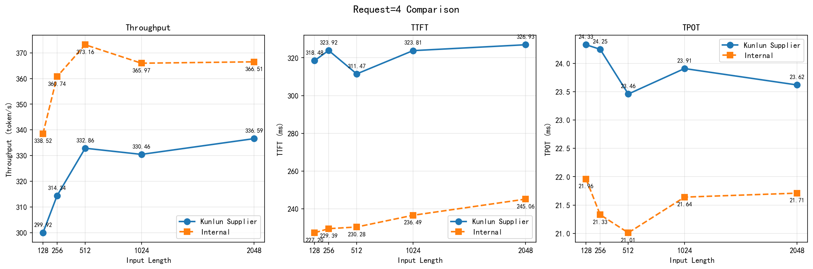
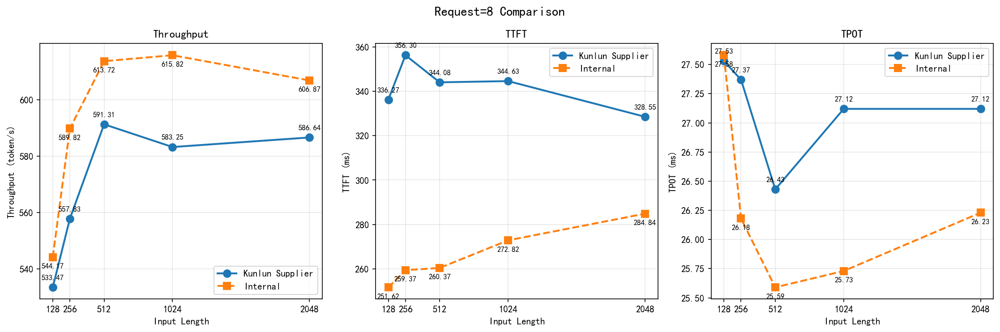
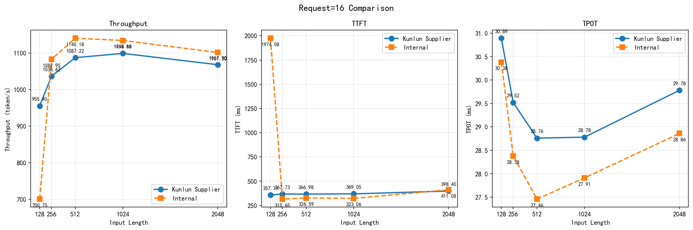
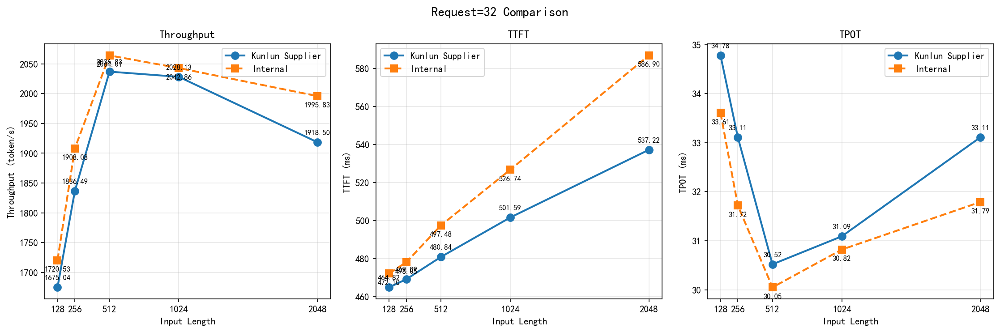

# MiniMax-M2.5模型在单节点昆仑芯P800上和供应商测试结果比对

<div align="center">
**测试日期：** 2026-04-01

</div>

---

**测试脚本**

``` shell
#!/bin/bash

MODEL_PATH="/data/MiniMax-M2.5-W8A8-INT8-Dynamic"
MODEL_NAME="minimax-m2.5"

HOST="127.0.0.1"
PORT=8080
BACKEND="openai"
DATASET="random"
# NUM_PROMPTS_LIST=(1)
NUM_PROMPTS_LIST=( 1 4 8 16 32 )
# 定义 input/output 成对组合
INPUT_OUTPUT_PAIRS=(
  "128 128"
  "256 256"
  "512 512"
  "1024 1024"
  "2048 2048"
)

for np in "${NUM_PROMPTS_LIST[@]}"; do
	for pair in "${INPUT_OUTPUT_PAIRS[@]}" ; do
		in_len=$(echo $pair | awk '{print $1}')
		out_len=$(echo $pair | awk '{print $2}')
		echo "Running num-prompts=$np input-len=$in_len output-len=$out_len"
		python3 ./pressure_test_v6_1/benchmarks/benchmark_serving.py --host $HOST --port $PORT --backend $BACKEND \
			--model $MODEL_PATH --served-model-name $MODEL_NAME --dataset-name $DATASET \
			--num-prompts $np --random-input-len $in_len --random-output-len $out_len \
			--ignore-eos
	done
done

```
---

### 昆仑芯提供的测试结果

| request | input_len | output_len | throughput token/s | ttft (ms) | tpot (ms) |
|---------|-----------|------------|--------------------|-----------|-----------|
| 1       | 1024      | 1024       | 89.01              | 173.68    | 22.09     |
| 1       | 2048      | 2048       | 89.05              | 199.33    | 22.37     |
| 4       | 128       | 128        | 299.92             | 318.48    | 24.33     |
| 4       | 256       | 256        | 314.34             | 323.92    | 24.25     |
| 4       | 512       | 512        | 332.86             | 311.47    | 23.46     |
| 4       | 1024      | 1024       | 330.46             | 323.81    | 23.91     |
| 4       | 2048      | 2048       | 336.59             | 326.93    | 23.62     |
| 8       | 128       | 128        | 533.47             | 336.27    | 27.53     |
| 8       | 256       | 256        | 557.83             | 356.30    | 27.37     |
| 8       | 512       | 512        | 591.31             | 344.08    | 26.43     |
| 8       | 1024      | 1024       | 583.25             | 344.63    | 27.12     |
| 8       | 2048      | 2048       | 586.64             | 328.55    | 27.12     |
| 16      | 128       | 128        | 955.40             | 357.31    | 30.89     |
| 16      | 256       | 256        | 1036.62            | 367.73    | 29.52     |
| 16      | 512       | 512        | 1087.22            | 366.98    | 28.76     |
| 16      | 1024      | 1024       | 1098.82            | 369.05    | 28.78     |
| 16      | 2048      | 2048       | 1067.90            | 398.40    | 29.78     |
| 32      | 128       | 128        | 1675.04            | 464.82    | 34.78     |
| 32      | 256       | 256        | 1836.49            | 469.09    | 33.11     |
| 32      | 512       | 512        | 2036.83            | 480.84    | 30.52     |
| 32      | 1024      | 1024       | 2028.13            | 501.59    | 31.09     |
| 32      | 2048      | 2048       | 1918.50            | 537.22    | 33.11     |

### 内部测试结果

| request | input_len | output_len | throughput token/s | ttft (ms) | tpot (ms) |
|---------|-----------|------------|--------------------|-----------|-----------|
| 1       | 128       | 128        | 99.40              | 128.34    | 19.26     |
| 1       | 256       | 256        | 101.17             | 131.11    | 19.33     |
| 1       | 512       | 512        | 101.58             | 133.90    | 19.46     |
| 1       | 1024      | 1024       | 100.69             | 133.50    | 19.75     |
| 1       | 2048      | 2048       | 98.24              | 143.02    | 20.30     |
| 4       | 128       | 128        | 338.52             | 227.20    | 21.96     |
| 4       | 256       | 256        | 360.74             | 229.39    | 21.33     |
| 4       | 512       | 512        | 373.16             | 230.28    | 21.01     |
| 4       | 1024      | 1024       | 365.97             | 236.49    | 21.64     |
| 4       | 2048      | 2048       | 366.51             | 245.06    | 21.71     |
| 8       | 128       | 128        | 544.17             | 251.62    | 27.58     |
| 8       | 256       | 256        | 589.82             | 259.37    | 26.18     |
| 8       | 512       | 512        | 613.72             | 260.37    | 25.59     |
| 8       | 1024      | 1024       | 615.82             | 272.82    | 25.73     |
| 8       | 2048      | 2048       | 606.87             | 284.84    | 26.23     |
| 16      | 128       | 128        | 700.75             | 1974.08   | 30.38     |
| 16      | 256       | 256        | 1082.95            | 315.65    | 28.38     |
| 16      | 512       | 512        | 1140.18            | 326.59    | 27.46     |
| 16      | 1024      | 1024       | 1134.16            | 323.06    | 27.91     |
| 16      | 2048      | 2048       | 1101.30            | 411.08    | 28.86     |
| 32      | 128       | 128        | 1720.53            | 472.10    | 33.61     |
| 32      | 256       | 256        | 1908.08            | 478.05    | 31.72     |
| 32      | 512       | 512        | 2064.01            | 497.48    | 30.05     |
| 32      | 1024      | 1024       | 2042.86            | 526.74    | 30.82     |
| 32      | 2048      | 2048       | 1995.83            | 586.90    | 31.79     |

### 对比折线图








<div align="center">
*报告生成时间: 2026-04-01*
</div>
