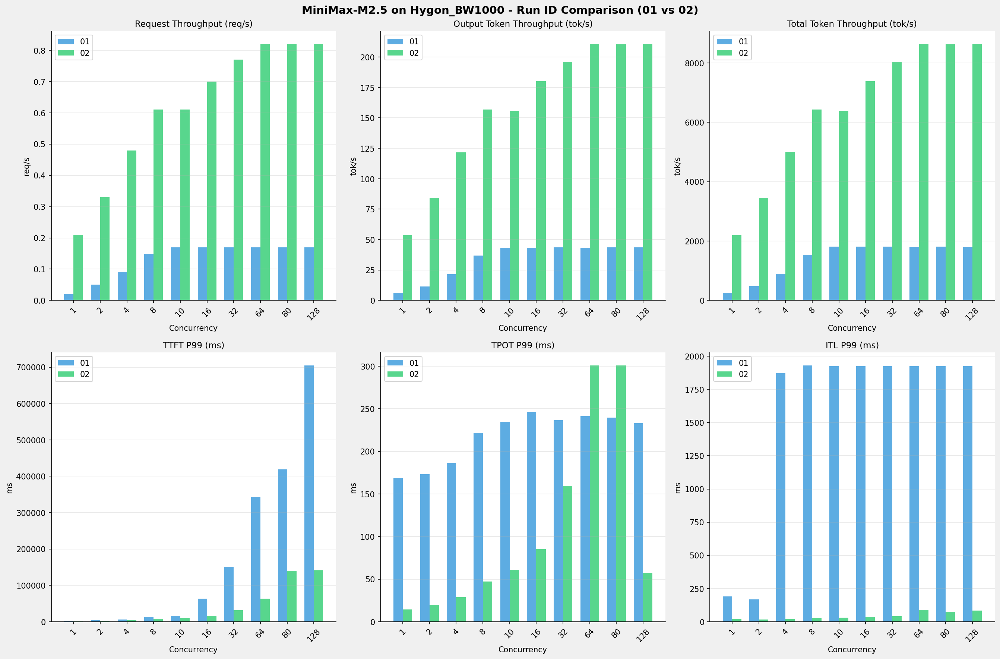

# MiniMax-M2.5模型在Hygon_BW1000上的RUN-ID对比报告

**测试日期：** 2026-03-31

**对比RUN-ID：** 01 vs 02

---

## 测试场景
对比同一芯片、同一测试套件下,同一模型优化前后测试结果比对，分析性能差异。

**测试模型**  
第一轮测试（RUN-01）: MiniMax-M2.5-bf16  
第二轮测试（RUN-02）: MiniMax-M2.5-W8A8

## 🤖 vLLM启动配置信息

| 参数名称                   | RUN-01     | RUN-02                                     |
|------------------------|------------|--------------------------------------------|
| max-model-len          | 196608     | 196608                                     |
| max-num-seqs           | 64         | 64                                         |
| max-num-batched-tokens | 8192       | N/A                                        |
| gpu-memory-utilization | 0.95       | 0.9                                        |
| dp                     | 1          | 1                                          |
| tp                     | 8          | 8                                          |
| pp                     | 1          | 1                                          |
| enable-export-parallel | False      | N/A                                        |
| tool-call-parser       | minimax_m2 | minimax_m2                                 |
| reasoning-parser       | minimax_m2 | N/A                                        |
| -cc                    | N/A        | {"pass_config": {"fuse_act_quant": false}} |

## 📊 测试概览

| 项目            | 配置                                    | 备注  |
|---------------|---------------------------------------|-----|
| **数据集**       | random                                |     |
| **并发数**       | [1, 2, 4, 8, 10, 16, 32, 64, 80, 128] |     |
| **总请求数**      | [320]                                 |     |
| **请求输入上下文长度** | [10240]                               |     |
| **请求输出上下文长度** | [256]                                 |     |
| **模型**        | MiniMax-M2.5                          |     |
| **被测芯片**      | Hygon_BW1000                          |     |

**主要采集指标**：

| 指标                  | 单位         | 含义                                 |
|---------------------|------------|------------------------------------|
| TTFT                | ms         | Time To First Token，首 token 延迟     |
| TPOT                | ms/token   | Time Per Output Token，每 token 生成时间 |
| Throughput          | tokens/s   | 系统总吞吐                              |
| QPS                 | requests/s | 请求吞吐                               |
| P50/P95/P99 Latency | ms         | 延迟分位数                              |

---

## 各并发级别详细对比

### 并发级别: 1

#### 服务基准结果

| 指标                       | RUN-01   | RUN-02  | 差异        | 百分比     |
|--------------------------|----------|---------|-----------|---------|
| 成功请求数                    | 320      | 320     | 0.00      | 0.0%    |
| 失败请求数                    | 0        | 0       | 0.00      | 0.0%    |
| 测试持续时间 (s)               | 13148.00 | 1523.87 | -11624.13 | -88.4%  |
| 总输入 tokens               | 3276748  | 3276800 | +52.00    | +0.0%   |
| 总生成 tokens               | 80226    | 81920   | +1694.00  | +2.1%   |
| **请求吞吐量 (req/s)**        | 0.02     | 0.21    | +0.19     | +950.0% |
| **输出 token 吞吐量 (tok/s)** | 6.10     | 53.76   | +47.66    | +781.3% |
| 峰值输出 token 吞吐量 (tok/s)   | 8.00     | 71.00   | +63.00    | +787.5% |
| 峰值并发请求数                  | 2.00     | 2.00    | 0.00      | 0.0%    |
| **总 token 吞吐量 (tok/s)**  | 255.32   | 2204.07 | +1948.75  | +763.3% |

#### 首Token延迟 (TTFT)

| 指标            | RUN-01  | RUN-02  | 差异      | 百分比    |
|---------------|---------|---------|---------|--------|
| 平均 TTFT (ms)  | 1958.35 | 1107.56 | -850.79 | -43.4% |
| 中位 TTFT (ms)  | 1964.30 | 1112.30 | -852.00 | -43.4% |
| P95 TTFT (ms) | 1977.98 | 1121.88 | -856.10 | -43.3% |
| P99 TTFT (ms) | 1990.88 | 1124.29 | -866.59 | -43.5% |

#### 每Token生成时间 (TPOT)

| 指标            | RUN-01 | RUN-02 | 差异      | 百分比    |
|---------------|--------|--------|---------|--------|
| 平均 TPOT (ms)  | 156.69 | 14.33  | -142.36 | -90.9% |
| 中位 TPOT (ms)  | 156.16 | 14.33  | -141.83 | -90.8% |
| P95 TPOT (ms) | 163.40 | 14.34  | -149.06 | -91.2% |
| P99 TPOT (ms) | 168.81 | 14.35  | -154.46 | -91.5% |

#### Token间延迟 (ITL)

| 指标           | RUN-01 | RUN-02 | 差异      | 百分比    |
|--------------|--------|--------|---------|--------|
| 平均 ITL (ms)  | 156.23 | 14.29  | -141.94 | -90.9% |
| 中位 ITL (ms)  | 155.76 | 14.32  | -141.44 | -90.8% |
| P95 ITL (ms) | 162.28 | 14.65  | -147.63 | -91.0% |
| P99 ITL (ms) | 191.32 | 18.70  | -172.62 | -90.2% |

### 并发级别: 2

#### 服务基准结果

| 指标                       | RUN-01  | RUN-02  | 差异       | 百分比     |
|--------------------------|---------|---------|----------|---------|
| 成功请求数                    | 320     | 320     | 0.00     | 0.0%    |
| 失败请求数                    | 0       | 0       | 0.00     | 0.0%    |
| 测试持续时间 (s)               | 6965.73 | 970.06  | -5995.67 | -86.1%  |
| 总输入 tokens               | 3276748 | 3276800 | +52.00   | +0.0%   |
| 总生成 tokens               | 80297   | 81920   | +1623.00 | +2.0%   |
| **请求吞吐量 (req/s)**        | 0.05    | 0.33    | +0.28    | +560.0% |
| **输出 token 吞吐量 (tok/s)** | 11.53   | 84.45   | +72.92   | +632.4% |
| 峰值输出 token 吞吐量 (tok/s)   | 15.00   | 134.00  | +119.00  | +793.3% |
| 峰值并发请求数                  | 4.00    | 4.00    | 0.00     | 0.0%    |
| **总 token 吞吐量 (tok/s)**  | 481.94  | 3462.37 | +2980.43 | +618.4% |

#### 首Token延迟 (TTFT)

| 指标            | RUN-01  | RUN-02  | 差异       | 百分比    |
|---------------|---------|---------|----------|--------|
| 平均 TTFT (ms)  | 2052.00 | 1625.47 | -426.53  | -20.8% |
| 中位 TTFT (ms)  | 2024.87 | 1172.93 | -851.94  | -42.1% |
| P95 TTFT (ms) | 2038.41 | 2151.08 | +112.67  | +5.5%  |
| P99 TTFT (ms) | 3752.70 | 2154.58 | -1598.12 | -42.6% |

#### 每Token生成时间 (TPOT)

| 指标            | RUN-01 | RUN-02 | 差异      | 百分比    |
|---------------|--------|--------|---------|--------|
| 平均 TPOT (ms)  | 165.84 | 17.40  | -148.44 | -89.5% |
| 中位 TPOT (ms)  | 166.01 | 15.56  | -150.45 | -90.6% |
| P95 TPOT (ms) | 168.30 | 19.54  | -148.76 | -88.4% |
| P99 TPOT (ms) | 173.26 | 19.59  | -153.67 | -88.7% |

#### Token间延迟 (ITL)

| 指标           | RUN-01 | RUN-02 | 差异      | 百分比    |
|--------------|--------|--------|---------|--------|
| 平均 ITL (ms)  | 165.31 | 17.34  | -147.97 | -89.5% |
| 中位 ITL (ms)  | 158.87 | 15.35  | -143.52 | -90.3% |
| P95 ITL (ms) | 164.70 | 16.15  | -148.55 | -90.2% |
| P99 ITL (ms) | 168.68 | 16.62  | -152.06 | -90.1% |

### 并发级别: 4

#### 服务基准结果

| 指标                       | RUN-01  | RUN-02  | 差异       | 百分比     |
|--------------------------|---------|---------|----------|---------|
| 成功请求数                    | 320     | 320     | 0.00     | 0.0%    |
| 失败请求数                    | 0       | 0       | 0.00     | 0.0%    |
| 测试持续时间 (s)               | 3741.16 | 672.39  | -3068.77 | -82.0%  |
| 总输入 tokens               | 3276748 | 3276800 | +52.00   | +0.0%   |
| 总生成 tokens               | 80266   | 81920   | +1654.00 | +2.1%   |
| **请求吞吐量 (req/s)**        | 0.09    | 0.48    | +0.39    | +433.3% |
| **输出 token 吞吐量 (tok/s)** | 21.45   | 121.83  | +100.38  | +468.0% |
| 峰值输出 token 吞吐量 (tok/s)   | 29.00   | 247.00  | +218.00  | +751.7% |
| 峰值并发请求数                  | 7.00    | 8.00    | +1.00    | +14.3%  |
| **总 token 吞吐量 (tok/s)**  | 897.32  | 4995.17 | +4097.85 | +456.7% |

#### 首Token延迟 (TTFT)

| 指标            | RUN-01  | RUN-02  | 差异       | 百分比     |
|---------------|---------|---------|----------|---------|
| 平均 TTFT (ms)  | 2185.58 | 3362.79 | +1177.21 | +53.9%  |
| 中位 TTFT (ms)  | 2038.85 | 4126.05 | +2087.20 | +102.4% |
| P95 TTFT (ms) | 3821.77 | 4132.31 | +310.54  | +8.1%   |
| P99 TTFT (ms) | 5568.67 | 4142.31 | -1426.36 | -25.6%  |

#### 每Token生成时间 (TPOT)

| 指标            | RUN-01 | RUN-02 | 差异      | 百分比    |
|---------------|--------|--------|---------|--------|
| 平均 TPOT (ms)  | 177.49 | 19.77  | -157.72 | -88.9% |
| 中位 TPOT (ms)  | 177.87 | 16.88  | -160.99 | -90.5% |
| P95 TPOT (ms) | 183.40 | 28.70  | -154.70 | -84.4% |
| P99 TPOT (ms) | 186.11 | 28.81  | -157.30 | -84.5% |

#### Token间延迟 (ITL)

| 指标           | RUN-01  | RUN-02 | 差异       | 百分比    |
|--------------|---------|--------|----------|--------|
| 平均 ITL (ms)  | 176.98  | 19.70  | -157.28  | -88.9% |
| 中位 ITL (ms)  | 157.22  | 16.81  | -140.41  | -89.3% |
| P95 ITL (ms) | 162.59  | 17.70  | -144.89  | -89.1% |
| P99 ITL (ms) | 1872.44 | 20.16  | -1852.28 | -98.9% |

### 并发级别: 8

#### 服务基准结果

| 指标                       | RUN-01  | RUN-02  | 差异       | 百分比     |
|--------------------------|---------|---------|----------|---------|
| 成功请求数                    | 320     | 320     | 0.00     | 0.0%    |
| 失败请求数                    | 0       | 0       | 0.00     | 0.0%    |
| 测试持续时间 (s)               | 2176.31 | 522.12  | -1654.19 | -76.0%  |
| 总输入 tokens               | 3276748 | 3276800 | +52.00   | +0.0%   |
| 总生成 tokens               | 80442   | 81920   | +1478.00 | +1.8%   |
| **请求吞吐量 (req/s)**        | 0.15    | 0.61    | +0.46    | +306.7% |
| **输出 token 吞吐量 (tok/s)** | 36.96   | 156.90  | +119.94  | +324.5% |
| 峰值输出 token 吞吐量 (tok/s)   | 59.00   | 431.00  | +372.00  | +630.5% |
| 峰值并发请求数                  | 15.00   | 16.00   | +1.00    | +6.7%   |
| **总 token 吞吐量 (tok/s)**  | 1542.60 | 6432.85 | +4890.25 | +317.0% |

#### 首Token延迟 (TTFT)

| 指标            | RUN-01   | RUN-02  | 差异       | 百分比     |
|---------------|----------|---------|----------|---------|
| 平均 TTFT (ms)  | 3297.61  | 7177.32 | +3879.71 | +117.7% |
| 中位 TTFT (ms)  | 2089.60  | 8080.61 | +5991.01 | +286.7% |
| P95 TTFT (ms) | 10888.09 | 8091.51 | -2796.58 | -25.7%  |
| P99 TTFT (ms) | 13004.02 | 8121.50 | -4882.52 | -37.5%  |

#### 每Token生成时间 (TPOT)

| 指标            | RUN-01 | RUN-02 | 差异      | 百分比    |
|---------------|--------|--------|---------|--------|
| 平均 TPOT (ms)  | 201.95 | 23.04  | -178.91 | -88.6% |
| 中位 TPOT (ms)  | 205.98 | 19.57  | -186.41 | -90.5% |
| P95 TPOT (ms) | 212.79 | 46.84  | -165.95 | -78.0% |
| P99 TPOT (ms) | 221.53 | 47.06  | -174.47 | -78.8% |

#### Token间延迟 (ITL)

| 指标           | RUN-01  | RUN-02 | 差异       | 百分比    |
|--------------|---------|--------|----------|--------|
| 平均 ITL (ms)  | 201.36  | 22.98  | -178.38  | -88.6% |
| 中位 ITL (ms)  | 157.25  | 19.65  | -137.60  | -87.5% |
| P95 ITL (ms) | 163.19  | 20.51  | -142.68  | -87.4% |
| P99 ITL (ms) | 1931.02 | 28.16  | -1902.86 | -98.5% |

### 并发级别: 10

#### 服务基准结果

| 指标                       | RUN-01  | RUN-02  | 差异       | 百分比     |
|--------------------------|---------|---------|----------|---------|
| 成功请求数                    | 320     | 320     | 0.00     | 0.0%    |
| 失败请求数                    | 0       | 0       | 0.00     | 0.0%    |
| 测试持续时间 (s)               | 1854.59 | 526.35  | -1328.24 | -71.6%  |
| 总输入 tokens               | 3276748 | 3276800 | +52.00   | +0.0%   |
| 总生成 tokens               | 80517   | 81920   | +1403.00 | +1.7%   |
| **请求吞吐量 (req/s)**        | 0.17    | 0.61    | +0.44    | +258.8% |
| **输出 token 吞吐量 (tok/s)** | 43.42   | 155.64  | +112.22  | +258.5% |
| 峰值输出 token 吞吐量 (tok/s)   | 73.00   | 420.00  | +347.00  | +475.3% |
| 峰值并发请求数                  | 16.00   | 20.00   | +4.00    | +25.0%  |
| **总 token 吞吐量 (tok/s)**  | 1810.25 | 6381.15 | +4570.90 | +252.5% |

#### 首Token延迟 (TTFT)

| 指标            | RUN-01   | RUN-02   | 差异       | 百分比     |
|---------------|----------|----------|----------|---------|
| 平均 TTFT (ms)  | 3593.83  | 9131.01  | +5537.18 | +154.1% |
| 中位 TTFT (ms)  | 2084.97  | 10049.34 | +7964.37 | +382.0% |
| P95 TTFT (ms) | 10884.20 | 10077.20 | -807.00  | -7.4%   |
| P99 TTFT (ms) | 16227.56 | 10093.60 | -6133.96 | -37.8%  |

#### 每Token生成时间 (TPOT)

| 指标            | RUN-01 | RUN-02 | 差异      | 百分比    |
|---------------|--------|--------|---------|--------|
| 平均 TPOT (ms)  | 214.72 | 28.69  | -186.03 | -86.6% |
| 中位 TPOT (ms)  | 219.17 | 25.26  | -193.91 | -88.5% |
| P95 TPOT (ms) | 227.12 | 60.26  | -166.86 | -73.5% |
| P99 TPOT (ms) | 234.69 | 60.57  | -174.12 | -74.2% |

#### Token间延迟 (ITL)

| 指标           | RUN-01  | RUN-02 | 差异       | 百分比    |
|--------------|---------|--------|----------|--------|
| 平均 ITL (ms)  | 214.01  | 28.59  | -185.42  | -86.6% |
| 中位 ITL (ms)  | 157.32  | 25.27  | -132.05  | -83.9% |
| P95 ITL (ms) | 163.94  | 26.06  | -137.88  | -84.1% |
| P99 ITL (ms) | 1924.45 | 31.38  | -1893.07 | -98.4% |

### 并发级别: 16

#### 服务基准结果

| 指标                       | RUN-01  | RUN-02  | 差异       | 百分比     |
|--------------------------|---------|---------|----------|---------|
| 成功请求数                    | 320     | 320     | 0.00     | 0.0%    |
| 失败请求数                    | 0       | 0       | 0.00     | 0.0%    |
| 测试持续时间 (s)               | 1847.45 | 454.43  | -1393.02 | -75.4%  |
| 总输入 tokens               | 3276748 | 3276800 | +52.00   | +0.0%   |
| 总生成 tokens               | 80132   | 81920   | +1788.00 | +2.2%   |
| **请求吞吐量 (req/s)**        | 0.17    | 0.70    | +0.53    | +311.8% |
| **输出 token 吞吐量 (tok/s)** | 43.37   | 180.27  | +136.90  | +315.7% |
| 峰值输出 token 吞吐量 (tok/s)   | 71.00   | 640.00  | +569.00  | +801.4% |
| 峰值并发请求数                  | 20.00   | 32.00   | +12.00   | +60.0%  |
| **总 token 吞吐量 (tok/s)**  | 1817.04 | 7391.10 | +5574.06 | +306.8% |

#### 首Token延迟 (TTFT)

| 指标            | RUN-01   | RUN-02   | 差异        | 百分比    |
|---------------|----------|----------|-----------|--------|
| 平均 TTFT (ms)  | 36634.82 | 15019.36 | -21615.46 | -59.0% |
| 中位 TTFT (ms)  | 35931.86 | 15998.10 | -19933.76 | -55.5% |
| P95 TTFT (ms) | 58125.31 | 16005.18 | -42120.13 | -72.5% |
| P99 TTFT (ms) | 63884.93 | 16006.87 | -47878.06 | -74.9% |

#### 每Token生成时间 (TPOT)

| 指标            | RUN-01 | RUN-02 | 差异      | 百分比    |
|---------------|--------|--------|---------|--------|
| 平均 TPOT (ms)  | 216.95 | 30.19  | -186.76 | -86.1% |
| 中位 TPOT (ms)  | 219.89 | 26.58  | -193.31 | -87.9% |
| P95 TPOT (ms) | 228.33 | 84.64  | -143.69 | -62.9% |
| P99 TPOT (ms) | 246.10 | 85.08  | -161.02 | -65.4% |

#### Token间延迟 (ITL)

| 指标           | RUN-01  | RUN-02 | 差异       | 百分比    |
|--------------|---------|--------|----------|--------|
| 平均 ITL (ms)  | 216.16  | 30.08  | -186.08  | -86.1% |
| 中位 ITL (ms)  | 157.71  | 26.71  | -131.00  | -83.1% |
| P95 ITL (ms) | 164.13  | 28.05  | -136.08  | -82.9% |
| P99 ITL (ms) | 1923.89 | 36.01  | -1887.88 | -98.1% |

### 并发级别: 32

#### 服务基准结果

| 指标                       | RUN-01  | RUN-02  | 差异       | 百分比      |
|--------------------------|---------|---------|----------|----------|
| 成功请求数                    | 320     | 320     | 0.00     | 0.0%     |
| 失败请求数                    | 0       | 0       | 0.00     | 0.0%     |
| 测试持续时间 (s)               | 1847.10 | 417.58  | -1429.52 | -77.4%   |
| 总输入 tokens               | 3276748 | 3276800 | +52.00   | +0.0%    |
| 总生成 tokens               | 80324   | 81920   | +1596.00 | +2.0%    |
| **请求吞吐量 (req/s)**        | 0.17    | 0.77    | +0.60    | +352.9%  |
| **输出 token 吞吐量 (tok/s)** | 43.49   | 196.18  | +152.69  | +351.1%  |
| 峰值输出 token 吞吐量 (tok/s)   | 71.00   | 896.00  | +825.00  | +1162.0% |
| 峰值并发请求数                  | 36.00   | 64.00   | +28.00   | +77.8%   |
| **总 token 吞吐量 (tok/s)**  | 1817.48 | 8043.38 | +6225.90 | +342.6%  |

#### 首Token延迟 (TTFT)

| 指标            | RUN-01    | RUN-02   | 差异         | 百分比    |
|---------------|-----------|----------|------------|--------|
| 平均 TTFT (ms)  | 122875.63 | 30685.52 | -92190.11  | -75.0% |
| 中位 TTFT (ms)  | 124891.14 | 31801.65 | -93089.49  | -74.5% |
| P95 TTFT (ms) | 147416.43 | 31812.89 | -115603.54 | -78.4% |
| P99 TTFT (ms) | 150615.03 | 31816.19 | -118798.84 | -78.9% |

#### 每Token生成时间 (TPOT)

| 指标            | RUN-01 | RUN-02 | 差异      | 百分比    |
|---------------|--------|--------|---------|--------|
| 平均 TPOT (ms)  | 218.56 | 43.40  | -175.16 | -80.1% |
| 中位 TPOT (ms)  | 220.42 | 39.36  | -181.06 | -82.1% |
| P95 TPOT (ms) | 227.78 | 39.76  | -188.02 | -82.5% |
| P99 TPOT (ms) | 236.50 | 159.79 | -76.71  | -32.4% |

#### Token间延迟 (ITL)

| 指标           | RUN-01  | RUN-02 | 差异       | 百分比    |
|--------------|---------|--------|----------|--------|
| 平均 ITL (ms)  | 217.96  | 43.23  | -174.73  | -80.2% |
| 中位 ITL (ms)  | 157.77  | 39.61  | -118.16  | -74.9% |
| P95 ITL (ms) | 165.32  | 40.89  | -124.43  | -75.3% |
| P99 ITL (ms) | 1924.43 | 42.64  | -1881.79 | -97.8% |

### 并发级别: 64

#### 服务基准结果

| 指标                       | RUN-01  | RUN-02  | 差异       | 百分比      |
|--------------------------|---------|---------|----------|----------|
| 成功请求数                    | 320     | 320     | 0.00     | 0.0%     |
| 失败请求数                    | 0       | 0       | 0.00     | 0.0%     |
| 测试持续时间 (s)               | 1864.45 | 388.79  | -1475.66 | -79.1%   |
| 总输入 tokens               | 3276748 | 3276800 | +52.00   | +0.0%    |
| 总生成 tokens               | 80461   | 81920   | +1459.00 | +1.8%    |
| **请求吞吐量 (req/s)**        | 0.17    | 0.82    | +0.65    | +382.4%  |
| **输出 token 吞吐量 (tok/s)** | 43.16   | 210.71  | +167.55  | +388.2%  |
| 峰值输出 token 吞吐量 (tok/s)   | 71.00   | 1152.00 | +1081.00 | +1522.5% |
| 峰值并发请求数                  | 68.00   | 128.00  | +60.00   | +88.2%   |
| **总 token 吞吐量 (tok/s)**  | 1800.65 | 8638.94 | +6838.29 | +379.8%  |

#### 首Token延迟 (TTFT)

| 指标            | RUN-01    | RUN-02   | 差异         | 百分比    |
|---------------|-----------|----------|------------|--------|
| 平均 TTFT (ms)  | 284382.45 | 62271.39 | -222111.06 | -78.1% |
| 中位 TTFT (ms)  | 308175.63 | 63393.43 | -244782.20 | -79.4% |
| P95 TTFT (ms) | 336951.30 | 63423.62 | -273527.68 | -81.2% |
| P99 TTFT (ms) | 343209.29 | 63426.45 | -279782.84 | -81.5% |

#### 每Token生成时间 (TPOT)

| 指标            | RUN-01 | RUN-02 | 差异      | 百分比    |
|---------------|--------|--------|---------|--------|
| 平均 TPOT (ms)  | 218.23 | 60.67  | -157.56 | -72.2% |
| 中位 TPOT (ms)  | 219.77 | 56.87  | -162.90 | -74.1% |
| P95 TPOT (ms) | 231.26 | 57.06  | -174.20 | -75.3% |
| P99 TPOT (ms) | 241.21 | 300.94 | +59.73  | +24.8% |

#### Token间延迟 (ITL)

| 指标           | RUN-01  | RUN-02 | 差异       | 百分比    |
|--------------|---------|--------|----------|--------|
| 平均 ITL (ms)  | 217.55  | 60.44  | -157.11  | -72.2% |
| 中位 ITL (ms)  | 157.89  | 57.12  | -100.77  | -63.8% |
| P95 ITL (ms) | 168.53  | 63.94  | -104.59  | -62.1% |
| P99 ITL (ms) | 1925.72 | 89.02  | -1836.70 | -95.4% |

### 并发级别: 80

#### 服务基准结果

| 指标                       | RUN-01  | RUN-02  | 差异       | 百分比      |
|--------------------------|---------|---------|----------|----------|
| 成功请求数                    | 320     | 320     | 0.00     | 0.0%     |
| 失败请求数                    | 0       | 0       | 0.00     | 0.0%     |
| 测试持续时间 (s)               | 1847.88 | 389.10  | -1458.78 | -78.9%   |
| 总输入 tokens               | 3276748 | 3276800 | +52.00   | +0.0%    |
| 总生成 tokens               | 80365   | 81920   | +1555.00 | +1.9%    |
| **请求吞吐量 (req/s)**        | 0.17    | 0.82    | +0.65    | +382.4%  |
| **输出 token 吞吐量 (tok/s)** | 43.49   | 210.54  | +167.05  | +384.1%  |
| 峰值输出 token 吞吐量 (tok/s)   | 71.00   | 1216.00 | +1145.00 | +1612.7% |
| 峰值并发请求数                  | 84.00   | 143.00  | +59.00   | +70.2%   |
| **总 token 吞吐量 (tok/s)**  | 1816.74 | 8631.97 | +6815.23 | +375.1%  |

#### 首Token延迟 (TTFT)

| 指标            | RUN-01    | RUN-02    | 差异         | 百分比    |
|---------------|-----------|-----------|------------|--------|
| 平均 TTFT (ms)  | 354268.91 | 77048.30  | -277220.61 | -78.3% |
| 中位 TTFT (ms)  | 402242.69 | 62356.31  | -339886.38 | -84.5% |
| P95 TTFT (ms) | 409210.34 | 140327.35 | -268882.99 | -65.7% |
| P99 TTFT (ms) | 418658.91 | 140622.89 | -278036.02 | -66.4% |

#### 每Token生成时间 (TPOT)

| 指标            | RUN-01 | RUN-02 | 差异      | 百分比    |
|---------------|--------|--------|---------|--------|
| 平均 TPOT (ms)  | 217.84 | 64.19  | -153.65 | -70.5% |
| 中位 TPOT (ms)  | 220.16 | 61.24  | -158.92 | -72.2% |
| P95 TPOT (ms) | 227.98 | 61.41  | -166.57 | -73.1% |
| P99 TPOT (ms) | 239.73 | 300.88 | +61.15  | +25.5% |

#### Token间延迟 (ITL)

| 指标           | RUN-01  | RUN-02 | 差异       | 百分比    |
|--------------|---------|--------|----------|--------|
| 平均 ITL (ms)  | 217.14  | 63.94  | -153.20  | -70.6% |
| 中位 ITL (ms)  | 157.45  | 57.33  | -100.12  | -63.6% |
| P95 ITL (ms) | 164.60  | 58.84  | -105.76  | -64.3% |
| P99 ITL (ms) | 1924.81 | 74.70  | -1850.11 | -96.1% |

### 并发级别: 128

#### 服务基准结果

| 指标                       | RUN-01  | RUN-02  | 差异       | 百分比      |
|--------------------------|---------|---------|----------|----------|
| 成功请求数                    | 320     | 320     | 0.00     | 0.0%     |
| 失败请求数                    | 0       | 0       | 0.00     | 0.0%     |
| 测试持续时间 (s)               | 1861.45 | 388.80  | -1472.65 | -79.1%   |
| 总输入 tokens               | 3276748 | 3276800 | +52.00   | +0.0%    |
| 总生成 tokens               | 80952   | 81920   | +968.00  | +1.2%    |
| **请求吞吐量 (req/s)**        | 0.17    | 0.82    | +0.65    | +382.4%  |
| **输出 token 吞吐量 (tok/s)** | 43.49   | 210.70  | +167.21  | +384.5%  |
| 峰值输出 token 吞吐量 (tok/s)   | 71.00   | 1216.00 | +1145.00 | +1612.7% |
| 峰值并发请求数                  | 132.00  | 192.00  | +60.00   | +45.5%   |
| **总 token 吞吐量 (tok/s)**  | 1803.81 | 8638.62 | +6834.81 | +378.9%  |

#### 首Token延迟 (TTFT)

| 指标            | RUN-01    | RUN-02    | 差异         | 百分比    |
|---------------|-----------|-----------|------------|--------|
| 平均 TTFT (ms)  | 551191.53 | 125025.53 | -426166.00 | -77.3% |
| 中位 TTFT (ms)  | 677657.74 | 141154.08 | -536503.66 | -79.2% |
| P95 TTFT (ms) | 697287.77 | 141224.06 | -556063.71 | -79.7% |
| P99 TTFT (ms) | 705024.57 | 141233.23 | -563791.34 | -80.0% |

#### 每Token生成时间 (TPOT)

| 指标            | RUN-01 | RUN-02 | 差异      | 百分比    |
|---------------|--------|--------|---------|--------|
| 平均 TPOT (ms)  | 217.69 | 58.43  | -159.26 | -73.2% |
| 中位 TPOT (ms)  | 220.15 | 57.02  | -163.13 | -74.1% |
| P95 TPOT (ms) | 227.58 | 57.35  | -170.23 | -74.8% |
| P99 TPOT (ms) | 233.25 | 57.35  | -175.90 | -75.4% |

#### Token间延迟 (ITL)

| 指标           | RUN-01  | RUN-02 | 差异       | 百分比    |
|--------------|---------|--------|----------|--------|
| 平均 ITL (ms)  | 216.99  | 58.20  | -158.79  | -73.2% |
| 中位 ITL (ms)  | 157.95  | 57.32  | -100.63  | -63.7% |
| P95 ITL (ms) | 164.61  | 73.06  | -91.55   | -55.6% |
| P99 ITL (ms) | 1925.47 | 84.96  | -1840.51 | -95.6% |

---

## 📊 RUN-ID对比柱状图

---

## 📝 分析总结

### 吞吐量对比

**请求吞吐量**: RUN-02 相比 RUN-01 平均提升 **432.1%**

**输出Token吞吐量**: RUN-02 相比 RUN-01 平均提升 **428.8%**

### 延迟对比

**TTFT P99**: RUN-02 相比 RUN-01 平均改善 **56.9%** (延迟降低)  
**TPOT P99**: RUN-02 相比 RUN-01 平均改善 **54.1%** (延迟降低)  
**ITL P99**: RUN-02 相比 RUN-01 平均改善 **95.9%** (延迟降低) 

---

*报告生成时间: 2026-03-31*

