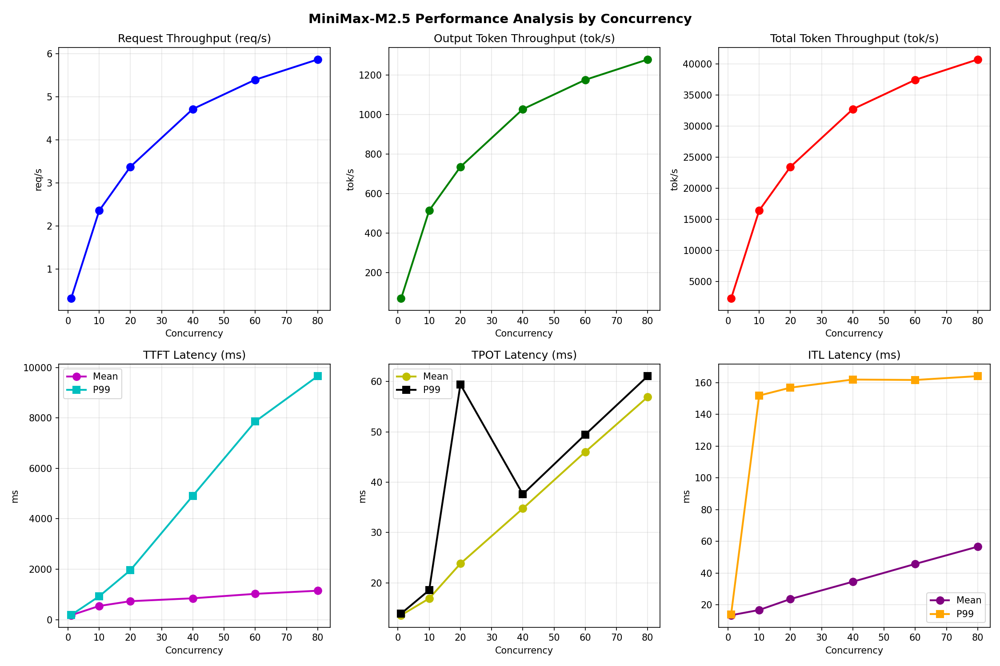

# MiniMax-M2.5 vLLM Benchmark 测试结果报告

**测试日期：** 2026-03-20

---

## 📊 测试概览

| 项目 | 配置 | 备注 |
|------|------|------|
| **数据集** | random |  |
| **并发数** | 1, 10, 20, 40, 60, 80 |  |
| **请求数量** | 935 | 来自 coding plan线上数据 |
| **输入上下文长度** | 6718 | 来自 coding plan线上数据 |
| **输出上下文长度** | 218 | 来自 coding plan线上数据 |

---

## 🤖 模型配置信息

| 模型名称 | 部署配置 | GPU 型号 | GPU 数量 | 精度 | 模型副本数 |
|----------|----------|----------|----------|------|------------|
| **MiniMax-M2.5** | TP=8, PP=1, DP=1, EP=N/A | B200 | 8 | FP8 | 1 |

---

## 📏 性能阈值指标

### 性能指标要求 (基于8卡B200芯片)

| 指标类别 | 指标名称 | 阈值要求 | 适用场景 |
|----------|----------|----------|----------|
| **吞吐量** | 请求吞吐量 (req/s) | >= 1.5 | 10并发以上 |
| **吞吐量** | 输出token吞吐量 (tok/s) | >= 300 | 10并发以上 |
| **吞吐量** | 总token吞吐量 (tok/s) | >= 9000 | 10并发以上 |
| **延迟** | TTFT P99 (ms) | <= 4000 | 中高并发 (20-40) |
| **延迟** | TPOT P99 (ms) | <= 40 | 所有并发 |
| **延迟** | ITL P99 (ms) | <= 800 | 所有并发 |
| **稳定性** | 请求成功率 | >= 99% | 所有场景 |
| **稳定性** | 峰值并发请求数 | <= 100 | 压力测试 |

### 达标判定标准

- ✅ **达标**: 实测值满足阈值要求
- ⚠️ **警告**: 实测值接近阈值（80%-100%范围内）
- ❌ **不达标**: 实测值超出阈值要求

---

## 📈 性能测试数据

### 🎯 服务基准结果

| 指标 | MiniMax-M2.5-1并发 | MiniMax-M2.5-10并发 | MiniMax-M2.5-20并发 | MiniMax-M2.5-40并发 | MiniMax-M2.5-60并发 | MiniMax-M2.5-80并发 |
|------|------------- | ------------- | ------------- | ------------- | ------------- | -------------|
| 成功请求数 | 935 | 935 | 935 | 935 | 935 | 935 |
| 失败请求数 | 0 | 0 | 0 | 0 | 0 | 0 |
| 测试持续时间 (s) | 2916.99 | 395.40 | 276.84 | 198.23 | 173.23 | 159.28 |
| 总输入 tokens | 6281330 | 6281330 | 6281330 | 6281330 | 6281330 | 6281330 |
| 总生成 tokens | 203830 | 203830 | 203830 | 203830 | 203830 | 203830 |
| **请求吞吐量 (req/s)** | 0.32 | 2.36 | 3.38 | 4.72 | 5.40 | 5.87 |
| **输出 token 吞吐量 (tok/s)** | 69.88 | 515.51 | 736.26 | 1028.25 | 1176.67 | 1279.73 |
| 峰值输出 token 吞吐量 (tok/s) | 76.00 | 740.00 | 1322.00 | 2360.00 | 3300.00 | 4160.00 |
| 峰值并发请求数 | 2.00 | 20.00 | 32.00 | 53.00 | 72.00 | 90.00 |
| **总 token 吞吐量 (tok/s)** | 2223.24 | 16401.70 | 23425.34 | 32715.43 | 37437.41 | 40716.48 |

### ⏱️ 首 Token 延迟 (TTFT)

| 指标 | MiniMax-M2.5-1并发 | MiniMax-M2.5-10并发 | MiniMax-M2.5-20并发 | MiniMax-M2.5-40并发 | MiniMax-M2.5-60并发 | MiniMax-M2.5-80并发 |
|------|------------- | ------------- | ------------- | ------------- | ------------- | -------------|
| 平均 TTFT (ms) | 174.03 | 541.07 | 731.13 | 845.89 | 1022.49 | 1146.31 |
| 中位 TTFT (ms) | 175.39 | 607.33 | 767.62 | 777.43 | 780.60 | 782.84 |
| P95 TTFT (ms) | 179.19 | 778.41 | 929.04 | 941.79 | 3009.29 | 4886.65 |
| P99 TTFT (ms) | 182.26 | 925.16 | 1961.18 | 4914.54 | 7858.85 | 9658.63 |

### ⚡ 每 Token 生成时间 (TPOT)

| 指标 | MiniMax-M2.5-1并发 | MiniMax-M2.5-10并发 | MiniMax-M2.5-20并发 | MiniMax-M2.5-40并发 | MiniMax-M2.5-60并发 | MiniMax-M2.5-80并发 |
|------|------------- | ------------- | ------------- | ------------- | ------------- | -------------|
| 平均 TPOT (ms) | 13.57 | 16.90 | 23.82 | 34.77 | 46.02 | 56.93 |
| 中位 TPOT (ms) | 13.50 | 16.60 | 22.92 | 34.98 | 46.77 | 58.49 |
| P95 TPOT (ms) | 13.89 | 18.52 | 25.45 | 37.02 | 48.33 | 60.01 |
| P99 TPOT (ms) | 13.90 | 18.55 | 59.43 | 37.63 | 49.46 | 61.07 |

### 🔄 Token 间延迟 (ITL)

| 指标 | MiniMax-M2.5-1并发 | MiniMax-M2.5-10并发 | MiniMax-M2.5-20并发 | MiniMax-M2.5-40并发 | MiniMax-M2.5-60并发 | MiniMax-M2.5-80并发 |
|------|------------- | ------------- | ------------- | ------------- | ------------- | -------------|
| 平均 ITL (ms) | 13.52 | 16.83 | 23.72 | 34.63 | 45.83 | 56.70 |
| 中位 ITL (ms) | 13.52 | 13.71 | 15.39 | 17.03 | 18.40 | 19.55 |
| P95 ITL (ms) | 13.93 | 14.83 | 136.90 | 156.18 | 158.37 | 160.95 |
| P99 ITL (ms) | 14.01 | 151.88 | 156.87 | 161.98 | 161.70 | 164.11 |

---

## 📊 性能趋势分析

下图展示了MiniMax-M2.5在不同并发级别下的关键性能指标变化趋势：

---

## 📝 结果分析

### 综合评估 (基于8卡B200指标-20并发场景)

| 指标类别 | 指标 | 阈值 | 实测值 (20并发) | 达标情况 |
|----------|------|------|-----------------|----------|
| 吞吐量 | 请求吞吐量 (req/s) | >= 1.5 | 3.38 | ✅ 达标 |
| 吞吐量 | 输出token吞吐量 (tok/s) | >= 300 | 736.26 | ✅ 达标 |
| 吞吐量 | 总token吞吐量 (tok/s) | >= 9000 | 23425.34 | ✅ 达标 |
| 延迟 | TTFT P99 (ms) | <= 4000 | 1961.18 | ✅ 达标 |
| 延迟 | TPOT P99 (ms) | <= 40 | 59.43 | ❌ 不达标 |
| 延迟 | ITL P99 (ms) | <= 800 | 156.87 | ✅ 达标 |
| 稳定性 | 请求成功率 | >= 99% | 100% | ✅ 达标 |

### 详细分析

1. **吞吐量表现** ✅
   - 请求吞吐量3.38 req/s，超过1.5 req/s阈值要求
   - 输出token吞吐量736.26 tok/s，超过300 tok/s阈值要求
   - 总token吞吐量23425.34 tok/s，远超9000 tok/s阈值要求
   - 吞吐量随并发增加持续上升，高并发(80并发)达5.87 req/s和40716 tok/s，系统未达到瓶颈

2. **延迟表现** ⚠️
   - **TTFT (首Token延迟)**: P99在20并发时为1961ms，满足4000ms阈值要求。高并发(60-80)下TTFT急剧增加至7858-9658ms ⚠️
   - **TPOT (每Token生成时间)**: P99在20并发时达到59.43ms，超过40ms阈值要求 ❌
   - **ITL (Token间延迟)**: P99在20并发以上稳定在156-164ms，远低于800ms阈值 ✅

3. **稳定性表现** ✅
   - 请求成功率100%，满足99%阈值要求
   - 峰值并发请求数90，未超过100的阈值

### 问题诊断

基于8卡B200芯片的部署环境，MiniMax-M2.5模型性能整体表现良好，但存在以下问题：

1. **TPOT延迟偏高**: 20并发时TPOT P99为59.43ms，超过40ms阈值，说明每Token生成时间需优化

### 优化建议

1. **TPOT延迟优化**: 建议优化batch调度策略或调整prefill/decode比例，降低每Token生成时间
2. **高并发TTFT关注**: 60-80并发下TTFT接近8-10秒，建议增加队列管理或限流机制
3. **充分利用算力**: 当前吞吐量随并发线性增长，可进一步压测探索上限

---

*报告生成时间: 2026-03-20*

